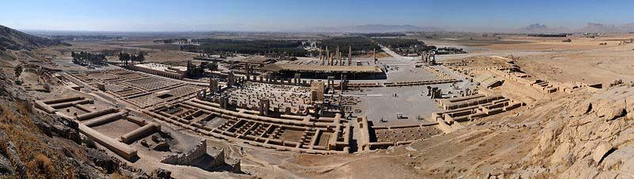

## Matn -- Gomšode dar rāh

Yek ruz Sārā‐vo Faribā dāštand bā māšin be vilā‐ye dust‐ešān, ke xārej
az šahr bud, miraftand. Dir‐i nagozašt, ke rāh‐ešān rā gom kardand. Ānhā
be dehkade‐i residand, ke dar kenār‐e yek rudxāne bud. Az mard‐i ke
āntaraf‐e xiyābān istāde bud, ādres‐ e mahall‐i rā porsidand, ke vilā‐ye
dust‐ešān dar ānjā bud. Ān mard rāh rā be ānhā nešān dād. Ānhā az u
tašakkor kardand va az masir‐i ke u be ānhā gofte bud, raftand va kam‐i
ba'd be vilā residand.

#### Nokte

-   "*Dir‐i nagozašt*" ya'ni ziyād tul nakešid.

##### Pāsox bedeh!

1.  Sārā‐vo Faribā kojā dāštand miraftand?
2.  Ānhā key rāh rā gom kardand?
3.  Ānhā be kojā residand?
4.  Mard‐i ke az u ādres porsidand, kojā istāde bud?
5.  Āyā masir‐i ke ān mard be ānhā goft, dorost bud?
6.  Sārā‐vo Faribā key be maqsad‐e xod residand?

## Sāxtār

### Ebārathā‐ye vasfi (vasf‐e fāel)

  ------ ---- ----------- ----------------------------------------
  Fāel   ‐i   ke Nemune   
                          
  Mard   ‐i   ke          ānjā istāde‐ast, ostād‐e man‐ast.
                          
  Muze   ‐i   ke          dar xiyābān‐e mā‐st, besyār jāleb‐ast.
  ------ ---- ----------- ----------------------------------------

#### Nokte

-   Dar injā "i" nešāne‐ye nesbat‐ast va mānand‐e nešāne‐ye nāmošaxxas
    tekye nadārad.

### Ebārathā‐ye vasfi (vasf‐e maf'ul)

  -------- ---- ---- ---- ----------------------------
  Maf'ul   ‐i   rā   ke   Nemune
                          
  Ketāb    ‐i   rā   ke   xaridam, hanuz naxānde‐am.
                          
  Matn     ‐i   rā   ke   mixānam, nemifahmam.
  -------- ---- ---- ---- ----------------------------

#### Nokte

-   Dar ebārathā‐ye vasfi‐ye bālā maf'ul‐e jomle bivāsete‐ast.

##### Mānand‐e nemune jomle besāz!

1.  Ān doxtar šāgerdavval‐e kelās‐ast. Ān doxtar emruz be dāneškade
    nayāmade‐ast. Doxtar‐i ke šāgerdavval‐e kelās‐ast, emruz be
    dāneškade nayāmade‐ast.
2.  In bacce gerye mikonad. In bacce deldard dārad.

\_\_\_\_\_\_\_\_\_\_\_\_\_\_\_\_\_\_\_\_\_\_\_\_\_\_\_\_\_\_\_\_\_\_\_\_\_\_\_\_\_\_\_\_\_\_\_\_\_\_\_\_\_\_\_\_\_\_\_\_\_\_\_\_\_\_\_\_\_\_\_\_\_\_\_\_\_\_\_\_\_\_\_\_\_\_\_\_\_\_\_\_\_\_\_\_\_\_\_

1.  Dišab šām‐e xošmaze‐i xordim. Ān rā dorost kon!

\_\_\_\_\_\_\_\_\_\_\_\_\_\_\_\_\_\_\_\_\_\_\_\_\_\_\_\_\_\_\_\_\_\_\_\_\_\_\_\_\_\_\_\_\_\_\_\_\_\_\_\_\_\_\_\_\_\_\_\_\_\_\_\_\_\_\_\_\_\_\_\_\_\_\_\_\_\_\_\_\_\_\_\_\_\_\_\_\_\_\_\_\_\_\_\_\_\_

4.  Be man ketāb dādi. Ān rā hanuz naxānde‐am.

\_\_\_\_\_\_\_\_\_\_\_\_\_\_\_\_\_\_\_\_\_\_\_\_\_\_\_\_\_\_\_\_\_\_\_\_\_\_\_\_\_\_\_\_\_\_\_\_\_\_\_\_\_\_\_\_\_\_\_\_\_\_\_\_\_\_\_\_\_\_\_\_\_\_\_\_\_\_\_\_\_\_\_\_\_\_\_\_\_\_\_\_\_\_\_\_\_\_

4.  Dar ān xāne si sāl zendegi karde budim. Xāne rā foruxtim.

\_\_\_\_\_\_\_\_\_\_\_\_\_\_\_\_\_\_\_\_\_\_\_\_\_\_\_\_\_\_\_\_\_\_\_\_\_\_\_\_\_\_\_\_\_\_\_\_\_\_\_\_\_\_\_\_\_\_\_\_\_\_\_\_\_\_\_\_\_\_\_\_\_\_\_\_\_\_\_\_\_\_\_\_\_\_\_\_\_\_\_\_\_\_\_\_\_\_\_

4.  Ān ostād diruz be injā āmad. U emruz bar migardad.

\_\_\_\_\_\_\_\_\_\_\_\_\_\_\_\_\_\_\_\_\_\_\_\_\_\_\_\_\_\_\_\_\_\_\_\_\_\_\_\_\_\_\_\_\_\_\_\_\_\_\_\_\_\_\_\_\_\_\_\_\_\_\_\_\_\_\_\_\_\_\_\_\_\_\_\_\_\_\_\_\_\_\_\_\_\_\_\_\_\_\_\_\_\_\_\_\_\_\_

4.  Hafte‐ye piš yek boluz xaridam. Ān rā be dust‐am hedye dādam.

\_\_\_\_\_\_\_\_\_\_\_\_\_\_\_\_\_\_\_\_\_\_\_\_\_\_\_\_\_\_\_\_\_\_\_\_\_\_\_\_\_\_\_\_\_\_\_\_\_\_\_\_\_\_\_\_\_\_\_\_\_\_\_\_\_\_\_\_\_\_\_\_\_\_\_\_\_\_\_\_\_\_\_\_\_\_\_\_\_\_\_\_\_\_\_\_\_\_\_

4.  Howle rā be man dādi. Kenār‐e dastšuyi āvizān kardam.

\_\_\_\_\_\_\_\_\_\_\_\_\_\_\_\_\_\_\_\_\_\_\_\_\_\_\_\_\_\_\_\_\_\_\_\_\_\_\_\_\_\_\_\_\_\_\_\_\_\_\_\_\_\_\_\_\_\_\_\_\_\_\_\_\_\_\_\_\_\_\_\_\_\_\_\_\_\_\_\_\_\_\_\_\_\_\_\_\_\_\_\_\_\_\_\_\_\_\_

4.  Ān pesar šalvārjin pušide‐ast. U rā mišenāsi?

\_\_\_\_\_\_\_\_\_\_\_\_\_\_\_\_\_\_\_\_\_\_\_\_\_\_\_\_\_\_\_\_\_\_\_\_\_\_\_\_\_\_\_\_\_\_\_\_\_\_\_\_\_\_\_\_\_\_\_\_\_\_\_\_\_\_\_\_\_\_\_\_\_\_\_\_\_\_\_\_\_\_\_\_\_\_\_\_\_\_\_\_\_\_\_\_\_\_\_

4.  Moallem dar dabestān dars midād. Al'ān bikār‐ast.

\_\_\_\_\_\_\_\_\_\_\_\_\_\_\_\_\_\_\_\_\_\_\_\_\_\_\_\_\_\_\_\_\_\_\_\_\_\_\_\_\_\_\_\_\_\_\_\_\_\_\_\_\_\_\_\_\_\_\_\_\_\_\_\_\_\_\_\_\_\_\_\_\_\_\_\_\_\_\_\_\_\_\_\_\_\_\_\_\_\_\_\_\_\_\_\_\_\_\_

4.  Āpārtemān rā xarid. Pārking‐o anbāri nadārad.

\_\_\_\_\_\_\_\_\_\_\_\_\_\_\_\_\_\_\_\_\_\_\_\_\_\_\_\_\_\_\_\_\_\_\_\_\_\_\_\_\_\_\_\_\_\_\_\_\_\_\_\_\_\_\_\_\_\_\_\_\_\_\_\_\_\_\_\_\_\_\_\_\_\_\_\_\_\_\_\_\_\_\_\_\_\_\_\_\_\_\_\_\_\_\_\_\_\_\_

4.  Ta'mirkār otomobil‐am rā ta'mir kard. Az vasāyel‐e naqliye‐ye omumi
    estefāde mikonad.

\_\_\_\_\_\_\_\_\_\_\_\_\_\_\_\_\_\_\_\_\_\_\_\_\_\_\_\_\_\_\_\_\_\_\_\_\_\_\_\_\_\_\_\_\_\_\_\_\_\_\_\_\_\_\_\_\_\_\_\_\_\_\_\_\_\_\_\_\_\_\_\_\_\_\_\_\_\_\_\_\_\_\_\_\_\_\_\_\_\_\_\_\_\_\_\_\_\_\_

4.  Ān sāat rā xarāb kardi. Ān sāat yādgāri‐ye mādar‐am bud.

\_\_\_\_\_\_\_\_\_\_\_\_\_\_\_\_\_\_\_\_\_\_\_\_\_\_\_\_\_\_\_\_\_\_\_\_\_\_\_\_\_\_\_\_\_\_\_\_\_\_\_\_\_\_\_\_\_\_\_\_\_\_\_\_\_\_\_\_\_\_\_\_\_\_\_\_\_\_\_\_\_\_\_\_\_\_\_\_\_\_\_\_\_\_\_\_\_\_\_

4.  In tim barande‐ye in mosābeqe‐ast. In tim bāzande‐ye mosābeqe‐ye
    hafte‐ye piš bud.

\_\_\_\_\_\_\_\_\_\_\_\_\_\_\_\_\_\_\_\_\_\_\_\_\_\_\_\_\_\_\_\_\_\_\_\_\_\_\_\_\_\_\_\_\_\_\_\_\_\_\_\_\_\_\_\_\_\_\_\_\_\_\_\_\_\_\_\_\_\_\_\_\_\_\_\_\_\_\_\_\_\_\_\_\_\_\_\_\_\_\_\_\_\_\_\_\_\_\_

## Irān‐o irāni -- Pārse (Taxt‐e Jamšid)

{width="3.8071in"
height="1.8425in"}Dar 64‐kilumetri‐ye šomāl‐e Širāz bāqimānde‐ye kāxhā‐
yi rā mibinim, ke az zamān‐e Haxāmanešiyān, ya'ni taqriban 2,500 sāl‐e
piš, barjā mānde‐and. Majmue‐ye in kāxhā Pārse yā Taxt‐e Jamšid nām
dārad. Jahāniyān ān rā be nām‐e Perspolis mišenāsand. In kāxhā az
šāhkārhā‐ ye me'māri dar jahān‐e bāstān mahsub mišavand. Pāyegozār‐e in
majmue Dāryuš‐e Bozorg bud. Šāhanšāhān‐e pas az u, beviže Xašāyāršā, ān
rā takmil kardand. Pārse talfiq‐i bihamtā az anāsor‐e gunāgun‐e
me'māri‐yo honari‐ye besyār‐i az mellathā‐ye jahān‐e bāstān‐ast.

{width="2.7709in"
height="3.9661in"}Masāhat‐e in majmue 125,000 m^2^‐ast, ke nešān az
azemat ān dārad. Ma'ruftarin banāhā Kāx‐e Āpādānā, Kāx‐e Sadsotun va
Darvāze‐ye Melal hastand. Bar divārhā va pellekānhā‐ye in majmue
tasāvir‐e barjeste‐i rā mibinim, ke mā rā bā mardomān‐e moxtalef‐e
šāhanšāhi āšnā mikonand. Hamconin sangneveštehā‐yi rā miyābim, ke
azjomle be xatt‐e pārsi‐ye bāstān gušehā‐yi az tārix‐e Irān rā bāzgu
mikonand. Yek‐i az cizhā‐yi ke jalb‐e tavajjoh mikonad, feqdān‐e
tasāvir‐e jang‐o xunrizi‐st. In majmue be nahv‐i solh‐o ārāmeš‐e
mardomān rā be tasvir mikešad.

Eskandar‐e Maqduni dar sāl‐e 330 p.m. Pārse rā be ātaš kešid. Dar
kāvošhā‐ye bāstānšenāsān dar sālhā‐ye 1930‐39 m. asnād‐i be dast
āmadand, ke ettelāāt‐e mohemm‐i rā dar bāre‐ye ān dowrān be dast‐e mā
midehand. In asnād beviže bar jāygāh‐e vālā‐ye zanān dar zamān‐e
Haxāmanešiyān govāhi midehand. Zanān az conān jāygāh‐i barxordār budand,
ke pāre‐i az pažuhešgarān‐o tārixdānān hattā az barābari‐ye zan‐ o mard
soxan miguyand. In dar hāl‐i‐st ke dar ān zamān, va hattā moddathā pas
az ān, zanān dar sāyer‐e noqāt‐e jahān yā barde be hesāb miāmadand yā az
hoquq‐e nāciz‐i barxordār budand.

##### Pāsox bedeh!

1.  Majmue‐ye Pārse kojā qarār dārad?
2.  Qedmat‐e ān taqriban cand sāl‐ast?
3.  In majmue rā ke sāxt?
4.  Ma'ruftarin banāhā‐ye Pārse kodām and?
5.  Ceciz dar naqšhā‐ye ru‐ye divārhā‐vo pellekānhā jalb‐e tavajjoh
    mikonad?
6.  Asnād‐e bedastāmade dar Pārse dar bāre‐ye zanān az ce hekāyat
    mikonand?

## Goftogu -- Ce model‐i barā tun bezanam?

Ārāyešgar:Befarmāyin!

Moštari:Mixāstam muhā‐m‐o kutā konam.

Ārāyešgar:Ce model‐i barā‐tun bezanam?

Moštari:Lotfan pošt‐o baqalā ro hesābi kutā konin, vali jolow ziyād kutā
naše.

Ārāyešgar:Mixāyn surat‐etun‐am eslā konam?

Moštari:Bale, lotfan.

-- -- -- -- -- -- -- -- -- --

Ārāyešgar:Sešuār‐am bekešam?

Moštari:Bale, age zahmat‐i nist.

-- -- -- -- -- -- -- -- -- --

Ārāyešgar:Besyār xob. Befarmāyin, tu āyne negāh konin. Pošt‐eš xub‐e?

Moštari:Bale, dast etun dard nakone. Ceqad taqdim konam?

Ārāyešgar:Qābel‐i nadāre. Cāhār‐o punsad.

#### Nokte

-   "Ceqad taqdim konam?" ya'ni "Ceqadr pardāxt konam?"

#### Nokte

  -- ------------ -------------
     Goftāri      Neveštāri
                  
     befarmāyin   befarmāyid
                  
     muhā‐m‐o     muhā‐yam rā
                  
     kutā         kutāh
                  
     barā‐tun     barā‐yetān
                  
     baqalā       baqalhā
                  
  -- ------------ -------------

  ---------------- ----------------------
  naše             našavad
                   
  mixāyn           mixāhid
                   
  surat‐etun‐am    surat‐etān rā ham
                   
  eslā             eslāh
                   
  sešuār‐am        sešuār ham
                   
  age              agar
                   
  xob              xub
                   
  dige             digar
                   
  tu āyne          tu‐ye/dar āyine
                   
  konin            konid
                   
  pošt‐eš          pošt‐aš
                   
  xub‐e            xub‐ast
                   
  dast‐etun        dast‐etān
                   
  nakone           nakonad
                   
  nadāre           nadārad
                   
  cāhār‐o punsad   cāhār hezār‐o pānsad
  ---------------- ----------------------

### Ebārathā/vāžehā

Mixāstam muhā‐m‐o kutā konam -- mixāstam muhā‐m‐o fer bezanam

Vaqt‐e qabli gereftin? -- qablān vaqt gereftin?

Ceqad kutā beše? -- Fer‐e riz yā fer‐e dorošt?

Sešuār‐am bekešam? -- Abruhā‐tun‐am morattab konam?

##### Bā estefāde az ebārathā/vāžehā goftogu‐ye bālā rā bā hamkelāsi‐yat tamrin kon! Goftogu‐ye behamrixte rā morattab kon va be zabān‐e neveštāri benevis!

-- Muhā‐tun‐o ke qabl‐eš rang nakardin, bale?

-- Fer‐e dorošt.

-- Mixāstam muhā‐m‐o fer bezanam.

-- Bale.

-- Fer‐e riz yā fer‐e dorošt?

-- Cetowr mage?

-- Qablan vaqt gereftin?

-- Con ru rang nemiše fer zad.

\_\_\_\_\_\_\_\_\_\_\_\_\_\_\_\_\_\_\_\_\_\_\_\_\_\_\_\_\_\_\_\_\_\_\_\_\_\_\_\_\_\_\_\_\_\_\_\_\_\_\_\_\_\_\_\_\_\_\_\_\_\_\_\_\_\_\_\_\_\_\_\_\_\_\_\_\_\_\_\_\_\_\_\_\_\_\_\_\_\_\_\_\_\_\_\_\_\_\_\_\_\_

\_\_\_\_\_\_\_\_\_\_\_\_\_\_\_\_\_\_\_\_\_\_\_\_\_\_\_\_\_\_\_\_\_\_\_\_\_\_\_\_\_\_\_\_\_\_\_\_\_\_\_\_\_\_\_\_\_\_\_\_\_\_\_\_\_\_\_\_\_\_\_\_\_\_\_\_\_\_\_\_\_\_\_\_\_\_\_\_\_\_\_\_\_\_\_\_\_\_\_\_\_\_

\_\_\_\_\_\_\_\_\_\_\_\_\_\_\_\_\_\_\_\_\_\_\_\_\_\_\_\_\_\_\_\_\_\_\_\_\_\_\_\_\_\_\_\_\_\_\_\_\_\_\_\_\_\_\_\_\_\_\_\_\_\_\_\_\_\_\_\_\_\_\_\_\_\_\_\_\_\_\_\_\_\_\_\_\_\_\_\_\_\_\_\_\_\_\_\_\_\_\_\_\_\_

\_\_\_\_\_\_\_\_\_\_\_\_\_\_\_\_\_\_\_\_\_\_\_\_\_\_\_\_\_\_\_\_\_\_\_\_\_\_\_\_\_\_\_\_\_\_\_\_\_\_\_\_\_\_\_\_\_\_\_\_\_\_\_\_\_\_\_\_\_\_\_\_\_\_\_\_\_\_\_\_\_\_\_\_\_\_\_\_\_\_\_\_\_\_\_\_\_\_\_\_\_\_

\_\_\_\_\_\_\_\_\_\_\_\_\_\_\_\_\_\_\_\_\_\_\_\_\_\_\_\_\_\_\_\_\_\_\_\_\_\_\_\_\_\_\_\_\_\_\_\_\_\_\_\_\_\_\_\_\_\_\_\_\_\_\_\_\_\_\_\_\_\_\_\_\_\_\_\_\_\_\_\_\_\_\_\_\_\_\_\_\_\_\_\_\_\_\_\_\_\_\_\_\_\_

\_\_\_\_\_\_\_\_\_\_\_\_\_\_\_\_\_\_\_\_\_\_\_\_\_\_\_\_\_\_\_\_\_\_\_\_\_\_\_\_\_\_\_\_\_\_\_\_\_\_\_\_\_\_\_\_\_\_\_\_\_\_\_\_\_\_\_\_\_\_\_\_\_\_\_\_\_\_\_\_\_\_\_\_\_\_\_\_\_\_\_\_\_\_\_\_\_\_\_\_\_\_

\_\_\_\_\_\_\_\_\_\_\_\_\_\_\_\_\_\_\_\_\_\_\_\_\_\_\_\_\_\_\_\_\_\_\_\_\_\_\_\_\_\_\_\_\_\_\_\_\_\_\_\_\_\_\_\_\_\_\_\_\_\_\_\_\_\_\_\_\_\_\_\_\_\_\_\_\_\_\_\_\_\_\_\_\_\_\_\_\_\_\_\_\_\_\_\_\_\_\_\_\_\_

\_\_\_\_\_\_\_\_\_\_\_\_\_\_\_\_\_\_\_\_\_\_\_\_\_\_\_\_\_\_\_\_\_\_\_\_\_\_\_\_\_\_\_\_\_\_\_\_\_\_\_\_\_\_\_\_\_\_\_\_\_\_\_\_\_\_\_\_\_\_\_\_\_\_\_\_\_\_\_\_\_\_\_\_\_\_\_\_\_\_\_\_\_\_\_\_\_\_\_\_\_\_

## Vāžehā-ye dars-e 

Pasoxhā-ye dars-e

Mānand‐e nemune jomle besāz!

2\. Bacce‐i ke gerye mikonad, deldard dārad. -- 3. Šām‐e xošmaze‐i rā ke
dišab xordim, dorost kon! -- 4. Ketāb‐i rā ke be man dādi, hanuz
naxānde‐am. -- 5. Xāne‐i rā ke dar ān si sāl zendegi karde budim,
foruxtim. -- 6. Ostād‐i ke diruz be injā āmad, emruz bar migardad. -- 7.
Boluz‐i rā ke hafte‐ye piš xaridam, be dust‐am hedye dādam. -- 8.
Howle‐i rā ke be man dādi, kenār‐e dastšuyi āvizān kardam. -- 9. Pesar‐i
rā ke šalvārjin pušide‐ast, mišenāsi? -- 10. Moallem‐i ke dar dabestān
dars midād, al'ān bikār‐ast. -- 11. Āpārtemān‐i rā ke xarid, pārking‐o
anbāri nadārad. -- 12. Ta'mirkār‐i ke otomobil‐am rā ta'mir kard, az
vasāyel‐e naqliye‐ye omumi estefāde mikonad. -- 13. Sāat‐i rā ke xarāb
kardi, yādgāri‐ye mādar‐am bud. -- 14. Tim‐i ke barande‐ye in
mosābeqe‐ast, bāzande‐ye mosābeqe‐ye hafte‐ye piš bud.

Goftogu‐ye behamrixte rā morattab kon va be zabān‐e neveštāri benevis!

-- Mixāstam muhā‐yam rā fer bezanam.

-- Qablan vaqt gereftid?

-- Bale.

-- Fer‐e riz yā fer‐e dorošt?

-- Fer‐e dorošt.

-- Muhā‐yetān rā ke qabl‐aš rang nakarde‐id, bale?

-- Cetowr magar?

-- Con ru‐ye rang nemišavad fer zad.
