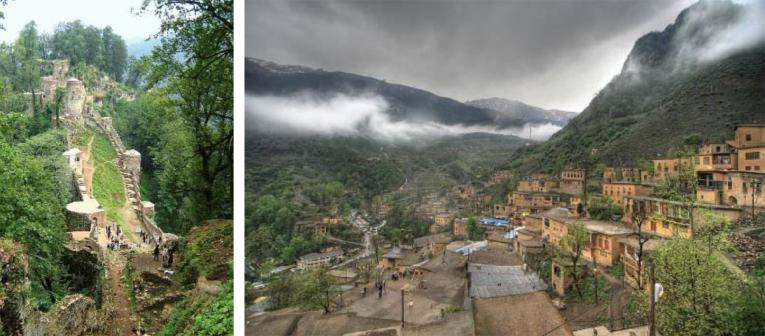

## Sāxtār

##### Jāhā‐ye xāli rā por kon!

1.  U emruz yek kerāvāt \_\_ (xaridan). 2.  Man dar livān āb \_\_ (rixtan). 3.  Mā cand šab dar Esfahān \_\_ (māndan). 4.  Narges dasthā‐yaš rā bā āb‐o sābun \_\_ (šostan). 5.  Ānhā fardā az mosāferat \_\_ \_\_     (bar gaštan). 6.  Ānhā fārsi \_\_ \_\_ (sohbat     kardan). 7.  Pedar‐e man dar bimārestān \_\_ \_\_     (kār kardan). 8.  U form‐e sabtenām rā \_\_ \_\_ (por     kardan). 9.  Man barā‐yat yek qesse \_\_ \_\_     (ta’rif kardan). 10. Šomā emšab mosābeqe‐ye futbāl rā bā ham \_\_     \_\_ (tamāšā kardan).

##### Bā fe’lhā‐ye zir yek jomle besāz!

|                    |                              |
|------------------|---------------------------- |
| Fe’l               | Jomle                        |
| xaridan (xar)      | Man emruz yek ketāb mixaram. |
| didan (bin)        |                              |
| neveštan (nevis)   |                              |
| xāndan (xān)       |                              |
| bar dāštan(dār)    |                              |
| dar āvardan (āvar) |                              |
| yād gereftan (gir) |                              |
| kār kardan (kon)   |                              |

##### Jāhā‐ye xāli rā bā zamir‐e maf’uli por kon!

1.  Pedarbozorg‐o mādarbozorg dar hayāt‐and. Man mibinam     \_\_ . 2.  Bacce aziyat mikonad vali mādar mibaxšad \_\_. 3.  To emšab tanhā hasti. Mā miresānim \_\_. 4.  Yekkam sabr konid. Rafiq‐am mibarad \_\_.

## Irān‐o irāni – Gilān

Irān si‐yo yek ostān dārad. Ostān‐e Gilān dar šomāl‐e Irān va dar kenār‐e Daryā‐ye Xazar‐ast. Ābohavā‐ye Gilān mo’tadel‐ o martub‐ast. Šahr‐e Rašt markaz‐e Ostān‐e Gilān‐ast. Zabān‐ e mahalli‐ye Gilān gilaki‐st. Ostān‐e Gilān besyār sarsabz‐o didani‐st. Rustā‐ye Māsule va Qal’e‐ye Rudxān dar in Ostān qarār dārand va xeyl‐i didani hastand. Honar‐e āšpazi‐ye Gilān dar Irān ma’ruf‐ast. Barā‐ye nemune Mirzāqāsemi yek qazā‐ye gilāni‐st.

##### Dorost yā qalat?

1.  Šahr‐e Rašt dar kenār‐e Daryā‐ye Xazar‐ast. 2.  Rustā‐ye Māsule dar Gilān‐ast. 3.  Havā‐ye Gilān garm‐ast. 4.  Zabān‐e mahalli‐ye Gilān gilaki‐st. 5.  Mirzāqāsemi az Gilān miāyad.

## Goftogu – Šoql‐etun ci‐ye?

Āqā‐ye Arjomand:Bebaxšin, šomā šoql‐etun ci‐ye?

Xānom‐e Nāmju:Man akkās hastam. Kār‐e šomā ci‐ye?

Āqā‐ye Arjomand:Man āmuzgār‐am. Rāsti, doxtar‐etun cekāra‐n?

Xānom‐e Nāmju:Doxtar‐am dandunpezešk‐e.

Āqā‐ye Arjomand:Bebaxšin, šoql‐ešun ci‐ye?

Xānom‐e Nāmju:Dandunpezešk‐e.

#### Nokte

|              |              |
|------------|------------ |
| Goftāri      | Neveštāri    |
| bebaxšin     | bebaxšid     |
| ci‐ye        | ci‐st        |
| etun         | etān         |
| cekāra‐n     | cekāre‐and   |
| dandunpezešk | dandānpezešk |
| šoql‐ešun    | šoql‐ešān    |

### Ebārathā/vāžehā

Pesar – mādar – pedar – barādar – xāhar – zan – šowhar

Ārāyešgar – me’mār – mekānik – mohandes – parastār – pezešk – vakil – nānvā – naqqāš

##### Bā estefāde az ebārathā/vāžehā goftogu‐ye bālā rā bā hamkelāsi‐yat tamrin kon! Jāhā‐ye xāli rā por kon!

Parviz: Minu, to \_\_‐i?

Minu: Man ravānpezešk‐am, \_\_‐e \_\_ ci‐ye?

Parviz: \_\_ ruznāmenegār \_\_.

##### Az goftāri be neveštāri tabdil kon!

**GoftāriNeveštāri**

Šoql‐ešun ci‐ye?

Šomā cekāre‐in?

Mādar‐e man dandunpezešk‐e.

## Vāžehā-ye dars-e 

Pasoxhā-ye dars-e 

Dorost yā qalat?

1\. dorost – 2. qalat – 3. dorost – 4. dorost – 5. qalat

Jāhā‐ye xāli rā por kon!

1\. mixarad – 2. mirizam – 3. mimānim – 4. mišuyad – 5. bar migardand – 6. sohbat mikonand – 7. kār mikonad – 8. por mikonad

– 9. ta’rif mikonam – 10. tamāšā mikonid

Jāhā‐ye xāli rā bā zamir‐e maf’uli por kon!

1\. ‐ešān – 2. ‐aš – 3. ‐at – 4. ‐etān

Dorost yā qalat?

1\. qalat – 2. dorost – 3. qalat – 4. dorost – 5. dorost

Jāhā‐ye xāli rā por kon!

cekāre – šoql – to – Man – ‐am

Az goftāri be neveštāri tabdil kon!

Šoql‐ešān ci‐st? – Šomā cekāre‐id? – Mādar‐e man dandānpezešk‐ast.

