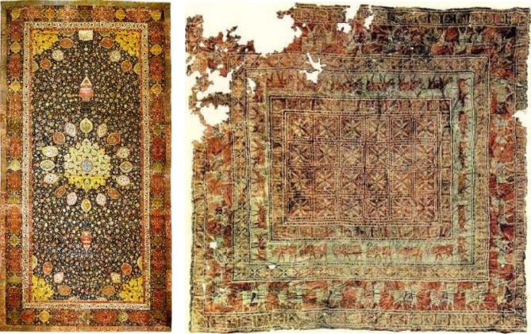

##### Jāhā‐ye xāli rā bā vāžehā‐ye zir por kon!

azbebarbābitājoz

1.  U \_\_ xāne birun miravad. 2.  Parviz šanbehā \_\_ dānešgāh nemiravad. 3.  Mā \_\_ māšin mosāferat mikonim. 4.  Sārā \_\_ mādar‐aš hicjā nemiravad. 5.  Yek sib‐e zibā \_\_ deraxt‐ast. 6.  Faribā \_\_ u kas‐i rā nadārad. 7.  \_\_ sāat‐e panj sabr mikonim.

##### Jāhā‐ye xāli rā bā vāžehā‐ye zir por kon!

kenārzirbālāpoštvasatsartu

1.  Gol \_\_‐ye goldān‐ast. 2.  Komod \_\_‐e taxt‐ast. 3.  Yek tāblow \_\_‐ye miz āvizān‐ast. 4.  Gārāž \_\_‐e xāne‐ast. 5.  Manucehr \_\_‐e kār‐ast. 6.  Sabad \_\_‐e miz‐ast. 7.  Bāqce \_\_‐e hayāt‐ast.

##### Jāhā‐ye xāli rā bā vāžehā‐ye zir por kon!

be su‐yeaz taraf‐edar bāre‐yebe xāter‐ebe jā‐yedar miyān‐ebe samt‐e

1.  Mā \_\_ rāst mipicim. 2.  Kāmrān rā \_\_ dustān‐aš mibinam. 3.  Faqat \_\_ to miāyam. 4.  Faribā \_\_ man be u gol midehad.

<!-- end list -->

43. 5.  \_\_ tārix‐e Irān ce midāni?     6.  \_\_ Parviz Kāmbiz rā mibaram.     7.  Lotfan \_\_ xāne beravid!

##### Jāhā‐ye xāli rā bā vāžehā‐ye zir por kon!

piš azba’d azbanā barrāje’ beqeyr az

1.  Mahnāz \_\_ mā be dānešgāh miresad. 2.  Dānešjuyān \_\_ emtehān‐e diruz sohbat mikonand. 3.  Mā \_\_ šomā harekat mikonim. 4.  Man \_\_ šomā kas‐i rā nadāram. 5.  \_\_ gozāreš‐e emruz mosābeqe‐ye futbāl‐e Irān‐o     Koveyt sāat‐e hašt šoru’ mišavad.

## Irān‐o irāni – Farš‐e irāni

Farš yā qāli‐ye irāni az mohemtarin sanāye‐e dasti‐ye Irān‐ast. Farš‐e irāni dar sarāsar‐e donyā ma’ruf‐ast va behtarin keyfiyat rā dar miyān‐e faršhā‐ye jahān dārad. Farš‐e irāni nešān‐i az farhang‐o honar‐e irāni‐st va pišine‐i hezārānsāle dārad. Bāfandegān‐e farš dar šahrhā‐vo rustāhā‐ye moxtalef‐e Irān be qālibāfi mašqul‐and. Ma’ruftarin faršhā mahsul‐e Tabriz, Kermān, Esfahān, Yazd va Kāšān hastand. Keyfiyat‐e farš be cand ciz bastegi dārad: jens, tarh, bāft va rang. Jens‐e farš ma’mulan az pašm‐e gusfand yā abrišam‐ast. Gerānbahātarin faršhā az jens‐e abrišam hastand. Sāderkonandegān‐ e farš qālihā‐ye irāni rā be bāzārhā‐ye jahān sāder mikonand.

|                |                       |
|--------------|--------------------- |
| un             | ān                    |
|                |                       |
| tu vitrin      | tu‐ye/dar vitrin      |
|                |                       |
| cand‐e         | cand‐ast              |
|                |                       |
| kudumyeki      | kodāmyek              |
|                |                       |
| tu vitrin‐e    | tu‐ye/dar vitrin‐ast  |
|                |                       |
| šalvār qermeze | in/ān šalvār‐e qermez |
|                |                       |
| Toman          | Tumān                 |
|                |                       |
| piran          | pirāhan               |
|                |                       |
| kudum          | kodām                 |
|                |                       |
| piran sabze    | in/ān pirāhan‐e sabz  |
|                |                       |
| punsad         | pānsad                |

### Ebārathā/vāžehā

Kotšalvār – dāman – žākat – šalvārjin – kāpšen – kot – pāltow – bārāni – poliver – jeliqe

Sefid – surati – qahvei – nārenji – banafš – kerem – meški – siyāh – sormei – ābi

##### Bā estefāde az ebārathā/vāžehā goftogu‐ye bālā rā bā hamkelāsi‐yat tamrin kon! Jāhā‐ye xāli rā por kon!

Xaridār:Ma’zerat mixām, in \_\_ \_\_‐e?

Forušande:\_\_ garmkon?

Xaridār:Garmkon \_\_?

Forušande:5,000 \_\_.

##### Az goftāri be neveštāri tabdil kon!

|                              |           |
|----------------------------|--------- |
| Goftāri                      | Neveštāri |
|                              |           |
| Un kāpšen cand‐e?            |           |
|                              |           |
| Kudum šalvār?                |           |
|                              |           |
| Kāpšen sefide.               |           |
|                              |           |
| In piran bist hezār Toman‐e. |           |
|                              |           |
| Kudumkyeki? Kot qermeze?     |           |

## Vāžehā-ye dars-e 

Pasoxhā-ye dars-e 

Dorost yā qalat?

1\. qalat – 2. qalat – 3. dorost – 4. qalat – 5. dorost

Jāhā‐ye xāli rā bā vāžehā‐ye zir por kon!

1\. az – 2. be – 3. bā – 4. bi – 5. bar – 6. joz – 7. tā

Jāhā‐ye xāli rā bā vāžehā‐ye zir por kon!

1\. tu – 2. kenār – 3. bālā – 4. pošt – 5. sar– 6. zir – 7. vasat

Jāhā‐ye xāli rā bā vāžehā‐ye zir por kon!

1\. be samt‐e – 2. dar miyān‐e – 3. be xāter‐e – 4. az taraf‐e – 5. dar bāre‐ye – 6. be jā‐ye – 7. be su‐ye

Jāhā‐ye xāli rā bā vāžehā‐ye zir por kon!

1\. piš az – 2. rāje’ be – 3. ba’d az – 4. qeyr az – 5. banā bar

Dorost yā qalat?

1\. qalat – 2. dorost – 3. qalat – 4. dorost – 5. dorost

Jāhā‐ye xāli rā por kon!

garmkon – cand – kudum – ābiye – Toman

Az goftāri be neveštāri tabdil kon!

Ān kāpšen cand‐ast? – Kodām šalvār? – Ān kāpšen‐e sefid. – In pirāhan bist hezār Tumān‐ast. – Kodāmyek? Ān kot‐e qermez?

