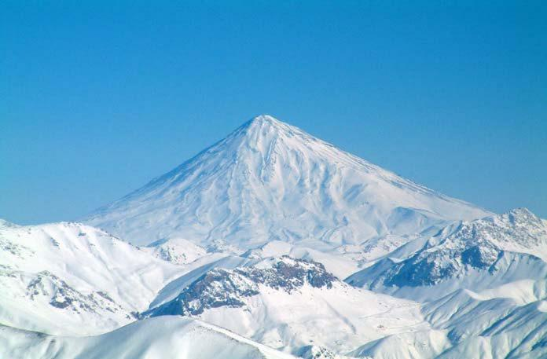

## Sāxtār

### Jomlehā‐ye axbāri

|      |                   |                   |             |
|----|-----------------|-----------------|----------- |
| Fāel | Maf’ul‐e bivāsete | Maf’ul‐e bāvāsete | Fe’l        |
|      |                   |                   |             |
| Man  | Mahnāz rā         |                   | dust dāram. |
|      |                   |                   |             |
| Man  |                   | be Mahnāz         | miguyam.    |

#### Nokte

  - Agar maf’ul‐e bivāsete yek mafhum‐e kolli dāšte bāšad, āngāh *rā*     nemiāyad: Man sib dust dāram.

### Jomlehā‐ye taajjobi

|            |              |                                                               |                            |
|----------|------------|-------------------------------------------------------------|-------------------------- |
| Ce + sefat | Ce + esm + i | Ce + esm +‐e + sefat + i Ce + esm +‐e + sefat +‐o + sefat + i |                            |
|            |              |                                                               |                            |
| Ce xub!   | Ce pesar‐i! | Ce pesar‐e xub‐i!                                            | Ce pesar‐e xub‐o tamiz‐i! |

#### Nokte

  - Dar jomlehā‐ye taajjobi esm nāmošaxxas‐ast.

### Porseš bā pāsox‐e bale yā na

|       |      |                   |                   |            |                     |
|-----|----|-----------------|-----------------|----------|------------------- |
| (Āyā) | Fāel | Maf’ul‐e bivāsete | Maf’ul‐e bāvāsete | Fe’l       | Pāsox               |
|       |      |                   |                   |            |                     |
| (Āyā) | to   | Mahnāz rā         |                   | dust dāri? | ‐ Bale, dust dāram. |
|       |      |                   |                   |            |                     |
| (Āyā) | to   |                   | be Mahnāz         | miguyi?    | ‐ Na, nemiguyam.    |

#### Nokte

  - Tartib‐e vāžehā mānand‐e jomlehā‐ye axbāri‐st. Tanhā lahn‐e jomle     soāli mišavad. Tekye bar vāže‐ye mowredesoāl‐ast.   - *Āyā *bištar dar jomlehā‐ye rasmi be kār miravad.

### Porseš‐e manfi bā pāsox‐e mosbat

|  |       |      |                   |                        |                     |
| 
|-----|----|-----------------|----------------------|------------------- |
|  | (Āyā) | Fāel | Maf’ul‐e bivāsete | Maf’ul‐e bāvāsete Fe’l | Pāsox               |
|  |       |      |                   |                        |                     |
|  | (Āyā) | to   | Mahnāz rā         | dust nadāri?           | ‐ Cerā, dust dāram. |
|  |       |      |                   |                        |                     |

(Āyā)tobe Mahnāznemiguyi?‐ Cerā, miguyam.

### Porseš bā pāsox‐e moxālef

|       |                     |                   |                   |            |                     |
|-----|-------------------|-----------------|-----------------|----------|------------------- |
| Magar | Fāel                | Maf’ul‐e bivāsete | Maf’ul‐e bāvāsete | Fe’l       | Pāsox               |
|       |                     |                   |                   |            |                     |
| Magar | to                  | Mahnāz rā         |                   | dust dāri? | ‐ Bale, dust dāram. |
|       | ‐ Na, dust nadāram. |                   |                   |            |                     |
|       |                     |                   |                   |            |                     |
|       |                     |                   |                   |            |                     |
| Magar | to                  |                   | be Mahnāz         | nemiguyi?  | ‐ Cerā, miguyam.    |
|       | ‐ Na, nemiguyam.    |                   |                   |            |                     |
|       |                     |                   |                   |            |                     |

### Porseš‐e qeyremostaqim

|              |      |       |               |        |
|------------|----|-----|-------------|------ |
| Baxš‐e manfi | (ke) | (āyā) | Baxš‐e mosbat | Yā na  |
|              |      |       |               |        |
| Nemidānam    | (ke) | (āyā) | miāyad        | yā na. |

### Jomlehā‐ye porseši

|                     |                                     |                                 |
|-------------------|-----------------------------------|------------------------------- |
| Zamir‐e porseši     | Qeyd‐e porseši                      | Sefat‐e porseši                 |
|                     |                                     |                                 |
| Ke/ki miāyad?       | Emšab kojā miravi?                  | Cejur kafš‐i mixāhi?            |
|                     |                                     |                                 |
| Ce/ci mibini?       | Cerā inqadr qamgin‐i?               | Kodām gozine dorost‐ast?        |
|                     |                                     |                                 |
| Kodām behtar‐ast?   | Bā Parviz cetowr/cegune kār mikoni? | Ceqadr ārd‐e gandom lāzem dāri? |
|                     |                                     |                                 |
| Kodāmyek rā mixāhi? | Fardā key bar migardi?              | Cand šab mimāni?                |

#### Nokte

  - Tartib‐e vāžehā mānand‐e jomlehā‐ye axbāri‐st. Tanhā lahn‐e jomle     soāli mišavad.

### Goftār‐e qeyremostaqim

|                        |                                    |                                              |
|----------------------|----------------------------------|-------------------------------------------- |
| Goftār‐e mostaqim      | Mahnāz miguyad: “Miāy**am**.”      | Ānhā miguyand: “Šām‐emān rā mixor**im**.”    |
|                        |                                    |                                              |
| Goftāt‐e qeyremostaqim | Mahnāz miguyad, **ke** miāy**ad**. | Ānhā miguyand, ke šām‐ešān rā mixor**and**.” |

#### Nokte

  - Dar goftār‐e mostaqim gofte 1‐1 bāzgu mišavad.   - Goftār‐e qeyremostaqim bā *ke* šoru’ mišavad.   - Dar goftār‐e qeyremostaqim šenāse‐ye fe’l va zamir bā bāzgukonande     hamxāni dārand.

##### Jomlehā‐ye behamrixte rā morattab kon!

**NāmorattabMorattab**

boluz / i / ce / qašang / dāri / e / !

mixorad / nāhār / key / u / ?

tārixce / Nowruz / ye / āyā / midānid / rā / ?

bolvār / in / dārad / ce / yi / ye / deraxthā / zibā / !

bā / konsert / mā / nemiāyi / cerā / be / ?

nāxonhā / boland / ye / ce / dārad / i / !

##### Bā vāžehā‐ye dāxel‐e parāntez porseš besāz!

1)  Sārā emšab be didan‐e Faribā miravad. (key)

\_\_

1)  Barā‐ye poxtan‐e in keyk nim litr šir lāzem dārim. (ceqadr)

\_\_

1)  Bābak dar Dānešgāh‐e Tehrān pezeški mixānad. (ke)

\_\_

1)  Mahnāz pirāhan‐e ābi rā bištar mipasandad. (kodām)

\_\_

1)  Nāder kār‐aš rā xeyl‐i xub anjām midehad. (cegune)

\_\_

1)  Emruz adas, lappe, noxod va lubiyā mixaram. (ce)

\_\_

1)  Yek mobl‐e rāhat‐o sabok‐o arzān mixāhand. (cejur)

\_\_

1)  Sag‐ešān kenār‐e jādde‐ast. (kojā)

\_\_

##### Az goftār‐e mostaqim be goftār‐e qeyremostaqim tabdil kon!

**MostaqimQeyremostaqim**

Ostādān miguyand: “Digar dars nemidehim.”

Navid miguyad: “Bā to hicjā nemiāyam.”

Mahšid miguyad: “Pedar‐am bimār‐ast.”

Kāmrān miguyad: “Ketāb‐am rā be to mideham.”

Narges miguyad: “Ābrizeš‐e bini dāram”.

Jāvid miguyad: “Zur‐e bāzu‐yam ziyād‐ast.”

Nāhid miguyad: “Be didār bā ostād‐am omid dāram.”

## Irān‐o irāni – Damāvand

Dar 69‐kilometri‐ye šomāl‐e šarq‐e Tehrān va dar dāmane‐ye reštekuh‐e Alborz bolandtarin kuh‐e Irān‐o Xāvar‐e Miyāne va bolandtarin qolle‐ye ātašfešāni‐ye Āsiyā qarār dārad. In kuh maxrutišekl‐ast va Damāvand nām dārad. Ertefā‐e Damāvand 5,671 metr‐ast. Damāvand avvalin asar‐e sabtšode‐ye tabii dar Fehrest‐e Āsār‐e Melli‐ye Irān‐ast. Dar ruzhā‐yi ke āsemān sāf‐ast, in kuh‐e bāšokuh az dāxel‐e Tehrān qābelero’yat‐ast. Damāvand dar afsānehā‐ vo asātir‐e irāni jāygāh‐e viže‐i dārad. Nevisandegān va šāerān‐e irāni niz dar āsār‐ešān ešārehā‐ye farāvān‐i be Damāvand dārand.

##### Pāsox bedeh!

1.  Kuh‐e Damāvand kojā qarār dārad? 2.  Ertefā‐e Damāvand cand metr‐ast? 3.  Āyā dar Xāvar‐e Miyāne kuh‐i bolandtar az Damāvand dārim? 4.  Dar ce ruzhā‐yi Damāvand az dāxel‐e Tehrān qābeledidan‐ast? 5.  Damāvand candomin asar‐e sabtšode‐ye tabii dar Fehrest‐e Āsār‐e     Melli‐ye Irān‐ast? 6.  Āyā Damāvand dar afsānehā‐vo adab‐e fārsi jāygāh‐e xāss‐i dārad?

## Goftogu – Ceqad miše?

Maqāzedār:Befarmāyin.

Moštari:Ye kilu angur mixāstam, nim kilu‐am gilās.

Maqāzedār: In ye kilu angur‐o in‐am nim kilu gilās. Farmāyeš‐e dige‐i nadārin? Moštari: Na, mamnun‐am. Ceqad miše?

Maqāzedār:Qābel‐i nadāre.

Moštari:Xāheš mikonam. Sāheb‐eš qābel dāre.

Maqāzedār: Angur kilu‐yi do hezār‐o punsad Toman, gilās‐am kilu‐yi se hezār Toman. Ruham miše cāhār hezār Toman. Moštari: Befarmāyin, in‐am cāhār hezār Toman.

Maqāzedār:Dast‐e šomā dard nakone!

Moštari:Sar‐e šomā dard nakone! Xodā hāfez!

#### Nokte

  - *Mixāstam *dar injā* *hamān ma’ni‐ye* mixāham *rā* *dārad, vali     kam‐i moaddabānetar‐ast.

#### Nokte

|  |            |            |
| 
|----------|---------- |
|  | Goftāri    | Neveštāri  |
|  |            |            |
|  | befarmāyin | befarmāyid |
|  |            |            |
|  | ye         | yek        |
|  |            |            |
|  | kilu‐am    | kilu ham   |
|  |            |            |
|  | dige       | digar      |
|  |            |            |
|  | nadārin    | nadārid    |
|  |            |            |
|  | ceqad      | ceqadr     |
|  |            |            |
|  | miše       | mišavad    |
|  |            |            |
|  | nadāre     | nadārad    |
|  |            |            |
|  | punsad     | pānsad     |
|  |            |            |
|  | Toman      | Tumān      |
|  |            |            |
|  | ruham      | ruyeham    |
|  |            |            |

nakonenakonad

### Ebārathā/vāžehā

Porteqāl – sib – golābi – anār – ālbālu – ālu – holu – mowz – tutfarangi – nārengi

##### Bā estefāde az ebārathā/vāžehā goftogu‐ye bālā rā bā hamkelāsi‐yat tamrin kon! Jāhā‐ye xāli rā por kon!

Maqāzedār:Befarmāyin.

Moštari:Lotfan ye kilu peste, nim kilu‐am zerešk.

Maqāzedār:Befarmāyin, in ye \_\_ \_\_‐vo in‐am nim kilu zerešk. Amr‐e \_\_‐i \_\_?

Moštari:Na, mersi. \_\_ \_\_?

Maqāzedār:\_\_‐i \_\_.

Moštari:\_\_‐eš qābel \_\_.

Maqāzedār:Peste kilu‐yi 12,000 Toman, \_\_‐am kilu‐yi \_\_ \_\_. Ruham miše 16,000 Toman.

Moštari:\_\_ in‐am 16,000 Toman.

Maqāzedār:Dast‐e šomā \_\_ \_\_.

Moštari:\_\_‐e \_\_ dard nakone.

##### Az goftāri be neveštāri tabdil kon!

**GoftāriNeveštāri**

In‐am ye kilu xiyār.

Ruham miše se hezār‐o punsad Toman.

Dast‐etun dard nakone.

Amr‐e dige‐i nadārin?

## Vāžehā-ye dars-e 

Pasoxhā-ye dars-e 

Dorost yā qalat?

1\. qalat – 2. dorost – 3. dorost – 4. dorost – 5. dorost

Jomlehā‐ye behamrixte rā morattab kon!

Ce boluz‐e qašang‐i dāri! – U key nāhār mixorad? – Āyā tārixce‐ye Nowruz rā midāni? – In bolvār ce deraxthā‐ye zibā‐yi dārad!

– Cerā bā mā be konsert nemiāyi? – Ce nāxonhā‐ye boland‐i dārad!

Bā vāžehā‐ye dāxel‐e parāntez porseš besāz!

1\) Sārā key be didan‐e Faribā miravad? – 2) Barā‐ye poxtan‐e in keyk ceqadr šir lāzem dārim? – 3) Ke dar Dānešgāh‐e Tehrān pezeški mixānad? – 4) Mahnāz kodām pirāhan rā bištar mipasandad? – 5) Nāder kār‐aš rā cegune anjām midehad? – 6) Emruz ce mixaram? – 7) Cejur mobl‐i mixāhand? – 8) Sag‐ešān kojā‐st?

Az goftār‐e mostaqim be goftār‐e qeyremostaqim tabdil kon!

Ostādān miguyand, ke digar dars nemidehand. – Navid miguyad, ke bā to hicjā nemiāyad. – Mahšid miguyad, ke pedar‐aš bimār‐ ast. – Kāmrān miguyad, ke ketāb‐aš rā be to midehad. – Narges miguyad, ke ābrizeš‐e bini dārad. – Jāvid miguyad, ke zur‐e bāzu‐yaš ziyād‐ast. – Nāhid miguyad, ke be didār bā ostād‐aš omid dārad.

Jāhā‐ye xāli rā por kon!

kilu – peste – dige – nadārin – ceqad – miše – qābel – nadāre – sāhāb – dāre – zerešk – 8,000 – befarmāyin – dard – nakone – sar – šomā

Az goftāri be neveštāri tabdil kon!

In ham yek kilu xiyār. – Ruyeham mišavad se hezār‐o pānsad Tumān. – Dast‐etān dard nakonad. – Amr‐e digar‐i nadārid?

