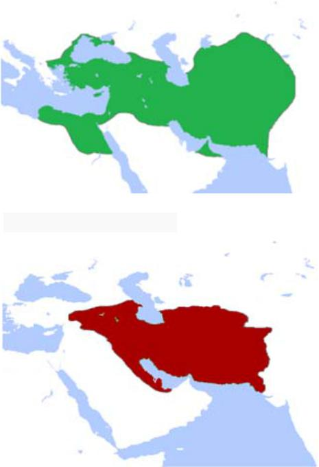

##### Bā tavajjoh be qeyd‐e zamān jāhā‐ye xāli rā bā fe’l‐e monāseb por kon!

1.  Kāmrān pārsāl harruz futbāl \_\_     \_\_ (bāzi kardan). 2.  Tā cand sāl piš mā dar Širāz \_\_     \_\_ (zendegi kardan). 3.  Pedar‐am qablan \_\_ \_\_ (sigār     kešidan) vali hālā bištar \_\_ \_\_     (pip kešidan). 4.  Man pišazin xeyl‐i šokolāt \_\_ (xordan) vali al’ān     aslan \_\_ \_\_ (dust dāštan). 5.  Dar gozašte az qahve \_\_ \_\_     (lezzat bordan), vali al’ān maze‐aš barā‐yam talx‐ast. 6.  Man tā pārsāl morq‐o gušt‐o sosis rā az in forušgāh     \_\_ (xordan).

##### Jāhā‐ye xāli rā bā fe’l‐e monāseb por kon!

1.Al’ān dāri cekār mikoni? – \_\_ televiziyon \_\_ \_\_ (tamāšā kardan).

2.  Diruz sobh dāšti cekār mikardi? – \_\_ sobhāne     \_\_ (xordan). 3.  Baccehā al’ān \_\_ cekār \_\_     (kardan)? – \_\_ musiqi \_\_     \_\_ (guš dādan). 4.  Dišab vaqt‐i ke āmadam, \_\_ kojā     \_\_ (raftan)? – \_\_     \_\_ piš‐e dust‐am (raftan). 5.  Parišab hengām‐i ke telefon zang zad, mašqul‐e ce kār‐i budi? –     \_\_ \_\_ \_\_ (duš     gereftan). 6.  Diruz dar forušgāh cekār mikardi? \_\_ kare‐vo     panir‐o xāme \_\_ (xaridan).

#### Pāsox bedeh!

1)  Diruz sobh dāšti cekār mikardi?     \_\_ 2)  Al’ān mašqul‐e ce kār‐i hasti?     \_\_

## Irān‐o irāni – Tārix‐e Irān

Dar hezāre‐ye dovvom‐e piš az milād Āryāyiyān, mardomān‐i hendoorupāyi, be Irān mohājerat kardand. Mādhā, Pārshā va Pārthā‐ye āryāyi harkodām dar mantaqe‐i az Irān sokunat kardand. Noxostin farmānravāyi rā dar Irān Mādhā 715 p.m. banā kardand. Pas az ānhā Kuroš‐e Bozorg Šāhanšāhi‐ye Haxāmaneši rā 559 p.m. ta’sis kard. In šāhanšāhi ānconān pahnāvar bud, ke tārixnegārān ān rā yek emperāturi‐ye jahāni midānand. Haxāmanešiyān be din, zabān va farhang‐e mardomān‐e digar ehterām migozāštand.

Pas az šekast‐e Haxāmanešiyān be dast‐e Eskandar‐e Maqduni dar 330 p.m. Solukiyān be qodrat residand vali kam‐i ba’d Aškāniyān‐e irāni ānhā rā az Irān rāndand va Emperāturi‐ye Rom rā niz be cāleš kešidand. Aškāniyān va pas az ānhā Sāsāniyān do šāhanšāhi‐ye bozorg‐o qodratmand‐i budand, ke tā hamle‐ye Arabhā be Irān dar miyāne‐ye sade‐ye 7om‐e milādi bar Irān hokumat mikardand. Dowre‐ye Sāsāniyān ta’sirgozārtarin dowre‐ye tārixi‐ye Irān be šomār miravad. Gostareš‐e nofuz‐e farhangi‐ ye Irān be šarq‐o qarb dar in dowrān cešmgir‐ast. Ta’sis va šokufāyi‐ye Dānešgāh‐e Gondišāpur be onvān‐e yek‐i az mohemtarin marākez‐e elmi‐ye jahān‐e bāstān marbut be hamin dowre‐ast. Dar in dowre Sāsāniyān‐o Romiyān yekdigar rā hamtā midānestand.

Pas az hamle‐ye A’rāb Hodud‐e 200 sāl tul kešid, tā irāniyān hokumathā‐yi mahalli barpā kardand. In hokumathā naqš‐e bozorg‐i dar negahdāri‐ye farhang‐e Irān dāštand. Yek‐i az ānhā Selsele‐ye Sāmāniyān bud. Tā āqāz‐e qarn‐e 16om‐e milādi irāniyān digar hokumat‐e markazi dar extiyār nadāštand va pas az tahājom‐e peydarpey‐e Torkhā va Moqolhā zir solte‐ye ānhā qarār gereftand. Bā peydāyeš‐e Safaviyān irāniyān dobāre qodrat rā be dast gereftand va barā‐ye do qarn šāhanšāhi‐ ye bozorg‐i banā kardand. Dar Sade‐ye 18om‐e milādi noxost Selselehā‐ye Afšār‐o Zand va sepas Qājāriyān be qodrat residand. Irān rafte‐rafte taz’if šod va Qājāriyān dar qarn‐ e 19om baxš‐e bozorg‐i az Irān, beviže eyālathā‐ye orupāyi, rā az dast dādand. Āxarin selsele‐ye pādšāhi dar Irān Pahlavi nām dāšt va aknun biš az si sāl‐ast, ke hokumat‐e Irān yek jomhuri‐ye eslāmi‐st.

##### Pāsox bedeh!

1.  Āryāyiyān key be Irān kuc kardand? 2.  Kuroš‐e Bozorg kodām šāhanšāhi rā ta’sis kard? 3.  Haxāmanešiyān bā mardomān‐e digar cegune raftār mikardand? 4.  Dar hezāre‐ye piš az hamle‐ye Arabhā ce šāhanšāhihā‐yi dar Irān     hokumat mikardand? 5.  Dānešgāh‐e Gondišāpur dar kodām dowre ta’sis šod? 6.  Sāmāniyān ce naqš‐i dar tārix‐e Irān dāštand? 7.  Pas az Arabhā ce kasān‐i be Irān hamle va bar Irān hokumat kardand? 8.  Safaviyān key zohur kardand?

<!-- end list -->

65. 9.  Baxš‐e bozorg‐i az sarzamin‐e Irān dar zamān‐e hokumat‐e ce         kasān‐i az dast raft?

## Goftogu – Ci meyl dārin?

Pišxedmat: Xoš umadin! Befarmāyin! Ātusā: Lotfan ye miz barā do nafar.

Pišxedmat: Befarmāyin az in taraf. Kenār‐e panjere xub‐e? Ātusā: Āli‐ye. Mamnun.

Pišxedmat: Xob, ci meyl dārin? Ātusā: Qazā‐ye ruz‐etun ci‐ye?

Pišxedmat:Fesenjun dārim‐o Zereškpolow bā Morq.

Ātusā: Lotf konin, ye pors Fesenjun‐o ye pors Zereškpolow. Pišxedmat: Nushidani ci meyl mifarmāyin?

Ātusā: Ye dune duq‐o ye ābporteqāl lotfan. Pišxedmat: besyār xob, ziyād tul nemikeše. Ātusā: Dast‐etun dard nakone.

#### Nokte

|            |            |
|----------|---------- |
| Goftāri    | Neveštāri  |
|            |            |
| umadin     | āmadid     |
|            |            |
| befarmāyin | befarmāyid |
|            |            |
| ye         | yek        |
|            |            |
| barā       | barā‐ye    |
|            |            |
| xub‐e      | xub‐ast    |
|            |            |
| xob        | xub        |
|            |            |
| dārin      | dārid      |
|            |            |
| ruz‐etun   | ruz‐etān   |
|            |            |
| ci‐ye      | ci‐st      |
|            |            |
| konin      | konid      |
|            |            |
| Fesenjun   | Fesenjān   |
|            |            |
| mifarmāyin | mifarmāyid |
|            |            |
| dune       | dāne       |
|            |            |
| nemikeše   | nemikešad  |
|            |            |
| dast‐etun  | dast‐etān  |
|            |            |
| nakone     | nakonad    |

### Ebārathā/vāžehā

Tahcin – Kabāb‐e Kubide – Jujekabāb – Kabāb‐e Barg – Xoreš‐e Karafs – Lubiyāpolow – ābma’dani – šarbat‐e ālbālu – Pepsi

##### Bā estefāde az ebārathā/vāžehā goftogu‐ye bālā rā bā hamkelāsi‐yat tamrin kon! Jāhā‐ye xāli rā por kon!

Gārson:Salām, xoš \_\_. Befarmāyin, in suratqazā. Alān miyām xedmat‐etun.

– – – – – – – – – –

Gārson:Xob, \_\_ meyl mifamāyin?

Nāder:Lotf \_\_, ye Qormesabzi‐o ye Jujekabāb.

Gārson:Nušidani‐o deser ci meyl \_\_?

Nāder:\_\_ do tā duq‐o do tā bastani.

Gārson:\_\_‐e dige‐i nist?

Nāder:Na, \_\_‐am.

– – – – – – – – – –

Nāder:\_\_ surathesāb‐e mā ro biyārin!

Gārson:Cašm, hamin \_\_.

## Vāžehā-ye dars-e 

Pasoxhā-ye dars-e 

Matn‐e ta’rif‐e Sārā rā az goftāri be neveštāri tabdil kon!

Yād‐aš be xeyr. Vaqt‐i man bacce budam, mādarbozorg‐am hanuz zende bud. Barā‐yam qessehā‐ye xeyl‐i qašang‐i migoft. Moteassefāne u mariz šod‐o mord. Pedarbozorg‐am xeyl‐i negarān‐e man bud. Yek‐i az ān ruzhā dāštam televiziyon tamāšā mikardam, ke pedarbozorg‐am āmad piš‐e man. U ma‐rā ru‐ye zānu‐yaš nešānd‐o barā‐yam qesse goft. Az ān ruz be ba’d harruz barā‐yam qesse migoft. Qessehā‐yaš xeyl‐i xandedār budand, con man‐o u naqš‐e asli rā dar qessehā bāzi mikardim. Har kār‐i ke del‐emān mixāst, dar ān qessehā mikardam. Be har ciz‐i ke dust dāštim, miresidim. Vāqean ke yād‐aš be xeyr.

Bā tavajjoh be qeyd‐e zamān jāhā‐ye xāli rā bā fe’l‐e monāseb por kon!

1\. bāzi mikard – 2. zendegi mikardim – 3. sigār mikešid; pip mikešad – 4. mixordam; dust nadāram – 5. lezzat mibordam – 6. mixaridam

Jāhā‐ye xāli rā bā fe’l‐e monāseb por kon!

1\. dāram; tamāšā mikonam – 2. dāštam; mixordam – 3. dārand; mikonand; dārand; guš midehand – 4. dāšti; mirafti; dāštam miraftam – 5. dāštam; duš migereftam – 6. dāštam; mixaridam

Jāhā‐ye xāli rā por kon!

umadin – ci – konin – dārin – lotfan – amr – motšakker – lotfan – alān

