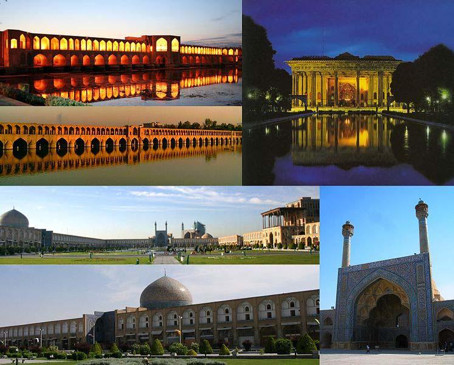

## Sāxtār

### Gozašte‐ye eltezāmi

|            |              |              |                         |
|----------|------------|------------|----------------------- |
| Nemune     | Esm‐e maf’ul |              | Hāl‐e eltezāmi‐ye budan |
|            |              |              |                         |
|            | borde        |              | bāšam.                  |
|            |              |              |                         |
| Šāyad      |              | bāši.        |                         |
| āmade      |              |              |                         |
|            |              |              |                         |
| Bāyad      | gofte        | **+ **bāšad. |                         |
| Momken‐ast | nevešte      |              |                         |
|            | bāšim.       |              |                         |
| Omidvār‐am | šoste        |              |                         |
|            | bāšid.       |              |                         |
|            | rafte        |              |                         |
|            |              |              |                         |
|            |              | bāšand.      |                         |
|            |              |              |                         |

### Moqāyese bā hāl‐e eltezāmi

|                |                        |
|--------------|---------------------- |
| Zamān          | Nemune                 |
|                |                        |
| Hāl‐e eltezāmi | Mitavānam **begu**yam. |

**Gozašte‐ye eltezāmi**Mitavānam **gofte bāš**am.

##### Jāhā‐ye xāli rā bā gozašte‐ye eltezāmi por kon!

1.  Parviz rā peydā nemikonam. Šāyad šomā u rā \_\_     \_\_ (didan). 2.  Baste‐aš hanuz be dast‐am nareside‐ast. Momken‐ast, tāze diruz     \_\_ \_\_ (ferestādan). 3.  Man ciz‐i našenidam vali ehtemāl dārad, ke u in harfhā rā     \_\_ \_\_ (goftan). 4.  Šāyad parandegān sibhā‐ye in deraxt rā \_\_     \_\_ (xordan). 5.  Man az eqāmat‐e u dar hotel ettelā’ nadāram. Šāyad to xabar     \_\_ \_\_ (dāštan). 6.  Pardehā kasif budand. Momken‐ast, mādar‐am ānhā rā     \_\_ \_\_ (šostan). 7.  Yax‐o limu rā farāmuš karde‐im. Šāyad ānhā \_\_     \_\_ (āvardan). 8.  In sāndevichā xošmaze‐and. Šāyad to \_\_     \_\_ \_\_ (emtehān kardan).

<!-- end list -->

9.  Andāmhā‐ye badan‐am dard mikonand. Šāyad šomā davā‐yi     \_\_ \_\_ (dāštan). 10. In estekānhā‐vo na’lbekihā rā naxar, con momken‐ast Mahnāz     \_\_ \_\_ (xaridan). 11. Barā‐ye man qarib budand. Šāyad šomā ānhā rā \_\_     \_\_ (šenāxtan). 12. In sibzaminihā xeyl‐i riz‐and. Šāyad ānhā dorošttar     \_\_ \_\_ (dāštan).

##### Az hāl‐e eltezāmi be gozašte‐ye eltezāmi tabdil kon!

|                                                      |                                                 |
|----------------------------------------------------|----------------------------------------------- |
| Hāl‐e eltezāmi                                       | Gozašte‐ye eltezāmi                             |
|                                                      |                                                 |
| Fariborz šāyad emruz be xāne‐ye mā biāyad.           | Fariborz šāyad diruz be xāne‐ye mā āmade bāšad. |
|                                                      |                                                 |
| Momken‐ast, sāl‐e āyande be Kānādā beravand.         |                                                 |
|                                                      |                                                 |
| Dānešjuyān bāyad in emtehān rā bedehand.             |                                                 |
|                                                      |                                                 |
| Ehtemāl dārad, ke polis dozd rā emruz dastgir konad. |                                                 |
|                                                      |                                                 |
| Pedar‐am mitavānad ān nāme rā benevisad.             |                                                 |
|                                                      |                                                 |
| Emruz šāyad tagarg‐e šadid‐i biyāyad.                |                                                 |
|                                                      |                                                 |
| Šāyad pust‐aš zir‐e āftāb besuzad.                   |                                                 |

## Irān‐o irāni – Esfahān

Šahr‐e Esfahān markaz‐e Ostān‐e Esfahān‐ast va dar nāhiye‐ye markazi‐ye Irān qarār dārad. In šahr tā Tehrān 420 km fāsele dārad. Rud‐e Zāyanderud az miyān‐e Esfahān migozarad va be ān jelve‐i besyār zibā mibaxšad. Esfahān ham az janbe‐ye tārixi va ham az janbe‐ye honari jozv‐e bartarinhā‐ye Irān be šomār miāyad.

Dar gozašte Esfahān pāytaxt‐e cand selsele‐ye pādšāhi, beviže Safaviyān, bude‐ast va az in ru namāyandegān‐o jahāngardān‐e bišomār‐i az šarq‐o qarb be Esfahān raftoāmad mikardand. Emruze niz kamtar kas‐i hast, ke Irān rā dide bāšad vali az Esfahān didan nakarde bāšad.

Esfahān pāytaxt‐e honari‐ye Irān be šomār miravad. Owj‐e honar rā dar in šahr mitavānim azjomle dar me’māri va sanāye‐e dasti‐ye ān az qabil‐e xātamkāri, minākāri, negārgari (miniyātur) va qalamkāri mošāhede konim. Šomār‐i az xirekonandetarin banāhā ye‐e tārixi‐yo honari dar Meydān‐e Naqš‐e

Jahān gerd‐e ham āmade‐and. Dar in meydān‐e besyār bozorg‐o bāšokuh mitavānim az Masjed‐e Šāh, Masjed‐e Šeyx Lotfollāh va Kāx‐e Āliqāpu didan konim‐o dāxel‐e bāzār‐e binazir‐e Esfahān šavim. Kāx‐e Cehelsotun, Madrese‐ ye Cāhārbāq, Kāx‐e Haštbehešt, Menārjonbān, Masjed‐e Jāme’, Kelisā‐ye Vānk va niz polhā‐ye tārixi‐ye Zāyanderud, azjomle Siyosepol va Pol‐e Xāju, az digar didanihā‐ye in šahr‐e zibā hastand.

##### Pāsox bedeh!

1.  Kodām rud az vasat‐e Esfahān migozarad? 2.  Cerā jahāniyān dar gozašte be Esfahān raftoāmad mikardand? 3.  Honar‐e Esfahān rā dar ce cizhā‐yi mitavānim bebinim? 4.  Kodām didanihā rā mitavānim dar Meydān‐e Naqš‐e Jahān bebinim? 5.  Polhā‐ye tārixi‐ye Zāyanderud ce nām dārand?

## Goftogu – Galu‐m dard mikone.

Doktor:Xob, befarmāyin moškel‐etun ci‐ye?

Fariborz:Galu‐m dard mikone.

Doktor:Candvaqt‐e?

Fariborz:Alān se ruz‐e. Vali emruz hāl‐am xeyl‐i badtar‐e.

Doktor:Ejāze bedin, moāyena‐tun konam. Lotfan in daraja ro bezārin tā tab‐etun‐o begiram.

Fariborz:Fekr mikonin, jeddi‐ye?

Doktor:Na, ciz‐e mohemm‐i nis. Ye sarmāxordegi‐ye joz’i‐ye.

Fariborz:Bāyad cekār konam?

Doktor:In qorsā ro har hašt sāat ye dune boxorin. Do‐se ruz‐am esterāhat konin. Hāl‐etun xub miše.

Fariborz:Cašm xānum doktor! Motšakker‐am.

#### Nokte

|  |                   |                   |
| 
|-----------------|----------------- |
|  | Goftāri           | Neveštāri         |
|  |                   |                   |
|  | xob               | xub               |
|  |                   |                   |
|  | befarmāyin        | befarmāyid        |
|  |                   |                   |
|  | moškel‐etun       | moškel‐etān       |
|  |                   |                   |
|  | ci‐ye             | ci‐st             |
|  |                   |                   |
|  | galu‐m            | galu‐yam          |
|  |                   |                   |
|  | mikone            | mikonad           |
|  |                   |                   |
|  | candvaqt‐e        | candvaqt‐ast      |
|  |                   |                   |
|  | alān              | al’ān             |
|  |                   |                   |
|  | se ruz‐e          | se ruz‐ast        |
|  |                   |                   |
|  | bedin             | bedehid           |
|  |                   |                   |
|  | moāyena‐tun konam | moāyene‐tān konam |
|  |                   |                   |
|  | daraja ro         | daraje rā         |
|  |                   |                   |
|  | bezārin           | begozārid         |
|  |                   |                   |
|  | tab‐etun‐o        | tab‐etān rā       |
|  |                   |                   |
|  | mikonin           | mikonid           |
|  |                   |                   |
|  | jeddi‐ye          | jeddi‐st          |
|  |                   |                   |
|  | nis               | nist              |
|  |                   |                   |
|  | ye                | yek               |
|  |                   |                   |
|  | qorsā ro          | qorshā ra         |
|  |                   |                   |
|  | boxorin           | bexorid           |
|  |                   |                   |
|  | se ruz‐am         | se ruz ham        |
|  |                   |                   |

|              |               |
|------------|------------- |
| konin        | konid         |
|              |               |
| hāl‐etun     | hāl‐etān      |
|              |               |
| miše         | mišavad       |
|              |               |
| cašm         | be ru‐ye cešm |
|              |               |
| motšakker‐am | motešakker‐am |

### Ebārathā/vāžehā

Hāl‐am bad‐e – hālattahavvo’ dāram – ... dard mikone Me’de – sar – del – kamar – pā – gardan – guš – šekam – sine

Lotfan derāz bekešin tā moāyana‐tun konam – ejāze bedin, fešārxun‐e tun‐o begiram

Me’dedard – sardard – deldard – kamardard – pādard – gardandard – gušdard – šekamdard – sinedard In ... ro ruz‐i se daf’e boxorin – in kerem/pomād‐o ru‐š bemālin

Qatre – dāru – kapsul – šarbat – davā

##### Bā estefāde az ebārathā/vāžehā goftogu‐ye bālā rā bā hamkelāsi‐yat tamrin kon! Goftogu‐ye behamrixte rā morattab kon va be zabān‐e neveštāri benevis!

– Na, negarān nabāšin, āmpul‐e bihessi mizanam.

– Hicci āqā‐ye doktor. Dandun‐am dard mikone.

– Xeyl‐i dard dāre, āqā‐ye doktor?

– Salām! Ci šode?

– Lotfan bešinin ru‐ye sandali, tā dandunā‐tun‐o bebinam. Moteassefāne yek‐i az unā kerm xorde. Bāyad bekešam‐eš.

\_\_

\_\_

\_\_

\_\_

\_\_

## Vāžehā-ye dars-e 

Pasoxhā-ye dars-e 

Jāhā‐ye xāli rā bā gozašte‐ye eltezāmi por kon!

1\. dide bāšid – 2. ferestāde bāšad – 3. gofte bāšad – 4. xorde bāšand – 5. dāšte bāši – 6. šoste bāšad – 7. āvarde bāšand – 8. Emtehān karde bāši – 9. dāšte bāšid – 10. xaride bāšad – 11. šenāxte bāšid – 12. dāšte bāšand

Az hāl‐e eltezāmi be gozašte‐ye eltezāmi tabdil kon!

Momken‐ast, sāl‐e gozašte be Kānādā rafte bāšand. – Dānešjuyān bāyad in emtehān rā dāde bāšand. – Ehtemāl dārad, ke polis dozd rā diruz dastgir karde bāšad. – Pedar‐am mitavānad ān nāme rā nevešte bāšad. – Diruz šāyad tagarg‐e šadid‐i āmade bāšad. – Šāyad pust‐aš zir‐e āftāb suxte bāšad.

Goftogu‐ye behamrixte rā morattab kon va be zabān‐e neveštāri benevis!

– Salām! Ce šode?

– Hicciz āqā‐ye doktor. Dandān‐am dard mikonad.

– Lotfan benešinid ru‐ye sandali, tā dandānhā‐yetān rā bebinam. Moteassefāne yek‐i az ānhā kerm xorde. Bāyad bekešam aš.

– Xeyl‐i dard dārad, āqā‐ye doktor?

– Na, negarān nabāšid, āmpul‐e bihessi mizanam.

