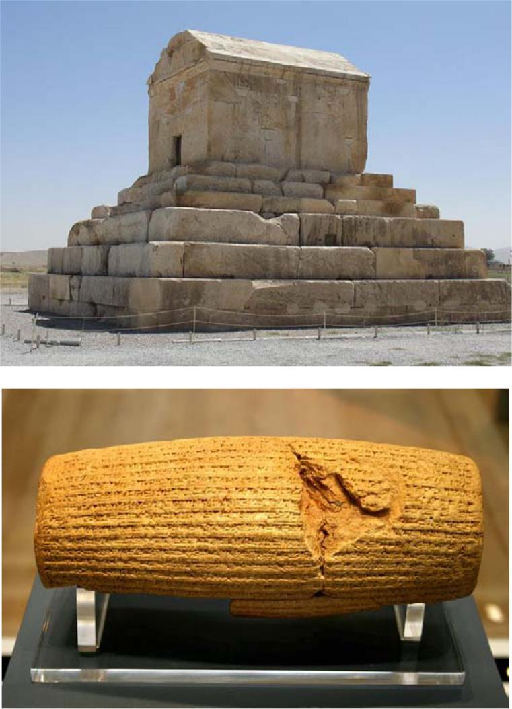

## Sāxtār

### Zamirhā‐ye ta’kidi/en’ekāsi

**XodŠenāseZamir**

xod“‐am”xodam

xod“‐at”xodat

xod**+**“‐aš”**=**xodaš

xod“‐emān”xodemān

xod“‐etān”xodetān

xod“‐ešān”xodešān

#### Nokte

  - Šenāsehā mānand‐e zamirhā‐ye dārāyi/maf’uli hastand.   - Zamir‐e en’ekāsi naqš‐e maf’ul rā dārad va be fāel‐e jomle ešāre     mikonad: Navid saranjām xodaš rā āzād kard.   - Zamir‐e ta’kidi bištar belāfāsele pas az fāel miāyad: Man xodam     goftam.   - Az fāel mitavān sarfenazar kard: Xodaš rā āzād kard. Xodam goftam.   - Zamir‐e ta’kidi/en’ekāsi be dun‐e šenāse ham be kār miravad: Xod rā     āzād kard. Xod goftam.   - Gāh‐i *xod* be onvān‐e zamir‐e en’ekāsi‐ye tanhā bā *xiš* jāygozin     mišavad: Xiš rā āzād kard.

### Zamirhā‐ye moteqābel

|          |                                                                        |
|--------|---------------------------------------------------------------------- |
| Zamir    | Nemune                                                                 |
|          |                                                                        |
| yekdigar | Ānhā yekdigar rā mišenāsand. Mahnāz‐o Parviz bā yekdigar āšnā hastand. |
|          |                                                                        |
| hamdigar | Ānhā hamdigar rā mišenāsand. Mahnāz‐o Parviz bā hamdigar āšnā hastand. |

#### Nokte

  - Porkārbordtarin zamirhā‐ye moteqābel dar fārsi *yekdigar* va     *hamdigar* hastand.   - Gāh‐i *ham* be jā‐ye *hamdigar* miāyad: Ānhā az ham mitarsand.

##### Jāhā‐ye xāli rā bā zamir‐e monāseb por kon!

1.  Kāmrān \_\_ bā minibus raft. 2.  Mā bā māšin‐e \_\_ miāyim. 3.  Cand sāl‐ast, ke bā \_\_ dar yek madrese hastid? 4.  Mādaršowhar‐am \_\_ \_\_ rā da’vat     kard. 5.  Bābak muhā‐yaš rā \_\_ mizanad. 6.  \_\_ rā xaste nakonid. In kār fāyede‐i nadārad. 7.  Mardom bāyad hamiše be \_\_ komak konand. 8.  \_\_ dar‐e tuālet rā basti. 9.  Parviz‐o Bahrām ānhā rā bā \_\_ āvardand. 10. Kāmrān \_\_ ham vazn‐e \_\_ rā     nemidānad. 11. In pārc faqat bist darsad taxfif dāšt, vali man arzāntar xaridam     \_\_. 12. \_\_ ertefā‐e otāq rā andāze gereftim.

## Irān‐o irāni – Kuroš‐e Bozorg

Kuroš‐e Bozorg (580‐529 p.M.) bonyāngozār‐e Šāhanšāhi‐ye Haxāmaneši bud. U noxostin ensān‐i‐st ke be u laqab‐e Bozorg dāde‐and. Farmānravāyi‐ye u sarzaminhā‐ye miyān‐e Daryā‐ ye Eže va Rud‐e Send rā dar bar migereft. Jahān tā ān zamān conin emperāturi‐ye pahnāvar‐i be cešm‐e xod nadide bud.

Kuroš fāteh‐i bozorg bud vali bā šekastxordegān be narmi raftār mikard. In ciz‐i bud, ke tā ān zamān sābeqe nadāšt. Yahudiyān dar Towrāt az u be onvān‐e nāji yād mikonand. Pas az fath‐e Bābel u yahudiyān rā az band āzād kard. Be ānhā komak kard, tā be sarzamin‐e xod beravand va kanisehā‐yešān rā dobāre besāzand.

Yunānizān niz az u bā ehterām yād mikonand. Sarāmad‐e hame‐ye āsār‐e bāstāni‐ye yunāni dar bāre‐ye Kuroš ketāb‐e Kurošnāme az Gezenofon motealleq be āqāz‐e qarn‐e 4om‐e piš az milād‐ast. Gezenofon dar in ketāb Kuroš rā be onvān‐e farmānravā‐yi bāmodārā misetāyad va farmānravāyi‐ye u rā olgu qarār midehad.

Mohemtarin sanad‐e bejāymānde az Kuroš Ostovāne‐ye Kuroš‐ast. Bāstānšenāsān in ostovāne rā dar kāvošhā‐ye šahr‐ e bāstāni‐ye Bābel dar sāl‐e 1879 m. yāftand. Ostovāne‐ye Kuroš marbut be fath‐e Bābel be dast‐e Kuroš dar sāl‐e 539 p.m.‐ast va dārā‐ye šavāhed‐e tārixi‐ye besyār bāarzeš‐i‐st. In ostovāne be Manšur‐e Hoquq‐e Bašar‐e Kuroš niz ma’ruf‐ast. Matn‐e in manšur hāki az be armaqān āvardan‐e solh‐o ārāmeš be Bābel, bāzsāzi‐ye niyāyešgāhhā‐ye virānšode va rahāyi‐o bāzgardāni‐ye asirān be mihan‐ešān‐ast. In ostovāne dar Muze‐ye Beritāniyā dar Landan va badal‐i az ān dar maqarr‐e Sāzmān‐e Melal‐e Mottahed dar *New York* negahdāri mišavad. Barx‐i az pažuhešgarān Manšur‐e Kuroš rā noxostin e’lāmiye‐ye hoquq‐e bašar dar jahān midānand.

##### Pāsox bedeh!

1.  Kuroš‐e Bozorg ke bud? 2.  Tā piš az zohur‐e Kuroš ce ciz‐i sābeqe nadāšt? 3.  Cerā yahudiyān az u be onvān‐e yek rahāyibaxš yād mikonand? 4.  Yunānizān‐e bāstān cegune be Kuroš minegaristand? 5.  Cerā Ostovāne‐ye Kuroš yek sanad‐e tārixi‐ye arzešmand‐ast? 6.  Barx‐i az mohaqqeqān cegune az Ostovāne‐ye Kuroš yād mikonand?

## Goftogu – Mitunam bā ... sohbat konam?

Xānom‐e Gilāni: Befarmāyin!

|                                                |                                                                                                         |
|----------------------------------------------|------------------------------------------------------------------------------------------------------- |
| Jamšid:                                        | Manzel‐e Āqā‐ye Gilāni?                                                                                 |
| Xānom‐e Gilāni:                                | Bale, šomā?                                                                                             |
| Jamšid:                                        | Man Jamšid‐am, yek‐i az hamkārā‐ye Farzād. Mitunam bā Farzād sohbat konam?                              |
| Xānom‐e Gilāni:                                | Jamšid jān, Farzād alān xune nist. Mixāy barā‐š peyqām bezāri?                                          |
| Jamšid:                                        | Lotfan be‐heš begin, fardā qarār‐e, az ye pol‐e tārixi aks begirim. Hatman durbin‐eš‐o bā xodeš biyāre. |
| Xānom‐e Gilāni:                                | Cašm, hatman be‐heš migam. Omidvār‐am, yād‐eš nare.                                                     |
| Jamšid:                                        | Xeyl‐i mamnun. Xodā hāfez!                                                                             |
| Xānom‐e Gilāni: Xāheš mikonam, Xodā negahdār! |                                                                                                         |
|                                                |                                                                                                         |
| Goftāri                                        | Neveštāri                                                                                               |
|                                                |                                                                                                         |
| befarmāyin                                     | befarmāyid                                                                                              |
|                                                |                                                                                                         |
| hamkārā                                        | hamkārhā                                                                                                |
|                                                |                                                                                                         |
| mitunam                                        | mitavānam                                                                                               |
|                                                |                                                                                                         |
| xune                                           | xāne                                                                                                    |
|                                                |                                                                                                         |
| mixāy                                          | mixāhi                                                                                                  |
|                                                |                                                                                                         |
| alān                                           | al’ān                                                                                                   |
|                                                |                                                                                                         |
| barā‐š                                         | barā‐yaš                                                                                                |
|                                                |                                                                                                         |
| bezāri                                         | begozāri                                                                                                |
|                                                |                                                                                                         |
| be‐heš                                         | be u                                                                                                    |
|                                                |                                                                                                         |
| begin                                          | beguyid                                                                                                 |
|                                                |                                                                                                         |
| qarār‐e                                        | qarār‐ast                                                                                               |
|                                                |                                                                                                         |
| ye                                             | yek                                                                                                     |
|                                                |                                                                                                         |
| durbin‐eš ‐o                                   | durbin‐aš rā                                                                                            |
|                                                |                                                                                                         |
| xodeš                                          | xodaš                                                                                                   |
|                                                |                                                                                                         |
| biyāre                                         | biyāvarad                                                                                               |
|                                                |                                                                                                         |
| cašm                                           | be ru‐ye cešm                                                                                           |
|                                                |                                                                                                         |
| migam                                          | miguyam                                                                                                 |
|                                                |                                                                                                         |
| yād‐eš nare                                    | yād‐aš naravad                                                                                          |

### Ebārathā/vāžehā

Qasr – muze – masjed – kelisā – qal’e – kāx – arg – bāq – borj – hammām – kārvānsarā

##### Bā estefāde az ebārathā/vāžehā goftogu‐ye bālā rā bā hamkelāsi‐yat tamrin kon! Goftogu‐ye bālā rā be zabān‐e neveštāri benevis!

\_\_

\_\_

\_\_

\_\_

\_\_

\_\_

\_\_

\_\_

\_\_

##### Jāhā‐ye xāli rā por kon!

Negin:Alo, \_\_!

Āqā‐ye Kāmyāb: Salām, \_\_!

Negin:\_\_e Xānom‐e Xoršidi?

Āqā‐ye Kāmyāb: \_\_, eštebāh gereftin.

Negin:\_\_, mozāhem‐etun šodam.

Āqā‐ye Kāmyāb: Xāheš \_\_.

## Vāžehā-ye dars-e 

Pasoxhā-ye dars-e 

Jāhā‐ye xāli rā bā zamir‐e monāseb por kon!

1\. xodaš – 2. xodemān – 3. u – 4. xodaš; mā – 5. xodaš – 6. xodetān – 7. hamdigar – 8. xodat – 9. xodešān – 10. xodaš; xodaš – 11. ‐aš – 12. xodemān

Goftogu‐ye bālā rā be zabān‐e neveštāri benevis!

Xānom‐e Gilāni: Befarmāyid!

Jamšid:Manzel‐e Āqā‐ye Gilāni?

Xānom‐e Gilāni: Bale, šomā?

Jamšid:Man Jamšid‐am, yek‐i az hamkārhā‐ye Farzād. Mitavānam bā Farzād sohbat konam?

Xānom‐e Gilāni: Jamšid jān, Farzād al’ān xāne nist. Mixāhi barā‐yaš peyqām begozāri?

Jamšid:Lotfan be u beguyid, fardā qarār‐ast, az yek pol‐e tārixi aks begirim. Hatman durbin‐aš rā bā xodaš biāvarad.

Xānom‐e Gilāni: Be ru‐ye cešm, hatman be u miguyam. Omidvār am, yād‐aš naravad.

Jamšid:Xeyl‐i mamnun. Xodā hāfez!

Xānom‐e Gilāni: Xāheš mikonam, Xodā negahdār!

Jāhā‐ye xāli rā por kon!

salām – befarmāyin – manzel – naxeyr – bebaxšin – mikonam

