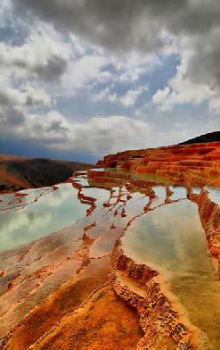

##### Jomlehā‐ye zir rā kāmel kon!

1.  Man fārsi yād migiram, con     \_\_ 2.  Pedar‐am kuhnavardi rā dust nadārad, banā bar in     \_\_ 3.  Agarce sedā‐yaš rā mišenavam,     \_\_ 4.  Parviz na tanhā gitār mizanad, balke     \_\_ 5.  Bā vojud‐e moškelāt‐e eqtesādi     \_\_ 6.  Mā harsāl be šomāl miravim, zirā     \_\_ 7.  Ānhā yā bāyad emšab beravand, yā     \_\_ 8.  Bā in ke xodam rā barā‐ye emtehān āmāde karde budam,     \_\_ 9.  Parvāz be Esfahān gerān‐ast, az in ru     \_\_ 10. Be dalil‐e in ke barf mibārid,     \_\_ 11. Mixāham u rā bebinam, vali     \_\_ 12. In kār besyār saxt‐ast, alāve bar in     \_\_ 13. Mā hame gorosne‐im, dar hā‐i ke     \_\_ 14. Qabl az in ke beravi,     \_\_ 15. Be dun‐e in ke moškel rā hal konad,     \_\_ 16. Be jā‐ye in ke motorsiklet bexari,     \_\_ 17. Garce satl‐e āšqāl injā nist,     \_\_ 18. Bā vojud‐e in ke in bāzi yeknavāxt‐ast,     \_\_

## Irān‐o irāni – Bādāb‐e Surt

Bādāb‐e Surt nām‐e cešmehā‐ye šegeftangiz‐i‐st ke dar jonub‐e šarqi‐ye Ostān‐e Māzandarān qarār dārand. Bādāb‐e Surt be zabān‐e mahalli ya’ni asar‐e āb‐e gāzdār. Vali in cešmehā bā nām‐e Cešmehā‐ye Talāyi yā Qasr‐e Talāyi ma’ruf šode‐and va be onvān‐e dovvomin asar‐e mirās‐e tabii‐ye Irān be sabt reside‐and.

Bādāb‐e Surt do cešme dārad. Āb‐e harkodām az in cešmehā rang, bu va maze‐ye xāss‐e xodaš rā dārad. Yek‐i šur‐e šur va digar‐i toršoširin‐ast. Āb‐e in cešmehā masāref‐e darmāni niz dārad. Ābhā‐ye rosubi‐ye in cešmehā hezārān sāl‐ast ke bā sarāzir šodan az kuhestān howzcehā‐ye rangin‐i rā dar del‐e saxrehā por mikonand. Tabiat in makān rā barā‐ye bāzi‐ye ranghā bā sanghā bargozide‐ast. Dar qesmat‐i saxrehā lāye‐lāye dar rang‐e nārenji zamin rā bālā rafte‐ and. Dar baxš‐i digar zamin lāye‐lāye sabz‐o ābi va kam‐i āntaraftar lāye‐lāye zard‐ast. Tābeš‐e nur‐e xoršid dar howzcehā‐ye rangin va en’ekās‐e nur ān dar sāyerowšan‐e tabiat yek‐i az zibātarin tāblowhā‐ye tabiat rā dar moqābel‐e cešmān‐e šegeftzade‐ye binandegān‐e xiš qarār midehad.

Dar jahān se kešvar‐e digar hastand, ke cešmehā‐yi mošābeh dārand: Torkiye, Āmrikā va Niyuzland. Nām‐e cešme dar Torkiye Pāmukāle‐ast. Pāmukāle bozorgtar az Bādāb‐e Surt‐ast, vali rang‐e ān be dalil‐e rosubāt‐e kalsiyom sefid‐ast.

#### Nokte

  - “Šur‐e šur“ ya’ni “xeyl‐i šur”.

##### Pāsox bedeh!

1.  Bādāb‐e Surt kojā‐st? 2.  Cešmehā‐ye Bādāb‐e Surt be onvān‐e candomin asar‐e mirās‐e tabii dar     Irān be sabt reside‐and? 3.  In cešmehā bā ce nām‐i ma’ruf šode‐and? 4.  Bādāb‐e Surt cand cešme dārad? 5.  In cešmehā ce vižegihā‐yi dārand? 6.  Cerā dar matn‐e bālā az bāzi‐ye ranghā bā sanghā mixānim? 7.  Kodām kešvarhā cešmehā‐ye mošābeh‐i dārand?

## Goftogu – Kojā tašrif mibarin?

Modir‐e āžāns:Tāksiservis‐e Bahār, befarmāyin!

Xānom‐e Āzari:Salām. Bebaxšin, ye māšin mixāstam.

Modir‐e āžāns:Tamannā mikonam. Šomāre‐ye ešterāk dārin?

Xānom‐e Āzari:Na moteassefāne.

Modir‐e āžāns:Besyār xob, kojā tašrif mibarin?

Xānom‐e Āzari:Meydun‐e Tajriš.

Modir‐e āžāns:Ādres‐etun lotfan.

Xānom‐e Āzari:Xiyābun‐e Xoš, kuce‐ye Rāzgošā, pelāk‐e 14.

Modir‐e āžāns:Esm‐e šarif‐etun?

Xānom‐e Āzari:Bande Āzari hastam.

Modir‐e āžāns:Šomāretelefon‐etun‐am lotf mikonin?

Xānom‐e Āzari:Xāheš mikonam, 88 93 94 17.

Modir‐e āžāns:Xānum‐e Āzari, māšin tā dah daiqe dige miyād xedmat‐etun.

Xānom‐e Āzari:Motšakker‐am, xodā hāfez!

Modir‐e āžāns:Tamannā mikonam, Xodā negahdār!

#### Nokte

  - “Kojā tašrif mibarin?“ be ma’ni‐ye “Kojā miravid?” be gune‐ye     moaddabānetar‐ast.   - Be jā‐ye “Esm‐e šarif etun?“ mitavānim nām‐e yek xānom rā bā     “Sarkār?“ va nām‐e yek āqā rā bā “Jenābāli?“ beporsim.   - “Bande“ dar injā be ma’ni‐ye "man" be kār miravad.   - “Miyād xedmat‐etun“ ya’ni miāyad, tā dar xedmat‐e šomā bāšad.

#### Nokte

|  |            |            |
| 
|----------|---------- |
|  | Goftāri    | Neveštāri  |
|  |            |            |
|  | befarmāyin | befarmāyid |
|  |            |            |
|  | bebaxšin   | bebaxšid   |
|  |            |            |
|  | dārin      | dārid      |
|  |            |            |
|  | xob        | xub        |
|  |            |            |
|  | mibarin    | mibarid    |
|  |            |            |
|  | meydun     | meydān     |
|  |            |            |
|  | ādres‐etun | ādres‐etān |
|  |            |            |
|  | xiyābun    | xiyābān    |
|  |            |            |

|                               |                           |
|-----------------------------|------------------------- |
|  |                           |
|                               |                           |
| esm‐e šarif‐etun              | esm‐e šarif‐etān          |
|                               |                           |
| šomāretelefon‐etun‐am         | šomāretelefon‐etān rā ham |
|                               |                           |
| mikonin                       | mikonid                   |
|                               |                           |
| xānum                         | xānom                     |
|                               |                           |
| daiqe                         | daqiqe                    |
|                               |                           |
| dige                          | digar                     |
|                               |                           |
| miyād xedmat‐etun             | miāyad xedmat‐etān        |
|                               |                           |
| motšakker‐am                  | motešakker‐am             |

### Ebārathā/vāžehā

Šomāre‐ye ešterāk‐etun cand‐e? ...

Barā‐ye kojā mixāstid?

Forudgāh – rāhāhan – Termināl‐e Qarb Key mirese?

Hamin alān – tā nim sāat‐e dige

##### Bā estefāde az ebārathā/vāžehā goftogu‐ye bālā rā bā hamkelāsi‐yat tamrin kon! Goftogu‐ye behamrixte rā morattab kon va be zabān‐e neveštāri benevis!

– Besyār xob, pas barā sāat‐e cāhār ye māšin mifrestam xedmat‐etun.

– Salām Jenāb‐e Behruzi. Amr befarmāyin! Kojā tašrif mibarin?

– Tāksiservis‐e Pāsārgād, befarmāyin!

– Taqāzā mikonam. Mixāstam fardā sāat‐e panj‐e sobh forudgāh bāšam.

– Xeyl‐i mamnun!

– Xaste nabāšin! Behruzi hastam, moštarek‐e 121.

\_\_

\_\_

\_\_

\_\_

\_\_

\_\_

## Vāžehā-ye dars-e 

Pasoxhā-ye dars-e 

Goftogu‐ye behamrixte rā morattab kon va be zabān‐e neveštāri benevis!

– Tāksiservis‐e Pāsārgād, befarmāyid!

– Xaste nabāšid! Behruzi hastam, moštarek‐e 121.

– Salām Jenāb‐e Behruzi. Amr befarmāyid! Kojā tašrif mibarid?

– Taqāzā mikonam. Mixāstam fardā sāat‐e panj‐e sobh forudgāh bāšam.

– Besyār xub, pas barā‐ye sāat‐e cāhār yek māšin miferestam xedmat‐etān.

– Xeyl‐i mamnun!

