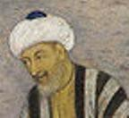
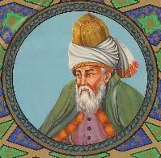
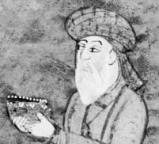

##### Jāhā‐ye xāli rā bā ebārat‐e qeyrešaxsi‐ye monāseb por kon!

1.  Mahin az film‐e tarsnāk \_\_     (bad āmadan). 2.  Harce fekr kardam, \_\_ (yād     āmadan), ke u rā kojā dide budam. 3.  Lotfan panjere rā beband! Ānhā hassās hastand.     \_\_ (sard šodan). 4.  Kāpšen‐at rā dar biyāvar, vagarna     \_\_ (garm šodan). 5.  Zarbe‐aš mohkam bud. Parviz \_\_     (dard gereftan). 6.  Dar meh nabāyad tond balke yavāš     \_\_ (rānandegi kardan). 7.  Xānehā rā az bālā‐ye borj \_\_     (šodan, didan). 8.  Farzāne dānešju‐ye besyār zerang‐i‐st. Mitavān \_\_     (goftan), ke u behtarin dānešju‐ye dāneškade‐ast. 9.  Injā jā‐ye amn‐i nist. Be jā‐ye digar‐i bāyad \_\_     (raftan). 10. Parisā \_\_ (yād raftan), ke     mesvāk‐o xamirdandān‐aš rā bā xodaš biyāvarad. 11. Ānhā az docarxesavāri‐yo dow     \_\_ (xoš āmadan). 12. Dar in butik \_\_ pirāhanhā‐yi bā modelhā‐ye     motenavve’ \_\_ (tavānestan, xaridan). 13. Hengām‐e ra’dobarq nabāyad zir‐e deraxt \_\_     (istādan). 14. Āheste harf bezan, tā Susan \_\_     (xāb bordan).

##### Jāhā‐ye xāli rā dar matn‐e zir bā fe’lhā‐ye sababi por kon!

Faribā, dust‐e Sārā, cand ruz piš bimār šode bud. Sārā be ayādat‐e u raft. Faribā xeyl‐i qamgin bud va dāruhā‐yaš rā nemixord. Sārā noxost u rā ru‐ye sandali \_\_ (nešastan). Sepas kenār‐e u nešast va talāš kard, tā bā jokhā‐ye xod u rā \_\_

(xandidan). Kār‐e sāde‐i nabud, vali Sārā bel’axare Faribā rā \_\_ (xandidan). Bā hezār xāheš‐o tamannā dāruhā‐yaš rā ham be u \_\_ (xordan). Faribā be Sārā qowl dād, ke az in be ba’d xodaš dāruhā‐yaš rā bexorad.

## Irān‐o irāni – Bozorgān‐e adab‐o andiše

Adab‐e pārsi pišine‐i dirine dārad va az gerānbahātarin adabiyāt‐e bašariyat be šomār miravad. Dar adabiyāt‐e pārsi še’r hamvāre jāygāh‐e viže‐i dāšte‐ast. Az miyān‐e šāerān‐e irāni mitavān az Sa’di, Mowlavi (Rumi) va Hāfez nām bord. Haryek az ānhā šohrat‐e jahāni dārad va tarjome‐ye āsār‐aš be zabānhā‐ye gunāgun dar dastres‐ast.

**Sa’di **(568‐671 h.š.) be Ostād‐e Soxan šohrat dārad. U moddat‐e derāz‐i az omr‐e xod rā** **dar safarhā‐ye** **pormājarā be kešvarhā‐ye gunāgun gozarānd. Ma’ruftarin āsār‐e Sa’di Bustān va Golestān nām dārand. Soxan‐e Sa’di bār‐e axlāqi‐yo ensāndusti dārad. Irāniyān az xordsāli bā aš’ār‐o hekāyāt‐e u āšnā mišavand va besyār‐i az ānhā dar nazd‐e irāniyān zarbolmasal šode‐and.

**Mowlavi **(586‐652 h.š.) az bozorgtarin va porkārtarin** **ārefān‐o šāerān‐e irāni‐st. U dar javāni be Quniyye** **(Torkiye‐ye emruzi, Rum‐e sābeq) raft va dar ānjā mizist. Be hamin dalil be u Rumi niz miguyand. Ma’ruftarin āsār‐e u Divān‐e Šams‐e Tabrizi va Masnavi‐ye Ma’navi nām dārand. Āsār‐e u bozorgtarin ta’sir rā dar adab‐ e ārefāne dāšte‐and.

**Hāfez **(706‐769 h.š.) mahbubtarin šāer‐e irāni‐st. Šāyad hic xāne‐i rā** **dar Irān natavān yāft, ke dar** **ān Divān‐** **e Hāfez nabāšad. Hāfez qazal rā be noqte‐ye owj‐e xod resānd. Soxan‐e Hāfez hakimāne‐vo jāduyi‐st va hekāyat az setiz bā riyākāri‐yo jahl‐o taassob dārad. Hāfez az conān maqām‐i dar nazd‐e jahāniyān barxordār‐ ast, ke šifte‐ye u, Göthe, dar bāre‐aš conin miguyad: *“... Hāfez! Xiš rā* *bā* *to barābar nahādan, joz nešān‐e* *divānegi nist.”*

##### Pāsox bedeh!

1.  Adabiyāt‐e fārsi ce jāygāh‐i dar jahān dārad? 2.  Ma’ruftarin āsār‐e Sa’di ce nām dārand? 3.  Ma’ruftarin āsār‐e Mowlavi ce nām dārand? 4.  Ce ketāb‐i ehtemālan dar xāne‐ye hame‐ye irāniyān hast? 5.  Soxan‐e Hāfez ce vižegihā‐yi dārad?

## Goftogu – Parvāz ce sāat‐i‐ye?

### Ebārathā/vāžehā

Luthansa – Berlin – pesar – bist‐o panj kilu

##### Bā estefāde az ebārathā/vāžehā goftogu‐ye bālā rā bā hamkelāsi‐yat tamrin kon! Goftogu‐ye behamrixte rā morattab kon va be zabān‐e neveštāri benevis!

– Ye parvāz‐e bedunetavaqqof bā Iran Air dārim, cāhārsad hezār Toman.

– Ye belit‐e raftobargašt be Bārselon lotfan.

– Key tašrif mibarin?

– Arzuntar nadārin?

– Cerā, bā KLM miše sisad‐o panjā hezār Toman, vali ye tavaqqof tu Āmesterdām dārin.

– Haftom‐e mehr. Bist‐o yekom‐e ābān‐am mixām bar gardam.

\_\_

\_\_

\_\_

\_\_

\_\_

\_\_

## Vāžehā-ye dars-e 

Pasoxhā-ye dars-e 

Jāhā‐ye xāli rā bā ebārat‐e qeyrešaxsi‐ye monāseb por kon!

1\. bad‐aš miāyad – 2. yād‐am nayāmad – 3. sard‐ešān mišavad – 4. garm‐at mišavad – 5. dard‐aš gereft – 6. rānandegi kard – 7. mišavad; did – 8. goft – 9. raft – 10. yād‐aš raft – 11. xoš‐ešān miāyad – 12. mitavān; xarid – 13. istād – 14. xāb‐aš bebarad

Jāhā‐ye xāli rā dar matn‐e zir bā fe’lhā‐ye sababi por kon!

nešānd – bexandānad – xandānd – xorānd

Goftogu‐ye behamrixte rā morattab kon va be zabān‐e neveštāri benevis!

– Yek belit‐e raftobargašt be Bārselon lotfan.

– Key tašrif mibarid?

– Haftom‐e mehr. Bist‐o yekom‐e ābān ham mixāham bar gardam.

– Yek parvāz‐e bedunetavaqqof bā Iran Air dārim, cāhārsad hezār Tumān.

– Arzāntar nadārid?

– Cerā, bā KLM mišavad sisad‐o panjā hezār Tumān, vali yek tavaqqof dar Āmesterdām dārid.

