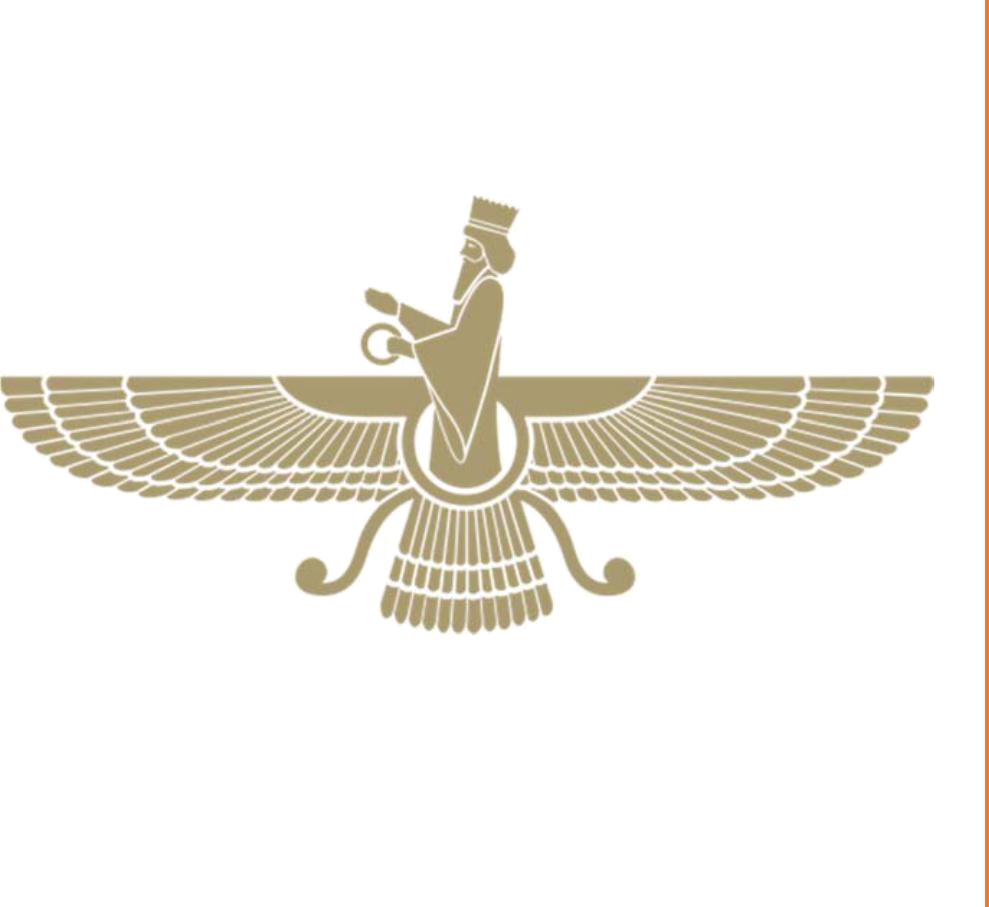
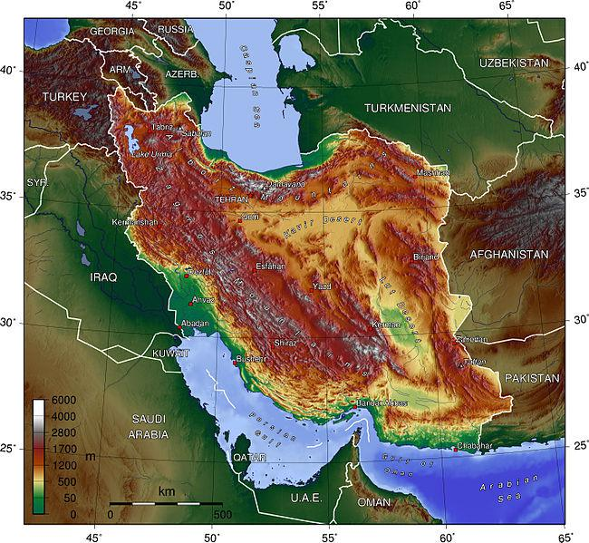
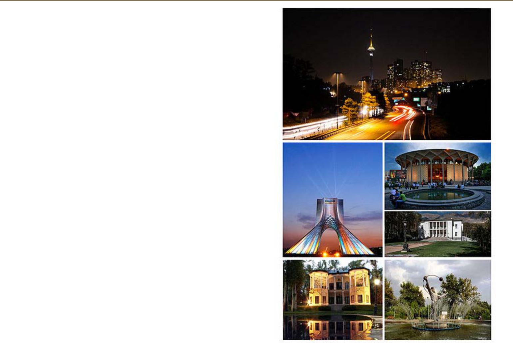
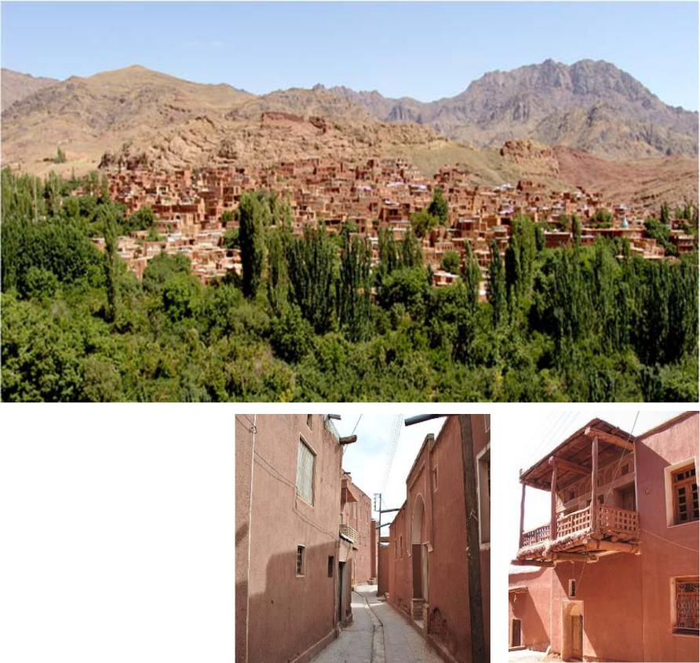
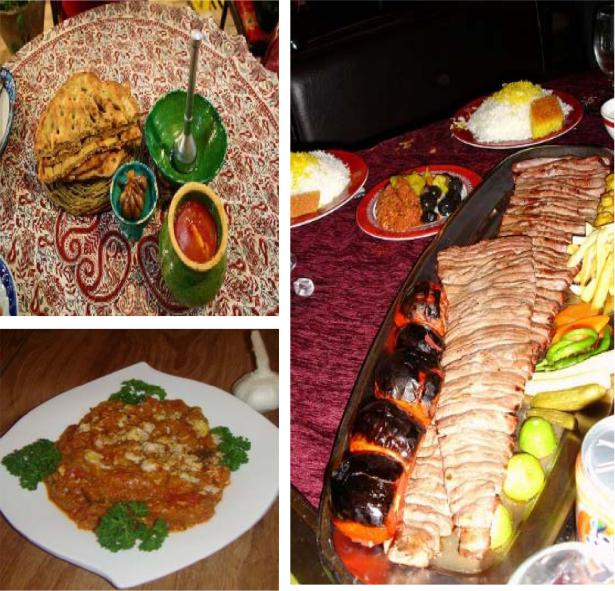
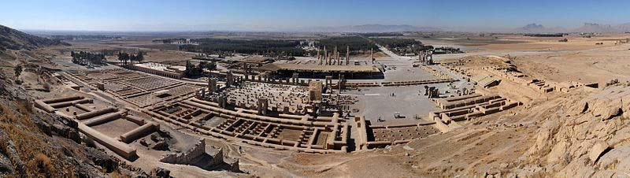
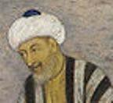
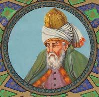
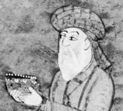

---
title:	Mā fārsi balad-im
layout: page
---

# MĀ FĀRSI BALAD‐IM\!

Be kušeš‐e Hamid Farroukh

# Mā fārsi balad‐im\!

Be kušeš‐e Hamid Farroukh

Anjoman‐e Irāniyān

Virāst‐e dovvom

Bahār‐e 1393

Irānischer Verein e. V.

Postfach 180408

60085 Frankfurt‐am Main

[www.iranverein.de](http://www.iranverein.de/)

<info@iranverein.de>

# Dar bāre‐ye virāst‐e dovvom

Tā cand‐i piš estāndārd‐i rasmi barā‐ye āvānegāri‐ye fārsi be xatt‐e
Lātin nabud. Xošbaxtāne be tāzegi estāndārd‐i bā onvān‐e Šivenāme‐ye
Āvānegāri‐ye Kolli‐ye Nāmhā‐ye Joqrāfiyāyi‐ye Irān be hame‐ye
vezāratxānehā‐vo nahādhā‐ye dowlati barā‐ye ejrā eblāq šode. Be hamin
dalil dar virāst‐e talāš kardim, tā Alefbā‐ye 2om va niz in
ketāb rā bā in estāndārd hamāhang konim.

# Sepāsgozāri

Tarh‐o farāhamāvari‐ye Alefbā‐ye 2om az kušešhā‐vo
pišnahādhā‐ye pišiniyān bahre borde‐ast. Jāy‐e ān dārad, ke az
hame‐ye ānhā sepāsgozāri šavad. Az miyān‐e pišnahādhā‐ye gozašte
mitavān beviže az Unipers, IPA2 Pársik, Eurofarsi, Dabire, Nowdabire va
Persik nām bord, ke harkodām be nowbe‐ye xod naqš‐e besezā‐yi dar
bonyād‐e Alefbā‐ye 2om dāšte‐and. Hamconin sepās‐e farāvān
az Āqā‐ye Masud Khayyam ke bā be miyān āvardan‐e ide‐ye xatt‐e fanni dar
kenār‐e xatt adabi‐ye fārsi angize‐ye xatt‐e dovvom rā dar zehn‐e
negārande bar angixtand. Sepās‐e viže az Āqā‐ye Omid Kashefi barā‐ye
kušešhā‐ye bidariq‐e išān barā‐ye sāxt‐e narmafzār‐e tarānevisi.
Barā‐ye poštibāni az tarh‐e Alefbā‐ye 2om az Anjoman‐e
Irāniyān (Iranischer Verein, e.V.) dar *Frankfurt* besyār
sepāsgozār‐am. Hamconin sepās‐e farāvān az dustān‐e xub‐am, Bagher
Zahedi Nour va Ebi Habibi barā‐ye hamandiši‐yo hamkāri dar
farāhamāvari‐ye Alefbā‐ye 2om. Az dustān‐e gerāmi‐yam,
Fararh Khosravānfar va Ebi Habibi barā‐ye hamkāri dar zabt‐e
goftoguhā‐ye darshā‐ye in ketāb bikarān sepāsgozār‐am. Dar pāyān az
xānevāde‐ye xiš, hamsar‐am Luzia, va farzandān‐am Sophia Annahita va
Roxana Amanda, barā‐ye sālhā poštibāni‐ye bidariq az tah‐e del
sepāsgozāri mikonam, ke be dun‐e ān piyādesāzi‐ye in tarh hargez
emkānpazir nemibud.

# © Parvāne

In ketāb bar pāye‐ye parvāne‐ye *Creative Commons* **CC BY‐SA** 3.0
barā‐ye hamegān dar dastres‐ast. Hargune bekārgiri, kopibardāri‐yo
degarguni dar in ketāb mojāz‐ast, agar farāvarde‐ye pāyāni niz bā hamin
parvāne yā parvānehā‐ye sāzgār erāe šavad. Barā‐ye āgāhi‐ye bištar dar
bāre‐ye in parvāne be *creativecommons.org/licenses* negāh konid.

# Fehrest

# Payām‐i az Anjoman‐e Irāniyān

Došvārihā‐ye āmuzeš‐e zabān‐e fārsi be nownahālān dar xārej az kešvar be
sabab‐e adam‐e tasallot‐e ānān dar xāndan‐o neveštan‐e motun‐e fārsi
angize‐i šod barā‐ye jostoju‐ye rāhkār‐i bonyādin, ke be bekārgiri‐ye
xatt‐i dovvom dar kenār‐e xatt‐ e fārsi anjāmid.

Hāsel‐e sālhā pažuheš‐o āzmun tavassot‐e Dr. Hamid Farroukh monjar be
tarh‐o ijād‐e xatt‐i bar pāye‐ye horuf‐e Lātin be nām‐ e "Alefbā‐ye
2om" šod. Farāham kardan‐e abzārhā‐ye zirsāxti azjomle
vāženāmehā‐ye dozabāne, qalatyāb‐e emlāyi va niz narmafzār‐e
tarānevisi barā‐ye bar gardāndan‐e motun‐e fārsi be xatt‐e dovvom,
pāsox‐i kāmelan amali rā be in zarurat‐e tārixi barā‐ye noxostin bār
emkānpazir sāxt.

Alāqemandān mitavānand barā‐ye āgāhi‐ye bištar dar bāre‐ye in xat be
tārnamā‐ye candzabāne‐ye www.alefbaye2om.org morājee konand.

"Mā fārsi balad im\!", majmue‐i ke dar dast dārid, be kušeš‐e Dr.
Farroukh dar cāhārcub‐e tarh‐i āzmāyeši az su‐ye Anjoman‐e Irāniyān
barā‐ye kelās‐e āmuzeš‐e zabān‐e fārsi be nowjavānān‐o javānān‐e
irānitabār farāham šode.

In majmue‐ye āmuzeši az 24 dars hamrāh bā parvandehā‐ye šenidāri taškil
šode, ke harkodām dārā‐ye baxšhā‐ye zir‐ast:

  - Matn‐i barā‐ye moarrefi‐ye sāxtār‐e dasturi
  - Sāxtār‐e dasturi‐yo tamrin
  - Moarrefi‐ye guše‐i az sarzamin‐o farhang‐e Irān
  - Goftogu barā‐ye barāvarde kardan‐e niyāzhā dar mowqeiyyathā‐ye
    gunāgun

In Majmue hamconin dārā‐ye baxšhā‐ye yādāvari‐st va dar pāyān‐e ketāb
pāsox‐e baxš‐e bozorg‐i az tamrinhā‐vo fehrest‐e vāžehā‐ye har dars
hamrāh bā tarjome‐ye ānhā āmade.

Anjoman‐e Irāniyān eftexār mikonad, ke dar poštibāni‐ye in ganjine‐ye
tārixi sahm‐e kucak‐i ohdedār‐ast va šak nadārad, ke in gām zamine‐i
barā‐ye gāmhā‐ye bas jasurānetar dar āyande xāhad bud.

Ebi Habibi

Sarparast‐e Anjoman‐e Irāniyān

# Dar bāre‐ye in ketāb

## Goruh‐e hadaf

In ketāb dar cāhārcub‐e tarh‐i āzmāyeši az su‐ye Anjoman‐e Irāniyān
(*Iranischer Verein, e.V.*) dar *Frankfurt* barā‐ye kelās‐e āmuzeš‐e
zabān‐e fārsi be nowjavānān‐o javānān‐e irānitabār farāham šode. In
ketāb barā‐ye āmuzeš be kudakān monāseb nist\!

## Cerā Alefbā‐ye 2om?

Farāgiri‐ye zabān‐e fārsi va be yāri‐ye ān tarābord‐e farhang‐e irāni be
nowjavānān‐o javānān‐i ke farāsu‐ye Irān zendegi mikonand, hamvāre yek‐i
az negarānihā‐ye bonyādin‐e pedar‐mādarān va niz āmuzgārān‐e in zabān
bude. Bar kas‐i pušide nist, ke bištar‐e irāniyān‐e tabār‐e dovvom bā in
ke kamābiš mitavānand be fārsi soxan beguyand va in zabān rā befahmand,
dar xāndan‐o neveštan‐e in zabān bisavād šemorde mišavand.

Nātavāni dar xāndan‐o neveštan‐e neveštehā‐ye fārsi be ān mianjāmad, ke
dāneš‐e in nowjavānān‐o javānān dar zabān‐e mādari yā pedari‐šān hamvāre
dar rade‐i besyār pāyin bāz bemānad, va ān tarābord‐e farhangi‐ye delxāh
anjām nagirad. Tajrobe nešān dāde, ke talāš barā‐ye āmuzeš‐e xāndan‐o
neveštan be tabār‐e dovvom‐e irāniyān‐e birun az kešvar be dalil‐e
nabud‐e ciregi‐ye išān bar xatt‐e fārsi bištar nākārāmad az āb dar
miāyad. Xatt‐e fārsi bāzdārande‐ye bozorg‐i barā‐ye kasān‐i be šomār
miāyad, ke mānand‐e irāniyān‐e bumi dar tamās‐e ruzmarre bā in xat rošd
nakarde‐and.

Došvārihā‐ye xatt‐e fārsi ānconān pušide nist. Be towr‐e kolli, ānhā rā
mitavān conin bar šemord:

  - Barx‐i az vākehā padidār nemigardand va barx‐i niz hamzamān hamxān‐i
    rā namāyandegi mikonand.
  - Nevisehā jodā nevešte našode va baste be jāygāh‐e ānhā dar vāže be
    rixthā‐ye gunāgun‐i padidār mišavand.
  - Gāh‐i yek nevise cand sedā dārad.
  - Gāh‐i yek sedā bā cand nevise namāyandegi mišavad.
  - Negāreš‐e xatt‐e fārsi az rāst be cap anjām migirad va bā
    gozārehā‐ye riyāzi nāhamāhangi dārad.

In došvārihā bed‐ān mianjāmand, ke kas‐i be dun‐e dānestan‐e baxš‐e
bozorg‐i az vāžegān‐e fārsi tavānā be xāndan‐o neveštan‐ e ravān‐e
neveštehā‐ye fārsi nabāšad. Barā‐ye yek zabānāmuz bā angize‐i miyāngin
cand sāl tul mikešad, tā betavānad ravān benevisad‐o bexānad. Irāniyān‐e
tabār‐e dovvom‐e birun az kešvar, baste be kešvar‐i ke dar ān zendegi
mikonand va senn‐i ke dar āqāz‐e yādgiri dārand, fārsi rā be onvān‐e
zabān‐e dovvom yā hattā sevvom yād migirand. Pišraft‐e besyār āheste
dar xāndan‐o neveštan be sarxordegi va ce basā rahā kardan‐e yeksare‐ye
yādgiri‐ye zabān‐e neveštāri mianjāmad.

Az āqāz‐e sade‐ye bistom tā konun va be gune‐i sarāsar mostaqel az
vaz’iyat‐e došvāriāfarin‐e irāniyān‐e māndegār dar birun az kešvar
besyār‐i xāhān‐e jāygozini‐ye xatt‐e fārsi bā xatt‐i sādetar šode‐and.
Dar miyān‐e pišnahādhā bištar xatt‐e Lātin be cešm mixorad, cerā ke
jahāniyān bā in xat āšnā hastand. Harcand havādārān‐e conin tarh‐i bā
ešāre be pišrafthā‐ye fanāvari‐ ye rāyānei bar gardāndan‐e kamābiš
xodkār‐e adab‐e fārsi rā be xatt‐e now navid midehand va siyāsat‐i
gāmbegām barā‐ye gostareš‐e xatt‐e now pišnahād mikonand, moxālefān‐e
in tarh bim‐e šekast‐e peyvand‐e farhangi bā gozašte‐vo gozaštegān‐e xiš
rā dārand.

Be nazar miresad, ke cāre‐i barā‐ye borunraft az in došvāri peydā šode,
va ān bekārgiri‐ye yek xatt‐e dovvom dar kenār‐e xatt‐ e fārsi mibāšad.
Alefbā‐ye 2om nām‐e tarh‐i barā‐ye hamin xāste‐ast. Hadaf jāygozini‐ye
xatt‐e fārsi nist\! Alefbā‐ye 2om tanhā abzār‐i komaki barā‐ye peyvand‐e
tabār‐e dovvom bā neveštehā‐ye fārsi‐st va in forsat rā farāham mikonad,
tā zabānāmuzān be dalil‐e došvārihā‐ye xat az āmuxtan‐e zabān xoddāri
nakonand va cebasā dar āyande betavānand, xatt‐e fārsi rā niz
biyāmuzand.

Farātar az ān, ce xoš dāšte bāšim‐o ce na, irāniyān hattā dar darun‐e
Irān dar mowredhā‐yi xatt‐e Lātin rā barā‐ye zabān‐e fārsi be kār
migirand (barā‐ye nemune dar neveštan‐e payāmakhā‐ye telefoni). Az in ru
soxan bar sar‐e šāyeste yā nāšāyeste dānestan‐e in kār nist, balke bar
sar‐e estāndārdsāzi‐ye bekārgiri‐ye xatt‐e Lātin‐ast. Haminjā bāyad
goft, ke Alefbā‐ye 2om peyvand‐i bā padide‐ye "Pinglish" nadārad. Zirā
az ānjā‐yi ke šivehā‐vo estāndārdhā‐yi dar bekārgiri‐ye alefbā‐ye
engelisi barā‐ ye zabān‐e fārsi vojud nadārad, "Pinglish" gereftār‐e
āšoftegi šode va harkas ān rā be saliqe‐ye xod be kār mibarad, ke
hamin be ebhāmhā‐vo nāresāyihā‐ye farāvān‐i mianjāmad. Vali Alefbā‐ye
2om mikušad, tā xatt‐i vāji erāe dehad. Ebhāmhā‐vo nāresāyihā‐ye
"Pinglish" dar Alefbā‐ye 2om jā‐yi nadārand va kārbar bā xatt‐i
manteqi‐yo āsān sarokār dārad.

## Zirsāxthā‐ye mowredeniyāz

Barā‐ye sādesāzi dar xāndan‐o neveštan‐e zabān‐e fārsi tanhā pišnahād‐e
yek alefbā‐ye now basande nist, balke bāyad zirsāxthā‐yi rā dar
dastres‐e zabānāmuzān gozāšt, tā betavānand be farāgiri‐yo kārbord‐e
zabān bepardāzand. Az in ru abzārhā‐ ye zir dar hadd‐e emkān tarrāhi
šodand va dar hāl‐e towsee hastand:

  - Dastur‐e xat barā‐ye negāreš‐e ravešmand
  - Safhekelidhā‐ye majāzi barā‐ye dastresi be nevisehā‐ye zebardār (ā,
    š, ž)
  - Vāženāmehā‐ye dozabāne barā‐ye jostoju‐ye ma’ni‐ye vāžehā
  - Qalatyāb barā‐ye poštibāni az dorostnevisi
  - Tarānevis barā‐ye bar gardāndan‐e neveštehā az xatt‐e fārsi be
    Alefbā‐ye 2om
  - Ketāb‐e āmuzeši hamrāh bā parvandehā‐ye šenidāri barā‐ye kelāshā‐ye
    āmuzeš‐e fārsi

Barā‐ye āgāhi‐ye bištar dar bāre‐ye Alefbā‐ye 2om va niz daryāft‐e
abzārhā‐ye yādšode be alefbaye2om.org negāh konid.

## Sāxtār‐e ketāb

In ketāb bar pāye‐ye 24 dars pāyerizi šode, ke harkodām dārā‐ye
baxšhā‐ye zir hastand:

  - *Matn*‐i barā‐ye šenāsāndan‐e sāxtār‐e dasturi‐ye bargozide hamrāh
    bā* *porsešhā‐ye dark‐e matlab
  - *Sāxtār*‐e dasturi hamrāh bā* *tamrinhā‐ye farāvān‐o jurvājur
  - *Irān‐o irāni *be onvān‐e jāygāh‐i mostaqel barā‐ye pardāxtan be
    gušehā‐yi az sarzamin‐o farhang‐e Irān hamrāh bā* *porsešhā‐ye
    dark‐e matlab
  - *Goftogu*‐yi barā‐ye barāvarde kardan‐e niyāzhā* *dar mowqeiyathā‐ye
    gunāgun‐e goftāri hamrāh bā* *tamrinhā‐ye viže

Pas az har 8 dars yek baxš‐e yādāvari miāyad, ke dar ān bā bekārgiri‐ye
tamrinhā‐ye viže az su‐yi sāxtārhā‐ye dasturi morur mišavand va az su‐ye
digar šenāxt‐e vāžehā sanjide mišavad.

Dar pāyān‐e ketāb pāsox‐e baxš‐e bozorg‐i az tamrinhā (harānce pāsox‐i
bišokam sābet dārad) va niz fehrest‐e vāžehā‐ye har dars hamrāh bā
bargardān‐e ānhā, baste be nosxe‐ye bargozide, be zabān‐e engelisi yā
ālmāni āmade.

Barā‐ye dastresi be parvandehā‐ye šenidāri be lowh‐e fešorde‐ye hamrāh
yā *alefbaye2om.org* negāh konid.

## Kārbord‐e ketāb

Har dars be tartib‐e sāxtār‐e ketāb erāe migardad. Haryek az matnhā‐vo
goftoguhā bā yek parvande‐ye šenidāri poštibāni mišavand. Dānešāmuzān
noxost bā ketābhā‐ye baste be parvande‐ye šenidāri guš midehand va sepas
bā xāndan‐e hamzamān‐ e matn/goftogu dar ketāb dobāre be ān guš
midehand. Pišnahād mišavad, ke porsešhā‐ye dark‐e matlab be goftmān dar
bāre‐ ye matn biyanjāmad va āmuzgār āgāhihā‐yi janbi niz be dānešāmuzān
bedehad. Barā‐ye tamrin‐e goftoguhā be towr‐e ma’mul goruhhā‐ye donafare
be kār miāyand va āmuzgār tanhā naqš‐e yek mojri rā bar duš migirad.

Hame‐ye sāxtārhā‐ye dasturi‐yo noktehā barā‐ye komak be hāfeze‐ye
āmuzgār pišbini šodand va tanhā az su‐ye u onvān mišavand. In ketāb
hamzamān ketāb‐e dars‐o ketāb‐e kār be šomār miāyad. Pišnahād mišavad,
ke hame‐ye tamrinhā sar‐e kelās anjām šavand. Pas az anjām‐e tamrinhā be
dast‐e dānešāmuzān, haryek az ānhā morur mišavand, tā zabānāmuz emkān‐ e
tashih‐e eštebāhhā‐ye xod rā dāšte bāšad.

Barā‐ye taklif‐e xāne tanhā yādgiri/morur‐e vāžehā‐ye dars‐e ba’di
pišbini šode. Baxš‐i az vāžehā be gune‐ye fa’āl va baxš‐e digar‐i be
gune‐ye qeyrefa’āl dar zehn‐e zabānāmuz hastand. Az in ru behtar‐ast, ke
vāžehā‐ye har dars az su‐ye zabānāmuz yek bār morur šavand, tā u
bedānad, ke kodām vāžehā barā‐ye u tāzegi dārand va be yādgiri‐ye ānhā
bepardāzad.

Albatte āmuzgār mitavānad, baste be bāzšenāsi‐ye xiš, az pišnahādhā‐ye
bālā farātar ravad va yā dar ānhā degargunihā‐yi rā piš begirad.
Abzārhā‐ye yādšode dar bālā be u va zabānāmuzān komak mikonand, tā
darshā rā bā niyāzhā‐ye viže‐ye kelās hamsu konand.

## Zamānbandi

Barā‐ye har dars 4 sāat‐e darsi (4\*45 daqiqe) dar yek hafte pišbini
šode: Har dars rā mitavān dar yek ruz‐e šanbe az sobh tā zohr be pāyān
bord. Har baxš‐e yādāvari niz kamābiš be hamin moddatzamān niyāz dārad.
Az in ru barā‐ye koll‐e dowre‐ye āmuzeši 27 hafte (24 dars + 3 yādāvari)
pišbini šode.

Barā‐ye zamānbandi‐ye har dars ruykard‐e zir pišnahād mišavad:

  - Matn (15 daqiqe)
  - Dark‐e matlab‐o goftmān (15 daqiqe)
  - Sāxtār‐o noktehā (15 daqiqe)
  - Tamrinhā be dast‐e zabānāmuzān (20 daqiqe)
  - Barresi‐ye tamrinhā (25 daqiqe)
  - Irān‐o irāni (20 daqiqe)
  - Dark‐e matlab‐o goftmān (20 daqiqe)
  - Goftogu hamrāh bā noktehā (15 daqiqe)
  - Tamrin‐e goftāri‐ye goftogu (10 daqiqe)
  - Tamrin‐e neveštāri‐ye goftogu (10 daqiqe)
  - Barresi‐ye tamrin‐e neveštāri (15 daqiqe)

Rowšan‐ast, ke āmuzgār mitavānad, baste be har dars va niyāzhā‐ye kelās,
zamānbandi‐ye digar‐i barā‐ye har dars‐o har baxš bar gozinad.

## Āmuzeš‐e xānegi

Āmuzeš‐e xānegi be yek zabānāmuz emkānpazir‐ast, agar āmuzgār (mādar,
pedar, ...) dar tamrinhā naqš‐e hamkelāsi rā niz bar duš begirad.

## Bāzxord

Az hamegān xāheš mišavad, tā nāresāyihā‐vo laqzešhā‐ye in ketāb rā be
negārande gušzad konand va bā bāzxordhā‐ye sāzande‐ ye xod be behsāzi‐ye
in ketāb yāri namāyand. Xāhešmand‐im, enteqādhā‐vo pišnahādhā‐ye xod rā
be in nešāni beferestid: *h.farroukh@yahoo.de*.

Bā omid bar sāathā‐ye xoš‐e āmuzeš barā‐ye zabānāmuzān‐o āmuzgārān‐e
gerāmi.

Hamid Farroukh

*Frankfurt‐am Main*, pāyiz‐e 1392

# Sārā Panāhi

## Matn – Sārā Panāhi

Salām\! Man Sārā Panāhi hastam. Man dānešju‐yam. Esm‐e pedar‐e man
Manucehr‐ast. U mohandes‐ast. Esm‐e mādar‐am Mahnāz‐ast. Šoql‐e u
xayyāti‐st. Nām‐e xāhar‐e man Susan va nām‐e barādar‐am Sāmān‐ast. Ānhā
dānešāmuz hastand.

##### Dorost yā qalat?

1.  Susan dānešāmuz‐ast.
2.  Sārā xāhar‐e Sāmān‐ast.
3.  Mahnāz mohandes‐ast.
4.  Esm‐e pedar‐e Sārā Manucehr‐ast.

## Sāxtār

### Alefbā‐ye 2om

|        |     |     |        |        |     |           |        |
| ------ | --- | --- | ------ | ------ | --- | --------- | ------ |
| Nevise | IPA | Nām | Nemune | Nevise | IPA | Nām       | Nemune |
| a      | æ   | a   | asb    | o      | o   | o         | omid   |
| ā      | ɒː  | ā   | āb     | p      | p   | pe        | par    |
| b      | b   | be  | bad    | q      | ɣ   | qe        | qam    |
| c      | tʃ  | ce  | cap    | r      | r   | er        | rāh    |
| d      | d   | de  | dar    | s      | s   | es        | sib    |
| e      | e   | e   | emruz  | š      | ʃ   | še        | šab    |
| f      | f   | ef  | fanar  | t      | t   | te        | tab    |
| g      | ɡ   | ge  | gāv    | u      | uː  | u         | bu     |
| h      | h   | he  | ham    | v      | v   | ve        | va     |
| i      | iː  | i   | in     | w      | w   | dove      | jelow  |
| j      | ʤ   | je  | jām    | x      | x   | xe        | xub    |
| k      | k   | ke  | kam    | y      | j   | ye        | yek    |
| l      | l   | el  | lab    | z      | z   | ze        | zard   |
| m      | m   | em  | man    | ž      | ʒ   | že        | žarf   |
| n      | n   | en  | nim    | ‘      | ʔ   | āpostorof | ba’d   |

#### Nokte

  - Tartib‐e alefbā: a (ā), b, c, d, e, f, g, h, i, j, k, l, m, n, o, p,
    q, r, s (š), t, u, v, w, x, y, z (ž).
  - Alefbā‐ye 2om 6 vāke va yek vāke‐ye morakkab dārad.
    Vākehā‐ye “a”, “e” va “o” kutāh va vākehā‐ye “ā”, “i”, “u” va “ow”
    boland hastand.
  - Nevise‐ye “w” tanhā pas az “o” miāyad. Vāke‐ye morakkab‐e “ow”
    hamiše dar yek hejā minešinad.
  - Āpostorof dar āqāz‐e vāže nemiāyad. Ma’mulan miyān‐e do vāke niz
    nemiāyad va vākehā yeki‐yeki xānde mišavand (tanhā hengām‐i miāyad,
    ke dar pāyān‐e yek hejā bāšad). Namāyeš‐e āpostorof az talaffoz
    peyravi mikonad: e’temād, mas’ul, moallem, šam’, sari’, fa’āl,
    narmafzār, ham’aqide, ...

### Zamirhā‐ye fāeli – hāl‐e sāde‐ye budan (hast, bāš)

|                                   |                           |
| --------------------------------- | ------------------------- |
| Form‐e kāmel                      | Form‐e kutāh              |
| **(Man) **pezešk** hastam.**      | (Man) pezešk‐**am**.      |
| **(To) **mohandes** hasti.**      | (To) mohandes‐**i**.      |
| **(U) **parastār** hast.**        | (U) parastār‐ast.         |
| **(Mā) **nevisande** hastim.**    | (Mā) nevisande‐**im**.    |
| **(Šomā) **āmuzgār** hastid.**    | (Šomā) āmuzgār‐**id**.    |
| **(Ānhā) **dānešāmuz** hastand.** | (Ānhā) dānešāmuz‐**and**. |

### Āvā‐ye miyānji

|                |                   |               |               |                  |
| -------------- | ----------------- | ------------- | ------------- | ---------------- |
| nānvā          | nevisande         | rāzi          | dar metro     | dānešju          |
| nānvā**‐y**am  | nevisande**‐**am  | rāzi**‐y**am  | dar metro‐am  | dānešju‐**y**am  |
| nānvā**‐y**i   | nevisande**‐**i   | rāzi‐i        | dar metro‐i   | dānešju‐**y**i   |
| nānvā‐st       | nevisande**‐**ast | rāzi‐st       | dar metro‐st  | dānešju‐st       |
| nānvā**‐y**im  | nevisande**‐**im  | rāzi**‐**im   | dar metro‐im  | dānešju‐**y**im  |
| nānvā**‐y**id  | nevisande**‐**id  | rāzi**‐**id   | dar metro‐id  | dānešju‐**y**id  |
| nānvā**‐y**and | nevisande**‐**and | rāzi**‐y**and | dar metro‐and | dānešju‐**y**and |

#### Nokte

  - Formhā‐ye kutāh‐e budan tekye nadārand va bā vāže‐ye pišin xānde
    mišavand: pez*e*šk‐am.
  - Be jā‐ye “ānhā”, “išān” ham miguyim: ānhā dabir hastand = išān dabir
    hastand.
  - Be jā‐ye “u” moaddabāne “išān” miguyim: u dabir‐ast = išān dabir
    hastand.
  - Be towr‐e kolli āvā‐ye miyānji hamiše sābet nist va az talaffoz
    peyravi mikonad: dānešju‐yam, dānešju‐am.

### Ezāfe I – zamirhā‐ye dārāyi

|                |                 |
| -------------- | --------------- |
| Ezāfe (dārāyi) | Zamir‐e dārāyi  |
| pedar‐e man    | pedar‐**am**    |
| xāhar‐e to     | xāhar‐**at**    |
| ketāb‐e u      | ketāb‐**aš**    |
| daftar‐e mā    | daftar‐e**mān** |
| māšin‐e šomā   | māšin‐e**tān**  |
| lebās‐e ānhā   | lebās‐e**šān**  |

#### Nokte

  - Be zamirhā‐ye jam’ pas az hamxān āvā‐ye miyānji‐ye “e” afzude
    mišavad: daftar‐**e**mān.

### Āvā‐ye miyānji

|                 |                 |                 |                   |                 |
| --------------- | --------------- | --------------- | ----------------- | --------------- |
| sedā            | xāne            | bāzi            | rādiyo            | jāru            |
| sedā**‐ye** man | xāne‐**ye** man | bāzi‐**ye** man | rādiyo‐**ye** man | jāru‐**ye** man |

|                |          |              |            |                |
| -------------- | -------- | ------------ | ---------- | -------------- |
| sedā           | xāne     | bāzi         | rādiyo     | jāru           |
| sedā‐**y**am   | xāne‐am  | bāzi‐**y**am | rādiyo‐am  | jāru‐**y**am   |
| sedā‐**y**at   | xāne‐at  | bāzi‐**y**at | rādiyo‐at  | jāru‐**y**at   |
| sedā‐**y**aš   | xāne‐aš  | bāzi‐**y**aš | rādiyo‐aš  | jāru‐**y**aš   |
| sedā‐**ye**mān | xāne‐mān | bāzi‐mān     | rādiyo‐mān | jāru‐**ye**mān |
| sedā‐**ye**tān | xāne‐tān | bāzi‐tān     | rādiyo‐tān | jāru‐**ye**tān |
| sedā‐**ye**šān | xāne‐šān | bāzi‐šān     | rādiyo‐šān | jāru‐**ye**šān |

#### Nokte

  - Ezāfe va zamirhā‐ye dārāyi tekye nadārand va bā vāže‐ye pišin xānde
    mišavand: pez*e*šk‐e m*a*n, pez*e*šk‐am.

##### Jāhā‐ye xāli rā bā vāžehā‐ye zir por kon\!

māānhāhastidimyandmanyešānašat

1.  Rang‐e māšin \_\_\_\_\_\_\_\_\_\_ sabz‐ast.
2.  Ānhā dānešju \_\_\_\_\_\_\_\_\_\_.
3.  Šomā polis \_\_\_\_\_\_\_\_\_\_.
4.  Pedar‐e \_\_\_\_\_\_\_\_\_\_ mohandes‐ast.
5.  \_\_\_\_\_\_\_\_\_\_ parastār hastim.
6.  Mā dānešāmuz \_\_\_\_\_\_\_\_\_\_.
7.  Esm‐e barādar‐e \_\_\_\_\_\_\_\_\_\_ Sāmān‐ast.
8.  To va mādar \_\_\_\_\_\_\_\_\_\_ dar pārk hastid.
9.  Sedā \_\_\_\_\_\_\_\_\_\_ boland‐ast.

##### Jāhā‐ye xāli rā bā vāžehā‐ye zir por kon\!

ešānastšomāmānhastandtoueand

1.  Pesar va doxtar \_\_\_\_\_\_\_\_\_\_ dānešāmuz hastand.
2.  Amu‐ye man qadkutāh \_\_\_\_\_\_\_\_\_\_.
3.  Mādar \_\_\_\_\_\_\_\_\_\_ Sārā xayyāt‐ast.
4.  Dāyi‐ye \_\_\_\_\_\_\_\_\_\_ kārgar‐ast.
5.  Xāle va amme‐ye man tešne \_\_\_\_\_\_\_\_\_\_.
6.  Doxtarxāle va pesarxāle‐ye man gorosne \_\_\_\_\_\_\_\_\_\_.
7.  Doxtaramu va pesaramu‐ye \_\_\_\_\_\_\_\_\_\_ cāq hastand.
8.  Pesardāyi va doxtardāyi \_\_\_\_\_\_\_\_\_\_ xošhāl hastand.
9.  Pesaramme va doxtaramme‐ye \_\_\_\_\_\_\_\_\_\_ bimār‐and.

## Irān‐o irāni – Āmuzgār‐e irāni

Mā dānešāmuz hastim va aknun dar kelās‐im. Āmuzgār‐e mā irāni‐st.
Zabān‐e u fārsi‐st. Fārsi širin‐ast. Mā be fārsi alāqemand hastim.

##### Dorost yā qalat?

1.  Mā kārmand hastim.
2.  Moallem‐e mā kānādāyi‐st.

<!-- end list -->

3.  Zabān‐e moallem fārsi‐st.
4.  Fārsi širin‐ast.
5.  Man be fārsi alāqemand hastam.

## Goftogu – Salām‐o ahvālporsi

### 

Navid:Salām\! Esm‐e man Navid‐e. Esm‐e to ci‐ye?

Narges:Salām\! Esm‐e man Narges‐e.

Navid:Hāl‐et cetowr‐e, Narges?

Narges:Xub‐am, mersi. To cetowr‐i?

Navid:Man‐am xub‐am. Xeyl‐i Mamnun.

#### Nokte

|          |            |
| -------- | ---------- |
| Goftāri  | Neveštāri  |
| Navid‐e  | Navid‐ast  |
| ci‐ye    | ci‐st      |
| Narges‐e | Narges‐ast |
| hāl‐et   | hāl‐at     |
| cetowr‐e | cetowr‐ast |
| man‐am   | man ham    |

#### Nokte

  - To xodemāni‐st. Be dustān “to” miguyim.
  - Hazf‐e yek āvā bivāsete anjām migirad: sobh, sob.
  - Hargāh vāže‐i kārbord‐e mostaqell‐e xod rā az dast dehad, bā xatt‐e
    tire nevešte mišavad: man ham, man‐am.

### 

Kāmbiz:Salām\! Esm‐e man Kāmbiz‐e. Esm‐e šomā ci‐ye?

Xānom‐e Panāhi: Sob be xeyr. Man Panāhi hastam, ostād‐e šomā.

Kāmbiz:Hāl‐e tun cetowr‐e, Xānum‐e Panāhi?

Xānom‐e Panāhi: Xub‐am, motšakker‐am. Hāl‐e šomā cetowr‐e?

Kāmbiz:Mersi, man‐am xub‐am. Ruz‐e xub‐i dāšte bāšin.

Xānom‐e Panāhi: Mamnun. Be hamcenin. Xodā negahdār\!

Navid:Xodā hāfez\!

#### Nokte

|              |               |
| ------------ | ------------- |
| Goftāri      | Neveštāri     |
| Kāmbiz‐e     | Kāmbiz‐ast    |
| ci‐ye        | ci‐st         |
| sob          | sobh          |
| hāl‐etun     | hāl‐etān      |
| cetowr‐e     | cetowr‐ast    |
| xānum        | xānom         |
| motšakker‐am | motešakker‐am |
| man‐am       | man ham       |
| bāšin        | bāšid         |
| hamcenin     | hamconin      |

#### Nokte

  - Šomā moaddabāne‐ast. Be bozorgtarhā “šomā” miguyim.

### Ebārathā/vāžehā

Sob be xeyr\! – Zohr be xeyr\! – Asr be xeyr – Šab be xeyr\!

##### Bā estefāde az ebārathā/vāžehā goftoguhā‐ye bālā rā bā hamkelāsi‐yat tamrin kon\! Jomlehā‐ye behamrixte rā morattab kon\!

|                                |                     |
| ------------------------------ | ------------------- |
| Nāmorattab                     | Morattab            |
| man / e / esm / e / Bahrām / . | Esm‐e man Bahrām‐e. |
| ci / to / e / esm / ?          |                     |
| cetowr / et / e / hāl / ?      |                     |
| am / xub / , / mersi / .       |                     |

##### Jāhā‐ye xāli rā por kon\!

Mahin:Sob \_\_\_\_\_\_\_\_\_\_\! \_\_\_\_\_\_\_\_\_\_‐e man Mahin‐e.
Esm‐e \_\_\_\_\_\_\_\_\_\_ ci‐ye?

Āqā‐ye Afšār: Salām\! Man Afšār \_\_\_\_\_\_\_\_\_\_.

Mahin:Xošbaxt‐am. \_\_\_\_\_\_\_\_\_\_‐e šomā \_\_\_\_\_\_\_\_\_\_‐e,
Āqā‐ye Afšār?

Āqā‐ye Afšār: \_\_\_\_\_\_\_\_\_\_‐am, motšakker‐am.

Mahin:Ruz‐e xub‐i dāšte \_\_\_\_\_\_\_\_\_\_. \_\_\_\_\_\_\_\_\_\_
\_\_\_\_\_\_\_\_\_\_\!

Āqā‐ye Afšār: \_\_\_\_\_\_\_\_\_\_. Šomā ham hamintowr. Xodā negahdār\!

##### Az goftāri be neveštāri tabdil kon\!

|                               |                        |
| ----------------------------- | ---------------------- |
| Goftāri                       | Neveštāri              |
| Hāl‐e šomā cetowr‐e?          | Hāl‐e šomā cetowr‐ast? |
| Hāl‐etun xub‐e?               |                        |
| Motšakker‐am. Šomā cetowr‐in? |                        |
| Ruz‐e xub‐i dāšte bāšin\!     |                        |
| Esm‐e man Šahrām‐e.           |                        |
| Hāl‐et cetowr‐e?              |                        |
| Hāl‐et xub‐e?                 |                        |

## Vāžehā-ye dars-e 

|                           |                                  |                       |                                 |
| ------------------------- | -------------------------------- | --------------------- | ------------------------------- |
| ahvālporsi *поздравления* | greetings                        | احوال‌پرسی            | поздравления                    |
| aknun                     | now; present                     | اکنون                 | Теперь; настоящее время         |
| alāqemand                 | interested                       | علاقه‌مند             | заинтересованный                |
| amme                      | aunt                             | عامه                  | тетка                           |
| amu                       | uncle                            | عمو                   | дядя                            |
| āmuzgār                   | teacher; instructor              | آموز گر               | учитель; инструктор             |
| ānhā                      | those; they                      | آنها                  | те; они                         |
| asr be xeyr               | good evening                     | عصر به خیر            | хороший вечер                   |
| barādar                   | brother                          | برادر                 | брат                            |
| bāzi                      | game                             | بازی                  | игра                            |
| be                        | to; into; in; on; at             | به                    | к; в; в; на; в                  |
| bimār                     | patient; sick; ill               | بیمار                 | пациент; больные; плохо         |
| boland                    | high; tall; loud; long           | بلند                  | высокая; высокая; громко; долго |
| budan (hast, bāљ)         | be; exist                        | بودن (هست، بس)        | быть; существовать              |
| cāq                       | thick; fat                       | چاق                   | толщина; жир                    |
| cetowr                    | how                              | چطور                  | как                             |
| ci                        | what                             | چی                    | какие                           |
| daftar                    | office; bureau; notebook; volume | دفتر                  | офис; бюро; ноутбук; объем      |
| dāneљāmuz                 | student                          | دانه‌‌س آموز          | студент                         |
| dāneљju                   | student                          | دانه‌‌س جو            | студент                         |
| dar                       | at; in; door                     | در                    | на; в; дверь                    |
| dāyi                      | uncle                            | دایی                  | дядя                            |
| doxtar                    | girl; daughter                   | دختر                  | девушка; дочь                   |
| doxtaramme                | cousin                           | دخترعمه               | двоюродный брат                 |
| doxtaramu                 | cousin                           | دخترعمو               | двоюродный брат                 |
| doxtardāyi                | cousin                           | دختردایی              | двоюродный брат                 |
| doxtarxāle                | cousin                           | دخترخاله              | двоюродный брат                 |
| esm                       | name                             | اسم                   | имя                             |
| fārsi                     | Persian                          | فارسی                 | персидский                      |
| gorosne                   | hungry                           | گرسنه                 | голодный                        |
| hāl                       | mood                             | حال                   | настроение                      |
| ham                       | too; likewise                    | هم                    | тоже; также                     |
| hamconin                  | also; too                        | همچونین               | также; тоже                     |
| hamintowr                 | so; also                         | همین تور              | так; также                      |
| irāni                     | Iranian                          | ایرانی                | иранец                          |
| jāru                      | broom; brush                     | جارو                  | веник; щетка                    |
| kānādāyi                  | Canadian                         | کانادایی              | канадец                         |
| kārgar                    | worker; labor                    | کارگر                 | работник; труда                 |
| kārmand                   | employee                         | کارمند                | сотрудник                       |
| kelās                     | class; classroom; course         | کلاس                  | класс; классе; курс             |
| ketāb                     | book                             | کتاب                  | книга                           |
| lebās                     | cloth                            | لباس                  | ткань                           |
| mā                        | we; us; our                      | ما                    | мы; нам; наш                    |
| mādar                     | mother                           | مادر                  | мать                            |
| mamnun                    | grateful; thankful               | ممنون                 | признательна; благодарный       |
| man                       | I; me; my                        | من                    | I; мне; мой                     |
| māљin                     | car; machine                     | ماسین                 | автомобиль; машина              |
| mersi                     | thanks                           | مرسی                  | спасибо                         |
| metro                     | metro                            | مترو                  | метро                           |
| moallem                   | teacher                          | معلم                  | учитель                         |
| mohandes                  | engineer                         | مهندس                 | инженер                         |
| moteљakker                | thankful; grateful               | متشکر                 | благодарным; благодарный        |
| nām                       | name; reputation                 | نام                   | имя; репутации                  |
| nānvā                     | baker                            | نانوا                 | пекарь                          |
| nevisande                 | author; writer                   | نویسنده               | автор; писатель                 |
| ostād                     | professor                        | استاد                 | профессор                       |
| parastār                  | nurse                            | پرستار                | медсестра                       |
| pārk                      | park; parking                    | پارک                  | парк; парковка                  |
| pedar                     | father                           | پدر                   | отец                            |
| pesar                     | son; boy                         | پسر                   | сын; мальчик                    |
| pesaramme                 | cousin                           | پسرعمه                | двоюродный брат                 |
| pesaramu                  | cousin                           | پسرعمو                | двоюродный брат                 |
| pesardāyi                 | cousin                           | پسردائی               | двоюродный брат                 |
| pesarxāle                 | cousin                           | پسرخاله               | двоюродный брат                 |
| pezeљk                    | physician                        | پزشک                  | врач                            |
| polis                     | police; policeman                | پلیس                  | полиции; полицейский            |
| qadkutāh                  | small                            | قدکوتاه               | маленький                       |
| rādiyo                    | radio                            | رادیو                 | радио                           |
| rang                      | color                            | رنگ                   | цвет                            |
| rāzi                      | satisfied                        | راضی                  | удовлетворенный                 |
| Ruz-e xub-i dāљte bāљid\! | Have a niceday\!                 | روزه خوبی دسته بسید\! | Имейте niceday\!                |
| љab be xeyr               | good night                       | صعب به خیر            | спокойной ночи                  |
| sabz                      | green                            | سبز                   | зеленый                         |
| salām                     | hello; greet                     | سلام                  | привет; приветствовать          |
| sedā                      | sound                            | صدا                   | звук                            |
| љirin                     | sweet                            | ث ایرین               | сладкий                         |
| sobh be xeyr              | good morning                     | صبح به خیر            | доброе утро                     |
| љomā                      | you; your                        | سما                   | вы; ваш                         |
| љoql                      | job; profession                  | شغل                   | работа; профессия               |
| teљne                     | thirsty                          | تشنه                  | жаждущий                        |
| to                        | you; your                        | تو                    | вы; ваш                         |
| u                         | he; she; his; her                | او                    | он; она; его; ее                |
| va                        | and                              | و                     | и                               |
| xāhar                     | sister                           | خواهر                 | сестра                          |
| xāle                      | aunt                             | خاله                  | тетка                           |
| xāne                      | home; house                      | خانه                  | дома; дом                       |
| xayyāt                    | tailor                           | خیاط                  | портной                         |
| xayyāti                   | tailoring; tailor shop           | خیاطی                 | пошив одежды; портной магазин   |
| xeyl-i                    | very; much; many; lot            | خیلی                  | очень; много; многие; серия     |
| Xodā hāfez                | Goodbye\!; Bye\!                 | خدا حافظ              | До свидания\!; Bye\!            |
| Xodā negahdār             | Goodbye\!; Bye\!                 | خدا نگه‌دار           | До свидания\!; Bye\!            |
| xoљbaxt-am                | pleased                          | خو‌س بختم             | довольным                       |
| xoљhāl                    | happy; glad                      | خوش‌حال               | счастливым; рад                 |
| xub                       | good; well                       | خوب                   | хорошо; хорошо                  |
| zabān                     | language; tongue                 | زبان                  | язык; язык                      |
| zohr be xeyr              | good afternoon                   | ظهر به خیر            | добрый день                     |

Pasoxhā-ye dars-e 

Dorost yā qalat?

1\. dorost – 2. dorost – 3. qalat – 4. dorost

Jāhā‐ye xāli rā bā vāžehā‐ye zir por kon\!

1\. ‐aš – 2. ‐yand – 3. hastid – 4. ānhā – 5. mā – 6. ‐im – 7. man – 8.
‐at – 9. ‐yešān

Jāhā‐ye xāli rā bā vāžehā‐ye zir por kon\!

1\. ‐ešān – 2. ‐ast – 3. ‐e – 4. to – 5. hastand – 6. ‐and – 7. u – 8.
‐mān – 9. šomā

Dorost yā qalat?

1\. qalat – 2. qalat – 3. dorost – 4. dorost – 5. dorost

Jomlehā‐ye behamrixte rā morattab kon\!

Esm‐e to ci‐ye? – Hāl‐et cetowr e? – Xub‐am, mersi.

Jāhā‐ye xāli rā por kon\!

be xeyr – Esm – šomā – hastam – Hāl – cetowr – Xub – bāšin – Xodā –
hāfez – mamnun

Az goftāri be neveštāri tabdil kon\!

Hāl‐etān xub‐ast? – Motešakker‐am. Šomā cetowr‐id? – Ruz‐e xub‐i dāšte
bāšid\! – Esm‐e man Šahrām‐ast. – Hāl‐at cetowr‐ast?

– Hāl‐at xub‐ast?

# Dust‐e samimi

## Matn – Dust‐e samimi

Sārā yek dust‐e samimi dārad. Nām‐e u Faribā‐st. Sārā‐vo Faribā hamsāye
hastand. Faribā akkās‐ast va yek āteliye‐ye akkāsi dārad. Ānhā emruz bā
ham qarār dārand. Faribā yek māšin‐e qadimi dārad. Rang‐e māšin‐aš
qermez‐ast. Faribā yek xāhar ham dārad. Nām‐e xāhar‐aš Farānak‐ast.
Farānak šānzdah sāl dārad va hamkelāsi‐ye xāhar‐e Sārā, Susan,‐ast.

##### Dorost yā qalat?

1.  Esm‐e dust‐e Sārā Farānak‐ast.
2.  Esm‐e xāhar‐e Faribā Susan‐ast.
3.  Rang‐e māšin‐e Faribā qermez‐ast.
4.  Farānak dānešāmuz‐ast.

## Sāxtār

### Hāl‐e sāde‐ye dāštan (dār) – šenāsehā‐ye hāl

dār**am**dār**im**

dār**i**dār**id**

dār**ad**dār**and**

#### Nokte

  - Šenāsehā ma’mulan tekye nadārand: d*ā*ram.

  - Gāh‐i yek esm bā dāštan yek fe’l‐e morakkab misāzad:
    
      - *dust dāštan*: Man Celowkabāb dust dāram.
      - *qarār dāštan*: Irān dar qārre‐ye Āsiyā qarār dārad. Mahnāz
        fardā bā dandānpezešk qarār dārad. o *kār dāštan*: Ānhā bā to
        kār dārand.
      - *nām dāštan*: Pedar‐aš Manucehr nām dārad.

### O / va

man va toman‐o to

### Āvā‐ye miyānji

|                   |                   |                      |                           |                      |
| ----------------- | ----------------- | -------------------- | ------------------------- | -------------------- |
| sed**ā**          | xān**e**          | bāz**i**             | rādiyo                    | jār**u**             |
| sedā**‐vo** surat | xāne‐**v**o māšin | bāzi‐**y**o sargarmi | rādiyo‐**v**o televiziyon | jāru‐**v**o xākandāz |

#### Nokte

  - “O” tekye nadārad va bā vāže‐ye pišin xānde mišavad: ped*a*r‐o
    pes*a*r.

### Ezāfe II

|        |                                     |                   |
| ------ | ----------------------------------- | ----------------- |
| Towsif | Tehrān šahr‐ast. Tehrān bozorg‐ast. | šahr‐e bozorg     |
|        | Kāmbiz pesar‐ast. Kāmbiz lāqar‐ast. | pesar‐e lāqar     |
| Ta’yin | In māšin barā‐ye camanzani‐st.      | māšin‐e camanzani |
|        | In eynak barā‐ye motālee‐ast.       | eynak‐e motālee   |
|        | In kešvar Irān‐ast.                 | kešvar‐e Irān     |
|        | In šahr Širāz‐ast.                  | šahr‐e Širāz      |

|                       |                 |
| --------------------- | --------------- |
| In kuh Damāvand‐ast.  | Kuh‐e Damāvand  |
| In rud Kārun‐ast.     | Rud‐e Kārun     |
| In ketāb Šāhnāme‐ast. | Ketāb‐e Šāhnāme |

#### Nokte

  - Ezāfe mitavānad edāme dāšte bāšad: ketāb‐e pedar‐e Navid.

##### Jāhā‐ye xāli rā por kon\!

1.  Barādar‐e Mahnāz yek doxtar \_\_\_\_\_\_\_\_\_\_ (dāštan).
2.  Ālmān dar qārre‐ye Orupā \_\_\_\_\_\_\_\_\_\_ \_\_\_\_\_\_\_\_\_\_
    (qarār dāštan).
3.  Māšin‐e Ārmān gerān \_\_\_\_\_\_\_\_\_\_ (budan).
4.  Mā dānešāmuz \_\_\_\_\_\_\_\_\_\_ (budan).
5.  Šomā film \_\_\_\_\_\_\_\_\_\_ \_\_\_\_\_\_\_\_\_\_ (dust dāštan).
6.  Parviz fardā bā dandānpezešk \_\_\_\_\_\_\_\_\_\_
    \_\_\_\_\_\_\_\_\_\_ (qarār dāštan).
7.  To xaste \_\_\_\_\_\_\_\_\_\_ (budan).
8.  Man irāni \_\_\_\_\_\_\_\_\_\_ (budan).
9.  Mahnāz‐o Mahšid dānešju \_\_\_\_\_\_\_\_\_\_ (budan).
10. Mā emruz kelās \_\_\_\_\_\_\_\_\_\_ (dāštan).
11. Ānhā do pesar \_\_\_\_\_\_\_\_\_\_ (dāštan).
12. Nām‐e xānevādegi‐ye mā Bahrāmi \_\_\_\_\_\_\_\_\_\_ (budan).

##### Jāhā‐ye xāli rā bā vāžehā‐ye zir por kon\!

hastanddārimamdāradastdust dāriim

1.  Mā kārmand \_\_\_\_\_\_\_\_\_\_.
2.  Doxtarxāle ‐ye man zibā \_\_\_\_\_\_\_\_\_\_ .
3.  Man emšab xeyl‐i gereftār \_\_\_\_\_\_\_\_\_\_.
4.  Moteassef am, mā emruz xeyl‐i kār \_\_\_\_\_\_\_\_\_\_.
5.  Māšin‐e Mahnāz panj dar \_\_\_\_\_\_\_\_\_\_.
6.  Parviz‐o Piruz barādar \_\_\_\_\_\_\_\_\_\_.
7.  To hatman ājil‐o širini \_\_\_\_\_\_\_\_\_\_ \_\_\_\_\_\_\_\_\_\_.

##### Jāhā‐ye xāli rā por kon\!

1.  Emruz ta’til \_\_\_\_\_\_\_\_\_\_ (budan).
2.  Ānhā mas’uliyat \_\_\_\_\_\_\_\_\_\_ (dāštan).
3.  Dar bāz \_\_\_\_\_\_\_\_\_\_ (budan).
4.  Manucehr qadboland \_\_\_\_\_\_\_\_\_\_ (budan).
5.  Man bastani \_\_\_\_\_\_\_\_\_\_ \_\_\_\_\_\_\_\_\_\_ (dust dāštan).
6.  Tišert‐e man jib‐o dokme \_\_\_\_\_\_\_\_\_\_ (dāštan).
7.  Zendegi širin \_\_\_\_\_\_\_\_\_\_ (budan).
8.  Boluz‐e Mahnāz ābi \_\_\_\_\_\_\_\_\_\_ (budan).
9.  Sārā šenāsnāme‐ye irāni \_\_\_\_\_\_\_\_\_\_ (dāštan).
10. Mā forsat \_\_\_\_\_\_\_\_\_\_ (dāštan).
11. Ānhā xošbaxt \_\_\_\_\_\_\_\_\_\_ (budan).
12. Tom melliyat‐e āmrikāyi \_\_\_\_\_\_\_\_\_\_ (dāštan).

## Irān‐o irāni – Joqrāfiyā‐ye Irān

Irān jozv‐e
bist kešvar‐e bozorg va bist kešvar‐e porjam’iyat‐e jahān‐ast. Irān dar
qarb‐e qārre‐ye Āsiyā va dar mantaqe‐ye Xāvar‐ e Miyāne qarār dārad.
Irān az šomāl bā Jomhuri‐ye Āzarbāyjān, Armanestān va Torkamanestān; az
qarb bā Torkiye‐vo Arāq, va az šarq bā Afqānestān‐o Pākestān
hamsāye‐ast. Daryā‐ye Xazar va Reštekuh‐e Alborz dar šomāl‐e Irān
qarār dārand. Xalij‐e Fārs dar jonub‐e Irān‐ast. Reštekuh‐e Zāgros dar
šarq‐e Irān qarār dārad. Tehrān pāytaxt‐e Irān‐ast.

##### Dorost yā qalat?

1.  Irān jozv‐e bist kešvar‐e bozorg va porjam’iyat‐e jahān‐ast.
2.  Irān dar qarb‐e Mantaqe‐ye Xāvar‐e Miyāne qarār dārad.
3.  Armanestān az šarq bā Irān hamsāye‐ast.
4.  Arāq‐o Torkiye az qarb bā Irān hamsāye hastand.
5.  Reštekuh‐e Alborz dar šarq‐e Irān‐ast.
6.  Xalij‐e Fārs dar jonub va Daryā‐ye Xazar dar šomāl‐e Irān qarār
    dārad.
7.  Pāytaxt‐e Irān Tehrān‐ast.

## Goftogu – Kojāyi hastin?

Xānom‐e Partovi:Bebaxšin Āqā‐ye Āzād, šomā kojāyi hastin? Āqā‐ye Āzād:
Man ahl‐e Širāz‐am. Šomā ahl‐e kojā‐yin? Xānom‐e Partovi:Man Tehrāni
hastam.

#### Nokte

|          |           |
| -------- | --------- |
| Goftāri  | Neveštāri |
| bebaxšin | bebaxšid  |
| hastin   | hastid    |
| kojā‐yin | kojā‐yid  |

### Ebārathā/vāžehā

Bexašin – ozr mixām (mixāham) – ma’zerat mixām

Āqā‐ye ... – Xānum‐e (Xānom‐e) ... – Dušize ... – Ali Āqā – Bahrām Xān –
Mahin Xānum

Itāliyā, itāliyāyi – Farānse, farānsavi – Engelestān, engelisi – Ālmān,
ālmāni – Āmrikā, āmrikāyi – Žāpon, žāponi – Torkiye, Tork

##### Bā estefāde az ebārathā/vāžehā goftogu‐ye bālā rā bā hamkelāsi‐yat tamrin kon\! Jāhā‐ye xāli rā por kon\!

Nāder:Nedā, to \_\_\_\_\_\_\_\_\_\_ hasti?

Nedā: \_\_\_\_\_\_\_\_\_\_ tehrāni‐yam, to \_\_\_\_\_\_\_\_\_\_‐e
\_\_\_\_\_\_\_\_\_\_‐yi?

Nāder:Man Esfahāni‐yam.

##### Az goftāri be neveštāri tabdil kon\!

**GoftāriNeveštāri**

Bebaxšin, šomā ahl‐e kojā‐yin?

Parvin Xānum ozr mixām, šomā kojāyi hastin?

## Vāžehā-ye dars-e 

Pasoxhā-ye dars-e 

Dorost yā qalat?

1\. qalat – 2. qalat – 3. dorost – 4. dorost

Jāhā‐ye xāli rā por kon\!

1\. dārad – 2. qarār dārad – 3. ‐ast – 4. hastim – 5. dust dārid – 6.
qarār dārad – 7. hasti – 8. hastam – 9. hastand – 10. dārim – 11. dārand
– 12. ‐ast

Jāhā‐ye xāli rā bā vāžehā‐ye zir por kon\!

1.‐ im – 2. ‐st – 3. ‐am – 4. dārim – 5. dārad – 6. hastand – 7. dust
dāri

Jāhā‐ye xāli rā por kon\!

1\. ‐ast – 2. dārand – 3. ‐ast – 4. ‐ast – 5. dust dāram – 6. dārad – 7.
‐ast – 8. ‐st – 9. dārad – 10. dārim – 11. hastand – 12. dārad

Dorost yā qalat?

1\. dorost – 2. qalat – 3. qalat – 4. dorost – 5. qalat – 6. dorost – 7.
dorost

Jāhā‐ye xāli rā por kon\!

kojāyi – Man – ahl – kojā

Az goftāri be neveštāri tabdil kon\!

Bebaxšid, šomā ahl‐e kojā‐yid? – Parvin Xānom ozr mixāham, šomā kojāyi
hastid?

# Mehmān miāyad

## Matn – Mehmān miāyad

Emruz barā‐ye xānevāde‐ye Panāhi mehmān miāyad. Mahnāz, mādar‐e Sārā,
xāne rā tamiz mikonad. U be Manucehr, pedar‐e Sārā, yek list‐e xarid
midehad. Manucehr Sārā rā ham barā‐ye xarid mibarad. Sāmān‐o Susan be
mādar‐ešān komak mikonand. Susan otāq‐e pazirāyi rā jāru mikešad va
Sāmān bāqce rā āb midehad. Manucehr ma’mulan yek ciz rā eštebāhi
mixarad, vali Mahnāz hamiše mibaxšad‐aš.

##### Dorost yā qalat?

1.  Mahnāz xāne rā tamiz mikonad.
2.  Susan bāqce rā āb midehad.
3.  Xānevāde‐ye Panāhi emruz mehmān dārad.
4.  Sārā bā pedar‐aš xarid mikonad.
5.  Pedar‐e Sārā hamiše hameciz rā eštebāhi mixarad.

## Sāxtār

### Hāl‐e sāde

|              |                |                       |                                                  |        |    |  |
| ------------ | -------------- | --------------------- | ------------------------------------------------ | ------ | -- |  |
| bordan (bar) | āmadan (ā)     | šodan (šav, šow)      | neveštan (nevis)  šostan (šu)  raftan (rav, row) |        |    |  |
| Zamir        | Pišvand‐e sarf | Setāk‐e hāl / miyānji |                                                  | Šenāse |    |  |
| (man)        |                |                       | bar                                              |        | am |  |
| (to)         |                |                       |                                                  | i      |    |  |
|              |                | ā**y**                |                                                  |        |    |  |
| (u)          | mi             |                       | šav                                              |        | ad |  |
| (mā)         |                | nevis                 |                                                  | im     |    |  |
|              |                |                       | šu**y**                                          |        |    |  |
| (šomā)       |                |                       |                                                  | id     |    |  |
|              |                | rav                   |                                                  |        |    |  |
| (ānhā)       |                |                       |                                                  | and    |    |  |

#### Nokte

  - Setāk‐e hāl gāh‐i biqāede‐ast va dar parāntez nešān dāde mišavad.
  - “Mi‐“ tekyebar‐ast: m*i*baram.
  - Agar fāel‐e jomle ma’lum yā mohem nabāšad, sevvomšaxs‐e jam’ be
    dun‐e zamir be kār miravad: Minevisand.
  - Hargāh setāk‐e hāl bā “ā” yā “u” pāyān yābad, miyānji‐ye “y” miāyad.
  - Hargāh sedāhā‐ye “av” dar yek hejā qarār begirand, be “ow” tabdil
    mišavand: mišavand, šow.

### Fe’l‐e qeyresāde

|                      |                           |                  |                  |
| -------------------- | ------------------------- | ---------------- | ---------------- |
|                      | Sāxtār                    | Nemune‐ye masdar | Nemune‐ye sarf   |
| Pišvandi (qeydi)     | pišvand + fe’l            | bar dāštan       | bar midārad      |
| Morakkab             | esm/sefat + fe’l          | yād gereftan     | yād migirad      |
| Pišvandi‐ye morakkab | pišvand + esm + fe’l      | sar dar āvardan  | sar dar miāvarad |
| Ebārat‐e fe’li       | harf‐e ezāfe + ... + fe’l | az kār oftādan   | az kār mioftad   |

#### Nokte

  - Fe’lhā va masdarhā‐ye sāde jodā nevešte mišavand.
  - Dar fe’l‐e qeyresāde tanhā fe’l‐e sāde sarf mišavad.
  - Pišvandhā (qeydhā): *bāz* gaštan, *bar* gereftan, *dar* *āvardan*,
    *farā* xāndan, *foru* rixtan, *vā* dāštan, *var* oftādan

### Maf’ul‐e bivāsete va bāvāsete

|             |                              |                 |    |           |  |  |
| ----------- | ---------------------------- | --------------- | -- | --------- |  |  |
| didan (bin) | baxšidan (baxš)  goftan (gu) | porsidan (pors) |    |           |  |  |
|             | Harf‐e ezāfe                 | Maf’ul          | rā | Fe’l      |  |  |
| Bivāsete    |                              | Navid           | rā | mibinam.  |  |  |
|             |                              | Navid           | rā | mibaxšam. |  |  |
| Bāvāsete    | be                           | Navid           |    | miguyam.  |  |  |
|             | az                           | Navid           |    | miporsam. |  |  |
|             | ...                          | ...             |    | ...       |  |  |

### Zamirhā‐ye maf’uli

|                           |                   |
| ------------------------- | ----------------- |
| ma‐rā \[man rā\] mibaxšad | mibaxšad‐**am**   |
| to rā mibaxšad            | mibaxšad‐**at**   |
| u rā mibaxšad             | mibaxšad‐**aš**   |
| mā rā mibaxšad            | mibaxšad‐e**mān** |
| šomā rā mibaxšad          | mibaxšad‐e**tān** |
| ānhā rā mibaxšad          | mibaxšad‐e**šān** |

#### Nokte

  - Tafāvot‐e zamirhā‐ye maf’uli bā zamirhā‐ye dārāyi tanhā dar in‐ast,
    ke pas az fe’l (na esm) miāyand.
  - Zamirhā‐ye maf’uli dar fe’lhā‐ye pišvandi‐yo morakkab paz az joz’‐e
    qeyrefe’li niz miāyand: Dar‐aš miāvaram. Dust‐aš dāram.

### Tartib‐e vāžehā

|       |              |         |              |              |          |
| ----- | ------------ | ------- | ------------ | ------------ | -------- |
| Fāel  | Qeyd‐e zamān | Maf’ul  | Qeyd‐e hālat | Qeyd‐e makān | Fe’l     |
| Navid | emruz        | Omid rā | tanhā        | dar dānešgāh | mibinad. |

#### Nokte

  - Dar jomlehā‐ye fārsi tanhā jā‐ye fe’l nesbatan sābet‐ast. Baste be
    inke kodām joz’‐e jomle mohemtar be nazar miresad, mitavān tartib‐e
    vāžehā rā taqyir dād.
  - Dar fārsi sefathā ham mitavānand dar naqš‐e qeyd zāher šavand: In
    māšin tond miravad.
  - Dar fārsi esmhā ham mitavānand dar naqš‐e qeyd zāher šavand: U šab
    miāyad.
  - Qeyd‐e zamān, hālat yā makān gāh‐i bā yek harf‐e ezāfe va yek esm
    sāxte mišavad: U dar tābestān mosāferat mikonad. Mā bā māšin
    miravim. Ānhā dar dānešgāh qazā mixorand.

##### Jāhā‐ye xāli rā por kon\!

1.  U emruz yek kerāvāt \_\_\_\_\_\_\_\_\_\_ (xaridan).
2.  Man dar livān āb \_\_\_\_\_\_\_\_\_\_ (rixtan).
3.  Mā cand šab dar Esfahān \_\_\_\_\_\_\_\_\_\_ (māndan).
4.  Narges dasthā‐yaš rā bā āb‐o sābun \_\_\_\_\_\_\_\_\_\_ (šostan).
5.  Ānhā fardā az mosāferat \_\_\_\_\_\_\_\_\_\_ \_\_\_\_\_\_\_\_\_\_
    (bar gaštan).
6.  Ānhā fārsi \_\_\_\_\_\_\_\_\_\_ \_\_\_\_\_\_\_\_\_\_ (sohbat
    kardan).
7.  Pedar‐e man dar bimārestān \_\_\_\_\_\_\_\_\_\_ \_\_\_\_\_\_\_\_\_\_
    (kār kardan).
8.  U form‐e sabtenām rā \_\_\_\_\_\_\_\_\_\_ \_\_\_\_\_\_\_\_\_\_ (por
    kardan).
9.  Man barā‐yat yek qesse \_\_\_\_\_\_\_\_\_\_ \_\_\_\_\_\_\_\_\_\_
    (ta’rif kardan).
10. Šomā emšab mosābeqe‐ye futbāl rā bā ham \_\_\_\_\_\_\_\_\_\_
    \_\_\_\_\_\_\_\_\_\_ (tamāšā kardan).

##### Bā fe’lhā‐ye zir yek jomle besāz\!

|                    |                              |
| ------------------ | ---------------------------- |
| Fe’l               | Jomle                        |
| xaridan (xar)      | Man emruz yek ketāb mixaram. |
| didan (bin)        |                              |
| neveštan (nevis)   |                              |
| xāndan (xān)       |                              |
| bar dāštan(dār)    |                              |
| dar āvardan (āvar) |                              |
| yād gereftan (gir) |                              |
| kār kardan (kon)   |                              |

##### Jāhā‐ye xāli rā bā zamir‐e maf’uli por kon\!

1.  Pedarbozorg‐o mādarbozorg dar hayāt‐and. Man mibinam
    \_\_\_\_\_\_\_\_\_\_ .
2.  Bacce aziyat mikonad vali mādar mibaxšad \_\_\_\_\_\_\_\_\_\_.
3.  To emšab tanhā hasti. Mā miresānim \_\_\_\_\_\_\_\_\_\_.
4.  Yekkam sabr konid. Rafiq‐am mibarad \_\_\_\_\_\_\_\_\_\_.

## Irān‐o irāni – Gilān

Irān
si‐yo yek ostān dārad. Ostān‐e Gilān dar šomāl‐e Irān va dar kenār‐e
Daryā‐ye Xazar‐ast. Ābohavā‐ye Gilān mo’tadel‐ o martub‐ast. Šahr‐e Rašt
markaz‐e Ostān‐e Gilān‐ast. Zabān‐ e mahalli‐ye Gilān gilaki‐st. Ostān‐e
Gilān besyār sarsabz‐o didani‐st. Rustā‐ye Māsule va Qal’e‐ye Rudxān dar
in Ostān qarār dārand va xeyl‐i didani hastand. Honar‐e āšpazi‐ye Gilān
dar Irān ma’ruf‐ast. Barā‐ye nemune Mirzāqāsemi yek qazā‐ye gilāni‐st.

##### Dorost yā qalat?

1.  Šahr‐e Rašt dar kenār‐e Daryā‐ye Xazar‐ast.
2.  Rustā‐ye Māsule dar Gilān‐ast.
3.  Havā‐ye Gilān garm‐ast.
4.  Zabān‐e mahalli‐ye Gilān gilaki‐st.
5.  Mirzāqāsemi az Gilān miāyad.

## Goftogu – Šoql‐etun ci‐ye?

Āqā‐ye Arjomand:Bebaxšin, šomā šoql‐etun ci‐ye?

Xānom‐e Nāmju:Man akkās hastam. Kār‐e šomā ci‐ye?

Āqā‐ye Arjomand:Man āmuzgār‐am. Rāsti, doxtar‐etun cekāra‐n?

Xānom‐e Nāmju:Doxtar‐am dandunpezešk‐e.

Āqā‐ye Arjomand:Bebaxšin, šoql‐ešun ci‐ye?

Xānom‐e Nāmju:Dandunpezešk‐e.

#### Nokte

|              |              |
| ------------ | ------------ |
| Goftāri      | Neveštāri    |
| bebaxšin     | bebaxšid     |
| ci‐ye        | ci‐st        |
| etun         | etān         |
| cekāra‐n     | cekāre‐and   |
| dandunpezešk | dandānpezešk |
| šoql‐ešun    | šoql‐ešān    |

### Ebārathā/vāžehā

Pesar – mādar – pedar – barādar – xāhar – zan – šowhar

Ārāyešgar – me’mār – mekānik – mohandes – parastār – pezešk – vakil –
nānvā – naqqāš

##### Bā estefāde az ebārathā/vāžehā goftogu‐ye bālā rā bā hamkelāsi‐yat tamrin kon\! Jāhā‐ye xāli rā por kon\!

Parviz: Minu, to \_\_\_\_\_\_\_\_\_\_‐i?

Minu: Man ravānpezešk‐am, \_\_\_\_\_\_\_\_\_\_‐e \_\_\_\_\_\_\_\_\_\_
ci‐ye?

Parviz: \_\_\_\_\_\_\_\_\_\_ ruznāmenegār \_\_\_\_\_\_\_\_\_\_.

##### Az goftāri be neveštāri tabdil kon\!

**GoftāriNeveštāri**

Šoql‐ešun ci‐ye?

Šomā cekāre‐in?

Mādar‐e man dandunpezešk‐e.

## Vāžehā-ye dars-e 

Pasoxhā-ye dars-e 

Dorost yā qalat?

1\. dorost – 2. qalat – 3. dorost – 4. dorost – 5. qalat

Jāhā‐ye xāli rā por kon\!

1\. mixarad – 2. mirizam – 3. mimānim – 4. mišuyad – 5. bar migardand –
6. sohbat mikonand – 7. kār mikonad – 8. por mikonad

– 9. ta’rif mikonam – 10. tamāšā mikonid

Jāhā‐ye xāli rā bā zamir‐e maf’uli por
kon\!

1\. ‐ešān – 2. ‐aš – 3. ‐at – 4. ‐etān

Dorost yā qalat?

1\. qalat – 2. dorost – 3. qalat – 4. dorost – 5. dorost

Jāhā‐ye xāli rā por kon\!

cekāre – šoql – to – Man – ‐am

Az goftāri be neveštāri tabdil kon\!

Šoql‐ešān ci‐st? – Šomā cekāre‐id? – Mādar‐e man dandānpezešk‐ast.

# Ostād‐e saxtgir

## Matn – Ostād‐e saxtgir

Sārā došanbe emtehān‐e mohemm‐i dārad. Ostād‐e saxtgir‐i in emtehān rā
migirad. Porsešhā‐yaš ziyād va moškel‐and. U be dānešjuyān barā‐ye pāsox
be porsešhā nesbatan kam vaqt midehad. Albatte Sārā hamiše xub dars
mixānad va barā‐ye in emtehān āmādegi dārad. U ma’mulan dar emtehānhā
qabul mišavad. Vali Sārā dust‐i dārad, ke az emtehān mitarsad. U šab‐e
emtehān tā sobh dars mixānad.

#### Nokte

  - Gāh i, beviže dar vāmvāžehā‐ye arabi, yek hamxān piš az yek vāke
    tašdid migirad, ya’ni do bār talaffoz mišavad. Tašdid rā zamān‐i
    nešān midehim, ke ān rā talaffoz konim: ketāb‐e mohem rā, ketāb‐e
    mohemm‐i.

##### Dorost yā qalat?

1.  Emtehān‐e Sārā ruz‐e sešanbe‐ast.
2.  Ostād‐e Sārā saxtgir‐ast.
3.  Porsešhā‐ye emtehān āsān‐and.
4.  Ostād be dānešjuyān kam vaqt midehad.
5.  Sārā az emtehān mitarsad.

## Sāxtār

### Jam’ bā “‐hā”

**MofradJam’**

daftar**hā**

1 daftar2 daftar3 daftar…

#### Nokte

  - Hame‐ye esmhā bā “‐hā” jam’ baste mišavand.
  - Esm dar šomāreš mofrad mimānad: do ketāb (na do ketābhā).
  - Pasvandhā tekyebar hastand: ketābh*ā*.

### Jam’ bā “‐ān”

|             |           |                               |
| ----------- | --------- | ----------------------------- |
| Jāndār      | pedar     | pedarhā / pedar**ān**         |
|             | dānešmand | dānešmandhā / dānešmand**ān** |
|             | deraxt    | deraxthā / deraxt**ān**       |
| Ozv‐e badan | cešm      | cešmhā / cešm**ān**           |
|             | dast      | dasthā / dast**ān**           |

### Āvā‐ye miyānji

|             |                  |             |                |
| ----------- | ---------------- | ----------- | -------------- |
| Xod**ā**    | nevisand**e**    | tāz**i**    | dānešj**u**    |
| Xodā**y**ān | nevisande**g**ān | tāzi**y**ān | dānešju**y**ān |

### Sefat‐e ešāre

|        |               |              |            |
| ------ | ------------- | ------------ | ---------- |
|        | Sefat‐e ešāre | Esm‐e mofrad | Esm‐e jam’ |
| Nazdik | in            | daftar       | daftarhā   |
| Dur    | ān            | zan          | zanān      |

#### Nokte

  - Sefat‐e ešāre jam’ nadārad.

### Zamir‐e ešāre

|                          |                           |                         |                             |              |  |
| ------------------------ | ------------------------- | ----------------------- | --------------------------- | ------------ |  |
|                          | Zamir‐e mofrad            | Zamir‐e jam’            |                             |              |  |
| Nazdik                   | in                        | inhā                    |                             |              |  |
| Dur                      | ān                        | ānhā                    |                             |              |  |
|                          |                           |                         |                             |              |  |
| Mošaxxas                 |                           | Nāmošaxxas              | Nāmošaxxas                  | Nāmošaxxas   |  |
| doxtar                   |                           | yek doxtar              | doxtar‐i                    | yek doxtar‐i |  |
| doxtar‐e xub             | yek doxtar‐e xub          | doxtar‐e xub‐i          | yek doxtar‐e xub‐i          |              |  |
| doxtar‐e xub‐o zerang    | yek doxtar‐e xub‐o zerang | doxtar‐e xub‐o zerang‐i | yek doxtar‐e xub‐o zerang‐i |              |  |
| doxtarhā‐ye xub‐o zerang |                           |                         | doxtarhā‐ye xub‐o zerang‐i  |              |  |

#### Nokte

  - Nešāne‐ye nāmošaxxas tekye nadārad va bā vāže‐ye pišin xānde
    mišavad: ped*a*r‐i.

  - Dar fārsi sefat gāh‐i naqs‐e esm rā ham bāzi mikonad: bozorg,
    bozorgān, bozorg‐i.

  - Pas az *ce* esm hamiše nāmošaxxas‐ast:
    
      - oCe ketāb‐i\!
      - o Ce ketāb‐e jāleb‐i\! o Ce ketāb‐i mixāni?

### Āvā‐ye miyānji

|             |            |            |               |             |
| ----------- | ---------- | ---------- | ------------- | ----------- |
| sed**ā**    | xān**e**   | bāz**i**   | rādiyo        | jār**u**    |
| sedā**‐y**i | xāne**‐**i | bāzi**‐**i | rādiyo‐**y**i | jāru**‐y**i |

### Ruzhā‐ye hafte

Emruz candšanbe‐ast?

**šanbeyekšanbe  došanbe  sešanbecāhāršanbe  panjšanbejom’e / ādine**

##### Bā “‐hā” va/yā “‐ān” jam’ beband\!

|  |         |                              |         |               |               |
|  | ------- | ---------------------------- | ------- | ------------- | ------------- |
|  | Mofrad  | Jam’ bā “‐hā”  Jam’ bā “‐ān” | Mofrad  | Jam’ bā “‐hā” | Jam’ bā “‐ān” |
|  | parande |                              | sandali |               |               |
|  | šomāre  |                              | dast    |               |               |
|  | deraxt  |                              | cāhārpā |               |               |
|  | miz     |                              | baste   |               |               |
|  | darre   |                              | saqf    |               |               |

|           |         |
| --------- | ------- |
| qafase    | monši   |
|           |         |
| telefon   | tufān   |
|           |         |
| dāneškade | daryāce |
|           |         |
| buq       | oqyānus |
|           |         |
| kešāvarz  | saxre   |

##### Az mošaxxas be nāmošaxxas tabdil kon\!

|                                              |                         |
| -------------------------------------------- | ----------------------- |
| Mošaxxas                                     | Nāmošaxxas              |
| Mard dar xiyābān‐ast.                        | Mard‐i dar xiyābān‐ast. |
| Mard‐e nāšenās dar xiyābān‐ast.              |                         |
| Mard‐e nāšenās‐o xatarnāk dar xiyābān‐ast.   |                         |
| Mardān‐e nāšenās‐o xatarnāk dar xiyābān‐and. |                         |

##### Jomlehā‐ye behamrixte rā morattab kon\!

|                                                  |              |
| ------------------------------------------------ | ------------ |
| Nāmorattab                                       | Morattab     |
| pesar / i / ce / \!                              | Ce pesar‐i\! |
| mixāhi / ce / i / māšin / ?                      |              |
| ce / i / seyl / \!                               |              |
| eškāl / dārad / i / ce / ?                       |              |
| yi / sarmā / ce / \!                             |              |
| dānešāmuz / ce / bāhuš / e / zerang / o / i / \! |              |
| nasim / ce / i / xub / \!                        |              |

## Irān‐o irāni – Tehrān

Tehrān,
pāytaxt‐e Irān, dar dāmane‐ye jonubi‐ye Reštekuh‐e Alborz qarār dārad.
In šahr besyār bozorg‐ast va moteassefāne havā‐ye ālude‐i dārad. Vali
mardom‐e Tehrān besyār xungarm‐o mehmānnavāz‐and.

Tehrān didanihā‐ye ziyād‐i dārad. Borj‐e Milād‐o Borj‐e Āzādi namādhā‐ye
in šahr hastand. Borj‐e Milād taqriban az hamejā‐ye Tehrān
qābeledidan‐ast. Kāxmuzehā‐ye Golestān, Sa’dābād va Niāvarān va niz
muzehā‐ye Melli, Javāherāt, Farš va Ābgine cizhā‐ ye gerānbahā‐vo
jāleb‐i barā‐ye didan dārand. Bāzār‐e Tehrān xeyl‐i ma’ruf‐o
bozorg‐ast. Dar ānjā kamābiš hameciz hast: talā, noqre, pārce, qāli,
adviye, xoškbār, ... Mehmānān‐e xāreji in bāzār rā xeyl‐i dust dārand.

Dar Tehrān pārkhā‐ye besyār zibā‐yi vojud dārand. Pārk‐e Mellat, Pārk‐e
Jamšidiye va Pārk‐e jadid‐e Āb‐o Ātaš jozv‐e pārkhā‐ye didani‐ye
Tehrān‐and.

Dar ruzhā‐ye garm‐e tābestān mardom‐e Tehrān barā‐ye tafrih be
kuhpāyehā‐ye xonak‐o delpazir‐e Towcāl, Darband va Darake miravand.
Towcāl yek telekābin niz dārad va barā‐ye eski ham monāseb‐ast.

##### Dorost yā qalat?

1.  Mardom‐e Tehrān mehmānnavāz‐and.
2.  Borj‐e Āzādi va Borj‐e Milād namādhā‐ye Tehrān‐and.
3.  Kāxmuze‐ye Golestān didani‐st.
4.  Bāzār‐e Tehrān kucak‐ast.
5.  Pārk‐e Āb‐o Ātaš telekābin dārad.

## Goftogu – Ādres‐e mahall‐e kār‐etun ci‐ye?

Parisā:Bābak, to kojā kār mikoni?

Bābak:Tu bimārestān.

Parisā:Ādres‐e mahall‐e kār‐et ci‐ye?

Bābak:Bimārestān‐e Šerkat‐e Naft, Xiyābun‐e Hāfez, Kuce‐ye Iraj, pelāk‐e
27.

#### Nokte

|         |             |
| ------- | ----------- |
| Goftāri | Neveštāri   |
| tu      | tu‐ye / dar |
| kār‐et  | kār‐at      |
| xiyābun | xiyābān     |

### Ebārathā/vāžehā

Ārāyešgāh – resturān – matab – ta’mirgāh – bimārestān – darmāngāh –
dādgāh – kārxune (kārxāne) – akkāsi – kalāntari

##### Bā estefāde az ebārathā/vāžehā goftogu‐ye bālā rā bā hamkelāsi‐yat tamrin kon\! Jāhā‐ye xāli rā por kon\!

Xānom‐e Širāzi:Bebxašin Āqā‐ye Bahrāmi, šomā \_\_\_\_\_\_\_\_\_\_ kār
mikonin?

Āqā‐ye Bahrāmi: Man tu hotel \_\_\_\_\_\_\_\_\_\_ \_\_\_\_\_\_\_\_\_\_.
Xānom‐e Širāzi: Nešāni‐ye \_\_\_\_\_\_\_\_\_\_‐e kār‐etun ci‐ye?

Āqā‐ye Bahrāmi: \_\_\_\_\_\_\_\_\_\_‐e Ferdowsi, \_\_\_\_\_\_\_\_\_\_‐e
20.

##### Az goftāri be neveštāri tabdil kon\!

**GoftāriNeveštāri**

Kojā kār mikonin?

Ādres‐ešun ci‐ye?

Man tu Xiyābun‐e Āzādi zendegi mikonam.

## Vāžehā-ye dars-e 

Pasoxhā-ye dars-e 

Dorost yā qalat?

1\. qalat – 2. dorost – 3. qalat – 4. dorost – 5. qalat

Bā “‐hā” va/yā “‐ān” jam’ beband\!

parandehā; parandegān – šomārehā – deraxthā; deraxtān – mizhā – darrehā
– qafasehā – telefonhā – dāneškadehā – buqhā – kešāvarzhā; kešāvarzān
– sandalihā – dasthā; dastān – cāhārpāhā; cāhārpāyān – bastehā;
bastegān – saqfhā – monšihā; monšiyān – tufānhā – daryācehā – oqyānushā
– saxrehā

Az mošaxxas be nāmošaxxas tabdil kon\!

Mard‐e nāšenās‐i dar xiyābān‐ast. – Mard‐e nāšenās‐o xatarnāk‐i dar
xiyābān‐ast. – Mardān‐e nāšenās‐o xatarnāk‐i dar xiyābān‐and.

Jomlehā‐ye behamrixte rā morattab kon\!

Ce māšin‐i mixāhi? – Ce seyl‐i\! – Ce eškāl‐i dārad? – Ce sarmā‐yi\! –
Ce dānešāmuz‐e bāhuš‐o zerang‐i\! – Ce nasim‐e xub‐i\!

Dorost yā qalat?

1\. dorost – 2. dorost – 3. dorost – 4. qalat – 5. qalat

Jāhā‐ye xāli rā por kon\!

kojā – kār mikonam – mahall – Xiyābun – pelāk

Az goftāri be neveštāri tabdil kon\!

Kojā kār mikonid? – Ādres‐ešān ci‐st? – Man dar Xiyābān‐e Āzādi zendegi
mikonam.

# Zibātarin fasl‐e sāl

## Matn – Zibātarin fasl‐e sāl

Bahār avvalin fasl‐e sāl‐ast. Farvardin, ordibehešt va xordād māhhā‐ye
fasl‐e bahār hastand. Dar fasl‐e bahār havā mo’tadel‐ ast. Barg‐e
deraxtān sabz mišavad va deraxtān šokufe midehand. Ruz‐e avval‐e
farvardin šoru‐e sāl‐e irāni‐st. In ruz Nowruz nām dārad. Nowruz
bozorgtarin jašn‐e Irāniyān‐ast. Sārā bahār rā az hame‐ye faslhā bištar
dust dārad.

Dovvomin fasl‐e sāl tābestān‐ast. Tir, mordād va šahrivar māhhā‐ye
fasl‐e tābestān hastand. Tābestān garmtarin fasl‐e sāl‐ast. Deraxtān
dar tābestān mive midehand. Dar tābestān madresehā ta’til hastand. Sārā
ma’mulan yek yā do hafte rā dar Rāmsar yā Nowšahr, kenār‐e daryā
migozarānad.

Sevvomin fasl‐e sāl pāyiz‐ast. Mehr, ābān va āzar māhhā‐ye fasl‐e pāyiz
hastand. Havā‐ye pāyiz xonak‐ast. Barg‐e deraxtān dar pāyiz zard
mišavad. Pāyiz ham yek jašn‐e bāstāni dārad, ke nāme ān Mehregān‐ast.
Fasl‐e Pāyiz barā‐ye Sārā behtarin fasl barā‐ ye kuhnavardi‐st.

Fasl‐e cāhārom‐e sāl zemestān‐ast. Dey, bahman va esfand māhhā‐ye fasl‐e
zemestān hastand. Zemestān sardtarin fasl‐e sāl‐ ast. Šab‐e avval‐e
zemestān derāztarin šab‐e sāl‐ast. In šab Šab‐e Celle yā Šab‐e Yaldā nām
dārad. Mardom‐e Irān in šab rā jašn migirand. Sārā bā dustān‐aš
zemestānhā be eski miravad.

##### Dorost yā qalat?

1.  Ruz‐e avval‐e bahār āqāz‐e sāl‐e irāni‐st.
2.  Tir, mordād va šahrivar māhhā‐ye fasl‐e pāyiz hastand.
3.  Tābestān garmtarin fasl‐e sāl‐ast.
4.  Sārā dar bahār eski mikonad.
5.  Irāniyān šab‐e avval‐e zemestān rā jašn migirand.

## Sāxtār

### Sefat‐e tafzili va āli

|         |                                                               |                                         |                                                         |
| ------- | ------------------------------------------------------------- | --------------------------------------- | ------------------------------------------------------- |
| Motlaq  | šahr‐e bozorg                                                 | Širāz yek šahr‐e bozorg‐ast.            | In šahr **be bozorgi‐ye** ān šahr‐ast.                  |
| Tafzili | šahr‐e bozorg**tar**  Esfahān **az** Širāz **bozorgtar**‐ast. | Esfahān **bozorgtar**‐ast **tā** Širāz. |                                                         |
| Āli     | bozorg**tarin** šahr                                          | Tehrān **bozorgtarin** šahr‐e Irān‐ast. | Tehrān **az hame**‐ye šahrhā‐ye Irān **bozorgtar**‐ast. |

#### Nokte

  - Sefat‐e tafzili pas az esm, vali sefat‐e āli piš az esm miāyad.
  - Barā‐ye moqāyese bā sefat‐e motlaq esm‐e bargerefte az sefat (bā
    pasvand‐e "‐i") miāyad: bozorg \> be bozorgi‐ye.
  - Barā‐ye moqāyese bā sefat‐e tafzili *az* piš az esm, vali *tā* pas
    az fe’l miāyad.
  - Sefat pas az *harce* tafzili‐st: Harce bištar, behtar.

### Adadhā

|  |                |                    |                             |                              |
|  | -------------- | ------------------ | --------------------------- | ---------------------------- |
|  | **cand **term? | term‐e **candom**? | **candomin **term?          |                              |
|  | **haft **term  | term‐e **haftom**  | **haftomin **term           |                              |
|  | Adad be raqam  | Adad‐e asli        | Adad‐e tartibi (pas az esm) | Adad‐e tartibi (piš az esm)  |
|  | 1              | yek                | yekom / avval / noxost      | yekomin / avvalin / noxostin |
|  | 2              | do                 | do**vv**om                  | do**vv**omin                 |
|  | 3              | se                 | se**vv**om                  | se**vv**omin                 |
|  | 4              | cāhār              | cāhārom                     | cāhāromin                    |

|  |               |                      |                             |                             |
|  | ------------- | -------------------- | --------------------------- | --------------------------- |
|  | Adad be raqam | Adad‐e asli          | Adad‐e tartibi (pas az esm) | Adad‐e tartibi (piš az esm) |
|  | 5             | panj                 | panjom                      | panjomin                    |
|  | 6             | šeš                  | šešom                       | šešomin                     |
|  | 7             | haft                 | haftom                      | haftomin                    |
|  | 8             | hašt                 | haštom                      | haštomin                    |
|  | 9             | noh                  | nohom                       | nohomin                     |
|  | 10            | dah                  | dahom                       | dahomin                     |
|  | 11            | yāzdah               | yāzdahom                    | yāzdahomin                  |
|  | 12            | davāzdah             | davāzdahom                  | davāzdahomin                |
|  | 13            | sizdah               | sizdahom                    | sizdahomin                  |
|  | 14            | cāhārdah             | cāhārdahom                  | cāhārdahomin                |
|  | 15            | pānzdah              | pānzdahom                   | pānzdahomin                 |
|  | 16            | šānzdah              | šānzdahom                   | šānzdahomin                 |
|  | 17            | hefdah               | hefdahom                    | hefdahomin                  |
|  | 18            | hejdah               | hejdahom                    | hejdahomin                  |
|  | 19            | nuzdah               | nuzdahom                    | nuzdahomin                  |
|  | 20            | bist                 | bistom                      | bistomin                    |
|  | 21            | bist‐o yek           | bist‐o yekom                | bist‐o yekomin              |
|  | …             | bist‐o...            | bist‐o...                   | bist‐o...                   |
|  | 30            | si                   | siyom                       | siyomin                     |
|  | 40            | cehel                | cehelom                     | cehelomin                   |
|  | 50            | panjāh               | panjāhom                    | panjāhomin                  |
|  | 60            | šast                 | šastom                      | šastomin                    |
|  | 70            | haftād               | haftādom                    | haftādomin                  |
|  | 80            | haštād               | haštādom                    | haštādomin                  |
|  | 90            | navad                | navadom                     | navadomin                   |
|  | 100           | sad                  | sadom                       | sadomin                     |
|  | 125           | sad‐o bist‐o panj    | sad‐o bist‐o panjom         | sad‐o bist‐o panjomin       |
|  | 200           | devist               | devistom                    | devistomin                  |
|  | 300           | sisad                | sisadom                     | sisadomin                   |
|  | 400           | cāhārsad             | cāhārsadom                  | cāhārsadomin                |
|  | 500           | pānsad               | pānsadom                    | pānsadomin                  |
|  | 600           | šešsad               | šešsadom                    | šešsadomin                  |
|  | 700           | haftsad              | haftsadom                   | haftsadomin                 |
|  | 800           | haštsad              | haštsadom                   | haštsadomin                 |
|  | 900           | nohsad               | nohsadom                    | nohsadomin                  |
|  | 999           | nohsad‐o navad‐o noh | nohsad‐o navad‐o nohom      | nohsad‐o navad‐o nohomin    |
|  | 1.000         | hezār                | hezārom                     | hezāromin                   |
|  | 2.000         | do hezār             | do hezārom                  | do hezāromin                |

|               |             |                             |                             |
| ------------- | ----------- | --------------------------- | --------------------------- |
| Adad be raqam | Adad‐e asli | Adad‐e tartibi (pas az esm) | Adad‐e tartibi (piš az esm) |
| 9.000         | noh hezār   | noh hezārom                 | noh hezāromin               |
| 1.000.000     | yek milyun  | yek milyunom                | yek milyunomin              |
| 1.000.000.000 | yek milyārd | yek milyārdom               | yek milyārdomin             |

|               |      |                |                                      |                      |  |  |
| ------------- | ---- | -------------- | ------------------------------------ | -------------------- |  |  |
| Adad‐e kasri  | 1/3  | yeksevvom      | 5 ¼                                  | panj‐o yekcāhārom    |  |  |
| Adad‐e a’šāri | 0.25 | bistopanjsadom | 1.25                                 | yek‐o bistopanjsadom |  |  |
|               |      |                | Cāhār amal‐e asli                    |                      |  |  |
| \+            | 2    | \+ 3 = 5       | do be alāve/ezāfe‐ye se mišavad panj |                      |  |  |
| ‐             | 5    | ‐ 3 = 2        | panj menhā‐ye se mišavad do          |                      |  |  |
| \*            | 2    | \* 4 = 8       | do (zarb) dar cāhār mišavad hašt     |                      |  |  |

  - 8 : 2 = 4hašt taqsim/baxš bar do mišavad cāhār

#### Nokte

  - Ajzā‐ye adadhā‐ye kucaktar az hezār tanhā bā harf‐e rabt‐e “o” az
    yekdigar jodā mišavand: haftād‐o panj (75).
  - Dar adadhā‐ye bozorgtar az hezār, hezār, milyun, milyārd, … jodā
    nevešte mišavand: Se milyun‐o haštsad‐o panjāh hezār‐o pānsad‐o
    cehel (3,850,540).
  - Dar adadhā‐ye tartibi tanhā joz’‐e pāyāni pasvand migirad: panjāh‐o
    haštom (58om).
  - Baxš‐e kasri‐yo a’šāri peyvaste nevešte mišavad: sepanjom (3/5),
    bistosepanjom (23/5), bist‐o sepanjom (20 3/5), dohezārom (2/1,000),
    bistopanjhezārom (0.025), bist‐o dosadom (20.02), bistodosadom
    (0.22).
  - Be jā‐ye *mišavad* mitavānim beguyim *mosāvi‐st* bā yā *barābar‐ast
    bā*.

### Šomāreš

|                  |                                    |                       |                           |              |
| ---------------- | ---------------------------------- | --------------------- | ------------------------- | ------------ |
| Vāže‐ye šomāreši | Rade                               | Nemune                | Be dun‐e vāže‐ye šomāreši | Be dun‐e esm |
| dast             | lebās, zarf, mobl                  | yek dast kotšalvār    | yek kotšalvār             | yek**‐i**    |
| dāne             | mive, nān, toxmemorq               | do dāne toxmemorq     | do toxmemorq              | do tā        |
| farvand          | havāpeymā                          | se farvand havāpeymā  | se havāpeymā              | se tā        |
| jeld             | ketāb                              | cāhār jeld ketāb      | cāhār ketāb               | cāhār tā     |
| joft             | cizhā‐ye dotāyi                    | panj joft kafš        | panj kafš                 | panj tā      |
| baste            | ādāms, sigār, šokolāt, kebrit, tiq | šeš baste tiq         | šeš tiq                   | šeš tā       |
| tan / nafar      | ādamhā                             | haft tan/nafar sarbāz | haft sarbāz               | haft tā      |
| ra’s             | jānevarān                          | hašt ra’s gāv         | hašt gāv                  | hašt tā      |
| tā               | hamegāni                           | noh tā toxmemorq      | noh toxmemorq             | noh tā       |

#### Nokte

  - Hengām‐e šomāreš esm mofrad mimānad: do tā toxmemorq (na do tā
    toxmemorqhā).

### Faslhā‐vo māhhā‐ye sāl

|       |           |            |        |          |     |        |          |
| ----- | --------- | ---------- | ------ | -------- | --- | ------ | -------- |
| bahār | farvardin | ordibehešt | xordād | tābestān | tir | mordād | šahrivar |
| pāyiz | mehr      | ābān       | āzar   | zemestān | dey | bahman | esfand   |

### Māhhā‐ye milādi

žānviyefevriyemārsāvrilmežuanžuiyeutseptāmbroktobrnovāmbrdesāmbr

#### Nokte

  - Taqvim‐e konuni‐ye Irān bā hejrat‐e payāmbar‐e Eslām dar sāl‐e 622
    m. āqāz mišavad.
  - Extesār‐e taqvim‐e irāni h.š.‐st (hejri‐ye šamsi).
  - Extesār‐e māhhā‐ye irāni: far., ord., xor., tir., mor., šah., meh.,
    ābā., āza., dey., bah., esf.
  - Extesār‐e māhhā‐ye milād: žān., fev., mār., āvr., me, žua., žui.,
    ut, sep., okt., nov., des.
  - Barā‐ye tabdil‐e sāl‐e milādi be hejri‐ye šamsi bāyad 622 (az
    avval‐e žānviye tā bistom‐e mārs 621) sāl kam konim.

### Bayān‐e tārix

|                                           |                                |                 |                |
| ----------------------------------------- | ------------------------------ | --------------- | -------------- |
| šanbe, 31om‐e farvardin‐e 1383 | 31om‐e far. ‐e 1383 | 31‐01‐83        | farvardin‐e 83 |
| šanbe, 31‐e farvardin‐e 1383              | 31‐e far. ‐e 1383              | 31‐01‐1383 h.š. | far. ‐e 83     |

##### Jāhā‐ye xāli rā bā vāžehā‐ye zir por kon\!

bozorgtarsālemtarinderāzisaxtgirtarkohnetarjavāntarintamizipirtarbāhuštarin

1.  In xatkeš be \_\_\_\_\_\_\_\_\_\_‐ye ān xatkeš‐ast.
2.  Kāmbiz \_\_\_\_\_\_\_\_\_\_ dānešāmuz‐e kelās‐ast.
3.  Šalvār‐e man be \_\_\_\_\_\_\_\_\_\_‐ye pirāhan‐am‐ast.
4.  Navid az Omid \_\_\_\_\_\_\_\_\_\_‐ast.
5.  Āmuzgār‐e mā az hame‐ye āmuzgārān \_\_\_\_\_\_\_\_\_\_‐ast.
6.  \_\_\_\_\_\_\_\_\_\_ dānešju Faribā‐st.
7.  Ān mard \_\_\_\_\_\_\_\_\_\_ az pedar‐e man‐ast.
8.  In qazā az \_\_\_\_\_\_\_\_\_\_ qazāhā‐st.
9.  In lebāshā \_\_\_\_\_\_\_\_\_\_ az ān lebāshā hastand.

##### Kodām gozine dorost‐ast?

|     |                                            |            |             |             |
| --- | ------------------------------------------ | ---------- | ----------- | ----------- |
| 1\. | Man dar radif‐e ... minešinam.             |            |             |             |
|     | a) sevvomin                                | b) cāhārom | c) sesadom  | d) do tā    |
| 2\. | Emruz ... sālruz‐e āšnāyi mā‐st.           |            |             |             |
|     | a) haft tā                                 | b) haftom  | c) haft     | d) haftomin |
| 3\. | Ānhā dar mazrae‐šān se ... gusfand dārand. |            |             |             |
|     | a) baste                                   | b) dāne    | c) farvand  | d) ra’s     |
| 4\. | Kāmbiz cāhār ... jurāb mixarad.            |            |             |             |
|     | a) jeld                                    | b) dast    | c) joft     | d) baste    |
| 5\. | ...‐e in zamin rā miforušim.               |            |             |             |
|     | a) se                                      | b) sevvom  | c) dosevvom | d) sevvomin |

## Irān‐o irāni – Nowruz

Eyd‐e
Nowruz bozorgtarin jašn‐e melli‐ye irāniyān‐ast. Nowruz āqāz‐e sāl‐e
now‐e irāni, barābar bā avval‐e farvardin va šoru‐e fasl‐e bahār‐ast.
Mardom‐e Irān az cand ruz qabl be pišvāz‐e Nowruz miravand. Ānhā
xānetekāni mikonand va lebāshā‐vo vasāyel‐e now mixarand.

Šab‐e cāhāršanbe‐ye āxar‐e sāl, ya’ni āxarin sešanbešab‐e sāl,
Cāhāršanbesuri nām dārad. Dar in šab irāniyān ātašbāzi mikonand va az
ru‐ye ātaš miparand‐o āhang‐e viže‐i mixānand: *Zardi‐* *ye man az to,
sorxi‐ye to az man\!*

Hengām‐e šoru‐e sāl hame bā lebāshā‐ye now dowr‐e Sofre‐ye Haftsin
minešinand. Dar Sofre‐ye Haftsin dar kenār‐e cizhā‐ye digar haft
ciz‐ast, ke bā “s” āqāz mišavad: sib, serke, samanu, somāq, sir,
sabze, sekke va senjed.

Pas az sāltahvil hame bā ham rubusi mikonand, be ham tabrik miguyand va
be yekdigar, beviže baccehā, eydi midehand. Dar ruzhā‐ye pas az
sāltahvil xānevādehā be didobāzdid‐e yekdigar va gāh‐i ham be mosāferat
miravand.

Ruz‐e sizdahom‐e farvardin ruz‐e āxar‐e ta’tilāt‐ast. Dar in ruz mardom
be gardeš‐e dastejam’i miravand va tamām‐e ruz rā be tafrih
migozarānand. In ruz Sizdahbedar nām dārad.

##### Pāsox bedeh\!

1.  Irāniyān dar ruzhā‐ye qabl az sāl‐e now cekār mikonand?
2.  Dar Šab‐e Cāhāršanbesuri cekār mikonand?
3.  Dar Sofre‐ye Haftsin ce hast?
4.  Irāniyān dar ruzhā‐ye pas az sāltahvil cekār mikonand?
5.  Dar Ruz‐e Sizdahbedar cekār mikonand?

## Goftogu – Cand sāl‐etun‐e?

Faribā: Kāmrān, to cand sāl‐et‐e? Kāmrān: Man bist sāl‐am‐e.

Faribā:To candomin bacce‐ye xunevāde‐i?

Kāmrān: Man dovvomin bacca‐m. Barādar‐am az man bozorgtar‐e. Xāharā‐m az
man kuciktar‐an. Faribā: Mage cand tā xāhar dāri?

Kāmrān:Do tā xāhar dāram.

Faribā: Kuciktarin xāhar‐et cand sāl‐eš‐e? Kāmrān: Šunzdah sāl‐eš‐e.

#### Nokte

|               |                 |
| ------------- | --------------- |
| Goftāri       | Neveštāri       |
| cand sāl‐et‐e | cand sāl‐at ast |
| xunevāde      | xānevāde        |
| bacca‐m       | bacce‐am        |
| xāharā‐m      | xāharhā‐yam     |
| kucik         | kucak           |
| cand sāl‐eš‐e | cand sāl‐aš‐ast |

### Ebārathā/vāžehā

Nuzdah sāl‐am‐e – sevvomin bacce – barādarā‐m az man bozorgtar‐an –
cāhārdah sāl‐eš‐e

##### Bā estefāde az ebārathā/vāžehā goftogu‐ye bālā rā bā hamkelāsi‐yat tamrin kon\! Jāhā‐ye xāli rā por kon\!

Xānom‐e Nāmju: Bebxašin Āqā‐ye Āzād, šomā \_\_\_\_\_\_\_\_\_\_ sāl
dārin?

Āqā‐ye Āzād: Man cehelopanj sāl \_\_\_\_\_\_\_\_\_\_. Xānom‐e Nāmju:
Šomā \_\_\_\_\_\_\_\_\_\_ farzand‐e xunevāde‐in?

Āqā‐ye Āzād: Man \_\_\_\_\_\_\_\_\_\_ farzand‐am. Do tā barādar‐e
bozorgtar dāram. Xānom‐e Nāmju: Bozorgtarin barāder‐etun
\_\_\_\_\_\_\_\_\_\_ sāl‐ešun‐e?

Āqā‐ye Āzād:Cehelonoh sāl \_\_\_\_\_\_\_\_\_\_‐e.

##### Az goftāri be neveštāri tabdil kon\!

**GoftāriNeveštāri**

Cand sāl dārin?

Man sevvomin farzand‐e xunevāda‐m.

Mādar‐etun cand sāl‐ešun‐e?

Barādarā‐m az man kuciktar‐an.

Ce omr‐e derāz‐i dāre\!

## Vāžehā-ye dars-e 

Pasoxhā-ye dars-e 

Dorost yā qalat?

1\. dorost – 2. qalat – 3. dorost – 4. qalat – 5. dorost

Jāhā‐ye xāli rā bā vāžehā‐ye zir por kon\!

1\. derāzi – 2. bāhuštarin – 3. tamizi – 4. bozorgtar – 5. saxtgirtar –
6. javāntarin – 7. pirtar – 8. sālemtarin – 9. kohnetar

Kodām gozine dorost‐ast?

1\. b) – 2. d) – 3. d) – 4. c) – 5. c)

Jāhā‐ye xāli rā por kon\!

cand – dāram – candomin – sevvomin – cand – ‐eš

Az goftāri be neveštāri tabdil kon\!

Cand sāl dārid? – Man sevvomin farzand‐e xānevāde‐am. – Mādar‐etān cand
sāl‐ešān‐ast? – Barādarhā‐yam az man kucaktar‐ and. – Ce omr‐e derāz‐i
dārad\!

# Pitzā‐ye hāzeri

## Matn – Pitzā‐ye hāzeri

Mahnāz, mādar‐e Sārā, ma’mulan nimevaqt kār mikonad. Kār‐e u emruz
estesnāan xeyl‐i tul mikešad. Be in dalil barā‐ye šowhar‐aš, Manucehr,
yek yāddāšt minevisad: "*Aziz‐am, man emruz dirtar be xune bar migardam.
Pitzā‐ye hāzeri tu firizer‐e.* *Lotfan fer‐o rowšan kon va bā harārat‐e
180 daraje barā‐ye 10 daiqe garm kon. Ba’d cāhār tā pitzā az tu‐ye
firizer dar biyār‐o be moddat‐e 12 daiqe tu fer bezār‐o be baccehā xabar
bede. Šām‐etun‐o boxorin‐o montazer‐e man namunin. Rāsti, golā‐ye
bāqca‐r‐am lotfan āb bede. Mamnun‐am aziz‐am. Tā ba’d\!*"

#### Nokte

|              |                   |
| ------------ | ----------------- |
| Goftāri      | Neveštāri         |
|              |                   |
| xune         | xāne              |
|              |                   |
| tu firizer‐e | tu‐ye ferizer‐ast |
|              |                   |
| fer‐o        | fer rā            |
|              |                   |
| daiqe        | daqiqe            |
|              |                   |
| dar biyār    | dar biyāvar       |
|              |                   |
| bezār        | begozār           |
|              |                   |
| bede         | bedeh             |
|              |                   |
| šām‐etun‐o   | šām‐etān rā       |
|              |                   |
| boxorin      | bexorid           |
|              |                   |
| namunin      | namānid           |
|              |                   |
| gloā         | golhā             |
|              |                   |
| bāqca‐r‐am   | bāqce rā ham      |

##### Dorost yā qalat?

1.  Mahnāz emšab dir be xāne bar migardad.
2.  Mahnāz barā‐ye baccehā yek yāddāšt migozārad.
3.  Pitzāhā‐ye hāzeri dar yaxcāl‐and.
4.  Āmāde kardan‐e pitzā dar fer ruyehamrafte 22 daqiqe tul mikešad.

##### Matn‐e yāddāšt‐e Mahnāz rā az goftāri be neveštāri tabdil kon\!

\_\_\_\_\_\_\_\_\_\_\_\_\_\_\_\_\_\_\_\_\_\_\_\_\_\_\_\_\_\_\_\_\_\_\_\_\_\_\_\_\_\_\_\_\_\_\_\_\_\_\_\_\_\_\_\_\_\_\_\_\_\_\_\_\_\_\_\_\_\_\_\_\_\_\_\_\_\_\_\_\_\_\_\_\_\_\_\_\_\_\_\_\_\_\_\_\_\_\_\_\_\_

\_\_\_\_\_\_\_\_\_\_\_\_\_\_\_\_\_\_\_\_\_\_\_\_\_\_\_\_\_\_\_\_\_\_\_\_\_\_\_\_\_\_\_\_\_\_\_\_\_\_\_\_\_\_\_\_\_\_\_\_\_\_\_\_\_\_\_\_\_\_\_\_\_\_\_\_\_\_\_\_\_\_\_\_\_\_\_\_\_\_\_\_\_\_\_\_\_\_\_\_\_\_

\_\_\_\_\_\_\_\_\_\_\_\_\_\_\_\_\_\_\_\_\_\_\_\_\_\_\_\_\_\_\_\_\_\_\_\_\_\_\_\_\_\_\_\_\_\_\_\_\_\_\_\_\_\_\_\_\_\_\_\_\_\_\_\_\_\_\_\_\_\_\_\_\_\_\_\_\_\_\_\_\_\_\_\_\_\_\_\_\_\_\_\_\_\_\_\_\_\_\_\_\_\_

\_\_\_\_\_\_\_\_\_\_\_\_\_\_\_\_\_\_\_\_\_\_\_\_\_\_\_\_\_\_\_\_\_\_\_\_\_\_\_\_\_\_\_\_\_\_\_\_\_\_\_\_\_\_\_\_\_\_\_\_\_\_\_\_\_\_\_\_\_\_\_\_\_\_\_\_\_\_\_\_\_\_\_\_\_\_\_\_\_\_\_\_\_\_\_\_\_\_\_\_\_\_

\_\_\_\_\_\_\_\_\_\_\_\_\_\_\_\_\_\_\_\_\_\_\_\_\_\_\_\_\_\_\_\_\_\_\_\_\_\_\_\_\_\_\_\_\_\_\_\_\_\_\_\_\_\_\_\_\_\_\_\_\_\_\_\_\_\_\_\_\_\_\_\_\_\_\_\_\_\_\_\_\_\_\_\_\_\_\_\_\_\_\_\_\_\_\_\_\_\_\_\_\_\_

## Sāxtār

### Fe’l‐e amri

bordan (bar)neveštan (nevis)

|                        |                     |       |  |
| ---------------------- | ------------------- | ----- |  |
| Moxātab Pišvand‐e sarf | Setāk‐e hāl  Šenāse |       |  |
|                        |                     |       |  |
| to                     | bar                 |       |  |
|                        | be                  | nevis |  |
|                        |                     |       |  |
| šomā                   | id                  |       |  |
|                        |                     |       |  |

#### Nokte

  - “Be‐“ tekyebar‐ast: b*e*barid.
  - Hālat‐e amri‐ye budan *bāš*‐ast: Šomā injā hastid. Injā bāšid\!
  - Hargāh sedāhā‐ye “av” dar yek hejā qarār begirand, be “ow” tabdil
    mišavand: bešavid vali bešow.

### Degarguni‐ye āvāyi

|                      |                    |                                     |           |
| -------------------- | ------------------ | ----------------------------------- | --------- |
| andāxtan (**a**ndāz) | āvardan (**ā**var) | oftādan (**o**ft)  yāftan (**y**āb) |           |
|                      |                    |                                     |           |
| **biya**ndāz         | **biy**āvar        | **biy**oft                          | **bi**yāb |

#### Nokte

  - Agar setāk‐e hāl takhejāyi va az gune‐ye hamxān+o+hamxān bāšad,
    mitavānim ma’mulan “be‐“ rā be “bo‐“ tabdil konim: bexor/boxor,
    bekoš/bokoš.
  - Dar zabān‐e adabi gāh‐i az “be‐“ cešmpuši mišavad: be xod ā / be xod
    biyā.
  - Agar setāk‐e hāl bā “ā” / “u” pāyān yābad, gune‐ye digar‐i ham
    dārad, ke bā “āy”/“uy” pāyān miyābad: afzudan (afzā(y)), jostan
    (ju(y)). In gune bištar dar še’r be kār miravad:
  - *Conin goft peyqambar‐e nāmjuyze gahvāre tā gur dāneš bejuy\!*
  - “Ze” gune‐i az “az”‐ast, ke dar še’r be kār miravad.

### Nafy

|                |                            |
| -------------- | -------------------------- |
| bordan (bar)   | neveštan (nevis)           |
| Pišvand‐e sarf | Setāk‐e fe’l (hāl/gozašte) |
|                |                            |
| na             | bar                        |
| nevis          |                            |

#### Nokte

  - “Na‐“ tekyebar‐ast: n*a*bar.
  - “Na‐“ ma’mulan tanhā pišvand‐ast: bebar, nabar.
  - Tanhā “mi‐“ be “nemi” tabdil mišavad: m*i*baram, n*e*mibaram.
  - Nafy‐e setāk‐e hāl‐e budan (hast) biqāede‐ast: nistam, nisti, nist,
    nistim, nistid, nistand.

### Āvā‐ye miyāni

andāxtan (**a**ndāz)āvardan (**ā**var)oftādan (**o**ft)

na**y**andāzna**y**āvarna**y**oft

##### Jomlehā‐ye zir rā be hālat‐e amri tabdil kon\!

**AxbāriAmri**

To nāme minevisi.

Šomā otu mikešid.

Šomā emruz be dānešgāh miravid.

To emruz dar xāne hasti.

Šomā barā‐yaš gol miāvarid.

To dar dām nemiofti.

To qabul mikoni.

Šomā yek maqāle minevisid.

To dar harekat hasti.

##### Jomlehā‐ye zir rā manfi kon\!

**MosbatManfi**

Bā šomā be Tehrān miāyam.

Lotfan injā benešinid\!

Emšab dar in hotel bemānid\!

Zanamu‐vo zandāyi‐ye man nārāhat hastand.

Mā az šomā yād migirim.

Nazdiktar biāyid\!

Emruz mehmān‐e mā hastand.

Āb bepāš\!

Tekān bexor\!

Šāh be xalabān e’temād dārad.

Šowharamme‐vo šowharxāle‐ye man qadkutāh‐and.

In xānande āhanghā‐ye šād mixānad.

Man be mojassamesāzi alāqemand‐am.

Man dar māh‐e esfand tavallod dāram.

## Irān‐o irāni – Abyāne

Dar Irān
rustāhā‐ye tārixi‐yo zibā ham vojud dārad. Jahāngardān bištar az
Abyāne‐vo Māsule didan mikonand. Rustā‐ye Abyāne dar dāmane‐ye Kuh‐e
Karkas dar markaz‐e Irān va dar Ostān‐e Esfahān qarār dārad. In rustā be
Rustā‐ye Sorx ma’ruf‐ast, con hame‐ye xānehā‐vo makānhā‐ye omumi dārā‐
ye pušeš‐i az xāk‐e sorxrang hastand. Me’māri‐ye Abyāne
monhaserbefard‐ast. Pellekāni budan‐e xānehā‐ye rustā va
monabbatkāri‐ye darhā‐ye cubi‐ye ān tanhā do vižegi‐ye me’māri‐ye in
rustā hastand. Dar Abyāne cand banā‐ye tārixi niz vojud dārad, azjomle
Ātaškade‐ye Hārpāg va Masjed‐e Jāme’ dar miyān‐e rustā va qal’e‐i bar
farāz‐e kuhhā‐ye šomāli‐ye rustā. Mardom‐e Abyāne sonnathā, lebāshā‐ye
sonnati va lahje‐ye viže‐i dārand.

#### Nokte

  - Agar fāel‐e jomle jāndār nabāšad, mitavān fe’l‐e mofrad rā barā‐ye
    fāel‐e jam’ be kār bord: Dar Irān rustāhā‐ye tārixi‐yo zibā ham
    vojud dārad.

##### Dorost yā qalat?

1.  Rustā‐ye Abyāne dar jonub‐e Irān‐ast.
2.  Abyāne be Rustā‐ye Sorx ma’ruf‐ast.
3.  Darhā‐ye xānehā‐ye Abyāne cubi hastand.
4.  Ātaškade‐ye Hārpāg bar farāz‐e kuh qarār dārad.
5.  Mardom‐e Abyāne lebāshā‐ye sonnati mipušand.

## Goftogu – Meydun‐e Bahārestān Kojā‐st?

Xānom‐e Āzād:Ozr mixām āqā, Meydun‐e Bahārestān kojā‐st?

Jāvid:haminjā dowr bezanin, sar‐e cārrā bepicin samt‐e cap tu Xiyābun‐e
Jomhuri. Ba’d mostaqim berin.

Xānom‐e Āzād:Xiyābun‐e Jomhuri yetarafe nist?

Jāvid:Cerā, vali na az in taraf.

Xānom‐e Āzād:Mamnun‐am.

Jāvid:Xāheš mikonam.

#### Nokte

|              |              |
| ------------ | ------------ |
| Goftāri      | Neveštāri    |
|              |              |
| mixām        | mixāham      |
|              |              |
| meydun       | meydān       |
|              |              |
| dowr bezanin | dowr bezanid |
|              |              |
| cārrā        | cāhārrāh     |
|              |              |
| bepicin      | bepicid      |
|              |              |
| xiyābun      | xiyābān      |
|              |              |
| berin        | beravid      |
|              |              |
| yetarafe     | yektarafe    |

### Ebārathā/vāžehā

Avvalin xoruji – ba’d az cerāq‐e rāhnamāyi – sar‐e cārrā – nareside be
meydun – qabl az serāhi – entehā‐ye xiyābun Dowr bezanin – berin –
bepicin

Samt‐e cap – samt‐e rāst – dast‐e cap – dast‐e rāst – mostaqim Yetarafe
– vorudmamnu’

##### Bā estefāde az ebārathā/vāžehā goftogu‐ye bālā rā bā hamkelāsi‐yat tamrin kon\! Jāhā‐ye xāli rā por kon\!

Faršād:Bebxašin xānum, Pārk‐e Lāle \_\_\_\_\_\_\_\_\_\_‐st?

Xānom‐e Rād: \_\_\_\_\_\_\_\_\_\_ berin. \_\_\_\_\_\_\_\_\_\_ be meydun
bepicin dast‐e \_\_\_\_\_\_\_\_\_\_. Faršād: \_\_\_\_\_\_\_\_\_\_ nist?

Xānom‐e Rād: Na, negarān nabāšin. Faršād: \_\_\_\_\_\_\_\_\_\_‐am?
Xānom‐e Rād: \_\_\_\_\_\_\_\_\_\_ \_\_\_\_\_\_\_\_\_\_.

## Vāžehā-ye dars-e 

Pasoxhā-ye dars-e 

Dorost yā qalat?

1\. dorost – 2. qalat – 3. qalat – 4. dorost

Matn‐e yāddāšt‐e Mahnāz rā az goftāri be
neveštāri tabdil kon\!

Aziz‐am, man emruz dirtar be xāne bar migardam. Pitzā‐ye hāzeri dar
ferizer‐ast. Lotfan fer rā rowšan kon va bā harārat‐e 180 daraje barā‐ye
10 daqiqe garm kon. Ba’d cāhār tā pitzā az tu‐ye ferizer dar biyāvar‐o
be moddat‐e 12 daqiqe dar fer begozār‐o be baccehā xabar bedeh. Šām‐etān
rā bexorid‐o montazer‐e man namānid. Rāsti, golhā‐ye bāqce rā ham lotfan
āb bedeh. Mamnun‐am aziz‐am. Tā ba’d\!

Jomlehā‐ye zir rā be hālat‐e amri tabdil
kon\!

Nāme benevis\! – Otu bekešid\! – Be dānešgāh beravid\! – Emruz dar xāne
bāš\! – Barā‐yaš gol biyāvarid\! – Dar dām nayoft\! – Qabul kon\! – Yek
maqāle benevisid\! – Dar harekat bāš\!

Jomlehā‐ye zir rā manfi kon\!

Bā šomā be Tehrān nemiāyam. – Lotfan injā nanešinid\! – Emšab dar in
hotel namānid\! – Zanamu‐vo zandāyi‐ye man nārāhat nistand. – Mā az šomā
yād nemigirim. – Nazdiktar nayāyid\! – Emruz mehmān‐e mā nistand. – Āb
napāš\! – Tekān naxor\! – Šāh be xalabān e’temād nadārad. –
Šowharamme‐vo šowharxāle‐ye man qadkutāh nistand. – In xānande
āhanghā‐ye šād nemixānad. – Man be mojassamesāzi alāqemand nistam. –
Man dar māh‐e esfand tavallod nadāram.

Dorost yā qalat?

1\. qalat – 2. dorost – 3. dorost – 4. qalat – 5. dorost

Jāhā‐ye xāli rā por kon\!

kojā – mostaqim – nareside – cap – ye’tarafe – Mamnun – Xāheš – mikonam

# Kārhā‐ye ruzmarre

## Matn – Kārhā‐ye ruzmarre

Sārā ruzhā‐ye šanbe tā cāhāršanbe be dānešgāh miravad. U sobhhā sāat‐e
yek rob’ be haft az xāb bidār mišavad va nim sāat dar pārk midavad. Cand
daqiqe ham narmeš mikonad. U sepas duš migirad, lebāshā‐yaš rā mipušad,
sobhāne mixorad va sāat‐ e hašt be dānešgāh miravad. U ma’mulan tā
sāat‐e cāhār‐e ba’dazzohr kelās dārad. Sārā zohrhā dar sālon‐e
qazāxori‐ye dānešgāh qazā mixorad. Pas az bargašt be xāne kam‐i
esterāhat mikonad va sepas darshā‐yaš rā morur mikonad. Hafte‐i yek bār
ham be dust‐aš, Mehrān, riyāziyāt dars midehad. Sārā asrhā ma’mulan bā
dustān‐aš tafrih mikonad. Ānhā gāh‐i be sinamā, teātr yā gardeš
miravand. Ba’z‐i šabhā ham be konsert miravand. Sārā hic tafrih‐i rā
bištar az raftan be konsert dust nadārad.

##### Dorost yā qalat?

1.  Sārā az šanbe tā panjšanbe be dānešgāh miravad.
2.  Sāat‐e hašt az xāb bidār mišavad.
3.  Nāhār rā dar xāne nemixorad.
4.  Dar hafte yek bār be Mehrān riyāziyāt dars midehad.
5.  Sārā raftan be konsert rā az hame‐ye tafrihhā bištar dust dārad.

## Sāxtār

### Sefat‐e nāmošaxxas

|                 |               |            |
| --------------- | ------------- | ---------- |
| Piš az esm      | Esm           | Pas az esm |
|                 |               |            |
|                 | dānešjuyān‐e  | bištar‐i   |
|                 |               |            |
|                 | dānešjuyān‐e  | kamtar‐i   |
|                 |               |            |
| cand            | dānešju       |            |
|                 |               |            |
| candin          | dānešju       |            |
|                 |               |            |
| bištar/aqlab‐e  | dānešjuyān    |            |
|                 |               |            |
| hame‐ye/tamām‐e | dānešjuyān    |            |
|                 |               |            |
| ba’z‐i/barx‐i   | dānešjuyān    |            |
|                 |               |            |
| har             | dānešju (‐yi) |            |
|                 |               |            |
| hic             | dānešju‐yi    |            |

#### Nokte

  - Sefat‐e nāmošaxxas‐e šomāreši bā esm‐e mofrad miāyad: cand/candin
    ketāb.
  - Barx‐i az sefathā‐ye nāmošaxxas bā harf‐e ezāfe‐ye *az* ham miāyand:
    ba’z‐i mardom / ba’z‐i az mardom.
  - *Hic *bā* *esm‐e nāmošaxxas va fe’l‐e manfi miāyad: hic dānešju‐yi
    nayāmad.

### Zamir‐e nāmošaxxas

|                                                 |                                 |
| ----------------------------------------------- | ------------------------------- |
| **Harkas**/**hamekas **miguyad.                 | **Hickodām **xub nist.          |
|                                                 |                                 |
| **Harciz**/**harkodām**/**hameciz **momken‐ast. | **Besyār**‐i midānand.          |
|                                                 |                                 |
| **Hickas **nayāmad.                             | **Barx‐i**/**ba’z‐i **midānand. |

#### Nokte

  - Zamirhā‐ye nāmošaxxas bištar tarkibhā‐yi az vāžehā‐ye *har*, *hic*
    yā *hame* hastand: harjā, hicjā, hamejā.

### Moqāyese: sefat‐o zamir‐e nāmošaxxas

|               |        |
| ------------- | ------ |
| Sefat + esm   | Zamir  |
|               |        |
| hame‐ye jāhā  | hamejā |
|               |        |
| har jā‐yi     | harjā  |
|               |        |
| hic kas‐i     | hickas |
|               |        |
| har kas‐i     | harkas |
|               |        |
| ba’z‐i mardom | ba’z‐i |

### Bayān‐e zamān

|                          |                |                  |                          |                                                       |                       |                       |                       |                       |       |
| ------------------------ | -------------- | ---------------- | ------------------------ | ----------------------------------------------------- | --------------------- | --------------------- | --------------------- | --------------------- | ----- |
| Soāl                     |                |                  |                          | Javāb                                                 |                       | Sāat be raqam         | Bāmdād/ba’dazzohr     |                       |       |
|                          |                |                  |                          |                                                       |                       |                       |                       |                       |       |
| Sāat cand‐ast?           |                | (Sāat) haft‐ast. |                          | 07:00 / 19:00                                         |                       | 07:00 bd. / 07:00 bz. |                       |                       |       |
|                          |                |                  |                          |                                                       |                       |                       |                       |                       |       |
|                          |                |                  |                          | (Sāat) nuzdah‐ast.                                    |                       | 19:00                 |                       | 07:00 bz.             |       |
|                          |                |                  |                          |                                                       |                       |                       |                       |                       |       |
|                          |                |                  |                          | (Sāat) haft‐o rob’‐ast.                               |                       | 07:15 / 19:15         |                       | 07:15 bd. / 07:15 bz. |       |
|                          |                |                  |                          |                                                       |                       |                       |                       |                       |       |
|                          |                |                  |                          | (Sāat) haft‐o pānzdah daqiqe‐ast.                     | 07:15 / 19:15         |                       | 07:15 bd. / 07:15 bz. |                       |       |
|                          |                |                  |                          |                                                       |                       |                       |                       |                       |       |
|                          |                |                  |                          | (Sāat) haft‐o nim‐ast.                                |                       | 07:30 / 19:30         |                       | 07:30 bd. / 07:30 bz. |       |
|                          |                |                  |                          |                                                       |                       |                       |                       |                       |       |
|                          |                |                  |                          | (Sāat) haft‐o si daqiqe‐ast.                          | 07:30 / 19:30         |                       | 07:30 bd. / 07:30 bz. |                       |       |
|                          |                |                  |                          |                                                       |                       |                       |                       |                       |       |
|                          |                |                  |                          | (Sāat) yek rob’ be hašt‐ast.                          | 07:45 / 19:45         |                       | 07:45 bd. / 07:45 bz. |                       |       |
|                          |                |                  |                          |                                                       |                       |                       |                       |                       |       |
|                          |                |                  |                          | (Sāat) haft‐o cehel‐o panj daqiqe‐ast.  07:45 / 19:45 |                       | 07:45 bd. / 07:45 bz. |                       |                       |       |
|                          |                |                  |                          |                                                       |                       |                       |                       |                       |       |
| Sāat‐e cand / ce sāat‐i? | (Sāat‐e) haft. |                  | 07:00 / 19:00            |                                                       | 07:00 bd. / 07:00 bz. |                       |                       |                       |       |
|                          |                |                  |                          |                                                       |                       |                       |                       |                       |       |
| har                      | hic            | hame             | barx‐i  ba’z‐i  hickodām | aqlab                                                 | hickas                | hicjā                 | hamejā                | harkas                | harjā |

1.  Be \_\_\_\_\_\_\_\_\_\_ kas‐i ke mixāhi, begu\!
2.  \_\_\_\_\_\_\_\_\_\_ yek jur fekr mikonad.
3.  \_\_\_\_\_\_\_\_\_\_ hamin‐ast.
4.  Az \_\_\_\_\_\_\_\_\_\_‐ye kārmandān motešakker‐am.
5.  Dar donyā \_\_\_\_\_\_\_\_\_\_ jā‐ye behtar‐i peydā nemikoni.
6.  \_\_\_\_\_\_\_\_\_\_ ke miravam, u rā mibinam.
7.  \_\_\_\_\_\_\_\_\_\_ az mardom tanbal‐and.
8.  Bā \_\_\_\_\_\_\_\_\_\_ az ānhā āšnā hastam.
9.  \_\_\_\_\_\_\_\_\_\_‐e mardom kār kardan rā dust dārand.
10. \_\_\_\_\_\_\_\_\_\_ rā dust nadāram.
11. Be \_\_\_\_\_\_\_\_\_\_ e’temād nakon\!
12. Bā to \_\_\_\_\_\_\_\_\_\_ nemiāyam.

##### Sāat cand‐ast?

**Be raqamBe horuf**

09:00Sāat noh‐ast.

09:15

09:30

09:35

09:45

09:50

##### Barā‐ye harkodām az javābhā‐ye zir yek soāl benevis\!

|                                              |                |
| -------------------------------------------- | -------------- |
| Javāb                                        | Soāl           |
|                                              |                |
| Sāat haft‐o nim‐ast.                         | Sāat cand‐ast? |
|                                              |                |
| Mā sāat‐e panj bā ānhā qarār dārim.          |                |
|                                              |                |
| Film emšab sāat‐e hašt‐o rob’ šoru’ mišavad. |                |
|                                              |                |
| Bist daqiqe be noh miāyand.                  |                |
|                                              |                |
| Sāat cāhār‐o cehel‐o panj daqiqe‐ast.        |                |
|                                              |                |
| Mā se sāat vaqt dārim.                       |                |

## Irān‐o irāni – Mardom‐e Irān

Irān be
ma’ni‐ye Sarzamin‐e Āryāyiyān‐ast. Mardom‐e Irān az nežād‐e āryāyi
hastand. Āryāyiyān tirehā‐ye moxtalef‐i dārand. Ma’ruftarin‐e ānhā
Pārs‐ast. Bozorgtarin daste az mardom‐e Irān pārsi hastand. Az su‐ ye
digar, az gozaštehā‐ye dur tā emruz dar Irān aqvām‐e gunāgun‐i zendegi
mikonand. Emruze dar Irān aqvām‐e Pārs, Kord, Lor, Tork, Torkaman,
Baluc, Arab, armani, gorji va āšuri dar kenār‐e yekdigar dar solh‐o
ārāmeš zendegi mikonand. Aksariyat‐e mardom‐e Irān mosalmān‐and.
Aqalliyathā‐ye mazhabi dar Irān aqlab zartošti, masihi va yahudi
hastand. Haryek az aqvām‐e irāni zabān, farhang va ādāb‐o rosum‐e
jāleb‐i dārad. Zabān‐e rasmi‐ye Irān fārsi‐st. Fārsi hamān pārsi‐st.

##### Dorost yā qalat?

1.  Irān ya’ni Sarzamin‐e Āryāyiyān.
2.  Irān cand zabān‐e rasmi dārad.
3.  Dar Irān aqvām‐e moxtalef‐i zendegi nemikonand.
4.  Bozorgtarin aqalliyathā‐ye mazhabi dar Irān masihiyān, zartoštiyān
    va yahudiyān hastand.
5.  Aqvām‐e irāni bā yekdigar dar āšti‐o ārāmeš zendegi mikonand.

## Goftogu – Sāat cand‐e?

Farah:Farhād, emruz candšanba‐st?

Farhād:Sešanbe. Cetowr mage?

Farah:Bāzi‐ye Irān‐o Kore emruz‐e?

Farhād:Āre. Ce bāzi‐ye mohemm‐i\!

Farah:Sāat‐e cand?

Farhād:Sāat‐e hašt‐o nim.

Farah:Ozr mixām, ce sāat‐i?

Farhād:Hašt‐o nim.

Farah:Al’ān sāat cand‐e?

Farhād:Sāat panj‐e. Se sāat‐o nim‐e dige vaxt dārim.

#### Nokte

|              |               |
| ------------ | ------------- |
| Goftāri      | Neveštāri     |
|              |               |
| candšanba‐st | candšanbe‐ast |
|              |               |
| mage         | magar         |
|              |               |
| emruz‐e      | emruz‐ast     |
|              |               |
| āre          | āri/bale      |
|              |               |
| ozr mixām    | ozr mixāham   |
|              |               |
| cand‐e       | cand‐ast      |
|              |               |
| panj‐e       | panj‐ast      |
|              |               |
| dige         | digar         |
|              |               |
| vaxt         | vaqt          |

### Ebārathā/vāžehā

Šanbe – yešanbe (yekšanbe) – došanbe – sešanbe – cāršanbe (cāhāršanbe) –
panšanbe (panjšanbe) – jom’e

Konsert‐e Ebi – film‐e sinamāyi – mosābeqe‐ye tenis – paxš‐e mostaqim‐e
futbāl – arusi‐ye Minā – jašn‐e tavallod‐e Bābak

##### Bā estefāde az ebārathā/vāžehā goftogu‐ye bālā rā bā hamkelāsi‐yat tamrin kon\! Jāhā‐ye xāli rā por kon\!

Nāzi:Farhād, fardā \_\_\_\_\_\_\_\_\_\_‐st?

Farhād:Panšanbe. \_\_\_\_\_\_\_\_\_\_ \_\_\_\_\_\_\_\_\_\_?

Nāzi:Televiziyon ye \_\_\_\_\_\_\_\_\_\_‐e xub nešun mide.

Farhād:Ce \_\_\_\_\_\_\_\_\_\_‐i?

Nāzi:\_\_\_\_\_\_\_\_\_\_‐e \_\_\_\_\_\_\_\_\_\_.

Farhād:Pas biyā xune‐ye mā. Mā ye \_\_\_\_\_\_\_\_\_\_‐e bozorg dārim.

##### Az goftāri be neveštāri tabdil kon\!

**GoftāriNeveštāri**

Ozr mixām, fardā candšanba‐st?

Āre, sāat haft‐e.

Al’ān sāat cand‐e?

Ye sāat‐o nim‐e dige vaqt dārin.

Aqrabe‐ye sāniyešomār derāztar az aqrabe‐ye daiqešomār‐e.

Har daiqe šast sāniye dāre.

## Vāžehā-ye dars-e 

Pasoxhā-ye dars-e 

Dorost yā qalat?

1\. qalat – 2. qalat – 3. dorost – 4. dorost – 5. dorost

Jāhā‐ye xāli rā bā vāžehā‐ye zir por kon\!

1\. har – 2. harkas – 3. hamejā – 4. hame – 5. hic – 6. harjā – 7.
ba’z‐i – 8. barx‐i – 9. aqlab – 10. hickodām – 11. hickas – 12.
hicjā

Sāat cand‐ast?

Sāat noh‐o rob’‐ast. – Sāat noh‐o nim‐ast. – Sāat noh‐o si‐yo panj
daqiqe‐ast. – Sāat noh‐o cehel‐o panj daqiqe‐ast. – Sāat dah daqiqe be
dah‐ast.

Barā‐ye harkodām az javābhā‐ye zir yek soāl
benevis\!

Sāat‐e cand bā ānhā qarār dārid? – Film‐e emšab ce sāat‐i šoru’ mišavad?
– Sāat‐e cand miāyand? – Sāat cand‐ast? – Mā cand sāat vaqt dārim?

Dorost yā qalat?

1\. dorost – 2. qalat – 3. qalat – 4. dorost – 5. dorost

Jāhā‐ye xāli rā por kon\!

candšanba – Cetowr – mage – film – sāat – sāat – hašt‐o rob’ –
televiziyon

Az goftāri be neveštāri tabdil kon\!

Ozr mixāham, fardā candšanbe‐ast? – Bale, sāat haft‐ast. – Al’ān sāat
cand‐ast? – Yek sāat‐o nim‐e digar vaqt dārid. – Aqrabe‐ ye sāniyešomār
derāztar az aqrabe‐ye daqiqešomār‐ast. – Har daqiqe šast sāniye dārad.

# Asbābkeši

## Matn – Asbābkeši

Emruz Faribā asbābkeši dārad. Sārā be u komak mikonad. Ānhā televiziyon
rā kenār‐e ketābxāne migozārand. Sārā zir‐e miztahrir rā jāru mikonad va
Kāmpiyuter rā ru‐ye ān migozārad. Faribā sandali rā pošt‐e miztahrir
qarār midehad. Sārā darun‐ o birun‐e kešowhā rā dastmāl mikešad. Faribā
bālā‐ye taxtexāb yek tāblow āvizān mikonad. Jā‐ye goldānhā jelow‐e
panjere‐ ast. Sārā kārtonhā‐ye xāli rā tā mikonad va be zirzamin
mibarad. Faribā lebāshā‐yaš rā az tu‐ye kārton dar miāvarad va dar komod
āvizān mikonad.

##### Dorost yā qalat?

1.  Faribā be Sārā dar asbābkeši‐yaš komak mikonad.
2.  Ānhā televiziyon rā ru‐ye ketābxāne migozārand.
3.  Miztahrir zir‐e kāmpiyuter‐ast.
4.  Sārā pāyin‐e kešowhā rā dastmāl mikešad.
5.  Faribā lebāshā‐yaš rā dar komod āvizān mikonad.

## Sāxtār

### Sāxtār‐e horuf‐e ezāfe

|              |                       |                                   |                    |
| ------------ | --------------------- | --------------------------------- | ------------------ |
| Harf‐e ezāfe | Esm + e               | Harf‐e ezāfe + esm + e            | Esm + harf‐e ezāfe |
|              |                       |                                   |                    |
| az           | kenār‐e               | be/bar ru‐ye                      | piš/qabl az        |
|              |                       |                                   |                    |
| bar          | sar‐e                 | be xāter‐e                        | pas/ba’d az        |
|              |                       |                                   |                    |
| bā           | beyn/miyān‐e          | dar bāre‐ye                       | banā bar           |
|              |                       |                                   |                    |
| be           | zir‐e                 | be dalil‐e                        | rāje’ be           |
|              |                       |                                   |                    |
| bi           | ra’s‐e                | be manzur‐e                       | qeyr az            |
|              |                       |                                   |                    |
| joz          | bālā‐ye               | az su‐ye – az taraf‐e – az samt‐e |                    |
|              |                       |                                   |                    |
| tā           | darun/dāxel‐e – tu‐ye | az zir‐e                          |                    |
|              |                       |                                   |                    |
|              | pošt/aqab‐e           | be jā‐ye                          |                    |
|              |                       |                                   |                    |
|              | jelow‐e               | dar beyn/miyān‐e                  |                    |
|              |                       |                                   |                    |
|              | piš‐e                 | dar kenār‐e                       |                    |
|              |                       |                                   |                    |
|              | ru‐ye                 | bā vojud‐e                        |                    |
|              |                       |                                   |                    |
|              | hodud‐e               | be su‐ye – be taraf‐e – be samt‐e |                    |
|              |                       |                                   |                    |
|              | pāyin‐e               | az bālā‐ye                        |                    |
|              |                       |                                   |                    |
|              | birun/xārej‐e         | be vasile‐ye                      |                    |
|              |                       |                                   |                    |
|              |                       | be dun‐e                          |                    |

### Kārbord‐e horuf‐e ezāfe

|  |                   |            |                   |                   |
|  | ----------------- | ---------- | ----------------- | ----------------- |
|  | Zamān             | Makān      | Hālat             | Masir/harekat     |
|  |                   |            |                   |                   |
|  | ba’d az sāat‐e do | dar bālkon | bā māšin          | be su‐ye qolle    |
|  |                   |            |                   |                   |
|  | qabl az tābestān  | sar‐e miz  | bā sedā‐ye boland | az zir‐e zamin    |
|  |                   |            |                   |                   |
|  | dar māh‐e esfand  | dar kelās  | bā ajale          | be taraf‐e istgāh |
|  |                   |            |                   |                   |

|                    |                      |                  |                  |
| ------------------ | -------------------- | ---------------- | ---------------- |
| dar zemestān       | dar Xiyābān‐e Bahār  | bi sedā          | az samt‐e cap    |
|                    |                      |                  |                  |
| dar sāl‐e 1926     | beyn‐e miz‐o sandali | bā kelid         | be samt‐e rāst   |
|                    |                      |                  |                  |
| sar‐e sāat         | pošt‐e panjere       | bā kārt          | az bālā‐ye tappe |
|                    |                      |                  |                  |
| dar tul‐e hafte    | kenār‐e dar          | bā darbāzkon     | az ru‐ye miz     |
|                    |                      |                  |                  |
| dar arz‐e yek sāat | az ānjā              | bā docarxe       |                  |
|                    |                      |                  |                  |
| barā‐ye do sāat    | tā injā              | bā dust‐am       |                  |
|                    |                      |                  |                  |
| ra’s‐e sāāt‐e do   | be dānešgāh          | qeyr az mā       |                  |
|                    |                      |                  |                  |
|                    | jelow‐e forušgāh     | be vasile‐ye zur |                  |
|                    |                      |                  |                  |
|                    | ru‐ye divār          |                  |                  |

##### Jāhā‐ye xāli rā bā vāžehā‐ye zir por kon\!

azbebarbābitājoz

1.  U \_\_\_\_\_\_\_\_\_\_ xāne birun miravad.
2.  Parviz šanbehā \_\_\_\_\_\_\_\_\_\_ dānešgāh nemiravad.
3.  Mā \_\_\_\_\_\_\_\_\_\_ māšin mosāferat mikonim.
4.  Sārā \_\_\_\_\_\_\_\_\_\_ mādar‐aš hicjā nemiravad.
5.  Yek sib‐e zibā \_\_\_\_\_\_\_\_\_\_ deraxt‐ast.
6.  Faribā \_\_\_\_\_\_\_\_\_\_ u kas‐i rā nadārad.
7.  \_\_\_\_\_\_\_\_\_\_ sāat‐e panj sabr mikonim.

##### Jāhā‐ye xāli rā bā vāžehā‐ye zir por kon\!

kenārzirbālāpoštvasatsartu

1.  Gol \_\_\_\_\_\_\_\_\_\_‐ye goldān‐ast.
2.  Komod \_\_\_\_\_\_\_\_\_\_‐e taxt‐ast.
3.  Yek tāblow \_\_\_\_\_\_\_\_\_\_‐ye miz āvizān‐ast.
4.  Gārāž \_\_\_\_\_\_\_\_\_\_‐e xāne‐ast.
5.  Manucehr \_\_\_\_\_\_\_\_\_\_‐e kār‐ast.
6.  Sabad \_\_\_\_\_\_\_\_\_\_‐e miz‐ast.
7.  Bāqce \_\_\_\_\_\_\_\_\_\_‐e hayāt‐ast.

##### Jāhā‐ye xāli rā bā vāžehā‐ye zir por kon\!

be su‐yeaz taraf‐edar bāre‐yebe xāter‐ebe jā‐yedar miyān‐ebe samt‐e

1.  Mā \_\_\_\_\_\_\_\_\_\_ rāst mipicim.
2.  Kāmrān rā \_\_\_\_\_\_\_\_\_\_ dustān‐aš mibinam.
3.  Faqat \_\_\_\_\_\_\_\_\_\_ to miāyam.
4.  Faribā \_\_\_\_\_\_\_\_\_\_ man be u gol midehad.

<!-- end list -->

43. 5.  \_\_\_\_\_\_\_\_\_\_ tārix‐e Irān ce midāni?
    6.  \_\_\_\_\_\_\_\_\_\_ Parviz Kāmbiz rā mibaram.
    7.  Lotfan \_\_\_\_\_\_\_\_\_\_ xāne beravid\!

##### Jāhā‐ye xāli rā bā vāžehā‐ye zir por kon\!

piš azba’d azbanā barrāje’ beqeyr az

1.  Mahnāz \_\_\_\_\_\_\_\_\_\_ mā be dānešgāh miresad.
2.  Dānešjuyān \_\_\_\_\_\_\_\_\_\_ emtehān‐e diruz sohbat mikonand.
3.  Mā \_\_\_\_\_\_\_\_\_\_ šomā harekat mikonim.
4.  Man \_\_\_\_\_\_\_\_\_\_ šomā kas‐i rā nadāram.
5.  \_\_\_\_\_\_\_\_\_\_ gozāreš‐e emruz mosābeqe‐ye futbāl‐e Irān‐o
    Koveyt sāat‐e hašt šoru’ mišavad.

## Irān‐o irāni – Farš‐e irāni

Farš yā
qāli‐ye irāni az mohemtarin sanāye‐e dasti‐ye Irān‐ast. Farš‐e irāni
dar sarāsar‐e donyā ma’ruf‐ast va behtarin keyfiyat rā dar miyān‐e
faršhā‐ye jahān dārad. Farš‐e irāni nešān‐i az farhang‐o honar‐e
irāni‐st va pišine‐i hezārānsāle dārad. Bāfandegān‐e farš dar
šahrhā‐vo rustāhā‐ye moxtalef‐e Irān be qālibāfi mašqul‐and.
Ma’ruftarin faršhā mahsul‐e Tabriz, Kermān, Esfahān, Yazd va Kāšān
hastand. Keyfiyat‐e farš be cand ciz bastegi dārad: jens, tarh, bāft va
rang. Jens‐e farš ma’mulan az pašm‐e gusfand yā abrišam‐ast.
Gerānbahātarin faršhā az jens‐e abrišam hastand. Sāderkonandegān‐ e
farš qālihā‐ye irāni rā be bāzārhā‐ye jahān sāder mikonand.

|                |                       |
| -------------- | --------------------- |
| un             | ān                    |
|                |                       |
| tu vitrin      | tu‐ye/dar vitrin      |
|                |                       |
| cand‐e         | cand‐ast              |
|                |                       |
| kudumyeki      | kodāmyek              |
|                |                       |
| tu vitrin‐e    | tu‐ye/dar vitrin‐ast  |
|                |                       |
| šalvār qermeze | in/ān šalvār‐e qermez |
|                |                       |
| Toman          | Tumān                 |
|                |                       |
| piran          | pirāhan               |
|                |                       |
| kudum          | kodām                 |
|                |                       |
| piran sabze    | in/ān pirāhan‐e sabz  |
|                |                       |
| punsad         | pānsad                |

### Ebārathā/vāžehā

Kotšalvār – dāman – žākat – šalvārjin – kāpšen – kot – pāltow – bārāni –
poliver – jeliqe

Sefid – surati – qahvei – nārenji – banafš – kerem – meški – siyāh –
sormei – ābi

##### Bā estefāde az ebārathā/vāžehā goftogu‐ye bālā rā bā hamkelāsi‐yat tamrin kon\! Jāhā‐ye xāli rā por kon\!

Xaridār:Ma’zerat mixām, in \_\_\_\_\_\_\_\_\_\_ \_\_\_\_\_\_\_\_\_\_‐e?

Forušande:\_\_\_\_\_\_\_\_\_\_ garmkon?

Xaridār:Garmkon \_\_\_\_\_\_\_\_\_\_?

Forušande:5,000 \_\_\_\_\_\_\_\_\_\_.

##### Az goftāri be neveštāri tabdil kon\!

|                              |           |
| ---------------------------- | --------- |
| Goftāri                      | Neveštāri |
|                              |           |
| Un kāpšen cand‐e?            |           |
|                              |           |
| Kudum šalvār?                |           |
|                              |           |
| Kāpšen sefide.               |           |
|                              |           |
| In piran bist hezār Toman‐e. |           |
|                              |           |
| Kudumkyeki? Kot qermeze?     |           |

## Vāžehā-ye dars-e 

Pasoxhā-ye dars-e 

Dorost yā qalat?

1\. qalat – 2. qalat – 3. dorost – 4. qalat – 5. dorost

Jāhā‐ye xāli rā bā vāžehā‐ye zir por kon\!

1\. az – 2. be – 3. bā – 4. bi – 5. bar – 6. joz – 7. tā

Jāhā‐ye xāli rā bā vāžehā‐ye zir por kon\!

1\. tu – 2. kenār – 3. bālā – 4. pošt – 5. sar– 6. zir – 7. vasat

Jāhā‐ye xāli rā bā vāžehā‐ye zir por kon\!

1\. be samt‐e – 2. dar miyān‐e – 3. be xāter‐e – 4. az taraf‐e – 5. dar
bāre‐ye – 6. be jā‐ye – 7. be su‐ye

Jāhā‐ye xāli rā bā vāžehā‐ye zir por kon\!

1\. piš az – 2. rāje’ be – 3. ba’d az – 4. qeyr az – 5. banā bar

Dorost yā qalat?

1\. qalat – 2. dorost – 3. qalat – 4. dorost – 5. dorost

Jāhā‐ye xāli rā por kon\!

garmkon – cand – kudum – ābiye – Toman

Az goftāri be neveštāri tabdil kon\!

Ān kāpšen cand‐ast? – Kodām šalvār? – Ān kāpšen‐e sefid. – In pirāhan
bist hezār Tumān‐ast. – Kodāmyek? Ān kot‐e qermez?

# Yādāvari I

##### Haryek az pāsoxhā‐ye sotun‐e B javāb‐e kodām porseš az sotun‐e A‐ast? Šomāre‐ye ān rā benevis\!

|                                  |                               |        |  |
| -------------------------------- | ----------------------------- | ------ |  |
| A                                | B                             | Šomāre |  |
|                                  |                               |        |  |
| 1‐ Cand sāl‐at‐ast?              | Ahl‐e Kermānšāh.              | 8      |  |
|                                  |                               |        |  |
| 2‐ Kojā zendegi mikoni?          | Ān šalvār‐e ābi.              |        |  |
|                                  |                               |        |  |
| 3‐ Šoql‐e šomā ci‐st?            | Bist‐o yek sāl.               |        |  |
|                                  |                               |        |  |
| 4‐ Cand tā barādar dāri?         | Dar Mašhad.                   |        |  |
|                                  |                               |        |  |
| 5‐ To farzand‐e candom‐i?        | Dar qafase.                   |        |  |
|                                  |                               |        |  |
| 6‐ Pedar‐at cekāre‐ast?          | Haft‐o si‐yo panj daqiqe.     |        |  |
|                                  |                               |        |  |
| 7‐ Fardā candšanbe‐ast?          | Man dovvomin bacce‐am.        |        |  |
|                                  |                               |        |  |
| 8‐ Moallem‐e šomā ahl‐e kojā‐st? | Man me’mār‐am.                |        |  |
|                                  |                               |        |  |
| 9‐ Sāat cand‐ast?                | Naqqāš‐ast.                   |        |  |
|                                  |                               |        |  |
| 10‐ Ce sāat‐i bāzi dārim?        | Sāat‐e do.                    |        |  |
|                                  |                               |        |  |
| 11‐ Kodām šalvār?                | Se tā.                        |        |  |
|                                  |                               |        |  |
| 12‐ Ān docarxe cand‐ast?         | Sešanbe.                      |        |  |
|                                  |                               |        |  |
| 13‐ Ce ketāb‐i mixāni?           | Si‐yo do hezār Tumān.         |        |  |
|                                  |                               |        |  |
| 14‐ Livānhā kojā hastand?        | Yek ketāb dar bāre‐ye Nowruz. |        |  |
|                                  |                               |        |  |
| 08:15                            | 21:10                         |        |  |
|                                  |                               |        |  |
| 11:45                            | 18:30                         |        |  |
|                                  |                               |        |  |
| 12                               | 7.25                          |        |  |
|                                  |                               |        |  |
| ½                                | 135                           |        |  |

##### Esmhā‐ye zir rā bā “‐hā” va, dar surat‐e emkān “‐ān” jam’ beband\!

|         |       |
| ------- | ----- |
| xānande | livān |
|         |       |
| dānešju | miz   |
|         |       |
| jurāb   | šāh   |

##### Kodām gozine dorost‐ast?

|     |                                    |            |            |            |
| --- | ---------------------------------- | ---------- | ---------- | ---------- |
| 1\. | Golhā ... goldān hastand.          |            |            |            |
|     | a) bālā‐ye                         | b) pošt‐e  | c) dar     | d) birun‐e |
| 2\. | Man ... māšin be dānešgāh miravam. |            |            |            |
|     | a) be                              | b) bā      | c) az      | d) bar     |
| 3\. | Miz‐e mā ... panjere‐ast.          |            |            |            |
|     | a) kenār‐e                         | b) dāxel‐e | c) birun‐e | d) dar     |

|                                              |                                         |               |             |            |
| -------------------------------------------- | --------------------------------------- | ------------- | ----------- | ---------- |
| 4\.                                          | In maqāle ... mojassamesāzi‐st.         |               |             |            |
|                                              | a) be dalil‐e                           | b) rāje’ be   | c) qeyr az  | d) magar   |
| 5\.                                          | Ānhā ... Tabriz harekat mikonand.       |               |             |            |
|                                              | a) az taraf‐e                           | b) be xāter‐e | c) be su‐ye | d) be      |
| 6\. ... āmadan‐e to hameciz rā be u miguyam. |                                         |               |             |            |
|                                              | a) dar miyān‐e                          | b) pošt‐e     | c) qabl az  | d) qeyr az |
| 7\.                                          | Mā az sobh ... šab montazer‐aš mimānim. |               |             |            |
|                                              | a) dar                                  | b) joz        | c) bā       | d) tā      |

##### Kāmel kon\!

Man ketāb‐am rā mixānam.

To ketāb‐at rā

U

Mā

Šomā

Ānhā

##### Jomlehā‐ye zir rā az mosbat be manfi yā bar aks tabdil kon\!

Pedar‐am šabhā qazā nemixorad.

Sar‐e jā‐yat benešin\!

Lotfan dar rā bebandid\!

Ānhā bastani dust nadārand.

Rāmin sešanbehā futbāl bāzi mikonad.

Man ādam‐e xošbaxt‐i hastam.

##### Jomlehā‐ye zir rā be hālat‐e amri tabdil kon\!

To barā‐yam ājil miāvari.

Šomā ketābhā‐yetān rā bāz mikonid.

Šomā emruz dar dānešgāh hastid.

To barā‐yešān qesse ta’rif mikoni.

##### Kodām gozine dorost‐ast?

1\. Be ... az ānhā e’temād nadāram.

a) hameb) harc) aqlabd) hickodām

|                                                      |                                            |           |           |             |
| ---------------------------------------------------- | ------------------------------------------ | --------- | --------- | ----------- |
| 2\. ... az dānešjuyān emruz be dāneškade nemiravand. |                                            |           |           |             |
|                                                      | a) hickas                                  | b) hic    | c) barx‐i | d) harkas   |
| 3\.                                                  | Mā barā‐ye ... mas’uliyat qabul nemikonim. |           |           |             |
|                                                      | a) hickas                                  | b) ba’z‐i | c) har    | d) harkodām |
| 4\.                                                  | ... sohbat az u‐st.                        |           |           |             |
|                                                      | a) harjā                                   | b) hicjā  | c) hamejā | d) hic      |

##### Form‐e zir rā por kon\!

Form‐e sabtenām

Nām:

Nām‐e xānevādegi:

Šomāre‐ye šenāsnāme:

Tārix‐e tavallod:

Mahall‐e tavallod:

Melliyat:

Jens:

Nešāni:

Telefon:

Šoql:

##### Vāžehā‐ye zir rā dastebandi kon\!

amme – amu – āmuzgār – bacce – barādar – boluz – dāman – dāyi – doxtar –
farzand – žākat – jurāb – kafš – kārgar – kārmand

– kerāvāt – kešāvarz – kot – mādar – mādarbozorg – mohandes – monši –
pāltow – parastār – pedar – pedarbozorg – pesar – pezešk – pirāhan –
šalvār – šalvārjin – tišert – vakil – xāhar – xalabān – xāle

Xānevāde:

Šoqlhā:

Pušāk:

##### Vāžehā‐ye radif‐e bālā rā be moxālef‐ešān dar radif‐e pāyin mottasel kon\!

xošhālqadbolandsefidcāqkucakgorosnekohnepesarjavānsālem

nowtešnenārāhatbimārlāqarqadkutāhdoxtarpirsiyāhbozorg

##### Vāžehā‐ye radif‐e bālā rā be mošābeh‐ešān dar radif‐e pāyin mottasel kon\!

omrfarzandtudidanidusttekānpāšidanxošhālforsatta’til

darharekatvaqtzendegišādbastebaccerafiqrixtanjāleb

##### Kodām vāže bā baqiye ertebāt nadārad?

1)  kuh – qolle – šahr – darre – saxre – tappe
2)  irāni – Žāpon – ālmāni – engelisi – kānādāyi – āmrikāyi
3)  zanamu – pesaramu – šowharamme – pesarxāle – doxtaramu – dust
4)  doxtaramme – doxtarxāle – šowharxāle – zandāyi – hamsāye – pesardāyi
5)  daryā – daryāce – xiyābān – xalij – oqyānus – rud
6)  daqiqe – sāniye – aqrabe – buq – daqiqešomār – sāniyešomār
7)  dar – divār – panjere – saqf – kuce – bālkon
8)  neveštan – ketāb – raftan – didan – oftādan – bordan

# Dar jostoju‐ye Ketāb

## Matn – Dar jostoju‐ye ketāb

Sārā‐vo Faribā emruz dar yek ketābforuši hastand. Ānhā be donbāl‐e yek
ketāb‐e āmuzeš‐e zabān‐e fārsi barā‐ye yek dust‐e āmrikāyi migardand.
Cand ketāb rā varaq mizanad. Yek‐i az ketābhā barā‐yešān xeyl‐i
jāleb‐ast. Onvān‐e darshā‐ye in ketāb hamiše yek porseš‐ast: "Esm‐e
šomā ci‐st?", "Šomā kojāyi hastid?", "Meydān‐e Naqš‐e Jahān rā
mišenāsid?", "Dar bāre‐ye Nowruz ce midānid?", ... Sārā in ketāb rā
barā‐ye xarid pišnahād mikonad. Faribā be u miguyad ke pišnahād‐aš rā
mipazirad, va ānhā ketāb rā mixarand.

##### Dorost yā qalat?

1.  Faribā‐vo Sārā emruz dar yek ketābxāne hastand.
2.  Ānhā dar jostoju‐ye yek ketāb‐e āmuzeš‐e zabān‐e fārsi hastand.
3.  Ānhā yek dust‐e āmrikāyi dārand.
4.  Onvān‐e darshā‐ye yek‐i az ketābhā hamiše yek soāl‐ast.
5.  Faribā pišnahād‐e Sārā rā qabul mikonad.

## Sāxtār

### Jomlehā‐ye axbāri

|      |                   |                   |             |
| ---- | ----------------- | ----------------- | ----------- |
| Fāel | Maf’ul‐e bivāsete | Maf’ul‐e bāvāsete | Fe’l        |
|      |                   |                   |             |
| Man  | Mahnāz rā         |                   | dust dāram. |
|      |                   |                   |             |
| Man  |                   | be Mahnāz         | miguyam.    |

#### Nokte

  - Agar maf’ul‐e bivāsete yek mafhum‐e kolli dāšte bāšad, āngāh *rā*
    nemiāyad: Man sib dust dāram.

### Jomlehā‐ye taajjobi

|            |              |                                                               |                            |
| ---------- | ------------ | ------------------------------------------------------------- | -------------------------- |
| Ce + sefat | Ce + esm + i | Ce + esm +‐e + sefat + i Ce + esm +‐e + sefat +‐o + sefat + i |                            |
|            |              |                                                               |                            |
| Ce xub\!   | Ce pesar‐i\! | Ce pesar‐e xub‐i\!                                            | Ce pesar‐e xub‐o tamiz‐i\! |

#### Nokte

  - Dar jomlehā‐ye taajjobi esm nāmošaxxas‐ast.

### Porseš bā pāsox‐e bale yā na

|       |      |                   |                   |            |                     |
| ----- | ---- | ----------------- | ----------------- | ---------- | ------------------- |
| (Āyā) | Fāel | Maf’ul‐e bivāsete | Maf’ul‐e bāvāsete | Fe’l       | Pāsox               |
|       |      |                   |                   |            |                     |
| (Āyā) | to   | Mahnāz rā         |                   | dust dāri? | ‐ Bale, dust dāram. |
|       |      |                   |                   |            |                     |
| (Āyā) | to   |                   | be Mahnāz         | miguyi?    | ‐ Na, nemiguyam.    |

#### Nokte

  - Tartib‐e vāžehā mānand‐e jomlehā‐ye axbāri‐st. Tanhā lahn‐e jomle
    soāli mišavad. Tekye bar vāže‐ye mowredesoāl‐ast.
  - *Āyā *bištar dar jomlehā‐ye rasmi be kār miravad.

### Porseš‐e manfi bā pāsox‐e mosbat

|  |       |      |                   |                        |                     |
|  | ----- | ---- | ----------------- | ---------------------- | ------------------- |
|  | (Āyā) | Fāel | Maf’ul‐e bivāsete | Maf’ul‐e bāvāsete Fe’l | Pāsox               |
|  |       |      |                   |                        |                     |
|  | (Āyā) | to   | Mahnāz rā         | dust nadāri?           | ‐ Cerā, dust dāram. |
|  |       |      |                   |                        |                     |

(Āyā)tobe Mahnāznemiguyi?‐ Cerā, miguyam.

### Porseš bā pāsox‐e moxālef

|       |                     |                   |                   |            |                     |
| ----- | ------------------- | ----------------- | ----------------- | ---------- | ------------------- |
| Magar | Fāel                | Maf’ul‐e bivāsete | Maf’ul‐e bāvāsete | Fe’l       | Pāsox               |
|       |                     |                   |                   |            |                     |
| Magar | to                  | Mahnāz rā         |                   | dust dāri? | ‐ Bale, dust dāram. |
|       | ‐ Na, dust nadāram. |                   |                   |            |                     |
|       |                     |                   |                   |            |                     |
|       |                     |                   |                   |            |                     |
| Magar | to                  |                   | be Mahnāz         | nemiguyi?  | ‐ Cerā, miguyam.    |
|       | ‐ Na, nemiguyam.    |                   |                   |            |                     |
|       |                     |                   |                   |            |                     |

### Porseš‐e qeyremostaqim

|              |      |       |               |        |
| ------------ | ---- | ----- | ------------- | ------ |
| Baxš‐e manfi | (ke) | (āyā) | Baxš‐e mosbat | Yā na  |
|              |      |       |               |        |
| Nemidānam    | (ke) | (āyā) | miāyad        | yā na. |

### Jomlehā‐ye porseši

|                     |                                     |                                 |
| ------------------- | ----------------------------------- | ------------------------------- |
| Zamir‐e porseši     | Qeyd‐e porseši                      | Sefat‐e porseši                 |
|                     |                                     |                                 |
| Ke/ki miāyad?       | Emšab kojā miravi?                  | Cejur kafš‐i mixāhi?            |
|                     |                                     |                                 |
| Ce/ci mibini?       | Cerā inqadr qamgin‐i?               | Kodām gozine dorost‐ast?        |
|                     |                                     |                                 |
| Kodām behtar‐ast?   | Bā Parviz cetowr/cegune kār mikoni? | Ceqadr ārd‐e gandom lāzem dāri? |
|                     |                                     |                                 |
| Kodāmyek rā mixāhi? | Fardā key bar migardi?              | Cand šab mimāni?                |

#### Nokte

  - Tartib‐e vāžehā mānand‐e jomlehā‐ye axbāri‐st. Tanhā lahn‐e jomle
    soāli mišavad.

### Goftār‐e qeyremostaqim

|                        |                                    |                                              |
| ---------------------- | ---------------------------------- | -------------------------------------------- |
| Goftār‐e mostaqim      | Mahnāz miguyad: “Miāy**am**.”      | Ānhā miguyand: “Šām‐emān rā mixor**im**.”    |
|                        |                                    |                                              |
| Goftāt‐e qeyremostaqim | Mahnāz miguyad, **ke** miāy**ad**. | Ānhā miguyand, ke šām‐ešān rā mixor**and**.” |

#### Nokte

  - Dar goftār‐e mostaqim gofte 1‐1 bāzgu mišavad.
  - Goftār‐e qeyremostaqim bā *ke* šoru’ mišavad.
  - Dar goftār‐e qeyremostaqim šenāse‐ye fe’l va zamir bā bāzgukonande
    hamxāni dārand.

##### Jomlehā‐ye behamrixte rā morattab kon\!

**NāmorattabMorattab**

boluz / i / ce / qašang / dāri / e / \!

mixorad / nāhār / key / u / ?

tārixce / Nowruz / ye / āyā / midānid / rā / ?

bolvār / in / dārad / ce / yi / ye / deraxthā / zibā / \!

bā / konsert / mā / nemiāyi / cerā / be / ?

nāxonhā / boland / ye / ce / dārad / i / \!

##### Bā vāžehā‐ye dāxel‐e parāntez porseš besāz\!

1)  Sārā emšab be didan‐e Faribā miravad. (key)

\_\_\_\_\_\_\_\_\_\_\_\_\_\_\_\_\_\_\_\_\_\_\_\_\_\_\_\_\_\_\_\_\_\_\_\_\_\_\_\_\_\_\_\_\_\_\_\_\_\_\_\_\_\_\_\_\_\_\_\_\_\_\_\_\_\_\_\_\_\_\_\_\_\_\_\_\_\_\_\_\_\_\_\_\_\_\_\_\_\_\_\_\_\_\_\_\_\_\_

1)  Barā‐ye poxtan‐e in keyk nim litr šir lāzem dārim. (ceqadr)

\_\_\_\_\_\_\_\_\_\_\_\_\_\_\_\_\_\_\_\_\_\_\_\_\_\_\_\_\_\_\_\_\_\_\_\_\_\_\_\_\_\_\_\_\_\_\_\_\_\_\_\_\_\_\_\_\_\_\_\_\_\_\_\_\_\_\_\_\_\_\_\_\_\_\_\_\_\_\_\_\_\_\_\_\_\_\_\_\_\_\_\_\_\_\_\_\_\_\_

1)  Bābak dar Dānešgāh‐e Tehrān pezeški mixānad. (ke)

\_\_\_\_\_\_\_\_\_\_\_\_\_\_\_\_\_\_\_\_\_\_\_\_\_\_\_\_\_\_\_\_\_\_\_\_\_\_\_\_\_\_\_\_\_\_\_\_\_\_\_\_\_\_\_\_\_\_\_\_\_\_\_\_\_\_\_\_\_\_\_\_\_\_\_\_\_\_\_\_\_\_\_\_\_\_\_\_\_\_\_\_\_\_\_\_\_\_\_

1)  Mahnāz pirāhan‐e ābi rā bištar mipasandad. (kodām)

\_\_\_\_\_\_\_\_\_\_\_\_\_\_\_\_\_\_\_\_\_\_\_\_\_\_\_\_\_\_\_\_\_\_\_\_\_\_\_\_\_\_\_\_\_\_\_\_\_\_\_\_\_\_\_\_\_\_\_\_\_\_\_\_\_\_\_\_\_\_\_\_\_\_\_\_\_\_\_\_\_\_\_\_\_\_\_\_\_\_\_\_\_\_\_\_\_\_\_

1)  Nāder kār‐aš rā xeyl‐i xub anjām midehad. (cegune)

\_\_\_\_\_\_\_\_\_\_\_\_\_\_\_\_\_\_\_\_\_\_\_\_\_\_\_\_\_\_\_\_\_\_\_\_\_\_\_\_\_\_\_\_\_\_\_\_\_\_\_\_\_\_\_\_\_\_\_\_\_\_\_\_\_\_\_\_\_\_\_\_\_\_\_\_\_\_\_\_\_\_\_\_\_\_\_\_\_\_\_\_\_\_\_\_\_\_\_

1)  Emruz adas, lappe, noxod va lubiyā mixaram. (ce)

\_\_\_\_\_\_\_\_\_\_\_\_\_\_\_\_\_\_\_\_\_\_\_\_\_\_\_\_\_\_\_\_\_\_\_\_\_\_\_\_\_\_\_\_\_\_\_\_\_\_\_\_\_\_\_\_\_\_\_\_\_\_\_\_\_\_\_\_\_\_\_\_\_\_\_\_\_\_\_\_\_\_\_\_\_\_\_\_\_\_\_\_\_\_\_\_\_\_\_

1)  Yek mobl‐e rāhat‐o sabok‐o arzān mixāhand. (cejur)

\_\_\_\_\_\_\_\_\_\_\_\_\_\_\_\_\_\_\_\_\_\_\_\_\_\_\_\_\_\_\_\_\_\_\_\_\_\_\_\_\_\_\_\_\_\_\_\_\_\_\_\_\_\_\_\_\_\_\_\_\_\_\_\_\_\_\_\_\_\_\_\_\_\_\_\_\_\_\_\_\_\_\_\_\_\_\_\_\_\_\_\_\_\_\_\_\_\_\_

1)  Sag‐ešān kenār‐e jādde‐ast. (kojā)

\_\_\_\_\_\_\_\_\_\_\_\_\_\_\_\_\_\_\_\_\_\_\_\_\_\_\_\_\_\_\_\_\_\_\_\_\_\_\_\_\_\_\_\_\_\_\_\_\_\_\_\_\_\_\_\_\_\_\_\_\_\_\_\_\_\_\_\_\_\_\_\_\_\_\_\_\_\_\_\_\_\_\_\_\_\_\_\_\_\_\_\_\_\_\_\_\_\_\_

##### Az goftār‐e mostaqim be goftār‐e qeyremostaqim tabdil kon\!

**MostaqimQeyremostaqim**

Ostādān miguyand: “Digar dars nemidehim.”

Navid miguyad: “Bā to hicjā nemiāyam.”

Mahšid miguyad: “Pedar‐am bimār‐ast.”

Kāmrān miguyad: “Ketāb‐am rā be to mideham.”

Narges miguyad: “Ābrizeš‐e bini dāram”.

Jāvid miguyad: “Zur‐e bāzu‐yam ziyād‐ast.”

Nāhid miguyad: “Be didār bā ostād‐am omid dāram.”

## Irān‐o irāni – Damāvand

Dar
69‐kilometri‐ye šomāl‐e šarq‐e Tehrān va dar dāmane‐ye reštekuh‐e
Alborz bolandtarin kuh‐e Irān‐o Xāvar‐e Miyāne va bolandtarin qolle‐ye
ātašfešāni‐ye Āsiyā qarār dārad. In kuh maxrutišekl‐ast va Damāvand nām
dārad. Ertefā‐e Damāvand 5,671 metr‐ast. Damāvand avvalin asar‐e
sabtšode‐ye tabii dar Fehrest‐e Āsār‐e Melli‐ye Irān‐ast. Dar ruzhā‐yi
ke āsemān sāf‐ast, in kuh‐e bāšokuh az dāxel‐e Tehrān qābelero’yat‐ast.
Damāvand dar afsānehā‐ vo asātir‐e irāni jāygāh‐e viže‐i dārad.
Nevisandegān va šāerān‐e irāni niz dar āsār‐ešān ešārehā‐ye farāvān‐i be
Damāvand dārand.

##### Pāsox bedeh\!

1.  Kuh‐e Damāvand kojā qarār dārad?
2.  Ertefā‐e Damāvand cand metr‐ast?
3.  Āyā dar Xāvar‐e Miyāne kuh‐i bolandtar az Damāvand dārim?
4.  Dar ce ruzhā‐yi Damāvand az dāxel‐e Tehrān qābeledidan‐ast?
5.  Damāvand candomin asar‐e sabtšode‐ye tabii dar Fehrest‐e Āsār‐e
    Melli‐ye Irān‐ast?
6.  Āyā Damāvand dar afsānehā‐vo adab‐e fārsi jāygāh‐e xāss‐i dārad?

## Goftogu – Ceqad miše?

Maqāzedār:Befarmāyin.

Moštari:Ye kilu angur mixāstam, nim kilu‐am gilās.

Maqāzedār: In ye kilu angur‐o in‐am nim kilu gilās. Farmāyeš‐e dige‐i
nadārin? Moštari: Na, mamnun‐am. Ceqad miše?

Maqāzedār:Qābel‐i nadāre.

Moštari:Xāheš mikonam. Sāheb‐eš qābel dāre.

Maqāzedār: Angur kilu‐yi do hezār‐o punsad Toman, gilās‐am kilu‐yi se
hezār Toman. Ruham miše cāhār hezār Toman. Moštari: Befarmāyin, in‐am
cāhār hezār Toman.

Maqāzedār:Dast‐e šomā dard nakone\!

Moštari:Sar‐e šomā dard nakone\! Xodā hāfez\!

#### Nokte

  - *Mixāstam *dar injā* *hamān ma’ni‐ye* mixāham *rā* *dārad, vali
    kam‐i moaddabānetar‐ast.

#### Nokte

|  |            |            |
|  | ---------- | ---------- |
|  | Goftāri    | Neveštāri  |
|  |            |            |
|  | befarmāyin | befarmāyid |
|  |            |            |
|  | ye         | yek        |
|  |            |            |
|  | kilu‐am    | kilu ham   |
|  |            |            |
|  | dige       | digar      |
|  |            |            |
|  | nadārin    | nadārid    |
|  |            |            |
|  | ceqad      | ceqadr     |
|  |            |            |
|  | miše       | mišavad    |
|  |            |            |
|  | nadāre     | nadārad    |
|  |            |            |
|  | punsad     | pānsad     |
|  |            |            |
|  | Toman      | Tumān      |
|  |            |            |
|  | ruham      | ruyeham    |
|  |            |            |

nakonenakonad

### Ebārathā/vāžehā

Porteqāl – sib – golābi – anār – ālbālu – ālu – holu – mowz – tutfarangi
– nārengi

##### Bā estefāde az ebārathā/vāžehā goftogu‐ye bālā rā bā hamkelāsi‐yat tamrin kon\! Jāhā‐ye xāli rā por kon\!

Maqāzedār:Befarmāyin.

Moštari:Lotfan ye kilu peste, nim kilu‐am zerešk.

Maqāzedār:Befarmāyin, in ye \_\_\_\_\_\_\_\_\_\_ \_\_\_\_\_\_\_\_\_\_‐vo
in‐am nim kilu zerešk. Amr‐e \_\_\_\_\_\_\_\_\_\_‐i
\_\_\_\_\_\_\_\_\_\_?

Moštari:Na, mersi. \_\_\_\_\_\_\_\_\_\_ \_\_\_\_\_\_\_\_\_\_?

Maqāzedār:\_\_\_\_\_\_\_\_\_\_‐i \_\_\_\_\_\_\_\_\_\_.

Moštari:\_\_\_\_\_\_\_\_\_\_‐eš qābel \_\_\_\_\_\_\_\_\_\_.

Maqāzedār:Peste kilu‐yi 12,000 Toman, \_\_\_\_\_\_\_\_\_\_‐am kilu‐yi
\_\_\_\_\_\_\_\_\_\_ \_\_\_\_\_\_\_\_\_\_. Ruham miše 16,000 Toman.

Moštari:\_\_\_\_\_\_\_\_\_\_ in‐am 16,000 Toman.

Maqāzedār:Dast‐e šomā \_\_\_\_\_\_\_\_\_\_ \_\_\_\_\_\_\_\_\_\_.

Moštari:\_\_\_\_\_\_\_\_\_\_‐e \_\_\_\_\_\_\_\_\_\_ dard nakone.

##### Az goftāri be neveštāri tabdil kon\!

**GoftāriNeveštāri**

In‐am ye kilu xiyār.

Ruham miše se hezār‐o punsad Toman.

Dast‐etun dard nakone.

Amr‐e dige‐i nadārin?

## Vāžehā-ye dars-e 

Pasoxhā-ye dars-e 

Dorost yā qalat?

1\. qalat – 2. dorost – 3. dorost – 4. dorost – 5. dorost

Jomlehā‐ye behamrixte rā morattab kon\!

Ce boluz‐e qašang‐i dāri\! – U key nāhār mixorad? – Āyā tārixce‐ye
Nowruz rā midāni? – In bolvār ce deraxthā‐ye zibā‐yi dārad\!

– Cerā bā mā be konsert nemiāyi? – Ce nāxonhā‐ye boland‐i dārad\!

Bā vāžehā‐ye dāxel‐e parāntez porseš
besāz\!

1\) Sārā key be didan‐e Faribā miravad? – 2) Barā‐ye poxtan‐e in keyk
ceqadr šir lāzem dārim? – 3) Ke dar Dānešgāh‐e Tehrān pezeški mixānad? –
4) Mahnāz kodām pirāhan rā bištar mipasandad? – 5) Nāder kār‐aš rā
cegune anjām midehad? – 6) Emruz ce mixaram? – 7) Cejur mobl‐i mixāhand?
– 8) Sag‐ešān kojā‐st?

Az goftār‐e mostaqim be goftār‐e
qeyremostaqim tabdil kon\!

Ostādān miguyand, ke digar dars nemidehand. – Navid miguyad, ke bā to
hicjā nemiāyad. – Mahšid miguyad, ke pedar‐aš bimār‐ ast. – Kāmrān
miguyad, ke ketāb‐aš rā be to midehad. – Narges miguyad, ke ābrizeš‐e
bini dārad. – Jāvid miguyad, ke zur‐e bāzu‐yaš ziyād‐ast. – Nāhid
miguyad, ke be didār bā ostād‐aš omid dārad.

Jāhā‐ye xāli rā por kon\!

kilu – peste – dige – nadārin – ceqad – miše – qābel – nadāre – sāhāb –
dāre – zerešk – 8,000 – befarmāyin – dard – nakone – sar – šomā

Az goftāri be neveštāri tabdil kon\!

In ham yek kilu xiyār. – Ruyeham mišavad se hezār‐o pānsad Tumān. –
Dast‐etān dard nakonad. – Amr‐e digar‐i nadārid?

# Belit‐e havāpeymā

## Matn – Belit‐e havāpeymā

Sārā‐vo Faribā mixāhand dar ta’tilāt‐e nowruzi‐ye emsāl be Esfahān
beravand. Ānhā mitavānand bā māšin‐e Faribā beravand. Vali māšin‐e
Faribā qadimi‐st va šāyad dar rāh xarāb šavad. Be hamin dalil tarjih
midehand ke bā otobus, qatār yā havāpeymā beravand. Ānhā havāpeymā rā
entexāb mikonand. Belit‐e havāpeymā az hame gerāntar‐ast vali safar bā
havāpeymā tanhā 40 daqiqe tul mikešad. Intowri zamān‐e bištar‐i barā‐ye
bāzdid az Esfahān barā‐yešān bāqi mimānad. Barā‐ye safar bā havāpeymā
bāyad harce zudtar belithā rā rezerv konand, tā jā namānand.

##### Pāsox bedeh\!

1.  Faribā‐vo Sārā mixāhand kojā beravand?
2.  Key mixāhand beravand?
3.  Cerā nemixāhand bā māšin‐e Faribā beravand?
4.  Safar be Esfahān bā havāpeymā ceqadr tul mikešad?
5.  Cerā bāyad Sārā‐vo Faribā harce zudtar belithā rā rezerv konand?

## Sāxtār

### Hāl‐e eltezāmi

|                                                         |                                                            |  |                |             |                 |
| ------------------------------------------------------- | ---------------------------------------------------------- |  | -------------- | ----------- | --------------- |
| bordan (bar)   goftan (gu)   raftan (rav)   didan (bin) | sāxtan (sāz)   xāndan (xān)   istādan (ist)   māndan (mān) |  |                |             |                 |
| Kārbord                                                 | Nemune                                                     |  | Pišvand‐e sarf | Setāk‐e hāl | Šenāse (nemune) |
|                                                         |                                                            |  |                |             |                 |
| Ārezu                                                   | Mixāham – dust dāram – māyel‐am                            |  |                | bar         | am.             |
|                                                         |                                                            |  |                |             |                 |
| Tasmim                                                  | Tasmim dāri – qasd dāri                                    |  |                | gu          | yi.             |
|                                                         |                                                            |  |                |             |                 |
| Tarjih                                                  | Tarjih midehad                                             |  |                | rav         | ad.             |
|                                                         |                                                            |  |                |             |                 |
| Niyāz                                                   | Lāzem‐ast – niyāz‐ast                                      |  |                | bin         | im.             |
|                                                         |                                                            |  |                |             |                 |
| Ejbār                                                   | Majbur‐id – nāgozir‐id                                     |  |                | sāz         | id.             |
|                                                         |                                                            |  |                |             |                 |
| Vazife                                                  | Bāyad                                                      |  |                | xān         | am.             |
|                                                         |                                                            |  |                |             |                 |
| Tavānāyi                                                | Mitavānand – qāder‐and                                     |  | be             | ist         | and.            |
|                                                         |                                                            |  |                |             |                 |
| Ejāze                                                   | Ejāze bedehid – begozārid                                  |  |                | gu          | yam.            |
|                                                         |                                                            |  |                |             |                 |
| Forsat                                                  | Forsat dāram – vaqt dāram – heyf‐ast                       |  |                | rav         | am.             |
|                                                         |                                                            |  |                |             |                 |
| Ehtemāl                                                 | Šāyad – momken‐ast – qarār‐ast                             |  |                | mān         | im.             |
|                                                         |                                                            |  |                |             |                 |
| Kefāyat                                                 | Kāfi‐st                                                    |  |                | bin         | i.              |
|                                                         |                                                            |  |                |             |                 |
| Pišnahād                                                |                                                            |  |                | rav         | im\!            |
|                                                         |                                                            |  |                |             |                 |
| Darxāst‐e pišnahād                                      | Kojā                                                       |  |                | rav         | im?             |

#### Nokte

  - Āvāhā‐ye miyānji va degarguni‐ye *be* be *bi* mānand‐e fe’l‐e
    amri‐st: Bāyad biyāyim.
  - Hāl‐e eltezāmi‐ye budan *bāš*‐ast: Mixāham injā bāšam.
  - Hāl‐e eltezāmi‐ye dāštan *dāšte bāš*‐ast: Bāyad in ketāb rā dāšte
    bāšam.
  - Dar fe’lhā‐ye morakkab va pišvandi gāh‐i az *be‐* cešmpuši mišavad:
    Bāyad tamiz (be)konam. Šāyad dar (biy)āvaram.
  - Hāl‐e eltezāmi aqlab bā *ke* hamrāh mišavad: Kāfi‐st, ke yek bār
    emtehān koni.
  - Barā‐ye residan be yek hadaf ma’mulan *tā* be kār miravad: Miravam,
    tā bebinam.

##### Jāhā‐ye xāli rā bā hāl‐e eltezāmi por kon\!

1.  Barādar‐am mixāhad dar tābestān be Āmrikā \_\_\_\_\_\_\_\_\_\_
    (raftan).
2.  Mahnāz dust nadārad, hamrāh‐e man \_\_\_\_\_\_\_\_\_\_ (āmadan).
3.  Parviz mitavānad dar emtehān \_\_\_\_\_\_\_\_\_\_
    \_\_\_\_\_\_\_\_\_\_ (qabul šodan).
4.  Mā tasmim dārim, yek šab injā \_\_\_\_\_\_\_\_\_\_ (māndan).
5.  To nabāyad harf‐e u rā \_\_\_\_\_\_\_\_\_\_ \_\_\_\_\_\_\_\_\_\_
    (guš kardan).
6.  Majbur‐im, belit rā hatman fardā \_\_\_\_\_\_\_\_\_\_
    \_\_\_\_\_\_\_\_\_\_ (rezerv kardan).
7.  Momken‐ast, man emšab u rā \_\_\_\_\_\_\_\_\_\_ (didan).
8.  Lāzem‐ast, ke to hatman az u \_\_\_\_\_\_\_\_\_\_
    \_\_\_\_\_\_\_\_\_\_ (ozrxāhi kardan).
9.  Begozārid, mā ān rā \_\_\_\_\_\_\_\_\_\_ (bordan).
10. Ānhā nabāyad barā‐ye tahvil‐e bār \_\_\_\_\_\_\_\_\_\_
    \_\_\_\_\_\_\_\_\_\_ (montazer māndan).
11. Ejāze bedehid, ke mā kam‐i injā \_\_\_\_\_\_\_\_\_\_ (nešastan).
12. Šomā dar in sāhel tolu‐o qorub‐e āftāb rā hatman bāyad
    \_\_\_\_\_\_\_\_\_\_ (didan).
13. Ānhā behtar‐ast, mavādd‐e qazāyi rā az in forušgāh
    \_\_\_\_\_\_\_\_\_\_ (xaridan).
14. To bāyad ketri‐yo quri rā dar āšpazxāne \_\_\_\_\_\_\_\_\_\_
    (gozāštan).

##### Jāhā‐ye xāli rā bā fe’l‐e monāseb‐e mosbat yā manfi por kon\!

1.  Mā emšab be teātr \_\_\_\_\_\_\_\_\_\_ (raftan).
2.  Faribā musiqi rā \_\_\_\_\_\_\_\_\_\_ \_\_\_\_\_\_\_\_\_\_ (dust
    dāštan).
3.  To bāyad \_\_\_\_\_\_\_\_\_\_ (āmadan), tā \_\_\_\_\_\_\_\_\_\_
    (didan).
4.  Belit‐at rā rezerv kon, tā \_\_\_\_\_\_\_\_\_\_ (jā māndan).
5.  In ketāb rā be Pedar‐at \_\_\_\_\_\_\_\_\_\_ (dādan)\!
6.  Mixāhi barā‐yaš yek ketāb \_\_\_\_\_\_\_\_\_\_ (xaridan)?
7.  U lāzem nist, ke be donbāl‐e man \_\_\_\_\_\_\_\_\_\_ (āmadan).
8.  Ānhā bāzi rā dastejam’i \_\_\_\_\_\_\_\_\_\_ \_\_\_\_\_\_\_\_\_\_
    (tamāšā kardan).
9.  Bāyad bexāni, tā \_\_\_\_\_\_\_\_\_\_ \_\_\_\_\_\_\_\_\_\_ (yād
    gereftan).
10. Tā nabini, \_\_\_\_\_\_\_\_\_\_ \_\_\_\_\_\_\_\_\_\_ (bāvar kardan).
11. Mošaxxasāt‐e māšin rā injā \_\_\_\_\_\_\_\_\_\_ (neveštan)\!
12. Movāzeb‐e lab‐o dahān‐at \_\_\_\_\_\_\_\_\_\_ (budan)\!

## Irān‐o irāni – Honar‐e āšpazi‐ye Irān

Kāfi‐st ke yek
bār qazā‐ye irāni rā emtehān koni; digar maze‐aš az zir‐e dandān‐at
birun nemiravad. Qazāhā‐ye irāni besyār xošmaze, xošbu, xošrang,
cešmnavāz va sālem hastand. Honar‐e āšpazi dar Irān pišine‐i kohan
dārad. Be dalil‐e hamsāyegi‐ye tārixi‐ye Irān bā tamaddonhā‐ye bozorg‐e
jahān āšpazi‐ye irāni yek‐i az kāmeltarin tarkibāt‐e qazāyi‐ye jahān rā
dar bar migirad. Barx‐i jāygāh‐e āšpazi‐ye irāni rā dar Āsiyā hamānand‐e
jāygāh‐e āšpazi‐ye farānsavi dar Orupā midānand. Šāyad ma’ruftarin
qazā‐ye irāni Celowkabāb bāšad. Dar miyān‐e qazāhā‐ye sonnati Dizi yā
Ābgušt niz havādārān‐e ziyād‐i dārad. Har mantaqe dar Irān qazāhā‐ye
xāss‐e ān mantaqe rā niz dārad. Masalan heyf‐ast, ke be Gilān beravi,
vali Mirzāqāsemi naxori.

##### Pāsox bedeh\!

1.  Qazāhā‐ye irāni ce vižegihā‐yi dārand?
2.  Cerā honar‐e āšpazi‐ye irān yek‐i az kāmeltarin tarkibāt‐e qazāyi‐
    ye donyā rā šāmel mišavad?
3.  Barx‐i āšpazi‐ye irāni rā bā āšpazi‐ye kodām kešvar moqāyese
    mikonand?
4.  Ma’ruftarin qazā‐ye irāni ehtemālan kodām‐ast?
5.  Dar Gilān kodām qazā rā bāyad hatman emtehān konim?

## Goftogu – Nāhār key hāzer miše?

Bahrām:Māmān, nāhār key hāzer miše?

Mādar:Alān hāzer miše. Lotf kon, miz‐o becin.

Bahrām:Livānā kojā‐n?

Mādar:Tu qafase.

Bahrām:Cangālā kojā‐n?

Mādar:Baqaldast‐et, tu kešow.

Bahrām:Bošqābā ro az kojā var dāram?

Mādar:Az tu komod‐e kenār‐e ojāq. Ceqadr soāl mikoni\!

#### Nokte

|              |              |
| ------------ | ------------ |
| Goftāri      | Neveštāri    |
|              |              |
| miše         | mišavad      |
|              |              |
| alān         | al’ān        |
|              |              |
| miz‐o        | miz rā       |
|              |              |
| livānā       | livānhā      |
|              |              |
| kojā‐n       | kojā‐yand    |
|              |              |
| tu           | tu‐ye/dar    |
|              |              |
| cangālā      | cangālhā     |
|              |              |
| baqaldast‐et | baqaldast‐at |
|              |              |
| bošqābā      | bošqābhā     |
|              |              |
| ro           | rā           |
|              |              |
| var dāram    | bar dāram    |

### Ebārathā/vāžehā

Sobune (sobhāne) – šām

Kārd – cāqu – kāse – fenjun (fenjān) – pišdasti – sini – dis – zarf –
qāšoq

Bufe‐ye otāq‐e nāhārxori – komod‐e baqal‐e yaxcāl – kābinet‐e zir‐e
zarfšuyi

##### Bā estefāde az ebārathā/vāžehā goftogu‐ye bālā rā bā hamkelāsi‐yat tamrin kon\! Goftogu‐ye behamrixte rā morattab kon va be zabān‐e neveštāri benevis\!

– Na, vali mitunam dorost konam.

– Sup‐e Jow, Jujekabāb‐o berenj.

– Māmān, emšab šām ci dārim?

– Mersi māmān\! Pas man polow bā māhi mixoram.

– Māhi‐yam dārim?

\_\_\_\_\_\_\_\_\_\_\_\_\_\_\_\_\_\_\_\_\_\_\_\_\_\_\_\_\_\_\_\_\_\_\_\_\_\_\_\_\_\_\_\_\_\_\_\_\_\_\_\_\_\_\_\_\_\_\_\_\_\_\_\_\_\_\_\_\_\_\_\_\_\_\_\_\_\_\_\_\_\_\_\_\_\_\_\_\_\_\_\_\_\_\_\_\_\_\_\_\_\_

\_\_\_\_\_\_\_\_\_\_\_\_\_\_\_\_\_\_\_\_\_\_\_\_\_\_\_\_\_\_\_\_\_\_\_\_\_\_\_\_\_\_\_\_\_\_\_\_\_\_\_\_\_\_\_\_\_\_\_\_\_\_\_\_\_\_\_\_\_\_\_\_\_\_\_\_\_\_\_\_\_\_\_\_\_\_\_\_\_\_\_\_\_\_\_\_\_\_\_\_\_\_

\_\_\_\_\_\_\_\_\_\_\_\_\_\_\_\_\_\_\_\_\_\_\_\_\_\_\_\_\_\_\_\_\_\_\_\_\_\_\_\_\_\_\_\_\_\_\_\_\_\_\_\_\_\_\_\_\_\_\_\_\_\_\_\_\_\_\_\_\_\_\_\_\_\_\_\_\_\_\_\_\_\_\_\_\_\_\_\_\_\_\_\_\_\_\_\_\_\_\_\_\_\_

\_\_\_\_\_\_\_\_\_\_\_\_\_\_\_\_\_\_\_\_\_\_\_\_\_\_\_\_\_\_\_\_\_\_\_\_\_\_\_\_\_\_\_\_\_\_\_\_\_\_\_\_\_\_\_\_\_\_\_\_\_\_\_\_\_\_\_\_\_\_\_\_\_\_\_\_\_\_\_\_\_\_\_\_\_\_\_\_\_\_\_\_\_\_\_\_\_\_\_\_\_\_

## Vāžehā-ye dars-e 

Pasoxhā-ye dars-e 

Jāhā‐ye xāli rā bā hāl‐e eltezāmi por kon\!

  - 1.  beravad – 2. biyāyad – 3. qabul šavad – 4. bemānim – 5. guš koni
        – 6. rezerv konim – 7. bebinam – 8. ozrxāhi koni – 9. bebarim

– 10. montazer bemānand – 11. benešinim – 12. bebinid – 13. bexarand –
14. begozāri

Jāhā‐ye xāli rā bā fe’l‐e monāseb‐e mosbat
yā manfi por kon\!

1\. miravim – 2. dust dārad – 3. biyāyi; bebini – 4. jā namāni – 5.
bedeh – 6. bexari – 7. biyāyad – 8. tamāšā mikonand – 9. yād begiri –
10. bāvar nemikoni – 11. benevis – 12. bāš

Goftogu‐ye behamrixte rā morattab kon va be
zabān‐e neveštāri benevis\!

– Māmān, emšab šām ce dārim?

– Sup‐e Jow, Jujekabāb‐o berenj.

– Māhi ham dārim?

– Na, vali mitavānam dorost konam.

– Mersi māmān\! Pas man polow bā māhi mixoram.

# Jašn‐e tavallod

## Matn – Jašn‐e tavallod

Dišab jašn‐e tavallod‐e Susan, xāhar‐e Sārā, bud. Hame‐ye dustān‐e Susan
bejoz Nasrin dar xāne‐ye Susan dowr‐e ham jam’ budand. Dustān‐e Susan
barā‐yaš hedye āvardand. Keyk‐o mive xordand va barā‐yaš āhang‐e
"Tavallod‐at mobārak\!" rā xāndand. Susan hedyehā rā bāz kard va az
didan‐e ānhā xeyl‐i xošhāl šod. Be Susan‐o dustān‐aš xeyl‐i xoš gozašt.
Nasrin nayāmad, con pedar‐aš bimār bud. U be Susan telefon kard va be u
tabrik goft. Nasrin goft, ke sāl‐e digar hatman be jašn‐e tavallod‐e u
xāhad āmad.

##### Pāsox bedeh\!

1.  Dišab ke jašn‐e tavallod dāšt?
2.  Dustān‐aš barā‐yaš ce āhang‐i xāndand?
3.  Susan az ce xošhāl šod?
4.  Cerā Nasrin nayāmad?
5.  Nasrin pā‐ye telefon be Susan ce goft?

## Sāxtār

### Setāk‐e gozašte

|          |        |      |                 |  |
| -------- | ------ | ---- | --------------- |  |
| Masdar   |        |      | Setāk‐e gozašte |  |
|          |        |      |                 |  |
| xordan   |        |      | xord            |  |
|          | ‐      | “an” | \=              |  |
|          | nevešt |      |                 |  |
| neveštan |        |      |                 |  |

#### Nokte

  - Setāk‐e gozašte hamiše bā “d” yā “t” pāyān migirad.

### Gozašte‐ye sāde

|                          |                              |    |  |
| ------------------------ | ---------------------------- | -- |  |
| bāxtan  šekastan  poxtan | pāšidan ferestādan  porsidan |    |  |
| Zamir  Setāk‐e gozašte   | Šenāse                       |    |  |
|                          |                              |    |  |
| (man)                    | bāxt                         | am |  |
|                          |                              |    |  |
| (to)                     | i                            |    |  |
| šekast                   |                              |    |  |
|                          |                              |    |  |

21) poxt

|        |          |    |
| ------ | -------- | -- |
| (mā)   | pāšid    | im |
|        | ferestād |    |
| (šomā) | id       |    |
| porsid |          |    |
|        |          |    |
| (ānhā) | and      |    |
|        |          |    |

#### Nokte

  - Sevvomšaxs‐e mofrad šenāse nemigirad: Mahnāz raft (na Mahnāz
    raftad).

### Āyande

|       |                              |                 |      |
| ----- | ---------------------------- | --------------- | ---- |
| Zamir | Setāk‐e hāl‐e xāstan  Šenāse | Setāk‐e gozašte |      |
|       |                              |                 |      |
| (man) | xāh                          | am              | bāxt |
| (to)  | i                            | šekast          |      |
|       |                              |                 |      |
|       |                              |                 |      |

|        |          |     |       |
| ------ | -------- | --- | ----- |
| (u)    |          | ad  | poxt  |
|        |          |     | pāšid |
| (mā)   |          | im  |       |
|        | ferestād |     |       |
|        |          |     |       |
| (šomā) |          | id  |       |
|        | porsid   |     |       |
|        |          |     |       |
| (ānhā) |          | and |       |

#### Nokte

  - Hāl‐e sāde dar mohāvere barā‐ye āyande ham be kār miravad: Fardā az
    u miporsam.
  - Dar fe’lhā‐ye morakkab va pišvandi setāk‐e hāl‐e xāstan be miyān
    miāyad: yād gereftan, yād xāham gereft; bar dāštan, bar xāham dāšt.

##### Yek jomle barā‐ye zamān‐e gozašte va yek jomle barā‐ye zamān‐e āyande besāz\!

**MasdarJomle**

didan

paridan

gozāštan

šostan

##### Jomlehā‐ye zir rā az zamān‐e hāl be zamān‐e gozašte tabdil kon\!

1)  Afsus ke gorbe‐aš nist.

\_\_\_\_\_\_\_\_\_\_\_\_\_\_\_\_\_\_\_\_\_\_\_\_\_\_\_\_\_\_\_\_\_\_\_\_\_\_\_\_\_\_\_\_\_\_\_\_\_\_\_\_\_\_\_\_\_\_\_\_\_\_\_\_\_\_\_\_\_\_\_\_\_\_\_\_\_\_\_\_\_\_\_\_\_\_\_\_\_\_\_\_\_\_\_\_\_\_\_

1)  Cerā asb‐at rā miforuši?

\_\_\_\_\_\_\_\_\_\_\_\_\_\_\_\_\_\_\_\_\_\_\_\_\_\_\_\_\_\_\_\_\_\_\_\_\_\_\_\_\_\_\_\_\_\_\_\_\_\_\_\_\_\_\_\_\_\_\_\_\_\_\_\_\_\_\_\_\_\_\_\_\_\_\_\_\_\_\_\_\_\_\_\_\_\_\_\_\_\_\_\_\_\_\_\_\_\_\_

1)  In bigānegān injā ce mikonand?

\_\_\_\_\_\_\_\_\_\_\_\_\_\_\_\_\_\_\_\_\_\_\_\_\_\_\_\_\_\_\_\_\_\_\_\_\_\_\_\_\_\_\_\_\_\_\_\_\_\_\_\_\_\_\_\_\_\_\_\_\_\_\_\_\_\_\_\_\_\_\_\_\_\_\_\_\_\_\_\_\_\_\_\_\_\_\_\_\_\_\_\_\_\_\_\_\_\_\_

1)  Be Cāyxāne‐ye Pāsārgād miravim.

\_\_\_\_\_\_\_\_\_\_\_\_\_\_\_\_\_\_\_\_\_\_\_\_\_\_\_\_\_\_\_\_\_\_\_\_\_\_\_\_\_\_\_\_\_\_\_\_\_\_\_\_\_\_\_\_\_\_\_\_\_\_\_\_\_\_\_\_\_\_\_\_\_\_\_\_\_\_\_\_\_\_\_\_\_\_\_\_\_\_\_\_\_\_\_\_\_\_\_

1)  Ruberu‐ye postxāne dar piyāderow miistand.

\_\_\_\_\_\_\_\_\_\_\_\_\_\_\_\_\_\_\_\_\_\_\_\_\_\_\_\_\_\_\_\_\_\_\_\_\_\_\_\_\_\_\_\_\_\_\_\_\_\_\_\_\_\_\_\_\_\_\_\_\_\_\_\_\_\_\_\_\_\_\_\_\_\_\_\_\_\_\_\_\_\_\_\_\_\_\_\_\_\_\_\_\_\_\_\_\_\_\_

1)  Barā‐yat šāmpu rā kenār‐e vān migozāram.

\_\_\_\_\_\_\_\_\_\_\_\_\_\_\_\_\_\_\_\_\_\_\_\_\_\_\_\_\_\_\_\_\_\_\_\_\_\_\_\_\_\_\_\_\_\_\_\_\_\_\_\_\_\_\_\_\_\_\_\_\_\_\_\_\_\_\_\_\_\_\_\_\_\_\_\_\_\_\_\_\_\_\_\_\_\_\_\_\_\_\_\_\_\_\_\_\_\_\_

1)  Qadd‐e man kutāhtar az qadd‐e barādar‐am‐ast.

\_\_\_\_\_\_\_\_\_\_\_\_\_\_\_\_\_\_\_\_\_\_\_\_\_\_\_\_\_\_\_\_\_\_\_\_\_\_\_\_\_\_\_\_\_\_\_\_\_\_\_\_\_\_\_\_\_\_\_\_\_\_\_\_\_\_\_\_\_\_\_\_\_\_\_\_\_\_\_\_\_\_\_\_\_\_\_\_\_\_\_\_\_\_\_\_\_\_\_

1)  Bā qāyeq be su‐ye ābšār harekat mikonim.

\_\_\_\_\_\_\_\_\_\_\_\_\_\_\_\_\_\_\_\_\_\_\_\_\_\_\_\_\_\_\_\_\_\_\_\_\_\_\_\_\_\_\_\_\_\_\_\_\_\_\_\_\_\_\_\_\_\_\_\_\_\_\_\_\_\_\_\_\_\_\_\_\_\_\_\_\_\_\_\_\_\_\_\_\_\_\_\_\_\_\_\_\_\_\_\_\_\_\_

1)  Barā‐ye xarid‐e kāmiyonhā‐ye jadid pul‐e kāfi nadārand.

\_\_\_\_\_\_\_\_\_\_\_\_\_\_\_\_\_\_\_\_\_\_\_\_\_\_\_\_\_\_\_\_\_\_\_\_\_\_\_\_\_\_\_\_\_\_\_\_\_\_\_\_\_\_\_\_\_\_\_\_\_\_\_\_\_\_\_\_\_\_\_\_\_\_\_\_\_\_\_\_\_\_\_\_\_\_\_\_\_\_\_\_\_\_\_\_\_\_\_

10\) Sāed‐o ārenj‐am rā dard miāvarad.

\_\_\_\_\_\_\_\_\_\_\_\_\_\_\_\_\_\_\_\_\_\_\_\_\_\_\_\_\_\_\_\_\_\_\_\_\_\_\_\_\_\_\_\_\_\_\_\_\_\_\_\_\_\_\_\_\_\_\_\_\_\_\_\_\_\_\_\_\_\_\_\_\_\_\_\_\_\_\_\_\_\_\_\_\_\_\_\_\_\_\_\_\_\_\_\_\_\_\_

##### Bā tavajjoh be qeyd‐e zamān jāhā‐ye xāli rā bā fe’l‐e monāseb por kon\!

1.  Mādar‐am diruz barā‐yemān Qormesabzi \_\_\_\_\_\_\_\_\_\_ (poxtan).
2.  Mā har hafte be kuh \_\_\_\_\_\_\_\_\_\_ (raftan).
3.  To parišab kojā \_\_\_\_\_\_\_\_\_\_ (budan)?
4.  Negarān nabāš\! Fardā hatman u rā \_\_\_\_\_\_\_\_\_\_
    \_\_\_\_\_\_\_\_\_\_ (didan).
5.  Āyā haft‐e‐ye piš kārgarān xub \_\_\_\_\_\_\_\_\_\_
    \_\_\_\_\_\_\_\_\_\_ (kār kardan)?
6.  Ānhā hafte‐ye āyande az mosāferat \_\_\_\_\_\_\_\_\_\_
    \_\_\_\_\_\_\_\_\_\_ \_\_\_\_\_\_\_\_\_\_ (bar gaštan).
7.  Mā pariruz doroške \_\_\_\_\_\_\_\_\_\_ \_\_\_\_\_\_\_\_\_\_ (savār
    šodan).
8.  Mādar‐am fardā barā‐ye sālād xiyār, havij, kāhu, zorrat,
    gowjefarangi va piyāz \_\_\_\_\_\_\_\_\_\_ \_\_\_\_\_\_\_\_\_\_
    (xaridan).
9.  Ānhā diruz baqal‐e pompbenzin az otobus \_\_\_\_\_\_\_\_\_\_
    \_\_\_\_\_\_\_\_\_\_ (piyāde šodan).
10. Mā fardā dar hotel \_\_\_\_\_\_\_\_\_\_ \_\_\_\_\_\_\_\_\_\_
    \_\_\_\_\_\_\_\_\_\_ (mostaqar šodan).

## Irān‐o irāni – Širāz

Šahr‐e Širāz
markaz‐e Ostān‐e Fārs‐ast va dar 900‐kilumetri‐ye jonub‐e Tehrān qarār
dārad. Širāz zādgāh‐e Hāfez‐o Sa’di, do šāer‐e bozorg‐e irāni‐st. Širāz
az porbāzdidtarin manāteq‐e gardešgari‐ye Irān‐ast va pāytaxt‐e
farhangi‐ye Irān be šomār miāyad. Mardom‐e besyār‐i dar ta’tilāt‐e
nowruzi az in šahr didan mikonand. Bahār‐e Širāz farāmušnašodani‐st. Dar
bahār bu‐ye atr‐e nārenj dar bāqhā‐ye Širāz mipicad‐o ādami rā mast
mikonad. Hammām, Bāzār va Masjed‐e Vakil dar kenār‐e Nārenjestān‐e
Qavām‐o Arg‐e Karimxāni az banāhā‐ye didani‐ye Širāz hastand.
Ārāmgāh‐e Hāfez, Ārāmgāh‐e Sa’di, Bāq‐e Eram va Bāq‐e Afifābād az
digar didanihā‐ye Širāz‐and. Vaqt‐i be Širāz safar mikoni, hatman bāyad
dar nazdiki‐ye Širāz az majmuehā‐ye bāstāni‐ye Taxt‐e Jamšid‐o Pāsārgād,
ke sāxt‐ešān be biš az 2,500 sāl‐e piš bar migardad, didan koni.

##### Pāsox bedeh\!

1.  Širāz markaz‐e kodām ostān‐ast?
2.  Nām‐e šāerān‐e bozorg‐e širāzi ci‐st?
3.  Cerā bahār‐e Širāz farāmušnašodani‐st?
4.  Makānhā‐ye didani‐ye Širāz kodām and?
5.  Kodām majmuehā‐ye bāstāni nazdik‐e Širāz hastand?

## Goftogu – Be ci alāqe dārin?

Minu:Šahrām, to be ci alāqe dāri?

Šahrām:Man bištar be varzeš‐o ketāb xundan alāqe dāram. Musiqi r‐am dust
dāram. To be ci alāqemand‐i?

Minu:Honar‐o dust dāram. Teātr miram. Film tamāšā mikonam. Naqqāši‐yam
mikonam. To ce varzeš‐i mikoni?

Šahrām:Tu hafte do ruz futbāl dāram. Āxarehaftehā‐m miram kuhnavardi.

#### Nokte

|                |                  |
| -------------- | ---------------- |
| Goftāri        | Neveštāri        |
|                |                  |
| ci             | ce               |
|                |                  |
| xundan         | xāndan           |
|                |                  |
| musiqi r‐am    | musiqi rā ham    |
|                |                  |
| honar‐o        | honar rā         |
|                |                  |
| miram          | miravam          |
|                |                  |
| naqqāši‐yam    | naqqāši ham      |
|                |                  |
| tu             | tu‐ye/dar        |
|                |                  |
| āxarehaftehā‐m | āxarehaftehā ham |

### Ebārathā/vāžehā

Eski – šenā – majalle – ruznāme – āšpazi – raqs – āvāz – televiziyon –
gardeš – sinamā

##### Bā estefāde az ebārathā/vāžehā goftogu‐ye bālā rā bā hamkelāsi‐yat tamrin kon\! Jāhā‐ye xāli rā por kon\!

Rāmin:Nedā, to be ci \_\_\_\_\_\_\_\_\_\_‐i?

Nedā:Man bištar be musiqi \_\_\_\_\_\_\_\_\_\_ \_\_\_\_\_\_\_\_\_\_.

Rāmin:Kuhnavardi r‐am \_\_\_\_\_\_\_\_\_\_ dāri?

Nedā:Na, kuhnavardi ro ziyād dust \_\_\_\_\_\_\_\_\_\_. To be musiqi
alāqe dāri?

Rāmin:Man kamtar be \_\_\_\_\_\_\_\_\_\_ alāqe \_\_\_\_\_\_\_\_\_\_.
Bištar dust \_\_\_\_\_\_\_\_\_\_, varzeš \_\_\_\_\_\_\_\_\_\_.

##### Benevis, hamkelāsi‐yat be ce cizhā‐yi alāqe dārad va ce cizhā‐yi rā dust nadārad.

\_\_\_\_\_\_\_\_\_\_\_\_\_\_\_\_\_\_\_\_\_\_\_\_\_\_\_\_\_\_\_\_\_\_\_\_\_\_\_\_\_\_\_\_\_\_\_\_\_\_\_\_\_\_\_\_\_\_\_\_\_\_\_\_\_\_\_\_\_\_\_\_\_\_\_\_\_\_\_\_\_\_\_\_\_\_\_\_\_\_\_\_\_\_\_\_\_\_\_\_\_\_

\_\_\_\_\_\_\_\_\_\_\_\_\_\_\_\_\_\_\_\_\_\_\_\_\_\_\_\_\_\_\_\_\_\_\_\_\_\_\_\_\_\_\_\_\_\_\_\_\_\_\_\_\_\_\_\_\_\_\_\_\_\_\_\_\_\_\_\_\_\_\_\_\_\_\_\_\_\_\_\_\_\_\_\_\_\_\_\_\_\_\_\_\_\_\_\_\_\_\_\_\_\_

\_\_\_\_\_\_\_\_\_\_\_\_\_\_\_\_\_\_\_\_\_\_\_\_\_\_\_\_\_\_\_\_\_\_\_\_\_\_\_\_\_\_\_\_\_\_\_\_\_\_\_\_\_\_\_\_\_\_\_\_\_\_\_\_\_\_\_\_\_\_\_\_\_\_\_\_\_\_\_\_\_\_\_\_\_\_\_\_\_\_\_\_\_\_\_\_\_\_\_\_\_\_

## Vāžehā-ye dars-e 

Pasoxhā-ye dars-e 

Jomlehā‐ye zir rā az zamān‐e hāl be zamān‐e gozašte tabdil kon\!

1\) Afsus ke gorbe‐aš nabud. – 2) Cerā asb‐at rā foruxti? – 3) In
bigānegān injā ce kardand? – 4) Be Cāyxāne‐ye Pāsārgād raftim.

– 5) Ruberu‐ye postxāne dar piyāderow istādand. – 6) Barā‐yat šāmpu rā
kenār‐e vān gozāštam. – 7) Qadd‐e man kutāhtar az qadd‐e barādar‐am bud.
– 8) Bā qāyeq be su‐ye ābšār harekat kardim. – 9) Barā‐ye xarid‐e
kāmiyonhā‐ye jadid pul‐e kāfi nadāštand. – 10) Sāed‐o ārenj‐am rā dard
āvard.

Bā tavajjoh be qeyd‐e zamān jāhā‐ye xāli rā
bā fe’l‐e monāseb por kon\!

1\. poxt – 2. miravim – 3. budi – 4. xāhi did – 5. kār kardand – 6. bar
xāhand gašt – 7. savār šodim – 8. xāhad xarid – 9. piyāde šodand – 10.
mostaqar xāhim šod

Jāhā‐ye xāli rā por kon\!

alāqemand – alāqe – dāram – dust – nadāram – musiqi – dāram – dāram –
konam

# Gozaštehā

## Matn – Gozaštehā

Sārā‐vo dustān‐aš aknun dar otāq‐e Sārā hastand. Sārā dārad az gozaštehā
ta’rif mikonad va dustān‐aš dārand be ta’rif‐e u guš mikonand: *Yād‐eš
be xeyr. Vaqt‐i man bacce budam, mādarbozorg‐am hanuz zende bud. Barā‐m
qessehā‐ye xeyl‐i qašang‐i migoft. Moteassefāne un mariz šod‐o mord.
Pedarbozorg‐am xeyl‐i negarān‐e man bud. Yek‐i az un ruzā dāštam
televiziyon tamāšā mikardam, ke pedarbozorg‐am umad piš‐e man. Un man‐o
ru zānu‐š nešund‐o barā‐m qesse goft. Az un ruz be ba’d harruz barā‐m
qesse migoft. Qessehā‐š xeyl‐i xandedār budan, con man‐o un naqš‐e asli
ro tu qessehā bāzi mikardim. Har kār‐ i ke del‐emun mixāst, tu un
qessehā mikardim. Be har ciz‐i ke dust dāštim, miresidim. Vāqean ke
yād‐eš be xeyr.*

#### Nokte

|           |                  |
| --------- | ---------------- |
| Goftāri   | Neveštāri        |
|           |                  |
| yād‐eš    | yād‐aš           |
|           |                  |
| barā‐m    | barā‐yam         |
|           |                  |
| un        | ān               |
|           |                  |
| ruzā      | ruzhā            |
|           |                  |
| umad      | āmad             |
|           |                  |
| man‐o     | ma‐rā \[man rā\] |
|           |                  |
| ru        | ru‐ye            |
|           |                  |
| zānu‐š    | zānu‐yaš         |
|           |                  |
| nešund    | nešānd           |
|           |                  |
| qessehā‐š | qessehā‐yaš      |
|           |                  |
| budan     | budand           |
|           |                  |
| ro        | rā               |
|           |                  |
| del‐emun  | del‐emān         |

##### Pāsox bedeh\!

1.  Sārā barā‐ye ce kasān‐i az gozaštehā ta’rif mikonad?
2.  Mādarbozorg‐e sārā key mord?
3.  Vaqt‐i pedarbozorg piš‐e Sārā āmad, Sārā dāšt cekār mikard?
4.  Pedarbozorg Sārā rā kojā nešānd?
5.  Cerā qessehā‐ye pedarbozorg xandedār budand?

##### Matn‐e ta’rif‐e Sārā rā az goftāri be neveštāri tabdil kon\!

\_\_\_\_\_\_\_\_\_\_\_\_\_\_\_\_\_\_\_\_\_\_\_\_\_\_\_\_\_\_\_\_\_\_\_\_\_\_\_\_\_\_\_\_\_\_\_\_\_\_\_\_\_\_\_\_\_\_\_\_\_\_\_\_\_\_\_\_\_\_\_\_\_\_\_\_\_\_\_\_\_\_\_\_\_\_\_\_\_\_\_\_\_\_\_\_\_\_\_\_\_\_

\_\_\_\_\_\_\_\_\_\_\_\_\_\_\_\_\_\_\_\_\_\_\_\_\_\_\_\_\_\_\_\_\_\_\_\_\_\_\_\_\_\_\_\_\_\_\_\_\_\_\_\_\_\_\_\_\_\_\_\_\_\_\_\_\_\_\_\_\_\_\_\_\_\_\_\_\_\_\_\_\_\_\_\_\_\_\_\_\_\_\_\_\_\_\_\_\_\_\_\_\_\_

\_\_\_\_\_\_\_\_\_\_\_\_\_\_\_\_\_\_\_\_\_\_\_\_\_\_\_\_\_\_\_\_\_\_\_\_\_\_\_\_\_\_\_\_\_\_\_\_\_\_\_\_\_\_\_\_\_\_\_\_\_\_\_\_\_\_\_\_\_\_\_\_\_\_\_\_\_\_\_\_\_\_\_\_\_\_\_\_\_\_\_\_\_\_\_\_\_\_\_\_\_\_

\_\_\_\_\_\_\_\_\_\_\_\_\_\_\_\_\_\_\_\_\_\_\_\_\_\_\_\_\_\_\_\_\_\_\_\_\_\_\_\_\_\_\_\_\_\_\_\_\_\_\_\_\_\_\_\_\_\_\_\_\_\_\_\_\_\_\_\_\_\_\_\_\_\_\_\_\_\_\_\_\_\_\_\_\_\_\_\_\_\_\_\_\_\_\_\_\_\_\_\_\_\_

\_\_\_\_\_\_\_\_\_\_\_\_\_\_\_\_\_\_\_\_\_\_\_\_\_\_\_\_\_\_\_\_\_\_\_\_\_\_\_\_\_\_\_\_\_\_\_\_\_\_\_\_\_\_\_\_\_\_\_\_\_\_\_\_\_\_\_\_\_\_\_\_\_\_\_\_\_\_\_\_\_\_\_\_\_\_\_\_\_\_\_\_\_\_\_\_\_\_\_\_\_\_

\_\_\_\_\_\_\_\_\_\_\_\_\_\_\_\_\_\_\_\_\_\_\_\_\_\_\_\_\_\_\_\_\_\_\_\_\_\_\_\_\_\_\_\_\_\_\_\_\_\_\_\_\_\_\_\_\_\_\_\_\_\_\_\_\_\_\_\_\_\_\_\_\_\_\_\_\_\_\_\_\_\_\_\_\_\_\_\_\_\_\_\_\_\_\_\_\_\_\_\_\_\_

## Sāxtār

### Gozašte‐ye estemrāri

|                      |                                             |                 |     |        |  |
| -------------------- | ------------------------------------------- | --------------- | --- | ------ |  |
| bordan               | āmadangoftan   neveštan                     | šostan   raftan |     |        |  |
| Zamir                | Pišvand‐e sarf                              | Setāk‐e gozašte |     | Šenāse |  |
|                      |                                             |                 |     |        |  |
| (man)                |                                             | bord            |     | am     |  |
|                      |                                             |                 |     |        |  |
| (to)                 |                                             |                 | i   |        |  |
|                      | āmad                                        |                 |     |        |  |
|                      |                                             |                 |     |        |  |
| (u)                  | mi                                          | goft            |     |        |  |
|                      | nevešt                                      |                 |     |        |  |
| (mā)                 |                                             | im              |     |        |  |
|                      |                                             |                 |     |        |  |
|                      |                                             | šost            |     |        |  |
| (šomā)               |                                             |                 | id  |        |  |
|                      | raft                                        |                 |     |        |  |
|                      |                                             |                 |     |        |  |
| (ānhā)               |                                             |                 | and |        |  |
|                      |                                             |                 |     |        |  |
|                      |                                             |                 |     |        |  |
| Zamān                |                                             | Nemune          |     |        |  |
|                      |                                             |                 |     |        |  |
| Hāl‐e sāde           | Man harruz be dānešgāh mi**rav**am.         |                 |     |        |  |
|                      |                                             |                 |     |        |  |
| Gozašte‐ye estemrāri | Man pārsāl harruz be dānešgāh mi**raft**am. |                 |     |        |  |

#### Nokte

  - Gozašte‐ye estemrāri amal‐i rā bāzgu mikonad, ke be towr‐e monazzam
    dar gozašte anjām gerefte.

### Hāl‐e nātamām, gozašte‐ye nātamām

|                                                                          |                                       |                                  |
| ------------------------------------------------------------------------ | ------------------------------------- | -------------------------------- |
| Zamān                                                                    | Sāxtār                                | Nemune                           |
|                                                                          |                                       |                                  |
| Hāl‐e nātamām                                                            | Hāl‐e sāde‐ye dāštan + hāl‐e sāde     | Man al’ān **dār**am mi**rav**am. |
|                                                                          |                                       |                                  |
| **Gozašte‐ye nātamām  **Gozašte‐ye sāde‐ye dāštan + gozašte‐ye estemrāri | Man ānmowqe’ **dāšt**am mi**raft**am. |                                  |

#### Nokte

  - Hāl‐e nātamām amal‐i rā bāzgu mikonad, ke aknun dar hāl‐e anjām
    šodan‐ast.
  - Gozašte‐ye nātamām amal‐i rā bāzgu mikonad, ke dar yek maqta‐e
    gozašte dar hāl‐e anjām šodan bude.
  - Dar hāl‐e nātamām setāk‐e hāl‐e *dāštan* (dār) hamgām bā fe’l‐e asli
    sarf mišavad: dārad miravad.
  - Dar gozašte‐ye nātamām setāk‐e gozašte‐ye *dāštan* (dāšt) hamgām bā
    fe’l‐e asli sarf mišavad: dāšt miraft.

##### Bā tavajjoh be qeyd‐e zamān jāhā‐ye xāli rā bā fe’l‐e monāseb por kon\!

1.  Kāmrān pārsāl harruz futbāl \_\_\_\_\_\_\_\_\_\_
    \_\_\_\_\_\_\_\_\_\_ (bāzi kardan).
2.  Tā cand sāl piš mā dar Širāz \_\_\_\_\_\_\_\_\_\_
    \_\_\_\_\_\_\_\_\_\_ (zendegi kardan).
3.  Pedar‐am qablan \_\_\_\_\_\_\_\_\_\_ \_\_\_\_\_\_\_\_\_\_ (sigār
    kešidan) vali hālā bištar \_\_\_\_\_\_\_\_\_\_ \_\_\_\_\_\_\_\_\_\_
    (pip kešidan).
4.  Man pišazin xeyl‐i šokolāt \_\_\_\_\_\_\_\_\_\_ (xordan) vali al’ān
    aslan \_\_\_\_\_\_\_\_\_\_ \_\_\_\_\_\_\_\_\_\_ (dust dāštan).
5.  Dar gozašte az qahve \_\_\_\_\_\_\_\_\_\_ \_\_\_\_\_\_\_\_\_\_
    (lezzat bordan), vali al’ān maze‐aš barā‐yam talx‐ast.
6.  Man tā pārsāl morq‐o gušt‐o sosis rā az in forušgāh
    \_\_\_\_\_\_\_\_\_\_ (xordan).

##### Jāhā‐ye xāli rā bā fe’l‐e monāseb por kon\!

1.Al’ān dāri cekār mikoni? – \_\_\_\_\_\_\_\_\_\_ televiziyon
\_\_\_\_\_\_\_\_\_\_ \_\_\_\_\_\_\_\_\_\_ (tamāšā kardan).

2.  Diruz sobh dāšti cekār mikardi? – \_\_\_\_\_\_\_\_\_\_ sobhāne
    \_\_\_\_\_\_\_\_\_\_ (xordan).
3.  Baccehā al’ān \_\_\_\_\_\_\_\_\_\_ cekār \_\_\_\_\_\_\_\_\_\_
    (kardan)? – \_\_\_\_\_\_\_\_\_\_ musiqi \_\_\_\_\_\_\_\_\_\_
    \_\_\_\_\_\_\_\_\_\_ (guš dādan).
4.  Dišab vaqt‐i ke āmadam, \_\_\_\_\_\_\_\_\_\_ kojā
    \_\_\_\_\_\_\_\_\_\_ (raftan)? – \_\_\_\_\_\_\_\_\_\_
    \_\_\_\_\_\_\_\_\_\_ piš‐e dust‐am (raftan).
5.  Parišab hengām‐i ke telefon zang zad, mašqul‐e ce kār‐i budi? –
    \_\_\_\_\_\_\_\_\_\_ \_\_\_\_\_\_\_\_\_\_ \_\_\_\_\_\_\_\_\_\_ (duš
    gereftan).
6.  Diruz dar forušgāh cekār mikardi? \_\_\_\_\_\_\_\_\_\_ kare‐vo
    panir‐o xāme \_\_\_\_\_\_\_\_\_\_ (xaridan).

#### Pāsox bedeh\!

1)  Diruz sobh dāšti cekār mikardi?
    \_\_\_\_\_\_\_\_\_\_\_\_\_\_\_\_\_\_\_\_\_\_\_\_\_\_\_\_\_\_\_\_\_\_\_\_\_\_\_\_\_\_\_\_\_\_\_\_\_\_\_\_\_\_\_\_\_\_\_\_\_\_\_\_\_\_\_\_\_\_
2)  Al’ān mašqul‐e ce kār‐i hasti?
    \_\_\_\_\_\_\_\_\_\_\_\_\_\_\_\_\_\_\_\_\_\_\_\_\_\_\_\_\_\_\_\_\_\_\_\_\_\_\_\_\_\_\_\_\_\_\_\_\_\_\_\_\_\_\_\_\_\_\_\_\_\_\_\_\_\_\_\_\_\_\_\_

## Irān‐o irāni – Tārix‐e Irān

Dar hezāre‐ye dovvom‐e piš az milād Āryāyiyān, mardomān‐i hendoorupāyi,
be Irān mohājerat kardand. Mādhā, Pārshā va Pārthā‐ye āryāyi harkodām
dar mantaqe‐i az Irān sokunat kardand. Noxostin farmānravāyi rā dar Irān
Mādhā 715 p.m. banā kardand. Pas az ānhā Kuroš‐e Bozorg Šāhanšāhi‐ye
Haxāmaneši rā 559 p.m. ta’sis kard. In šāhanšāhi ānconān pahnāvar bud,
ke tārixnegārān ān rā yek emperāturi‐ye jahāni midānand. Haxāmanešiyān
be din, zabān va farhang‐e mardomān‐e digar ehterām migozāštand.

Pas az šekast‐e Haxāmanešiyān be dast‐e Eskandar‐e Maqduni dar 330 p.m.
Solukiyān be qodrat residand vali kam‐i ba’d Aškāniyān‐e irāni ānhā rā
az Irān rāndand va Emperāturi‐ye Rom rā niz be cāleš kešidand. Aškāniyān
va pas az ānhā Sāsāniyān do šāhanšāhi‐ye bozorg‐o qodratmand‐i budand,
ke tā hamle‐ye Arabhā be Irān dar miyāne‐ye sade‐ye 7om‐e
milādi bar Irān hokumat mikardand. Dowre‐ye Sāsāniyān ta’sirgozārtarin
dowre‐ye tārixi‐ye Irān be šomār miravad. Gostareš‐e nofuz‐e farhangi‐
ye Irān be šarq‐o qarb dar in dowrān cešmgir‐ast. Ta’sis va šokufāyi‐ye
Dānešgāh‐e Gondišāpur be onvān‐e yek‐i az mohemtarin marākez‐e elmi‐ye
jahān‐e bāstān marbut be hamin dowre‐ast. Dar in dowre Sāsāniyān‐o
Romiyān yekdigar rā hamtā midānestand.

Pas az
hamle‐ye A’rāb Hodud‐e 200 sāl tul kešid, tā irāniyān hokumathā‐yi
mahalli barpā kardand. In hokumathā naqš‐e bozorg‐i dar negahdāri‐ye
farhang‐e Irān dāštand. Yek‐i az ānhā Selsele‐ye Sāmāniyān bud. Tā
āqāz‐e qarn‐e 16om‐e milādi irāniyān digar hokumat‐e
markazi dar extiyār nadāštand va pas az tahājom‐e peydarpey‐e Torkhā va
Moqolhā zir solte‐ye ānhā qarār gereftand. Bā peydāyeš‐e Safaviyān
irāniyān dobāre qodrat rā be dast gereftand va barā‐ye do qarn
šāhanšāhi‐ ye bozorg‐i banā kardand. Dar Sade‐ye 18om‐e
milādi noxost Selselehā‐ye Afšār‐o Zand va sepas Qājāriyān be qodrat
residand. Irān rafte‐rafte taz’if šod va Qājāriyān dar qarn‐ e
19om baxš‐e bozorg‐i az Irān, beviže eyālathā‐ye orupāyi, rā
az dast dādand. Āxarin selsele‐ye pādšāhi dar Irān Pahlavi nām dāšt va
aknun biš az si sāl‐ast, ke hokumat‐e Irān yek jomhuri‐ye eslāmi‐st.

##### Pāsox bedeh\!

1.  Āryāyiyān key be Irān kuc kardand?
2.  Kuroš‐e Bozorg kodām šāhanšāhi rā ta’sis kard?
3.  Haxāmanešiyān bā mardomān‐e digar cegune raftār mikardand?
4.  Dar hezāre‐ye piš az hamle‐ye Arabhā ce šāhanšāhihā‐yi dar Irān
    hokumat mikardand?
5.  Dānešgāh‐e Gondišāpur dar kodām dowre ta’sis šod?
6.  Sāmāniyān ce naqš‐i dar tārix‐e Irān dāštand?
7.  Pas az Arabhā ce kasān‐i be Irān hamle va bar Irān hokumat kardand?
8.  Safaviyān key zohur kardand?

<!-- end list -->

65. 9.  Baxš‐e bozorg‐i az sarzamin‐e Irān dar zamān‐e hokumat‐e ce
        kasān‐i az dast raft?

## Goftogu – Ci meyl dārin?

Pišxedmat: Xoš umadin\! Befarmāyin\! Ātusā: Lotfan ye miz barā do nafar.

Pišxedmat: Befarmāyin az in taraf. Kenār‐e panjere xub‐e? Ātusā: Āli‐ye.
Mamnun.

Pišxedmat: Xob, ci meyl dārin? Ātusā: Qazā‐ye ruz‐etun ci‐ye?

Pišxedmat:Fesenjun dārim‐o Zereškpolow bā Morq.

Ātusā: Lotf konin, ye pors Fesenjun‐o ye pors Zereškpolow. Pišxedmat:
Nushidani ci meyl mifarmāyin?

Ātusā: Ye dune duq‐o ye ābporteqāl lotfan. Pišxedmat: besyār xob, ziyād
tul nemikeše. Ātusā: Dast‐etun dard nakone.

#### Nokte

|            |            |
| ---------- | ---------- |
| Goftāri    | Neveštāri  |
|            |            |
| umadin     | āmadid     |
|            |            |
| befarmāyin | befarmāyid |
|            |            |
| ye         | yek        |
|            |            |
| barā       | barā‐ye    |
|            |            |
| xub‐e      | xub‐ast    |
|            |            |
| xob        | xub        |
|            |            |
| dārin      | dārid      |
|            |            |
| ruz‐etun   | ruz‐etān   |
|            |            |
| ci‐ye      | ci‐st      |
|            |            |
| konin      | konid      |
|            |            |
| Fesenjun   | Fesenjān   |
|            |            |
| mifarmāyin | mifarmāyid |
|            |            |
| dune       | dāne       |
|            |            |
| nemikeše   | nemikešad  |
|            |            |
| dast‐etun  | dast‐etān  |
|            |            |
| nakone     | nakonad    |

### Ebārathā/vāžehā

Tahcin – Kabāb‐e Kubide – Jujekabāb – Kabāb‐e Barg – Xoreš‐e Karafs –
Lubiyāpolow – ābma’dani – šarbat‐e ālbālu – Pepsi

##### Bā estefāde az ebārathā/vāžehā goftogu‐ye bālā rā bā hamkelāsi‐yat tamrin kon\! Jāhā‐ye xāli rā por kon\!

Gārson:Salām, xoš \_\_\_\_\_\_\_\_\_\_. Befarmāyin, in suratqazā. Alān
miyām xedmat‐etun.

– – – – – – – – – –

Gārson:Xob, \_\_\_\_\_\_\_\_\_\_ meyl mifamāyin?

Nāder:Lotf \_\_\_\_\_\_\_\_\_\_, ye Qormesabzi‐o ye Jujekabāb.

Gārson:Nušidani‐o deser ci meyl \_\_\_\_\_\_\_\_\_\_?

Nāder:\_\_\_\_\_\_\_\_\_\_ do tā duq‐o do tā bastani.

Gārson:\_\_\_\_\_\_\_\_\_\_‐e dige‐i nist?

Nāder:Na, \_\_\_\_\_\_\_\_\_\_‐am.

– – – – – – – – – –

Nāder:\_\_\_\_\_\_\_\_\_\_ surathesāb‐e mā ro biyārin\!

Gārson:Cašm, hamin \_\_\_\_\_\_\_\_\_\_.

## Vāžehā-ye dars-e 

Pasoxhā-ye dars-e 

Matn‐e ta’rif‐e Sārā rā az goftāri be neveštāri tabdil kon\!

Yād‐aš be xeyr. Vaqt‐i man bacce budam, mādarbozorg‐am hanuz zende bud.
Barā‐yam qessehā‐ye xeyl‐i qašang‐i migoft. Moteassefāne u mariz šod‐o
mord. Pedarbozorg‐am xeyl‐i negarān‐e man bud. Yek‐i az ān ruzhā dāštam
televiziyon tamāšā mikardam, ke pedarbozorg‐am āmad piš‐e man. U ma‐rā
ru‐ye zānu‐yaš nešānd‐o barā‐yam qesse goft. Az ān ruz be ba’d harruz
barā‐yam qesse migoft. Qessehā‐yaš xeyl‐i xandedār budand, con man‐o u
naqš‐e asli rā dar qessehā bāzi mikardim. Har kār‐i ke del‐emān mixāst,
dar ān qessehā mikardam. Be har ciz‐i ke dust dāštim, miresidim. Vāqean
ke yād‐aš be xeyr.

Bā tavajjoh be qeyd‐e zamān jāhā‐ye xāli rā
bā fe’l‐e monāseb por kon\!

1\. bāzi mikard – 2. zendegi mikardim – 3. sigār mikešid; pip mikešad –
4. mixordam; dust nadāram – 5. lezzat mibordam – 6. mixaridam

Jāhā‐ye xāli rā bā fe’l‐e monāseb por kon\!

1\. dāram; tamāšā mikonam – 2. dāštam; mixordam – 3. dārand; mikonand;
dārand; guš midehand – 4. dāšti; mirafti; dāštam miraftam – 5. dāštam;
duš migereftam – 6. dāštam; mixaridam

Jāhā‐ye xāli rā por kon\!

umadin – ci – konin – dārin – lotfan – amr – motšakker – lotfan – alān

# Āšpazi‐ye Sāmān

## Matn – Āšpazi‐ye Sāmān

Sāmān, barādar‐e Sārā, hanuz āšpazi rā xub yād nagerefte‐ast. Mādar‐aš
bārhā hameciz rā be u towzih dāde‐ast. Be u yād dāde‐ ast, ke ce
bexarad, az kojā xarid konad, cegune qazā rā āmāde konad va cetowr miz
rā becinad. Tā konun candin bār tahdig‐e berenj‐aš suxte‐ast. Yek bār
Qormesabzi dorost karde bud, ke hesābi šur šode bud. Yek daf’e ham
farāmuš karde bud, ke ojāq rā xāmuš konad. Vali Sāmān bā Susan
šartbandi karde‐ast, ke inbār qazā‐yaš xošmaze šavad. U qarār‐ast,
emruz Fesenjān dorost konad. Xodā be xeyr konad\!

##### Pāsox bedeh\!

1.  Sāmān ce kār‐i rā hanuz yād nagerefte‐ast?
2.  Mādar‐e Sāmān be u ce kārhā‐yi yād dāde‐ast?
3.  Āyā Sāmān tā be hāl tahdig‐e berenj rā suzānde‐ast?
4.  Sāmān bā Susan ce šart‐i baste‐ast?
5.  U qarār‐ast, emruz ce bepazad?

## Sāxtār

### Esm‐e maf’ul

|                 |        |              |  |
| --------------- | ------ | ------------ |  |
| Setāk‐e gozašte |        | Esm‐e maf’ul |  |
|                 |        |              |  |
| bast            |        | baste        |  |
|                 | \+     | “‐e”  =      |  |
|                 | šenide |              |  |
| šenid           |        |              |  |

#### Nokte

  - Esm‐e maf’ul be onvān‐e sefat ham be kār miravad: reside, šoste,
    ālude.

### Gozašte‐ye naqli

|        |         |       |
| ------ | ------- | ----- |
| (man)  | borde   | budam |
|        |         |       |
| (to)   | budi    |       |
| āmade  |         |       |
|        |         |       |
| (u)    | gofte   | bud   |
| (mā)   | nevešte | budim |
|        | šoste   |       |
| (šomā) | budid   |       |
| rafte  |         |       |
|        |         |       |
| (ānhā) | budand  |       |
|        |         |       |

#### Nokte

  - Gozašte‐ye dur amal‐i rā bāzgu mikonad, ke piš az amal‐e digar‐i
    anjām gerefte‐ast: Piš az āmadan‐e u man rafte budam.
  - Hargāh biš az yek esm‐e maf’ul dāšte bāšim, mitavānim gozašte‐ye
    naqli/dur rā yek bār besāzim: Man u rā dide‐vo pasandide‐am /
    pasandide budam.

##### Pāsox bedeh\!

|                                         |                                      |
| --------------------------------------- | ------------------------------------ |
| Porseš                                  | Pāsox                                |
|                                         |                                      |
| Tā konun film‐e irāni dide‐i?           | – Bale, do bār film‐e irāni dide‐am. |
| – Na, hicvaqt film‐e irāni nadide‐am.   |                                      |
|                                         |                                      |
|                                         |                                      |
| Tā hālā kas‐i az šomā film gerefte‐ast? | – Bale,                              |
| – Na, aslan                             |                                      |
|                                         |                                      |
|                                         |                                      |
| Tā konun muš‐i be in gondegi dide‐i?    | – Bale,                              |
| – Na, hargez                            |                                      |
|                                         |                                      |
|                                         |                                      |
| Tā konun damāq‐i be in pahni dide‐i?    | – Bale,                              |
| – Na, hanuz                             |                                      |
|                                         |                                      |
|                                         |                                      |
| Tā konun be Āfriqā rafte‐i?             | – Bale,                              |
| – Na, hargez                            |                                      |
|                                         |                                      |
|                                         |                                      |
| Tā hālā dar bāre‐aš ciz‐i šenide‐i?     | – Bale,                              |
| – Na, hanuz                             |                                      |
|                                         |                                      |
|                                         |                                      |
| Tā hālā angošt‐i be in bāriki dide‐i?   | – Bale,                              |
| – Na, aslan                             |                                      |
|                                         |                                      |
|                                         |                                      |
| Tā konun qelyān kešide‐i?               | – Bale,                              |
| – Na, hargez                            |                                      |
|                                         |                                      |
|                                         |                                      |
| Tā hālā ranginkamān dide‐i?             | – Bale,                              |
| – Na, hanuz                             |                                      |
|                                         |                                      |

##### Gozašte‐ye dur besāz\!

|                                                   |                                                             |
| ------------------------------------------------- | ----------------------------------------------------------- |
| Šomā kār‐etān rā tamām kardid. Ba’d ānhā āmadand. | Vaqt‐i ānhā āmadand, ke šomā kār‐etān rā tamām karde budid. |
|                                                   |                                                             |
| Mā be xāne residim. Sepas barf bārid.             | Zamān‐i                                                     |
|                                                   |                                                             |
| Zarfhā rā šostand. Ba’dan mādar‐ešān bidār šod.   | Hengām‐i                                                    |
|                                                   |                                                             |
| Hendevāne āvard. Ba’d mehmānhā raftand.           | Vaqt‐i                                                      |
|                                                   |                                                             |
| Dozdhā farār kardand. Ba’d polis resid.           | Mowqe‐i                                                     |
|                                                   |                                                             |
| Be bozorgrāh residim. Ba’dan havā tārik šod.      | Vaqt‐i                                                      |
|                                                   |                                                             |
| Xabar be mā resid. Sepas doktor raft.             | Hengām‐i                                                    |

## Irān‐o irāni – Zartošt

Zartošt yek
filsuf va eslāhtalab‐e Irān‐e bāstān bud. Az āmuzehā‐ye u din‐e zartošti
šekl gereft. Bištar‐e tārixnegārān zamān‐e zendegi‐ye u rā hodudan 1,000
sāl piš az milād midānand.

Dar āyin‐e Zartošt Ahurā Mazdā āfaridegār‐e xubihā‐st. Dar barābar‐e u
Ahriman mowjud‐e besyār palid‐i‐st, ke xāleq‐e badihā‐st. Jahān sahne‐ye
nabard‐e niki‐yo badi‐st. Xubi‐ye har ensān bā pendār‐e nik, goftār‐e
nik va kerdār‐e nik be dast miāyad. Erāde‐ye ensān āzād‐ast, tā miyān‐e
niki‐yo badi entexāb konad. Hattā pazireš‐e Ahurā Mazdā niz ejbāri nist.
Šāyad be hamin dalil Haxāmanešiyān mardomān‐e digar rā dar gozineš‐e din
āzād migozāštand.

Falsafe‐ye Zartošt tā hodud‐i bar dinhā‐ye digar, beviže din‐e yahudi,
va niz falsafe‐ye Yunān ta’sir gozāšte‐ast. Taālim‐e Zartošt dar ketāb‐e
Avestā gerdāvari šode‐and. Qarbiyān dar qarn‐e 18om be
vasile‐ye tarjome‐ye Avestā bištar bā u āšnā šodand. Dar qarn‐e
19om filsufān‐ i con Hegel be motālee va tafsir‐e āmuzehā‐ye
u pardāxtand. Bozorgtarin asar‐e andišmandān‐e qarbi dar bāre‐ye Zartošt
ketāb‐e *Conin goft Zartošt* az Nietzsche‐ast.

##### Pāsox bedeh\!

1.  Zartošt ke bud va key mizist?
2.  Dar āyin‐e Zartošt Ahurā Mazdā va Ahriman ce naqš‐i dārand?
3.  Se asl‐e dastyābi be xubi dar ensān kodām‐and?
4.  Dalil‐e āzād gozāštan‐e mardomān dar entexāb‐e din az su‐ye
    Haxāmanešiyān ce mitavānad bāšad?
5.  Nām‐e ketāb‐i ke dar ān āmuzehā‐ye Zartošt jam’āvari šode‐and,
    ci‐st?

## Goftogu – Televiziyon‐emun xarāb šode.

Mahšid:Ci‐ye? Ci šode? Pakar‐i.

Rezā:Na, ettefāq‐i nayoftāde. Faqat televiziyon‐emun xarāb šode.

Mahšid:Moteassef‐am. Hanuz gārānti dāre?

Rezā:Na, alān ye cāhār sāl‐i hast, ke xaridim‐eš.

Mahšid:Az baccehā kas‐i nis, doros‐eš kone?

Rezā:Faqat Bahrām balad‐e, ke un‐am mosāferat‐e.

Mahšid:Xob, hālā mixāy cekār koni?

Rezā:Hicci, yā bāyad bedim ta’mir‐eš konan, yā ye dune now bexarim.

#### Nokte

|                  |                       |
| ---------------- | --------------------- |
| Goftāri          | Neveštāri             |
|                  |                       |
| televiziyon‐emun | televiziyon‐emān      |
|                  |                       |
| dāre             | dārad                 |
|                  |                       |
| alān             | al’ān                 |
|                  |                       |
| ye               | yek                   |
|                  |                       |
| xarid*i*m‐eš     | xaride‐im‐aš          |
|                  |                       |
| nis              | nist                  |
|                  |                       |
| doros‐eš kone    | dorost‐aš konad       |
|                  |                       |
| balad‐e          | balad‐ast             |
|                  |                       |
| un‐am            | u ham                 |
|                  |                       |
| mosāferat‐e      | dar mosāferat‐ast     |
|                  |                       |
| mixāy            | mixāhi                |
|                  |                       |
| hicci            | hicciz                |
|                  |                       |
| bedim            | bedehim               |
|                  |                       |
| ta’mir‐eš konan  | (tā) ta’mir‐aš konand |
|                  |                       |
| dune             | dāne                  |

#### Nokte

  - Hāl‐e nātamām dar zabān‐e goftāri mānand‐e gozašte‐ye sāde sarf
    mišavad. Tafāvot ān tanhā dar jāygāh‐e tekye‐ast: xar*i*dim,
    xarid*i*m (xaride‐im).

### Ebārathā/vāžehā

Rādiyo – zabtesowt – yaxcāl – māšin‐e lebāsšuyi – māšin‐e zarfšuyi –
kuler – girande‐ye māhvāre – carxegušt – maxlutkon

##### Bā estefāde az ebārathā/vāžehā goftogu‐ye bālā rā bā hamkelāsi‐yat tamrin kon\! Goftogu‐ye bālā rā be zabān‐e neveštāri benevis\!

\_\_\_\_\_\_\_\_\_\_\_\_\_\_\_\_\_\_\_\_\_\_\_\_\_\_\_\_\_\_\_\_\_\_\_\_\_\_\_\_\_\_\_\_\_\_\_\_\_\_\_\_\_\_\_\_\_\_\_\_\_\_\_\_\_\_\_\_\_\_\_\_\_\_\_\_\_\_\_\_\_\_\_\_\_\_\_\_\_\_\_\_\_\_\_\_\_\_\_\_\_\_

\_\_\_\_\_\_\_\_\_\_\_\_\_\_\_\_\_\_\_\_\_\_\_\_\_\_\_\_\_\_\_\_\_\_\_\_\_\_\_\_\_\_\_\_\_\_\_\_\_\_\_\_\_\_\_\_\_\_\_\_\_\_\_\_\_\_\_\_\_\_\_\_\_\_\_\_\_\_\_\_\_\_\_\_\_\_\_\_\_\_\_\_\_\_\_\_\_\_\_\_\_\_

\_\_\_\_\_\_\_\_\_\_\_\_\_\_\_\_\_\_\_\_\_\_\_\_\_\_\_\_\_\_\_\_\_\_\_\_\_\_\_\_\_\_\_\_\_\_\_\_\_\_\_\_\_\_\_\_\_\_\_\_\_\_\_\_\_\_\_\_\_\_\_\_\_\_\_\_\_\_\_\_\_\_\_\_\_\_\_\_\_\_\_\_\_\_\_\_\_\_\_\_\_\_

\_\_\_\_\_\_\_\_\_\_\_\_\_\_\_\_\_\_\_\_\_\_\_\_\_\_\_\_\_\_\_\_\_\_\_\_\_\_\_\_\_\_\_\_\_\_\_\_\_\_\_\_\_\_\_\_\_\_\_\_\_\_\_\_\_\_\_\_\_\_\_\_\_\_\_\_\_\_\_\_\_\_\_\_\_\_\_\_\_\_\_\_\_\_\_\_\_\_\_\_\_\_

\_\_\_\_\_\_\_\_\_\_\_\_\_\_\_\_\_\_\_\_\_\_\_\_\_\_\_\_\_\_\_\_\_\_\_\_\_\_\_\_\_\_\_\_\_\_\_\_\_\_\_\_\_\_\_\_\_\_\_\_\_\_\_\_\_\_\_\_\_\_\_\_\_\_\_\_\_\_\_\_\_\_\_\_\_\_\_\_\_\_\_\_\_\_\_\_\_\_\_\_\_\_

\_\_\_\_\_\_\_\_\_\_\_\_\_\_\_\_\_\_\_\_\_\_\_\_\_\_\_\_\_\_\_\_\_\_\_\_\_\_\_\_\_\_\_\_\_\_\_\_\_\_\_\_\_\_\_\_\_\_\_\_\_\_\_\_\_\_\_\_\_\_\_\_\_\_\_\_\_\_\_\_\_\_\_\_\_\_\_\_\_\_\_\_\_\_\_\_\_\_\_\_\_\_

\_\_\_\_\_\_\_\_\_\_\_\_\_\_\_\_\_\_\_\_\_\_\_\_\_\_\_\_\_\_\_\_\_\_\_\_\_\_\_\_\_\_\_\_\_\_\_\_\_\_\_\_\_\_\_\_\_\_\_\_\_\_\_\_\_\_\_\_\_\_\_\_\_\_\_\_\_\_\_\_\_\_\_\_\_\_\_\_\_\_\_\_\_\_\_\_\_\_\_\_\_\_

\_\_\_\_\_\_\_\_\_\_\_\_\_\_\_\_\_\_\_\_\_\_\_\_\_\_\_\_\_\_\_\_\_\_\_\_\_\_\_\_\_\_\_\_\_\_\_\_\_\_\_\_\_\_\_\_\_\_\_\_\_\_\_\_\_\_\_\_\_\_\_\_\_\_\_\_\_\_\_\_\_\_\_\_\_\_\_\_\_\_\_\_\_\_\_\_\_\_\_\_\_\_

## Vāžehā-ye dars-e 

Pasoxhā-ye dars-e 

Pāsox bedeh\!

– Bale, az man candin bār aks gerefte‐and. – Na, aslan kas‐i az man aks
nagerefte‐ast.

– Bale, do bār muš‐i be in gondegi dide‐am. – Na, hargez muš‐i be in
gondegi nadide‐am.

– Bale, yek bār damāq‐i be in pahni dide‐am. – Na, hanuz damāq‐i be in
pahni nadide‐am.

– Bale, do bār be Āfriqā rafte‐am. – Na, hargez be Āfriqā narafte‐am.

– Bale, cand bār dar bāre‐aš ciz‐i šenide‐am. – Na, hanuz dar bāre‐aš
ciz‐i našenide‐am.

– Bale, angošt‐i be in bārik‐i dide‐am. – Na, aslan angošt‐i be in
bārik‐i nadide‐am.

– Bale, do bār qelyān kešide‐am. – Na, hargez qelyān nakešide‐am.

– Bale, cand bār ranginkamān dide‐am. – Na, hanuz ranginkamān nadide‐am.

Gozašte‐ye dur besāz\!

Zamān‐i barf bārid, ke mā be xāne reside budim. – Hengām‐i mādar‐ešān
bidār šod, ke zarfhā rā šoste budand. – Vaqt‐i mehmānhā raftand, ke
hendevāne āvarde bud. – Mowqe’‐i polis resid, ke dozdhā farār karde
budand. – Vaqt‐i havā tārik šod, ke be bozorgrāh reside budim. –
Hengām‐i doktor raft, ke xabar be mā reside bud.

Goftogu‐ye bālā rā be zabān‐e neveštāri
benevis\!

Mahšid:Ci‐st? Ce šode? Pakar‐i.

Rezā:Na, ettefāq‐i nayoftāde. Faqat televiziyon‐emān xarāb šode.

Mahšid:Moteassef‐am. Hanuz gārānti dārad?

Rezā:Na, al’ān yek cāhār sāl‐i hast, ke xaride‐im‐aš.

Mahšid:Az baccehā kas‐i nist, dorost‐aš konad?

Rezā:Faqat Bahrām balad‐ast, ke u ham dar mosāferat‐ast.

Mahšid:Xub, hālā mixāhi cekār koni?

Rezā:Hicciz, yā bāyad bedehim ta’mir‐aš konand, yā yek dāne now bexarim.

# Šab‐e tufāni

## Matn – Šab‐e tufāni

Dišab tā sobh bād‐e šadid‐i miāmad. Tufān šode bud. Bārān‐e ziyād‐i ham
bāride bud. Sārā fekr kard, ke šāyad dar‐e bālkon rā nabaste bāšad.
Šāyad tufān dar otāq‐e pazirāyi goldān rā az ru‐ye miz bar kaf‐e otāq
andāxte bāšad. Momken bud, ke bārān kaf‐e otāq rā kāmelan xis karde
bāšad. Be hamin xāter u be otāq‐e pazirāyi raft, tā bebinad ke āyā
dar‐e bālkon rā baste‐ast yā na. Xošbaxtāne dar baste bud. Goldān
hanuz ru‐ye miz bud va kaf‐e otāq ham xošk bud.

##### Pāsox bedeh\!

1.  Dišab cexabar bud?
2.  Sārā mitarsid, ke cekār nakarde bāšad?
3.  Mitarsid, ke dar otāq‐e pazirāyi ce ettefāq‐i oftāde bāšad?
4.  Sārā be otāq‐e pazirāyi raft, ke cekār konad?
5.  Dar otāq‐e pazirāyi ce did?

## Sāxtār

### Gozašte‐ye eltezāmi

|            |              |              |                         |
| ---------- | ------------ | ------------ | ----------------------- |
| Nemune     | Esm‐e maf’ul |              | Hāl‐e eltezāmi‐ye budan |
|            |              |              |                         |
|            | borde        |              | bāšam.                  |
|            |              |              |                         |
| Šāyad      |              | bāši.        |                         |
| āmade      |              |              |                         |
|            |              |              |                         |
| Bāyad      | gofte        | **+ **bāšad. |                         |
| Momken‐ast | nevešte      |              |                         |
|            | bāšim.       |              |                         |
| Omidvār‐am | šoste        |              |                         |
|            | bāšid.       |              |                         |
|            | rafte        |              |                         |
|            |              |              |                         |
|            |              | bāšand.      |                         |
|            |              |              |                         |

### Moqāyese bā hāl‐e eltezāmi

|                |                        |
| -------------- | ---------------------- |
| Zamān          | Nemune                 |
|                |                        |
| Hāl‐e eltezāmi | Mitavānam **begu**yam. |

**Gozašte‐ye eltezāmi**Mitavānam **gofte bāš**am.

##### Jāhā‐ye xāli rā bā gozašte‐ye eltezāmi por kon\!

1.  Parviz rā peydā nemikonam. Šāyad šomā u rā \_\_\_\_\_\_\_\_\_\_
    \_\_\_\_\_\_\_\_\_\_ (didan).
2.  Baste‐aš hanuz be dast‐am nareside‐ast. Momken‐ast, tāze diruz
    \_\_\_\_\_\_\_\_\_\_ \_\_\_\_\_\_\_\_\_\_ (ferestādan).
3.  Man ciz‐i našenidam vali ehtemāl dārad, ke u in harfhā rā
    \_\_\_\_\_\_\_\_\_\_ \_\_\_\_\_\_\_\_\_\_ (goftan).
4.  Šāyad parandegān sibhā‐ye in deraxt rā \_\_\_\_\_\_\_\_\_\_
    \_\_\_\_\_\_\_\_\_\_ (xordan).
5.  Man az eqāmat‐e u dar hotel ettelā’ nadāram. Šāyad to xabar
    \_\_\_\_\_\_\_\_\_\_ \_\_\_\_\_\_\_\_\_\_ (dāštan).
6.  Pardehā kasif budand. Momken‐ast, mādar‐am ānhā rā
    \_\_\_\_\_\_\_\_\_\_ \_\_\_\_\_\_\_\_\_\_ (šostan).
7.  Yax‐o limu rā farāmuš karde‐im. Šāyad ānhā \_\_\_\_\_\_\_\_\_\_
    \_\_\_\_\_\_\_\_\_\_ (āvardan).
8.  In sāndevichā xošmaze‐and. Šāyad to \_\_\_\_\_\_\_\_\_\_
    \_\_\_\_\_\_\_\_\_\_ \_\_\_\_\_\_\_\_\_\_ (emtehān kardan).

<!-- end list -->

9.  Andāmhā‐ye badan‐am dard mikonand. Šāyad šomā davā‐yi
    \_\_\_\_\_\_\_\_\_\_ \_\_\_\_\_\_\_\_\_\_ (dāštan).
10. In estekānhā‐vo na’lbekihā rā naxar, con momken‐ast Mahnāz
    \_\_\_\_\_\_\_\_\_\_ \_\_\_\_\_\_\_\_\_\_ (xaridan).
11. Barā‐ye man qarib budand. Šāyad šomā ānhā rā \_\_\_\_\_\_\_\_\_\_
    \_\_\_\_\_\_\_\_\_\_ (šenāxtan).
12. In sibzaminihā xeyl‐i riz‐and. Šāyad ānhā dorošttar
    \_\_\_\_\_\_\_\_\_\_ \_\_\_\_\_\_\_\_\_\_ (dāštan).

##### Az hāl‐e eltezāmi be gozašte‐ye eltezāmi tabdil kon\!

|                                                      |                                                 |
| ---------------------------------------------------- | ----------------------------------------------- |
| Hāl‐e eltezāmi                                       | Gozašte‐ye eltezāmi                             |
|                                                      |                                                 |
| Fariborz šāyad emruz be xāne‐ye mā biāyad.           | Fariborz šāyad diruz be xāne‐ye mā āmade bāšad. |
|                                                      |                                                 |
| Momken‐ast, sāl‐e āyande be Kānādā beravand.         |                                                 |
|                                                      |                                                 |
| Dānešjuyān bāyad in emtehān rā bedehand.             |                                                 |
|                                                      |                                                 |
| Ehtemāl dārad, ke polis dozd rā emruz dastgir konad. |                                                 |
|                                                      |                                                 |
| Pedar‐am mitavānad ān nāme rā benevisad.             |                                                 |
|                                                      |                                                 |
| Emruz šāyad tagarg‐e šadid‐i biyāyad.                |                                                 |
|                                                      |                                                 |
| Šāyad pust‐aš zir‐e āftāb besuzad.                   |                                                 |

## Irān‐o irāni – Esfahān

Šahr‐e
Esfahān markaz‐e Ostān‐e Esfahān‐ast va dar nāhiye‐ye markazi‐ye Irān
qarār dārad. In šahr tā Tehrān 420 km fāsele dārad. Rud‐e Zāyanderud az
miyān‐e Esfahān migozarad va be ān jelve‐i besyār zibā mibaxšad. Esfahān
ham az janbe‐ye tārixi va ham az janbe‐ye honari jozv‐e bartarinhā‐ye
Irān be šomār miāyad.

Dar gozašte Esfahān pāytaxt‐e cand selsele‐ye pādšāhi, beviže Safaviyān,
bude‐ast va az in ru namāyandegān‐o jahāngardān‐e bišomār‐i az šarq‐o
qarb be Esfahān raftoāmad mikardand. Emruze niz kamtar kas‐i hast, ke
Irān rā dide bāšad vali az Esfahān didan nakarde bāšad.

Esfahān pāytaxt‐e honari‐ye Irān be šomār miravad. Owj‐e honar rā dar in
šahr mitavānim azjomle dar me’māri va sanāye‐e dasti‐ye ān az qabil‐e
xātamkāri, minākāri, negārgari (miniyātur) va qalamkāri mošāhede konim.
Šomār‐i az xirekonandetarin banāhā ye‐e tārixi‐yo honari dar Meydān‐e
Naqš‐e

Jahān gerd‐e ham āmade‐and. Dar in meydān‐e besyār bozorg‐o bāšokuh
mitavānim az Masjed‐e Šāh, Masjed‐e Šeyx Lotfollāh va Kāx‐e Āliqāpu
didan konim‐o dāxel‐e bāzār‐e binazir‐e Esfahān šavim. Kāx‐e Cehelsotun,
Madrese‐ ye Cāhārbāq, Kāx‐e Haštbehešt, Menārjonbān, Masjed‐e Jāme’,
Kelisā‐ye Vānk va niz polhā‐ye tārixi‐ye Zāyanderud, azjomle Siyosepol
va Pol‐e Xāju, az digar didanihā‐ye in šahr‐e zibā hastand.

##### Pāsox bedeh\!

1.  Kodām rud az vasat‐e Esfahān migozarad?
2.  Cerā jahāniyān dar gozašte be Esfahān raftoāmad mikardand?
3.  Honar‐e Esfahān rā dar ce cizhā‐yi mitavānim bebinim?
4.  Kodām didanihā rā mitavānim dar Meydān‐e Naqš‐e Jahān bebinim?
5.  Polhā‐ye tārixi‐ye Zāyanderud ce nām dārand?

## Goftogu – Galu‐m dard mikone.

Doktor:Xob, befarmāyin moškel‐etun ci‐ye?

Fariborz:Galu‐m dard mikone.

Doktor:Candvaqt‐e?

Fariborz:Alān se ruz‐e. Vali emruz hāl‐am xeyl‐i badtar‐e.

Doktor:Ejāze bedin, moāyena‐tun konam. Lotfan in daraja ro bezārin tā
tab‐etun‐o begiram.

Fariborz:Fekr mikonin, jeddi‐ye?

Doktor:Na, ciz‐e mohemm‐i nis. Ye sarmāxordegi‐ye joz’i‐ye.

Fariborz:Bāyad cekār konam?

Doktor:In qorsā ro har hašt sāat ye dune boxorin. Do‐se ruz‐am esterāhat
konin. Hāl‐etun xub miše.

Fariborz:Cašm xānum doktor\! Motšakker‐am.

#### Nokte

|  |                   |                   |
|  | ----------------- | ----------------- |
|  | Goftāri           | Neveštāri         |
|  |                   |                   |
|  | xob               | xub               |
|  |                   |                   |
|  | befarmāyin        | befarmāyid        |
|  |                   |                   |
|  | moškel‐etun       | moškel‐etān       |
|  |                   |                   |
|  | ci‐ye             | ci‐st             |
|  |                   |                   |
|  | galu‐m            | galu‐yam          |
|  |                   |                   |
|  | mikone            | mikonad           |
|  |                   |                   |
|  | candvaqt‐e        | candvaqt‐ast      |
|  |                   |                   |
|  | alān              | al’ān             |
|  |                   |                   |
|  | se ruz‐e          | se ruz‐ast        |
|  |                   |                   |
|  | bedin             | bedehid           |
|  |                   |                   |
|  | moāyena‐tun konam | moāyene‐tān konam |
|  |                   |                   |
|  | daraja ro         | daraje rā         |
|  |                   |                   |
|  | bezārin           | begozārid         |
|  |                   |                   |
|  | tab‐etun‐o        | tab‐etān rā       |
|  |                   |                   |
|  | mikonin           | mikonid           |
|  |                   |                   |
|  | jeddi‐ye          | jeddi‐st          |
|  |                   |                   |
|  | nis               | nist              |
|  |                   |                   |
|  | ye                | yek               |
|  |                   |                   |
|  | qorsā ro          | qorshā ra         |
|  |                   |                   |
|  | boxorin           | bexorid           |
|  |                   |                   |
|  | se ruz‐am         | se ruz ham        |
|  |                   |                   |

|              |               |
| ------------ | ------------- |
| konin        | konid         |
|              |               |
| hāl‐etun     | hāl‐etān      |
|              |               |
| miše         | mišavad       |
|              |               |
| cašm         | be ru‐ye cešm |
|              |               |
| motšakker‐am | motešakker‐am |

### Ebārathā/vāžehā

Hāl‐am bad‐e – hālattahavvo’ dāram – ... dard mikone Me’de – sar – del –
kamar – pā – gardan – guš – šekam – sine

Lotfan derāz bekešin tā moāyana‐tun konam – ejāze bedin, fešārxun‐e
tun‐o begiram

Me’dedard – sardard – deldard – kamardard – pādard – gardandard –
gušdard – šekamdard – sinedard In ... ro ruz‐i se daf’e boxorin – in
kerem/pomād‐o ru‐š bemālin

Qatre – dāru – kapsul – šarbat – davā

##### Bā estefāde az ebārathā/vāžehā goftogu‐ye bālā rā bā hamkelāsi‐yat tamrin kon\! Goftogu‐ye behamrixte rā morattab kon va be zabān‐e neveštāri benevis\!

– Na, negarān nabāšin, āmpul‐e bihessi mizanam.

– Hicci āqā‐ye doktor. Dandun‐am dard mikone.

– Xeyl‐i dard dāre, āqā‐ye doktor?

– Salām\! Ci šode?

– Lotfan bešinin ru‐ye sandali, tā dandunā‐tun‐o bebinam. Moteassefāne
yek‐i az unā kerm xorde. Bāyad bekešam‐eš.

\_\_\_\_\_\_\_\_\_\_\_\_\_\_\_\_\_\_\_\_\_\_\_\_\_\_\_\_\_\_\_\_\_\_\_\_\_\_\_\_\_\_\_\_\_\_\_\_\_\_\_\_\_\_\_\_\_\_\_\_\_\_\_\_\_\_\_\_\_\_\_\_\_\_\_\_\_\_\_\_\_\_\_\_\_\_\_\_\_\_\_\_\_\_\_\_\_\_\_\_\_\_

\_\_\_\_\_\_\_\_\_\_\_\_\_\_\_\_\_\_\_\_\_\_\_\_\_\_\_\_\_\_\_\_\_\_\_\_\_\_\_\_\_\_\_\_\_\_\_\_\_\_\_\_\_\_\_\_\_\_\_\_\_\_\_\_\_\_\_\_\_\_\_\_\_\_\_\_\_\_\_\_\_\_\_\_\_\_\_\_\_\_\_\_\_\_\_\_\_\_\_\_\_\_

\_\_\_\_\_\_\_\_\_\_\_\_\_\_\_\_\_\_\_\_\_\_\_\_\_\_\_\_\_\_\_\_\_\_\_\_\_\_\_\_\_\_\_\_\_\_\_\_\_\_\_\_\_\_\_\_\_\_\_\_\_\_\_\_\_\_\_\_\_\_\_\_\_\_\_\_\_\_\_\_\_\_\_\_\_\_\_\_\_\_\_\_\_\_\_\_\_\_\_\_\_\_

\_\_\_\_\_\_\_\_\_\_\_\_\_\_\_\_\_\_\_\_\_\_\_\_\_\_\_\_\_\_\_\_\_\_\_\_\_\_\_\_\_\_\_\_\_\_\_\_\_\_\_\_\_\_\_\_\_\_\_\_\_\_\_\_\_\_\_\_\_\_\_\_\_\_\_\_\_\_\_\_\_\_\_\_\_\_\_\_\_\_\_\_\_\_\_\_\_\_\_\_\_\_

\_\_\_\_\_\_\_\_\_\_\_\_\_\_\_\_\_\_\_\_\_\_\_\_\_\_\_\_\_\_\_\_\_\_\_\_\_\_\_\_\_\_\_\_\_\_\_\_\_\_\_\_\_\_\_\_\_\_\_\_\_\_\_\_\_\_\_\_\_\_\_\_\_\_\_\_\_\_\_\_\_\_\_\_\_\_\_\_\_\_\_\_\_\_\_\_\_\_\_\_\_\_

## Vāžehā-ye dars-e 

Pasoxhā-ye dars-e 

Jāhā‐ye xāli rā bā gozašte‐ye eltezāmi por kon\!

1\. dide bāšid – 2. ferestāde bāšad – 3. gofte bāšad – 4. xorde bāšand –
5. dāšte bāši – 6. šoste bāšad – 7. āvarde bāšand – 8. Emtehān karde
bāši – 9. dāšte bāšid – 10. xaride bāšad – 11. šenāxte bāšid – 12.
dāšte bāšand

Az hāl‐e eltezāmi be gozašte‐ye eltezāmi
tabdil kon\!

Momken‐ast, sāl‐e gozašte be Kānādā rafte bāšand. – Dānešjuyān bāyad in
emtehān rā dāde bāšand. – Ehtemāl dārad, ke polis dozd rā diruz dastgir
karde bāšad. – Pedar‐am mitavānad ān nāme rā nevešte bāšad. – Diruz
šāyad tagarg‐e šadid‐i āmade bāšad. – Šāyad pust‐aš zir‐e āftāb suxte
bāšad.

Goftogu‐ye behamrixte rā morattab kon va be
zabān‐e neveštāri benevis\!

– Salām\! Ce šode?

– Hicciz āqā‐ye doktor. Dandān‐am dard mikonad.

– Lotfan benešinid ru‐ye sandali, tā dandānhā‐yetān rā bebinam.
Moteassefāne yek‐i az ānhā kerm xorde. Bāyad bekešam aš.

– Xeyl‐i dard dārad, āqā‐ye doktor?

– Na, negarān nabāšid, āmpul‐e bihessi mizanam.

# Dust‐e navāzande

## Matn – Dust‐e navāzande

Yek‐i az dustān‐e Sārā Bahrām‐ast. Bahrām navāzande‐ye besyār xubi‐st.
Sedā‐ye garm‐i ham dārad. Bahrām‐o Sārā moddathā‐ st ke hamdigar rā
mišenāsand. Emšab dar xāne‐ye Sārā yek mehmāni‐st. Sārā az Bahrām xāheš
karde‐ast, tā emšab majles‐e ānhā rā garm konad. Bahrām qarār‐ast, ke
sāat‐e hašt be xāne‐ye Sārā beravad. U tār‐e xod rā niz bā xod mibarad.
Bahrām barnāme‐aš rā sāat‐e noh šoru’ mikonad. Xodaš ham mizanad va ham
mixānad. Mehmānān az šenidan‐e sedā‐ye u va tār‐aš besyār lezzat
mibarand.

##### Pāsox bedeh\!

1.  Emšab dar xāne‐ye Sārā cexabar‐ast?
2.  Bahrām qarār‐ast, ke emšab cekār konad?
3.  U ce ciz‐i rā bā xodaš mibarad?
4.  Barnāme‐ye Bahrām ce sāat‐i šoru’ mišavad?
5.  Āyā Bahrām yek xānande bā xodaš mibarad?

## Sāxtār

### Zamirhā‐ye ta’kidi/en’ekāsi

**XodŠenāseZamir**

xod“‐am”xodam

xod“‐at”xodat

xod**+**“‐aš”**=**xodaš

xod“‐emān”xodemān

xod“‐etān”xodetān

xod“‐ešān”xodešān

#### Nokte

  - Šenāsehā mānand‐e zamirhā‐ye dārāyi/maf’uli hastand.
  - Zamir‐e en’ekāsi naqš‐e maf’ul rā dārad va be fāel‐e jomle ešāre
    mikonad: Navid saranjām xodaš rā āzād kard.
  - Zamir‐e ta’kidi bištar belāfāsele pas az fāel miāyad: Man xodam
    goftam.
  - Az fāel mitavān sarfenazar kard: Xodaš rā āzād kard. Xodam goftam.
  - Zamir‐e ta’kidi/en’ekāsi be dun‐e šenāse ham be kār miravad: Xod rā
    āzād kard. Xod goftam.
  - Gāh‐i *xod* be onvān‐e zamir‐e en’ekāsi‐ye tanhā bā *xiš* jāygozin
    mišavad: Xiš rā āzād kard.

### Zamirhā‐ye moteqābel

|          |                                                                        |
| -------- | ---------------------------------------------------------------------- |
| Zamir    | Nemune                                                                 |
|          |                                                                        |
| yekdigar | Ānhā yekdigar rā mišenāsand. Mahnāz‐o Parviz bā yekdigar āšnā hastand. |
|          |                                                                        |
| hamdigar | Ānhā hamdigar rā mišenāsand. Mahnāz‐o Parviz bā hamdigar āšnā hastand. |

#### Nokte

  - Porkārbordtarin zamirhā‐ye moteqābel dar fārsi *yekdigar* va
    *hamdigar* hastand.
  - Gāh‐i *ham* be jā‐ye *hamdigar* miāyad: Ānhā az ham mitarsand.

##### Jāhā‐ye xāli rā bā zamir‐e monāseb por kon\!

1.  Kāmrān \_\_\_\_\_\_\_\_\_\_ bā minibus raft.
2.  Mā bā māšin‐e \_\_\_\_\_\_\_\_\_\_ miāyim.
3.  Cand sāl‐ast, ke bā \_\_\_\_\_\_\_\_\_\_ dar yek madrese hastid?
4.  Mādaršowhar‐am \_\_\_\_\_\_\_\_\_\_ \_\_\_\_\_\_\_\_\_\_ rā da’vat
    kard.
5.  Bābak muhā‐yaš rā \_\_\_\_\_\_\_\_\_\_ mizanad.
6.  \_\_\_\_\_\_\_\_\_\_ rā xaste nakonid. In kār fāyede‐i nadārad.
7.  Mardom bāyad hamiše be \_\_\_\_\_\_\_\_\_\_ komak konand.
8.  \_\_\_\_\_\_\_\_\_\_ dar‐e tuālet rā basti.
9.  Parviz‐o Bahrām ānhā rā bā \_\_\_\_\_\_\_\_\_\_ āvardand.
10. Kāmrān \_\_\_\_\_\_\_\_\_\_ ham vazn‐e \_\_\_\_\_\_\_\_\_\_ rā
    nemidānad.
11. In pārc faqat bist darsad taxfif dāšt, vali man arzāntar xaridam
    \_\_\_\_\_\_\_\_\_\_.
12. \_\_\_\_\_\_\_\_\_\_ ertefā‐e otāq rā andāze gereftim.

## Irān‐o irāni – Kuroš‐e Bozorg

Kuroš‐e
Bozorg (580‐529 p.M.) bonyāngozār‐e Šāhanšāhi‐ye Haxāmaneši bud. U
noxostin ensān‐i‐st ke be u laqab‐e Bozorg dāde‐and. Farmānravāyi‐ye u
sarzaminhā‐ye miyān‐e Daryā‐ ye Eže va Rud‐e Send rā dar bar migereft.
Jahān tā ān zamān conin emperāturi‐ye pahnāvar‐i be cešm‐e xod nadide
bud.

Kuroš fāteh‐i bozorg bud vali bā šekastxordegān be narmi raftār mikard.
In ciz‐i bud, ke tā ān zamān sābeqe nadāšt. Yahudiyān dar Towrāt az u be
onvān‐e nāji yād mikonand. Pas az fath‐e Bābel u yahudiyān rā az band
āzād kard. Be ānhā komak kard, tā be sarzamin‐e xod beravand va
kanisehā‐yešān rā dobāre besāzand.

Yunānizān niz az u bā ehterām yād mikonand. Sarāmad‐e hame‐ye āsār‐e
bāstāni‐ye yunāni dar bāre‐ye Kuroš ketāb‐e Kurošnāme az Gezenofon
motealleq be āqāz‐e qarn‐e 4om‐e piš az milād‐ast. Gezenofon
dar in ketāb Kuroš rā be onvān‐e farmānravā‐yi bāmodārā misetāyad va
farmānravāyi‐ye u rā olgu qarār midehad.

Mohemtarin sanad‐e bejāymānde az Kuroš Ostovāne‐ye Kuroš‐ast.
Bāstānšenāsān in ostovāne rā dar kāvošhā‐ye šahr‐ e bāstāni‐ye Bābel
dar sāl‐e 1879 m. yāftand. Ostovāne‐ye Kuroš marbut be fath‐e Bābel be
dast‐e Kuroš dar sāl‐e 539 p.m.‐ast va dārā‐ye šavāhed‐e tārixi‐ye
besyār bāarzeš‐i‐st. In ostovāne be Manšur‐e Hoquq‐e Bašar‐e Kuroš niz
ma’ruf‐ast. Matn‐e in manšur hāki az be armaqān āvardan‐e solh‐o ārāmeš
be Bābel, bāzsāzi‐ye niyāyešgāhhā‐ye virānšode va rahāyi‐o bāzgardāni‐ye
asirān be mihan‐ešān‐ast. In ostovāne dar Muze‐ye Beritāniyā dar Landan
va badal‐i az ān dar maqarr‐e Sāzmān‐e Melal‐e Mottahed dar *New York*
negahdāri mišavad. Barx‐i az pažuhešgarān Manšur‐e Kuroš rā noxostin
e’lāmiye‐ye hoquq‐e bašar dar jahān midānand.

##### Pāsox bedeh\!

1.  Kuroš‐e Bozorg ke bud?
2.  Tā piš az zohur‐e Kuroš ce ciz‐i sābeqe nadāšt?
3.  Cerā yahudiyān az u be onvān‐e yek rahāyibaxš yād mikonand?
4.  Yunānizān‐e bāstān cegune be Kuroš minegaristand?
5.  Cerā Ostovāne‐ye Kuroš yek sanad‐e tārixi‐ye arzešmand‐ast?
6.  Barx‐i az mohaqqeqān cegune az Ostovāne‐ye Kuroš yād mikonand?

## Goftogu – Mitunam bā ... sohbat konam?

Xānom‐e Gilāni: Befarmāyin\!

|                                                |                                                                                                         |
| ---------------------------------------------- | ------------------------------------------------------------------------------------------------------- |
| Jamšid:                                        | Manzel‐e Āqā‐ye Gilāni?                                                                                 |
| Xānom‐e Gilāni:                                | Bale, šomā?                                                                                             |
| Jamšid:                                        | Man Jamšid‐am, yek‐i az hamkārā‐ye Farzād. Mitunam bā Farzād sohbat konam?                              |
| Xānom‐e Gilāni:                                | Jamšid jān, Farzād alān xune nist. Mixāy barā‐š peyqām bezāri?                                          |
| Jamšid:                                        | Lotfan be‐heš begin, fardā qarār‐e, az ye pol‐e tārixi aks begirim. Hatman durbin‐eš‐o bā xodeš biyāre. |
| Xānom‐e Gilāni:                                | Cašm, hatman be‐heš migam. Omidvār‐am, yād‐eš nare.                                                     |
| Jamšid:                                        | Xeyl‐i mamnun. Xodā hāfez\!                                                                             |
| Xānom‐e Gilāni: Xāheš mikonam, Xodā negahdār\! |                                                                                                         |
|                                                |                                                                                                         |
| Goftāri                                        | Neveštāri                                                                                               |
|                                                |                                                                                                         |
| befarmāyin                                     | befarmāyid                                                                                              |
|                                                |                                                                                                         |
| hamkārā                                        | hamkārhā                                                                                                |
|                                                |                                                                                                         |
| mitunam                                        | mitavānam                                                                                               |
|                                                |                                                                                                         |
| xune                                           | xāne                                                                                                    |
|                                                |                                                                                                         |
| mixāy                                          | mixāhi                                                                                                  |
|                                                |                                                                                                         |
| alān                                           | al’ān                                                                                                   |
|                                                |                                                                                                         |
| barā‐š                                         | barā‐yaš                                                                                                |
|                                                |                                                                                                         |
| bezāri                                         | begozāri                                                                                                |
|                                                |                                                                                                         |
| be‐heš                                         | be u                                                                                                    |
|                                                |                                                                                                         |
| begin                                          | beguyid                                                                                                 |
|                                                |                                                                                                         |
| qarār‐e                                        | qarār‐ast                                                                                               |
|                                                |                                                                                                         |
| ye                                             | yek                                                                                                     |
|                                                |                                                                                                         |
| durbin‐eš ‐o                                   | durbin‐aš rā                                                                                            |
|                                                |                                                                                                         |
| xodeš                                          | xodaš                                                                                                   |
|                                                |                                                                                                         |
| biyāre                                         | biyāvarad                                                                                               |
|                                                |                                                                                                         |
| cašm                                           | be ru‐ye cešm                                                                                           |
|                                                |                                                                                                         |
| migam                                          | miguyam                                                                                                 |
|                                                |                                                                                                         |
| yād‐eš nare                                    | yād‐aš naravad                                                                                          |

### Ebārathā/vāžehā

Qasr – muze – masjed – kelisā – qal’e – kāx – arg – bāq – borj – hammām
– kārvānsarā

##### Bā estefāde az ebārathā/vāžehā goftogu‐ye bālā rā bā hamkelāsi‐yat tamrin kon\! Goftogu‐ye bālā rā be zabān‐e neveštāri benevis\!

\_\_\_\_\_\_\_\_\_\_\_\_\_\_\_\_\_\_\_\_\_\_\_\_\_\_\_\_\_\_\_\_\_\_\_\_\_\_\_\_\_\_\_\_\_\_\_\_\_\_\_\_\_\_\_\_\_\_\_\_\_\_\_\_\_\_\_\_\_\_\_\_\_\_\_\_\_\_\_\_\_\_\_\_\_\_\_\_\_\_\_\_\_\_\_\_\_\_\_\_\_\_

\_\_\_\_\_\_\_\_\_\_\_\_\_\_\_\_\_\_\_\_\_\_\_\_\_\_\_\_\_\_\_\_\_\_\_\_\_\_\_\_\_\_\_\_\_\_\_\_\_\_\_\_\_\_\_\_\_\_\_\_\_\_\_\_\_\_\_\_\_\_\_\_\_\_\_\_\_\_\_\_\_\_\_\_\_\_\_\_\_\_\_\_\_\_\_\_\_\_\_\_\_\_

\_\_\_\_\_\_\_\_\_\_\_\_\_\_\_\_\_\_\_\_\_\_\_\_\_\_\_\_\_\_\_\_\_\_\_\_\_\_\_\_\_\_\_\_\_\_\_\_\_\_\_\_\_\_\_\_\_\_\_\_\_\_\_\_\_\_\_\_\_\_\_\_\_\_\_\_\_\_\_\_\_\_\_\_\_\_\_\_\_\_\_\_\_\_\_\_\_\_\_\_\_\_

\_\_\_\_\_\_\_\_\_\_\_\_\_\_\_\_\_\_\_\_\_\_\_\_\_\_\_\_\_\_\_\_\_\_\_\_\_\_\_\_\_\_\_\_\_\_\_\_\_\_\_\_\_\_\_\_\_\_\_\_\_\_\_\_\_\_\_\_\_\_\_\_\_\_\_\_\_\_\_\_\_\_\_\_\_\_\_\_\_\_\_\_\_\_\_\_\_\_\_\_\_\_

\_\_\_\_\_\_\_\_\_\_\_\_\_\_\_\_\_\_\_\_\_\_\_\_\_\_\_\_\_\_\_\_\_\_\_\_\_\_\_\_\_\_\_\_\_\_\_\_\_\_\_\_\_\_\_\_\_\_\_\_\_\_\_\_\_\_\_\_\_\_\_\_\_\_\_\_\_\_\_\_\_\_\_\_\_\_\_\_\_\_\_\_\_\_\_\_\_\_\_\_\_\_

\_\_\_\_\_\_\_\_\_\_\_\_\_\_\_\_\_\_\_\_\_\_\_\_\_\_\_\_\_\_\_\_\_\_\_\_\_\_\_\_\_\_\_\_\_\_\_\_\_\_\_\_\_\_\_\_\_\_\_\_\_\_\_\_\_\_\_\_\_\_\_\_\_\_\_\_\_\_\_\_\_\_\_\_\_\_\_\_\_\_\_\_\_\_\_\_\_\_\_\_\_\_

\_\_\_\_\_\_\_\_\_\_\_\_\_\_\_\_\_\_\_\_\_\_\_\_\_\_\_\_\_\_\_\_\_\_\_\_\_\_\_\_\_\_\_\_\_\_\_\_\_\_\_\_\_\_\_\_\_\_\_\_\_\_\_\_\_\_\_\_\_\_\_\_\_\_\_\_\_\_\_\_\_\_\_\_\_\_\_\_\_\_\_\_\_\_\_\_\_\_\_\_\_\_

\_\_\_\_\_\_\_\_\_\_\_\_\_\_\_\_\_\_\_\_\_\_\_\_\_\_\_\_\_\_\_\_\_\_\_\_\_\_\_\_\_\_\_\_\_\_\_\_\_\_\_\_\_\_\_\_\_\_\_\_\_\_\_\_\_\_\_\_\_\_\_\_\_\_\_\_\_\_\_\_\_\_\_\_\_\_\_\_\_\_\_\_\_\_\_\_\_\_\_\_\_\_

\_\_\_\_\_\_\_\_\_\_\_\_\_\_\_\_\_\_\_\_\_\_\_\_\_\_\_\_\_\_\_\_\_\_\_\_\_\_\_\_\_\_\_\_\_\_\_\_\_\_\_\_\_\_\_\_\_\_\_\_\_\_\_\_\_\_\_\_\_\_\_\_\_\_\_\_\_\_\_\_\_\_\_\_\_\_\_\_\_\_\_\_\_\_\_\_\_\_\_\_\_\_

##### Jāhā‐ye xāli rā por kon\!

Negin:Alo, \_\_\_\_\_\_\_\_\_\_\!

Āqā‐ye Kāmyāb: Salām, \_\_\_\_\_\_\_\_\_\_\!

Negin:\_\_\_\_\_\_\_\_\_\_e Xānom‐e Xoršidi?

Āqā‐ye Kāmyāb: \_\_\_\_\_\_\_\_\_\_, eštebāh gereftin.

Negin:\_\_\_\_\_\_\_\_\_\_, mozāhem‐etun šodam.

Āqā‐ye Kāmyāb: Xāheš \_\_\_\_\_\_\_\_\_\_.

## Vāžehā-ye dars-e 

Pasoxhā-ye dars-e 

Jāhā‐ye xāli rā bā zamir‐e monāseb por kon\!

1\. xodaš – 2. xodemān – 3. u – 4. xodaš; mā – 5. xodaš – 6. xodetān –
7. hamdigar – 8. xodat – 9. xodešān – 10. xodaš; xodaš – 11. ‐aš – 12.
xodemān

Goftogu‐ye bālā rā be zabān‐e neveštāri
benevis\!

Xānom‐e Gilāni: Befarmāyid\!

Jamšid:Manzel‐e Āqā‐ye Gilāni?

Xānom‐e Gilāni: Bale, šomā?

Jamšid:Man Jamšid‐am, yek‐i az hamkārhā‐ye Farzād. Mitavānam bā Farzād
sohbat konam?

Xānom‐e Gilāni: Jamšid jān, Farzād al’ān xāne nist. Mixāhi barā‐yaš
peyqām begozāri?

Jamšid:Lotfan be u beguyid, fardā qarār‐ast, az yek pol‐e tārixi aks
begirim. Hatman durbin‐aš rā bā xodaš biāvarad.

Xānom‐e Gilāni: Be ru‐ye cešm, hatman be u miguyam. Omidvār am, yād‐aš
naravad.

Jamšid:Xeyl‐i mamnun. Xodā hāfez\!

Xānom‐e Gilāni: Xāheš mikonam, Xodā negahdār\!

Jāhā‐ye xāli rā por kon\!

salām – befarmāyin – manzel – naxeyr – bebaxšin – mikonam

# Moallem‐e Susan

## Matn – Moallem‐e Susan

Dabirestān‐e Susan moallemin‐e xeyl‐i xub‐i dārad. Moallem‐e adabiyāt‐e
Susan besyār‐i az aš’ār‐e šoarā‐ye irāni rā azbar midānad. U dars‐aš rā
hamiše bā yek‐i az hekāyāt‐e Sa’di āqāz mikonad. Hargāh ke dānešāmuz‐i
eštebāh mikonad, u yek beyt az yek še’r‐e āmuzande rā barā‐yaš bāzgu
mikonad. Gāh‐i ham az abyāt‐e bištar‐i estefāde mikonad. U yek moallem‐e
delsuz‐ ast va hamiše be vazāyef‐e xod amal mikonad.

##### Pāsox bedeh\!

1.  Madrese‐ye Susan cejur āmuzgārān‐i dārad?
2.  Moallem‐e adabiyāt‐e Susan ce cizhā‐yi rā azbar midānad?
3.  U cegune dars‐aš rā šoru’ mikonad?
4.  Harvaqt yek šāgerd eštebāh mikonad, u cekār mikonad?
5.  Āyā moallem‐e Susan ādam‐e vazifešenās‐i‐st?

## Sāxtār

### Jam’‐e arabi bā “‐āt”

**MofradJam’**

enteqādenteqād**āt**

#### Nokte

  - Barx‐i az vāmvāžehā‐ye arabi surat‐e jam’‐e xod rā negah dāšte‐and.
  - Jam’‐e arabi kamābiš biqāede‐ast.
  - Jam’ bā “‐āt” gāh‐i barā‐ye vāžehā‐ye fārsi niz be kār miravad: deh,
    dehāt.

### Āvā‐ye miyānji

miv**e**sabz**i**

mive**j**ātsabzi**j**āt

### Hazf‐e āvā

kalam**e**

kalam**~~e~~**āt

### Jam’‐e arabi bā “‐in”

**MofradJam’**

moallemmoallem**in**

### Degarguni‐ye āvāyi

enqelāb**i**

enqelābi**~~i~~yu**n

### Jam’‐e šekaste‐ye arabi

**MofradJam’MofradJam’MofradJam’MofradJam’**

|       |       |         |         |      |       |        |        |
| ----- | ----- | ------- | ------- | ---- | ----- | ------ | ------ |
| hadaf | ahdāf | markaz  | marākez | harf | horuf | rais   | roasā  |
|       |       |         |         |      |       |        |        |
| raqam | arqām | mowred  | mavāred | fasl | fosul | xalife | xolafā |
|       |       |         |         |      |       |        |        |
| adad  | a’dād | mas’ale | masāel  | qarn | qorun | ālem   | olamā  |

##### Haryek az esmhā‐ye sotun‐e B jam’‐e kodām esm az sotun‐e A‐ast? Šomāre‐ye ān rā benevis\!

|             |           |        |
| ----------- | --------- | ------ |
| A           | B         | Šomāre |
|             |           |        |
| 1‐ mowze’   | sāreqin   | 7      |
|             |           |        |
| 2‐ šekl     | molāhezāt |        |
|             |           |        |
| 3‐ moxālef  | anāsor    |        |
|             |           |        |
| 4‐ mantaqe  | foqahā    |        |
|             |           |        |
| 5‐ onsor    | manābe’   |        |
|             |           |        |
| 6‐ faqih    | aškāl     |        |
|             |           |        |
| 7‐ sāreq    | madāres   |        |
|             |           |        |
| 8‐ molāheze | moxālefin |        |
|             |           |        |
| 9‐ madrese  | manāteq   |        |
|             |           |        |
| 10‐ manba’  | mavāze’   |        |

## Irān‐o irāni – Bāqhā‐ye irāni

Šive‐ye
bāqsāzi dar Irān az gozašte šohrat‐e jahāni dāšte‐ast va pišine‐ye ān
be bāq‐e Majmue‐ye Pāsārgād, pāytaxt‐e Kuroš‐e Bozorg, dar sade‐ye
6om‐e piš az milād miresad. Bāqhā‐ye irāni dar qadim pardis
nām dāštand. Vāžehā‐ye *paradise*,* Paradis*, ... dar zabānhā‐ye
orupāyi* *bargerefte az hamin vāže hastand.

Bāqsāzi‐ye irāni tarrāhi‐ye bāq rā az Hend tā Espāniyā va az tariq‐e ān
tā digar kešvarhā‐ye orupāyi taht‐e ta’sir‐e xod qarār dād. Nemunehā‐ ye
ta’sir‐e sabk‐e irāni rā mitavānim dar Tājmahal dar Hend va Alhambrā dar
Espāniyā bebinim.

Bāqhā‐ye irāni namād‐i az sabk‐e zendegi va zowq‐o honar‐e irāni
hastand. Dar še’r, adab, musiqi va hattā tarh‐e faršhā‐ye irāni
ešārehā‐ye farāvān‐i be bāq‐e irāni mibinim. Tarrāhi‐ye
hušmandāne‐ye bāq hamrāh bā sāxtemānhā‐ye darun‐e ān, Kārbord‐e
fanāvarihā‐ye gunāgun az qabil‐e sāmānehā‐ye ābresāni‐yo ābyāri va niz
tavānāyi‐ye pāsoxguyi be šarāyet‐e saxt‐e ābohavāyi az vižegihā‐ye
bāqhā‐ye irāni hastand.

Tā konun candin nemune az bāqhā‐ye irāni, ce dar Irān va ce xārej az
Irān, az su‐ye UNESCO dar Fehrest‐e Mirās‐e Farhangi‐ye Jahān jāy
gerefte‐and. Az zibātarin bāqhā dar Irān mitavānim az Bāq‐e Eram dar
Širāz va Bāq‐e Šāzde dar Māhān nām bebarim.

##### Pāsox bedeh\!

1.  Tārixce‐ye bāqhā‐ye irāni az key va kojā āqāz mišavad?
2.  Sabk‐e bāqsāzi‐ye irāni ce manāteq‐i az jahān rā taht‐e ta’sir‐e xod
    qarār dāde‐ast?
3.  Barā‐ye in ta’sir ce nemunehā‐yi rā mišenāsi?
4.  Cerā bāq‐e irāni namād‐i az sabk‐e zendegi‐ye irāni‐st?
5.  Šive‐ye bāqsāzi‐ye irāni ce vižegihā‐yi dārad?
6.  Kodām bāqhā‐ye irāni rā mišenāsi?

## Goftogu – Cand šab eqāmat mikonin?

Mas’ul‐e pazireš: Salām\! Xeyl‐i xoš āmadin\! Befarmāyin\!

Āqā‐ye Tehrāni: Salām. Bande Tehrāni hastam. Otāq‐e dotaxte‐ye xāli
dārin? Mas’ul‐e pazireš: Cand šab eqāmat mikonin?

Āqā‐ye Tehrāni:Do šab.

Mas’ul‐e pazireš: Ye dotaxte‐ye xāli dārim, ru be daryā, šab‐i 150,000
Toman, hamrāh bā sobhāne. Āqā‐ye Tehrāni: Besyār xob. Hamun‐o bedin.

Mas’ul‐e pazireš: Lotf konin, in form‐o por konin. Injā r‐am emzā
befarmāyin. Āqā‐ye Tehrāni: Befarmāyin\!

Mas’ul‐e pazireš: Lotfan kārt‐e melli‐tun‐am lotf befarmāyin. Āqā‐ye
Tehrāni: Befarmāyin\!

Mas’ul‐e pazireš: In‐am kelid‐e otāq‐etun. Otāq‐e 701, tabaqe‐ye haftom.
Āsānsor tah‐e rāhrow‐e. Āqā‐ye Tehrāni: Mamnun\! Sobhāne tā ce
sāat‐i‐ye?

Mas’ul‐e pazireš: Az haft tā dah‐o nim‐e sobh tu sālon‐e qazāxori,
tabaqe‐ye avval. Camedunā ro in āqā barā‐tun miāran bālā. Āqā‐ye
Tehrāni: Xeyl‐i mot’šakker‐am\!

#### Nokte

|                     |                      |
| ------------------- | -------------------- |
| Goftāri             | Neveštāri            |
|                     |                      |
| āmadin              | āmadid               |
|                     |                      |
| befarmāyin          | befarmāyid           |
|                     |                      |
| dārin               | dārid                |
|                     |                      |
| mikonin             | mikonid              |
|                     |                      |
| ye                  | yek                  |
|                     |                      |
| Toman               | Tumān                |
|                     |                      |
| xob                 | xub                  |
|                     |                      |
| hamun‐o             | hamān rā             |
|                     |                      |
| konin               | konid                |
|                     |                      |
| form‐o              | form rā              |
|                     |                      |
| injā r‐am           | injā rā ham          |
|                     |                      |
| kārt‐e melli‐tun‐am | kārt‐e melli‐tān ham |
|                     |                      |
| in‐am               | in ham               |
|                     |                      |
| otāq‐etun           | otāq‐etān            |
|                     |                      |
| tah‐e rāhrow‐e      | tah‐e rāhrow‐ast     |
|                     |                      |
| tā ce sāat‐i‐ye     | tā ce sāat‐i‐st      |
|                     |                      |
| tu                  | tu‐ye/dar            |
|                     |                      |
| camedunā            | camedānhā            |
|                     |                      |
| miāran              | miāvarand            |
|                     |                      |
| motšakker‐am        | motešakker‐am        |

### Ebārathā/vāžehā

Telefoni rezerv kardam – otāq‐e šomā āmāda‐st (āmāde‐ast) Yetaxte –
setaxte – ru be jangal

Šenāsnāme – gozarnāme – pāsport

##### Bā estefāde az ebārathā/vāžehā goftogu‐ye bālā rā bā hamkelāsi‐yat tamrin kon\! Goftogu‐ye behamrixte rā morattab kon va be zabān‐e neveštāri benevis\!

– Mamnun Āqā‐ye Pāknežād. In‐am kelid‐e otāq etun. Otāq‐e 312, tabaqe‐ye
sevvom. In āqā šomā ro rāhnamāyi mikonan.

– Bande Pāknežād hastam. Diruz ye otāq‐e dotaxte barā‐ye xodam‐o
hamsar‐am telefoni rezerv kardam.

– Sepāsgozār‐am.

– Xoš ādamin\! Befarmāyin\!

– Bale, albatte. Otāq‐e šomā āmāda‐st. Lotfan in form‐o por konin‐o emzā
konin.

– Befarmāyin\!

\_\_\_\_\_\_\_\_\_\_\_\_\_\_\_\_\_\_\_\_\_\_\_\_\_\_\_\_\_\_\_\_\_\_\_\_\_\_\_\_\_\_\_\_\_\_\_\_\_\_\_\_\_\_\_\_\_\_\_\_\_\_\_\_\_\_\_\_\_\_\_\_\_\_\_\_\_\_\_\_\_\_\_\_\_\_\_\_\_\_\_\_\_\_\_\_\_\_\_\_\_\_

\_\_\_\_\_\_\_\_\_\_\_\_\_\_\_\_\_\_\_\_\_\_\_\_\_\_\_\_\_\_\_\_\_\_\_\_\_\_\_\_\_\_\_\_\_\_\_\_\_\_\_\_\_\_\_\_\_\_\_\_\_\_\_\_\_\_\_\_\_\_\_\_\_\_\_\_\_\_\_\_\_\_\_\_\_\_\_\_\_\_\_\_\_\_\_\_\_\_\_\_\_\_

\_\_\_\_\_\_\_\_\_\_\_\_\_\_\_\_\_\_\_\_\_\_\_\_\_\_\_\_\_\_\_\_\_\_\_\_\_\_\_\_\_\_\_\_\_\_\_\_\_\_\_\_\_\_\_\_\_\_\_\_\_\_\_\_\_\_\_\_\_\_\_\_\_\_\_\_\_\_\_\_\_\_\_\_\_\_\_\_\_\_\_\_\_\_\_\_\_\_\_\_\_\_

\_\_\_\_\_\_\_\_\_\_\_\_\_\_\_\_\_\_\_\_\_\_\_\_\_\_\_\_\_\_\_\_\_\_\_\_\_\_\_\_\_\_\_\_\_\_\_\_\_\_\_\_\_\_\_\_\_\_\_\_\_\_\_\_\_\_\_\_\_\_\_\_\_\_\_\_\_\_\_\_\_\_\_\_\_\_\_\_\_\_\_\_\_\_\_\_\_\_\_\_\_\_

\_\_\_\_\_\_\_\_\_\_\_\_\_\_\_\_\_\_\_\_\_\_\_\_\_\_\_\_\_\_\_\_\_\_\_\_\_\_\_\_\_\_\_\_\_\_\_\_\_\_\_\_\_\_\_\_\_\_\_\_\_\_\_\_\_\_\_\_\_\_\_\_\_\_\_\_\_\_\_\_\_\_\_\_\_\_\_\_\_\_\_\_\_\_\_\_\_\_\_\_\_\_

\_\_\_\_\_\_\_\_\_\_\_\_\_\_\_\_\_\_\_\_\_\_\_\_\_\_\_\_\_\_\_\_\_\_\_\_\_\_\_\_\_\_\_\_\_\_\_\_\_\_\_\_\_\_\_\_\_\_\_\_\_\_\_\_\_\_\_\_\_\_\_\_\_\_\_\_\_\_\_\_\_\_\_\_\_\_\_\_\_\_\_\_\_\_\_\_\_\_\_\_\_\_

## Vāžehā-ye dars-e 

Pasoxhā-ye dars-e 

Haryek az esmhā‐ye sotun‐e B jam’‐e kodām esm az sotun‐e A‐ast?
Šomāre‐ye ān rā benevis\!

|             |           |        |
| ----------- | --------- | ------ |
| A           | B         | Šomāre |
|             |           |        |
| 1‐ mowze’   | sāreqin   | 7      |
|             |           |        |
| 2‐ šekl     | molāhezāt | 8      |
|             |           |        |
| 3‐ moxālef  | anāsor    | 5      |
|             |           |        |
| 4‐ mantaqe  | foqahā    | 6      |
|             |           |        |
| 5‐ onsor    | manābe’   | 10     |
|             |           |        |
| 6‐ faqih    | aškāl     | 2      |
|             |           |        |
| 7‐ sāreq    | madāres   | 9      |
|             |           |        |
| 8‐ molāheze | moxālefin | 3      |
|             |           |        |
| 9‐ madrese  | manāteq   | 4      |
|             |           |        |
| 10‐ manba’  | mavāze’   | 1      |

Goftogu‐ye behamrixte rā morattab kon va be
zabān‐e neveštāri benevis\!

– Xoš āmadid\! Befarmāyid\!

– Bande Pāknežād hastam. Diruz yek otāq‐e dotaxte barā‐ye xodam‐o
hamsar‐am telefoni rezerv kardam.

– Bale, albatte. Otāq‐e šomā āmāde‐ast. Lotfan in form rā por konid‐o
emzā konid.

– Befarmāyid\!

– Mamnun Āqā‐ye Pāknežād. In ham kelid‐e otāq‐etān. Otāq‐e 312,
tabaqe‐ye sevvom. In āqā šomā rā rāhnamāyi mikonand.

– Sepāsgozār‐am.

# Yādāvari II

##### Haryek az pāsoxhā‐ye sotun‐e B javāb‐e kodām porseš az sotun‐e A‐ast? Šomāre‐ye ān rā benevis\!

|                                |                           |        |
| ------------------------------ | ------------------------- | ------ |
| A                              | B                         | Šomāre |
|                                |                           |        |
| 1‐ Cand šab eqāmat mikonid?    | Bāyad beravim doktor.     |        |
|                                |                           |        |
| 2‐ Moškel‐etān ci‐st?          | Be yek konsert.           |        |
|                                |                           |        |
| 3‐ Bāyad cekār konim?          | Con pedar‐aš bimār bud.   |        |
|                                |                           |        |
| 4‐ Mixāhid cekār konid?        | Dāštam šām mixordam.      |        |
|                                |                           |        |
| 5‐ Mitavāni dorost‐aš koni?    | Dust‐am komak‐am kard.    |        |
|                                |                           |        |
| 6‐ Ci meyl mifarmāyid?         | Kuhnavardi‐yo eski.       |        |
|                                |                           |        |
| 7‐ Be ce alāqe dārand?         | Mixāhim film bebinim.     |        |
|                                |                           |        |
| 8‐ Nāhār key hāzer mišavad?    | Na, nemitavānam.          |        |
|                                |                           |        |
| 9‐ Ānhā rā key dide‐ast?       | Pariruz.                  |        |
|                                |                           |        |
| 10‐ Kojā rafte bud?            | Sardard‐e šadid‐i dāram.  |        |
|                                |                           |        |
| 11‐ Dišab dāšti cekār mikardi? | Se šab.                   |        |
|                                |                           |        |
| 12‐ Cerā Mahnāz nayāmade bud?  | Tā nim sāat‐e digar.      |        |
|                                |                           |        |
| 13‐ Cejur mobl‐i mixāhi?       | Yek mobl‐e sabok‐o rāhat. |        |
|                                |                           |        |
| 14‐ Cegune u rā peydā kardi?   | Yek qahve lotfan.         |        |

##### Bārā‐ye jomlehā‐ye zir yek porseš besāz\!

1)  Man dar Ahvāz zendegi mikonam.

\_\_\_\_\_\_\_\_\_\_\_\_\_\_\_\_\_\_\_\_\_\_\_\_\_\_\_\_\_\_\_\_\_\_\_\_\_\_\_\_\_\_\_\_\_\_\_\_\_\_\_\_\_\_\_\_\_\_\_\_\_\_\_\_\_\_\_\_\_\_\_\_\_\_\_\_\_\_\_\_\_\_\_\_\_\_\_\_\_\_\_\_\_\_\_\_\_\_\_

1)  Bā māšin be dānešgāh miravam.

\_\_\_\_\_\_\_\_\_\_\_\_\_\_\_\_\_\_\_\_\_\_\_\_\_\_\_\_\_\_\_\_\_\_\_\_\_\_\_\_\_\_\_\_\_\_\_\_\_\_\_\_\_\_\_\_\_\_\_\_\_\_\_\_\_\_\_\_\_\_\_\_\_\_\_\_\_\_\_\_\_\_\_\_\_\_\_\_\_\_\_\_\_\_\_\_\_\_\_

1)  Sāndevic‐e sosis dust dāram.

\_\_\_\_\_\_\_\_\_\_\_\_\_\_\_\_\_\_\_\_\_\_\_\_\_\_\_\_\_\_\_\_\_\_\_\_\_\_\_\_\_\_\_\_\_\_\_\_\_\_\_\_\_\_\_\_\_\_\_\_\_\_\_\_\_\_\_\_\_\_\_\_\_\_\_\_\_\_\_\_\_\_\_\_\_\_\_\_\_\_\_\_\_\_\_\_\_\_\_

1)  Sāat‐e hašt bar migardim.

\_\_\_\_\_\_\_\_\_\_\_\_\_\_\_\_\_\_\_\_\_\_\_\_\_\_\_\_\_\_\_\_\_\_\_\_\_\_\_\_\_\_\_\_\_\_\_\_\_\_\_\_\_\_\_\_\_\_\_\_\_\_\_\_\_\_\_\_\_\_\_\_\_\_\_\_\_\_\_\_\_\_\_\_\_\_\_\_\_\_\_\_\_\_\_\_\_\_\_

1)  Cāhāršanbehā be kelās‐e kārāte miravam.

\_\_\_\_\_\_\_\_\_\_\_\_\_\_\_\_\_\_\_\_\_\_\_\_\_\_\_\_\_\_\_\_\_\_\_\_\_\_\_\_\_\_\_\_\_\_\_\_\_\_\_\_\_\_\_\_\_\_\_\_\_\_\_\_\_\_\_\_\_\_\_\_\_\_\_\_\_\_\_\_\_\_\_\_\_\_\_\_\_\_\_\_\_\_\_\_\_\_\_

1)  In ketāb pānzdah hezār Tumān‐ast.

\_\_\_\_\_\_\_\_\_\_\_\_\_\_\_\_\_\_\_\_\_\_\_\_\_\_\_\_\_\_\_\_\_\_\_\_\_\_\_\_\_\_\_\_\_\_\_\_\_\_\_\_\_\_\_\_\_\_\_\_\_\_\_\_\_\_\_\_\_\_\_\_\_\_\_\_\_\_\_\_\_\_\_\_\_\_\_\_\_\_\_\_\_\_\_\_\_\_\_

##### Jāhā‐ye xāli rā bā fe’l‐e monāseb por kon\!

1.  Man‐o Sārā mixāhim fardā be Yazd
    \_\_\_\_\_\_\_\_\_\_\_\_\_\_\_\_\_\_\_\_ (raftan).
2.  To aslan nabāyad az harfhā‐ye u nabāyad
    \_\_\_\_\_\_\_\_\_\_\_\_\_\_\_\_\_\_\_\_ (šodan).
3.  Šāyad betavāni komak‐aš \_\_\_\_\_\_\_\_\_\_\_\_\_\_\_\_\_\_\_\_
    (kardan).

<!-- end list -->

4.  Vaqt‐i āmad, dāštim dars \_\_\_\_\_\_\_\_\_\_\_\_\_\_\_\_\_\_\_\_
    (xāndan).
5.  To tā konun be Kāšān safar \_\_\_\_\_\_\_\_\_\_\_\_\_\_\_\_\_\_\_\_
    (kardan)?
6.  Vaqt‐i to āmadi, ke Parviz \_\_\_\_\_\_\_\_\_\_\_\_\_\_\_\_\_\_\_\_
    (raftan).
7.  Dišab mā hame dowr‐e ham jam’
    \_\_\_\_\_\_\_\_\_\_\_\_\_\_\_\_\_\_\_\_ (budan).
8.  Man cāhār sāl dar in dāneškade
    \_\_\_\_\_\_\_\_\_\_\_\_\_\_\_\_\_\_\_\_ (dars dādan).
9.  In āhang rā qablan ham \_\_\_\_\_\_\_\_\_\_\_\_\_\_\_\_\_\_\_\_
    (šenidan).
10. Mā ruzhā‐ye šanbe kelās‐e fārsi
    \_\_\_\_\_\_\_\_\_\_\_\_\_\_\_\_\_\_\_\_ (dāštan).
11. Injā ke nist. Šāyad diruz piš‐e Kāmrān
    \_\_\_\_\_\_\_\_\_\_\_\_\_\_\_\_\_\_\_\_ (raftan).
12. To haminjā \_\_\_\_\_\_\_\_\_\_\_\_\_\_\_\_\_\_\_\_ (budan), tā bar
    gardam.

##### Az goftār‐e mostaqim be goftār‐e qeyremostaqim tabdil kon\!

**MostaqimQeyremostaqim**

Ostādān goftand: “Digar dars nadāde budim.”

Mahšid goft: “Pedar‐am bimār bude‐ast.”

Narges goft: “Ābrizeš‐e bini dāštam”.

Nāhid goft: “Be didār bā ostād‐am omid dāšte‐am.”

##### Zir‐e hame‐ye zamirhā‐ye matn‐e zir xat bekeš\!

Yek‐i az dustān‐e Sārā Bahrām‐ast. Bahrām navāzande‐ye besyār xubi‐st.
Sedā‐ye garm‐i ham dārad. Bahrām‐o Sārā moddathā‐ st ke hamdigar rā
mišenāsand. Emšab dar xāne‐ye Sārā yek mehmāni‐st. Sārā az Bahrām xāheš
karde‐ast, tā emšab majles‐e ānhā rā garm konad. Bahrām qarār‐ast, ke
sāat‐e hašt be xāne‐ye Sārā beravad. U tār‐e xod rā niz bā xod mibarad.
Bahrām barnāme‐aš rā sāat‐e noh šoru’ mikonad. Xodaš ham mizanad va ham
mixānad. Mehmānān az šenidan‐e sedā‐ye u va tār‐aš besyār lezzat
mibarand.

##### Mošaxxasāt‐e hamkelāsi‐yat rā benevis\!

Mošaxxasāt

Nām va nām‐e xānevādegi:

Tārix‐e tavallod:

Mahall‐e tavallod:

Qad:

Vazn:

Rang‐e mu:

Rang‐e cešm:

Sargarmihā:

##### Bā elhām az nāme‐ye zir yek nāme be dust‐at dar bāre‐ye āxarin safar‐at benevis\!

Nāhid jān, salām\!

Omidvār‐am, ke hāl‐at xub bāšad. Mā barā‐ye cand ruz‐i be Esfahān
āmade‐im. Diruz pas az mostaqar šodan dar hotel be Meydān‐e Naqš‐e
Jahān raftim va az masjedhā‐vo Kāx‐e Āliqāpu va niz Bāzār‐e Esfahān
didan kardim. Dar ānjā doroške ham savār šodim. Vāqean ke in meydān
xeyl‐i didani‐st. Šab raftim be Cāyxāne‐ye Hotel Abbāsi. Ānjā bā cand
jahāngard‐e ālmāni āšnā šodim. Bā hamdigar qelyān ham kešidim. Fardā
qarār‐ast, az Cehelsotun‐o Cāhārbāq‐o Menārjonbān bāzdid konim. Digar
sar‐at rā dard nemiāvaram. Movāzeb‐e xodat bāš\!

Be omid‐e didār Parisā

\_\_\_\_\_\_\_\_\_\_\_\_\_\_\_\_\_\_\_\_\_\_\_\_\_\_\_\_\_\_\_\_\_\_\_\_\_\_\_\_\_\_\_\_\_\_\_\_\_\_\_\_\_\_\_\_\_\_\_\_\_\_\_\_\_\_\_\_\_\_\_\_\_\_\_\_\_\_\_\_\_\_\_\_\_

\_\_\_\_\_\_\_\_\_\_\_\_\_\_\_\_\_\_\_\_\_\_\_\_\_\_\_\_\_\_\_\_\_\_\_\_\_\_\_\_\_\_\_\_\_\_\_\_\_\_\_\_\_\_\_\_\_\_\_\_\_\_\_\_\_\_\_\_\_\_\_\_\_\_\_\_\_\_\_\_\_\_\_\_\_

\_\_\_\_\_\_\_\_\_\_\_\_\_\_\_\_\_\_\_\_\_\_\_\_\_\_\_\_\_\_\_\_\_\_\_\_\_\_\_\_\_\_\_\_\_\_\_\_\_\_\_\_\_\_\_\_\_\_\_\_\_\_\_\_\_\_\_\_\_\_\_\_\_\_\_\_\_\_\_\_\_\_\_\_\_

\_\_\_\_\_\_\_\_\_\_\_\_\_\_\_\_\_\_\_\_\_\_\_\_\_\_\_\_\_\_\_\_\_\_\_\_\_\_\_\_\_\_\_\_\_\_\_\_\_\_\_\_\_\_\_\_\_\_\_\_\_\_\_\_\_\_\_\_\_\_\_\_\_\_\_\_\_\_\_\_\_\_\_\_\_

\_\_\_\_\_\_\_\_\_\_\_\_\_\_\_\_\_\_\_\_\_\_\_\_\_\_\_\_\_\_\_\_\_\_\_\_\_\_\_\_\_\_\_\_\_\_\_\_\_\_\_\_\_\_\_\_\_\_\_\_\_\_\_\_\_\_\_\_\_\_\_\_\_\_\_\_\_\_\_\_\_\_\_\_\_

\_\_\_\_\_\_\_\_\_\_\_\_\_\_\_\_\_\_\_\_\_\_\_\_\_\_\_\_\_\_\_\_\_\_\_\_\_\_\_\_\_\_\_\_\_\_\_\_\_\_\_\_\_\_\_\_\_\_\_\_\_\_\_\_\_\_\_\_\_\_\_\_\_\_\_\_\_\_\_\_\_\_\_\_\_

\_\_\_\_\_\_\_\_\_\_\_\_\_\_\_\_\_\_\_\_\_\_\_\_\_\_\_\_\_\_\_\_\_\_\_\_\_\_\_\_\_\_\_\_\_\_\_\_\_\_\_\_\_\_\_\_\_\_\_\_\_\_\_\_\_\_\_\_\_\_\_\_\_\_\_\_\_\_\_\_\_\_\_\_\_

##### Vāžehā‐ye zir rā dastebandi kon\!

abru – adas – anār – angur – bāzu – berenj – bini – cešm – dahān – damāq
– dandān – dast – del – galu – gandom – gardan – gilās – golābi – guš –
gušt – hendevāne – holu – kare – lab – lappe – limu – lubiyā – māhi –
morq – mowz – mu – nān – nārengi

– noxod – pā – panir – porteqāl – sāed – sar – šekam – sib – sine –
surat – tutfarangi – xāme – xiyār – zānu – zorrat

Andāmhā‐ye badan:

Mavādd‐e qazāyi:

Mivehā:

##### Vāžehā‐ye radif‐e bālā rā be moxālef‐ešān dar radif‐e pāyin mottasel kon\!

bozorgtāriktamizbāriktalxporbolanddoroštxoškgerān

kasifpahnširinrowšanrizxisarzānkucakxālikutāh

##### Vāžehā‐ye radif‐e bālā rā be mošābeh‐ešān dar radif‐e pāyin mottasel kon\!

xabargondedānešāmuzfaršmarizqaribheyfdonyābāstānimardomān

jahānbimārafsusaqvāmbozorgkohanqāliettelā’šāgerdbigāne

##### Kodām vāže bā baqiye ertebāt nadārad?

1)  angošt – ārenj – kamar – nāxon – pust – eynak
2)  estekān – qahve – fenjān – livān – na’lbeki – pārc
3)  asb – gāv – gorbe – muš – sag – māhi
4)  bād – nasim – jādde – bārān – ranginkamān – yax
5)  āšpazxāne – bošqāb – cangāl – kārd – kāse – qāšoq
6)  bozorgrāh – bolvār – kuce – meydān – pombenzin – xiyābān
7)  gowjefarangi – havij – yaxcāl – piyāz – sibzamini – sir
8)  varzeš – nārenj – hammām – arg – xub – bāq

# Pedar‐e varzeškār

## Matn – Pedar‐e varzeškār

Manucehr, pedar‐e Sārā, be varzeš alāqe‐ye ziyād‐i dārad, zirā pas az
varzeš xod rā sarehāl ehsās mikonad. U hattā dar zemestān sobhhā‐ye zud
dar pārk tamrin mikonad, bā in ke havā besyār sard‐ast. Garce senn‐i az
u gozašte‐ast, vali hanuz mitavānad bist kilumetr bedavad. Manucehr
ādam‐e pormašqale‐i‐st. Bā in vojud varzeš rā hicgāh kenār
nemigozārad. Az in ru hamiše sarzende‐vo pornešāt‐ast.

#### Nokte

  - “Bā in ke senn‐i az u gozašte ast“ ya’ni “bā in ke senn‐aš bālā‐st“.

##### Pāsox bedeh\!

1.  Pedar‐e Sārā be ceciz alāqe dārad?
2.  Cerā Manucehr varzeš rā dust dārad?
3.  Manucehr sobhhā‐ye zud dar zemestān ce mikonad?
4.  Cerā davidan‐e bist kilumetr barā‐ye Manucehr qābeletavajjoh‐ast?
5.  Cerā Manucehr hamiše sarzende‐vo bānešāt‐ast?

## Sāxtār

### Horuf‐e rabt‐e sāde

|      |     |       |       |     |       |      |
| ---- | --- | ----- | ----- | --- | ----- | ---- |
| va   | yā  | tā    | zirā  | con | agar  | ammā |
|      |     |       |       |     |       |      |
| vali | ham | tanhā | faqat | pas | hattā | ke   |

### Horuf‐e rabt‐e peydarpey

yā ... yāna ... naham ... hamce ... cena tanhā ... balke ... ham

### Horuf / ebārathā‐ye rabt (be dun‐e ke)

|           |              |             |               |             |               |               |
| --------- | ------------ | ----------- | ------------- | ----------- | ------------- | ------------- |
| agarce    | alāve bar in | conānce     | bā vojud‐e in | vagarna     | az in ru      | be in dalil   |
|           |              |             |               |             |               |               |
| bā in hāl | az in jahat  | banā bar in | dar natije    | bā in vojud | bed‐in tartib | bed‐in vasile |

### Horuf / ebārathā‐ye rabt (bā ke)

|                  |                    |                   |                     |                    |
| ---------------- | ------------------ | ----------------- | ------------------- | ------------------ |
| az ānjā ke       | piš/qabl az in ke  | pas/ba’d az ān ke | bi / be dun‐e in ke | bā ān ke           |
|                  |                    |                   |                     |                    |
| barā‐ye in ke    | be jā‐ye ān ke     | be šart‐e in ke   | vaqt/hengām‐i ke    | haminke            |
|                  |                    |                   |                     |                    |
| be dalil‐e ān ke | az vaqt/mowqe‐i ke | be xāter‐e in ke  | conke/zirāke        | dar surat/hāl‐i ke |

#### Nokte

  - Dar horuf/ebārathā‐ye bālā vāžehā‐ye *in* va *ān* ma’mulan
    mitavānand jāygozin‐e yekdigar bešavand.
  - Besyār‐i az horuf‐e rabt ma’mulan tanhā bā hāl‐e eltezāmi miāyand:

<!-- end list -->

  -   - o*be jā‐ye in ke: *Be jā‐ye in ke beravad, nešast.
      - *be dun‐e inke: *Be dun‐e inke ciz‐i benevisad, raft.
      - *be šart‐e in ke: *Miāyam, be šart‐e in ke naravi.
      - *piš az in ke: *Piš az in ke ciz‐i beguyi, behtar‐ast, fekr
        koni.

  - Harf‐e rabt‐e *ke* na tanhā joz’‐i az horuf‐e morakkab‐e
    gunāgun‐ast, balke be tanhāyi niz kārbordhā‐ye moxtalef dārad:

<!-- end list -->

  -   -   - Dāštam dars mixāndam, ke āmad.
    
      - oSe sāl‐ast, ke dar in tim bāzi mikonam.
    
      - o Be Tehrān ke residi, telefon kon. o Ketāb‐i rā xāst, ke man
        nadāštam. o Be u goft, ke man xaste‐am.

##### Jomlehā‐ye zir rā kāmel kon\!

1.  Man fārsi yād migiram, con
    \_\_\_\_\_\_\_\_\_\_\_\_\_\_\_\_\_\_\_\_\_\_\_\_\_\_\_\_\_\_\_\_\_\_\_\_\_\_\_\_\_\_\_\_\_\_\_\_\_\_\_\_\_\_\_\_\_\_\_\_\_\_\_\_\_\_\_\_\_\_\_\_\_
2.  Pedar‐am kuhnavardi rā dust nadārad, banā bar in
    \_\_\_\_\_\_\_\_\_\_\_\_\_\_\_\_\_\_\_\_\_\_\_\_\_\_\_\_\_\_\_\_\_\_\_\_\_\_\_\_\_\_\_\_\_\_\_\_\_\_\_\_\_\_
3.  Agarce sedā‐yaš rā mišenavam,
    \_\_\_\_\_\_\_\_\_\_\_\_\_\_\_\_\_\_\_\_\_\_\_\_\_\_\_\_\_\_\_\_\_\_\_\_\_\_\_\_\_\_\_\_\_\_\_\_\_\_\_\_\_\_\_\_\_\_\_\_\_\_\_\_\_\_\_\_\_\_
4.  Parviz na tanhā gitār mizanad, balke
    \_\_\_\_\_\_\_\_\_\_\_\_\_\_\_\_\_\_\_\_\_\_\_\_\_\_\_\_\_\_\_\_\_\_\_\_\_\_\_\_\_\_\_\_\_\_\_\_\_\_\_\_\_\_\_\_\_\_\_\_\_\_\_\_\_\_
5.  Bā vojud‐e moškelāt‐e eqtesādi
    \_\_\_\_\_\_\_\_\_\_\_\_\_\_\_\_\_\_\_\_\_\_\_\_\_\_\_\_\_\_\_\_\_\_\_\_\_\_\_\_\_\_\_\_\_\_\_\_\_\_\_\_\_\_\_\_\_\_\_\_\_\_\_\_\_\_\_\_\_\_
6.  Mā harsāl be šomāl miravim, zirā
    \_\_\_\_\_\_\_\_\_\_\_\_\_\_\_\_\_\_\_\_\_\_\_\_\_\_\_\_\_\_\_\_\_\_\_\_\_\_\_\_\_\_\_\_\_\_\_\_\_\_\_\_\_\_\_\_\_\_\_\_\_\_\_\_\_\_\_\_
7.  Ānhā yā bāyad emšab beravand, yā
    \_\_\_\_\_\_\_\_\_\_\_\_\_\_\_\_\_\_\_\_\_\_\_\_\_\_\_\_\_\_\_\_\_\_\_\_\_\_\_\_\_\_\_\_\_\_\_\_\_\_\_\_\_\_\_\_\_\_\_\_\_\_\_\_\_\_
8.  Bā in ke xodam rā barā‐ye emtehān āmāde karde budam,
    \_\_\_\_\_\_\_\_\_\_\_\_\_\_\_\_\_\_\_\_\_\_\_\_\_\_\_\_\_\_\_\_\_\_\_\_\_\_\_\_\_\_\_\_\_\_\_\_
9.  Parvāz be Esfahān gerān‐ast, az in ru
    \_\_\_\_\_\_\_\_\_\_\_\_\_\_\_\_\_\_\_\_\_\_\_\_\_\_\_\_\_\_\_\_\_\_\_\_\_\_\_\_\_\_\_\_\_\_\_\_\_\_\_\_\_\_\_\_\_\_\_\_\_\_\_\_\_
10. Be dalil‐e in ke barf mibārid,
    \_\_\_\_\_\_\_\_\_\_\_\_\_\_\_\_\_\_\_\_\_\_\_\_\_\_\_\_\_\_\_\_\_\_\_\_\_\_\_\_\_\_\_\_\_\_\_\_\_\_\_\_\_\_\_\_\_\_\_\_\_\_\_\_\_\_\_\_\_\_\_\_
11. Mixāham u rā bebinam, vali
    \_\_\_\_\_\_\_\_\_\_\_\_\_\_\_\_\_\_\_\_\_\_\_\_\_\_\_\_\_\_\_\_\_\_\_\_\_\_\_\_\_\_\_\_\_\_\_\_\_\_\_\_\_\_\_\_\_\_\_\_\_\_\_\_\_\_\_\_\_\_\_\_\_
12. In kār besyār saxt‐ast, alāve bar in
    \_\_\_\_\_\_\_\_\_\_\_\_\_\_\_\_\_\_\_\_\_\_\_\_\_\_\_\_\_\_\_\_\_\_\_\_\_\_\_\_\_\_\_\_\_\_\_\_\_\_\_\_\_\_\_\_\_\_\_\_\_\_\_\_\_\_\_\_
13. Mā hame gorosne‐im, dar hā‐i ke
    \_\_\_\_\_\_\_\_\_\_\_\_\_\_\_\_\_\_\_\_\_\_\_\_\_\_\_\_\_\_\_\_\_\_\_\_\_\_\_\_\_\_\_\_\_\_\_\_\_\_\_\_\_\_\_\_\_\_\_\_\_\_\_\_\_\_\_\_
14. Qabl az in ke beravi,
    \_\_\_\_\_\_\_\_\_\_\_\_\_\_\_\_\_\_\_\_\_\_\_\_\_\_\_\_\_\_\_\_\_\_\_\_\_\_\_\_\_\_\_\_\_\_\_\_\_\_\_\_\_\_\_\_\_\_\_\_\_\_\_\_\_\_\_\_\_\_\_\_\_\_\_\_\_\_\_
15. Be dun‐e in ke moškel rā hal konad,
    \_\_\_\_\_\_\_\_\_\_\_\_\_\_\_\_\_\_\_\_\_\_\_\_\_\_\_\_\_\_\_\_\_\_\_\_\_\_\_\_\_\_\_\_\_\_\_\_\_\_\_\_\_\_\_\_\_\_\_\_\_\_\_\_\_\_
16. Be jā‐ye in ke motorsiklet bexari,
    \_\_\_\_\_\_\_\_\_\_\_\_\_\_\_\_\_\_\_\_\_\_\_\_\_\_\_\_\_\_\_\_\_\_\_\_\_\_\_\_\_\_\_\_\_\_\_\_\_\_\_\_\_\_\_\_\_\_\_\_\_\_\_\_\_\_\_\_\_
17. Garce satl‐e āšqāl injā nist,
    \_\_\_\_\_\_\_\_\_\_\_\_\_\_\_\_\_\_\_\_\_\_\_\_\_\_\_\_\_\_\_\_\_\_\_\_\_\_\_\_\_\_\_\_\_\_\_\_\_\_\_\_\_\_\_\_\_\_\_\_\_\_\_\_\_\_\_\_\_\_\_\_\_
18. Bā vojud‐e in ke in bāzi yeknavāxt‐ast,
    \_\_\_\_\_\_\_\_\_\_\_\_\_\_\_\_\_\_\_\_\_\_\_\_\_\_\_\_\_\_\_\_\_\_\_\_\_\_\_\_\_\_\_\_\_\_\_\_\_\_\_\_\_\_\_\_\_\_\_\_\_\_\_\_

## Irān‐o irāni – Bādāb‐e Surt

Bādāb‐e Surt
nām‐e cešmehā‐ye šegeftangiz‐i‐st ke dar jonub‐e šarqi‐ye Ostān‐e
Māzandarān qarār dārand. Bādāb‐e Surt be zabān‐e mahalli ya’ni asar‐e
āb‐e gāzdār. Vali in cešmehā bā nām‐e Cešmehā‐ye Talāyi yā Qasr‐e
Talāyi ma’ruf šode‐and va be onvān‐e dovvomin asar‐e mirās‐e tabii‐ye
Irān be sabt reside‐and.

Bādāb‐e Surt do cešme dārad. Āb‐e harkodām az in cešmehā rang, bu va
maze‐ye xāss‐e xodaš rā dārad. Yek‐i šur‐e šur va digar‐i
toršoširin‐ast. Āb‐e in cešmehā masāref‐e darmāni niz dārad. Ābhā‐ye
rosubi‐ye in cešmehā hezārān sāl‐ast ke bā sarāzir šodan az kuhestān
howzcehā‐ye rangin‐i rā dar del‐e saxrehā por mikonand. Tabiat in makān
rā barā‐ye bāzi‐ye ranghā bā sanghā bargozide‐ast. Dar qesmat‐i saxrehā
lāye‐lāye dar rang‐e nārenji zamin rā bālā rafte‐ and. Dar baxš‐i digar
zamin lāye‐lāye sabz‐o ābi va kam‐i āntaraftar lāye‐lāye zard‐ast.
Tābeš‐e nur‐e xoršid dar howzcehā‐ye rangin va en’ekās‐e nur ān dar
sāyerowšan‐e tabiat yek‐i az zibātarin tāblowhā‐ye tabiat rā dar
moqābel‐e cešmān‐e šegeftzade‐ye binandegān‐e xiš qarār midehad.

Dar jahān se kešvar‐e digar hastand, ke cešmehā‐yi mošābeh dārand:
Torkiye, Āmrikā va Niyuzland. Nām‐e cešme dar Torkiye Pāmukāle‐ast.
Pāmukāle bozorgtar az Bādāb‐e Surt‐ast, vali rang‐e ān be dalil‐e
rosubāt‐e kalsiyom sefid‐ast.

#### Nokte

  - “Šur‐e šur“ ya’ni “xeyl‐i šur”.

##### Pāsox bedeh\!

1.  Bādāb‐e Surt kojā‐st?
2.  Cešmehā‐ye Bādāb‐e Surt be onvān‐e candomin asar‐e mirās‐e tabii dar
    Irān be sabt reside‐and?
3.  In cešmehā bā ce nām‐i ma’ruf šode‐and?
4.  Bādāb‐e Surt cand cešme dārad?
5.  In cešmehā ce vižegihā‐yi dārand?
6.  Cerā dar matn‐e bālā az bāzi‐ye ranghā bā sanghā mixānim?
7.  Kodām kešvarhā cešmehā‐ye mošābeh‐i dārand?

## Goftogu – Kojā tašrif mibarin?

Modir‐e āžāns:Tāksiservis‐e Bahār, befarmāyin\!

Xānom‐e Āzari:Salām. Bebaxšin, ye māšin mixāstam.

Modir‐e āžāns:Tamannā mikonam. Šomāre‐ye ešterāk dārin?

Xānom‐e Āzari:Na moteassefāne.

Modir‐e āžāns:Besyār xob, kojā tašrif mibarin?

Xānom‐e Āzari:Meydun‐e Tajriš.

Modir‐e āžāns:Ādres‐etun lotfan.

Xānom‐e Āzari:Xiyābun‐e Xoš, kuce‐ye Rāzgošā, pelāk‐e 14.

Modir‐e āžāns:Esm‐e šarif‐etun?

Xānom‐e Āzari:Bande Āzari hastam.

Modir‐e āžāns:Šomāretelefon‐etun‐am lotf mikonin?

Xānom‐e Āzari:Xāheš mikonam, 88 93 94 17.

Modir‐e āžāns:Xānum‐e Āzari, māšin tā dah daiqe dige miyād xedmat‐etun.

Xānom‐e Āzari:Motšakker‐am, xodā hāfez\!

Modir‐e āžāns:Tamannā mikonam, Xodā negahdār\!

#### Nokte

  - “Kojā tašrif mibarin?“ be ma’ni‐ye “Kojā miravid?” be gune‐ye
    moaddabānetar‐ast.
  - Be jā‐ye “Esm‐e šarif etun?“ mitavānim nām‐e yek xānom rā bā
    “Sarkār?“ va nām‐e yek āqā rā bā “Jenābāli?“ beporsim.
  - “Bande“ dar injā be ma’ni‐ye "man" be kār miravad.
  - “Miyād xedmat‐etun“ ya’ni miāyad, tā dar xedmat‐e šomā bāšad.

#### Nokte

|  |            |            |
|  | ---------- | ---------- |
|  | Goftāri    | Neveštāri  |
|  |            |            |
|  | befarmāyin | befarmāyid |
|  |            |            |
|  | bebaxšin   | bebaxšid   |
|  |            |            |
|  | dārin      | dārid      |
|  |            |            |
|  | xob        | xub        |
|  |            |            |
|  | mibarin    | mibarid    |
|  |            |            |
|  | meydun     | meydān     |
|  |            |            |
|  | ādres‐etun | ādres‐etān |
|  |            |            |
|  | xiyābun    | xiyābān    |
|  |            |            |

|                               |                           |
| ----------------------------- | ------------------------- |
|  |                           |
|                               |                           |
| esm‐e šarif‐etun              | esm‐e šarif‐etān          |
|                               |                           |
| šomāretelefon‐etun‐am         | šomāretelefon‐etān rā ham |
|                               |                           |
| mikonin                       | mikonid                   |
|                               |                           |
| xānum                         | xānom                     |
|                               |                           |
| daiqe                         | daqiqe                    |
|                               |                           |
| dige                          | digar                     |
|                               |                           |
| miyād xedmat‐etun             | miāyad xedmat‐etān        |
|                               |                           |
| motšakker‐am                  | motešakker‐am             |

### Ebārathā/vāžehā

Šomāre‐ye ešterāk‐etun cand‐e? ...

Barā‐ye kojā mixāstid?

Forudgāh – rāhāhan – Termināl‐e Qarb Key mirese?

Hamin alān – tā nim sāat‐e dige

##### Bā estefāde az ebārathā/vāžehā goftogu‐ye bālā rā bā hamkelāsi‐yat tamrin kon\! Goftogu‐ye behamrixte rā morattab kon va be zabān‐e neveštāri benevis\!

– Besyār xob, pas barā sāat‐e cāhār ye māšin mifrestam xedmat‐etun.

– Salām Jenāb‐e Behruzi. Amr befarmāyin\! Kojā tašrif mibarin?

– Tāksiservis‐e Pāsārgād, befarmāyin\!

– Taqāzā mikonam. Mixāstam fardā sāat‐e panj‐e sobh forudgāh bāšam.

– Xeyl‐i mamnun\!

– Xaste nabāšin\! Behruzi hastam, moštarek‐e 121.

\_\_\_\_\_\_\_\_\_\_\_\_\_\_\_\_\_\_\_\_\_\_\_\_\_\_\_\_\_\_\_\_\_\_\_\_\_\_\_\_\_\_\_\_\_\_\_\_\_\_\_\_\_\_\_\_\_\_\_\_\_\_\_\_\_\_\_\_\_\_\_\_\_\_\_\_\_\_\_\_\_\_\_\_\_\_\_\_\_\_\_\_\_\_\_\_\_\_\_\_\_\_

\_\_\_\_\_\_\_\_\_\_\_\_\_\_\_\_\_\_\_\_\_\_\_\_\_\_\_\_\_\_\_\_\_\_\_\_\_\_\_\_\_\_\_\_\_\_\_\_\_\_\_\_\_\_\_\_\_\_\_\_\_\_\_\_\_\_\_\_\_\_\_\_\_\_\_\_\_\_\_\_\_\_\_\_\_\_\_\_\_\_\_\_\_\_\_\_\_\_\_\_\_\_

\_\_\_\_\_\_\_\_\_\_\_\_\_\_\_\_\_\_\_\_\_\_\_\_\_\_\_\_\_\_\_\_\_\_\_\_\_\_\_\_\_\_\_\_\_\_\_\_\_\_\_\_\_\_\_\_\_\_\_\_\_\_\_\_\_\_\_\_\_\_\_\_\_\_\_\_\_\_\_\_\_\_\_\_\_\_\_\_\_\_\_\_\_\_\_\_\_\_\_\_\_\_

\_\_\_\_\_\_\_\_\_\_\_\_\_\_\_\_\_\_\_\_\_\_\_\_\_\_\_\_\_\_\_\_\_\_\_\_\_\_\_\_\_\_\_\_\_\_\_\_\_\_\_\_\_\_\_\_\_\_\_\_\_\_\_\_\_\_\_\_\_\_\_\_\_\_\_\_\_\_\_\_\_\_\_\_\_\_\_\_\_\_\_\_\_\_\_\_\_\_\_\_\_\_

\_\_\_\_\_\_\_\_\_\_\_\_\_\_\_\_\_\_\_\_\_\_\_\_\_\_\_\_\_\_\_\_\_\_\_\_\_\_\_\_\_\_\_\_\_\_\_\_\_\_\_\_\_\_\_\_\_\_\_\_\_\_\_\_\_\_\_\_\_\_\_\_\_\_\_\_\_\_\_\_\_\_\_\_\_\_\_\_\_\_\_\_\_\_\_\_\_\_\_\_\_\_

\_\_\_\_\_\_\_\_\_\_\_\_\_\_\_\_\_\_\_\_\_\_\_\_\_\_\_\_\_\_\_\_\_\_\_\_\_\_\_\_\_\_\_\_\_\_\_\_\_\_\_\_\_\_\_\_\_\_\_\_\_\_\_\_\_\_\_\_\_\_\_\_\_\_\_\_\_\_\_\_\_\_\_\_\_\_\_\_\_\_\_\_\_\_\_\_\_\_\_\_\_\_

## Vāžehā-ye dars-e 

Pasoxhā-ye dars-e 

Goftogu‐ye behamrixte rā morattab kon va be zabān‐e neveštāri benevis\!

– Tāksiservis‐e Pāsārgād, befarmāyid\!

– Xaste nabāšid\! Behruzi hastam, moštarek‐e 121.

– Salām Jenāb‐e Behruzi. Amr befarmāyid\! Kojā tašrif mibarid?

– Taqāzā mikonam. Mixāstam fardā sāat‐e panj‐e sobh forudgāh bāšam.

– Besyār xub, pas barā‐ye sāat‐e cāhār yek māšin miferestam xedmat‐etān.

– Xeyl‐i mamnun\!

# Gomšode dar rāh

## Matn – Gomšode dar rāh

Yek ruz Sārā‐vo Faribā dāštand bā māšin be vilā‐ye dust‐ešān, ke xārej
az šahr bud, miraftand. Dir‐i nagozašt, ke rāh‐ešān rā gom kardand. Ānhā
be dehkade‐i residand, ke dar kenār‐e yek rudxāne bud. Az mard‐i ke
āntaraf‐e xiyābān istāde bud, ādres‐ e mahall‐i rā porsidand, ke
vilā‐ye dust‐ešān dar ānjā bud. Ān mard rāh rā be ānhā nešān dād.
Ānhā az u tašakkor kardand va az masir‐i ke u be ānhā gofte bud,
raftand va kam‐i ba’d be vilā residand.

#### Nokte

  - “*Dir‐i nagozašt*” ya’ni ziyād tul nakešid.

##### Pāsox bedeh\!

1.  Sārā‐vo Faribā kojā dāštand miraftand?
2.  Ānhā key rāh rā gom kardand?
3.  Ānhā be kojā residand?
4.  Mard‐i ke az u ādres porsidand, kojā istāde bud?
5.  Āyā masir‐i ke ān mard be ānhā goft, dorost bud?
6.  Sārā‐vo Faribā key be maqsad‐e xod residand?

## Sāxtār

### Ebārathā‐ye vasfi (vasf‐e fāel)

|      |    |            |                                        |
| ---- | -- | ---------- | -------------------------------------- |
| Fāel | ‐i | ke  Nemune |                                        |
|      |    |            |                                        |
| Mard | ‐i | ke         | ānjā istāde‐ast, ostād‐e man‐ast.      |
|      |    |            |                                        |
| Muze | ‐i | ke         | dar xiyābān‐e mā‐st, besyār jāleb‐ast. |

#### Nokte

  - Dar injā “i” nešāne‐ye nesbat‐ast va mānand‐e nešāne‐ye nāmošaxxas
    tekye nadārad.

### Ebārathā‐ye vasfi (vasf‐e maf’ul)

|        |    |    |    |                            |
| ------ | -- | -- | -- | -------------------------- |
| Maf’ul | ‐i | rā | ke | Nemune                     |
|        |    |    |    |                            |
| Ketāb  | ‐i | rā | ke | xaridam, hanuz naxānde‐am. |
|        |    |    |    |                            |
| Matn   | ‐i | rā | ke | mixānam, nemifahmam.       |

#### Nokte

  - Dar ebārathā‐ye vasfi‐ye bālā maf’ul‐e jomle bivāsete‐ast.

##### Mānand‐e nemune jomle besāz\!

1.  Ān doxtar šāgerdavval‐e kelās‐ast. Ān doxtar emruz be dāneškade
    nayāmade‐ast. Doxtar‐i ke šāgerdavval‐e kelās‐ast, emruz be
    dāneškade nayāmade‐ast.
2.  In bacce gerye mikonad. In bacce deldard dārad.

\_\_\_\_\_\_\_\_\_\_\_\_\_\_\_\_\_\_\_\_\_\_\_\_\_\_\_\_\_\_\_\_\_\_\_\_\_\_\_\_\_\_\_\_\_\_\_\_\_\_\_\_\_\_\_\_\_\_\_\_\_\_\_\_\_\_\_\_\_\_\_\_\_\_\_\_\_\_\_\_\_\_\_\_\_\_\_\_\_\_\_\_\_\_\_\_\_\_\_

1.  Dišab šām‐e xošmaze‐i xordim. Ān rā dorost kon\!

\_\_\_\_\_\_\_\_\_\_\_\_\_\_\_\_\_\_\_\_\_\_\_\_\_\_\_\_\_\_\_\_\_\_\_\_\_\_\_\_\_\_\_\_\_\_\_\_\_\_\_\_\_\_\_\_\_\_\_\_\_\_\_\_\_\_\_\_\_\_\_\_\_\_\_\_\_\_\_\_\_\_\_\_\_\_\_\_\_\_\_\_\_\_\_\_\_\_

4.  Be man ketāb dādi. Ān rā hanuz naxānde‐am.

\_\_\_\_\_\_\_\_\_\_\_\_\_\_\_\_\_\_\_\_\_\_\_\_\_\_\_\_\_\_\_\_\_\_\_\_\_\_\_\_\_\_\_\_\_\_\_\_\_\_\_\_\_\_\_\_\_\_\_\_\_\_\_\_\_\_\_\_\_\_\_\_\_\_\_\_\_\_\_\_\_\_\_\_\_\_\_\_\_\_\_\_\_\_\_\_\_\_

4.  Dar ān xāne si sāl zendegi karde budim. Xāne rā foruxtim.

\_\_\_\_\_\_\_\_\_\_\_\_\_\_\_\_\_\_\_\_\_\_\_\_\_\_\_\_\_\_\_\_\_\_\_\_\_\_\_\_\_\_\_\_\_\_\_\_\_\_\_\_\_\_\_\_\_\_\_\_\_\_\_\_\_\_\_\_\_\_\_\_\_\_\_\_\_\_\_\_\_\_\_\_\_\_\_\_\_\_\_\_\_\_\_\_\_\_\_

4.  Ān ostād diruz be injā āmad. U emruz bar migardad.

\_\_\_\_\_\_\_\_\_\_\_\_\_\_\_\_\_\_\_\_\_\_\_\_\_\_\_\_\_\_\_\_\_\_\_\_\_\_\_\_\_\_\_\_\_\_\_\_\_\_\_\_\_\_\_\_\_\_\_\_\_\_\_\_\_\_\_\_\_\_\_\_\_\_\_\_\_\_\_\_\_\_\_\_\_\_\_\_\_\_\_\_\_\_\_\_\_\_\_

4.  Hafte‐ye piš yek boluz xaridam. Ān rā be dust‐am hedye dādam.

\_\_\_\_\_\_\_\_\_\_\_\_\_\_\_\_\_\_\_\_\_\_\_\_\_\_\_\_\_\_\_\_\_\_\_\_\_\_\_\_\_\_\_\_\_\_\_\_\_\_\_\_\_\_\_\_\_\_\_\_\_\_\_\_\_\_\_\_\_\_\_\_\_\_\_\_\_\_\_\_\_\_\_\_\_\_\_\_\_\_\_\_\_\_\_\_\_\_\_

4.  Howle rā be man dādi. Kenār‐e dastšuyi āvizān kardam.

\_\_\_\_\_\_\_\_\_\_\_\_\_\_\_\_\_\_\_\_\_\_\_\_\_\_\_\_\_\_\_\_\_\_\_\_\_\_\_\_\_\_\_\_\_\_\_\_\_\_\_\_\_\_\_\_\_\_\_\_\_\_\_\_\_\_\_\_\_\_\_\_\_\_\_\_\_\_\_\_\_\_\_\_\_\_\_\_\_\_\_\_\_\_\_\_\_\_\_

4.  Ān pesar šalvārjin pušide‐ast. U rā mišenāsi?

\_\_\_\_\_\_\_\_\_\_\_\_\_\_\_\_\_\_\_\_\_\_\_\_\_\_\_\_\_\_\_\_\_\_\_\_\_\_\_\_\_\_\_\_\_\_\_\_\_\_\_\_\_\_\_\_\_\_\_\_\_\_\_\_\_\_\_\_\_\_\_\_\_\_\_\_\_\_\_\_\_\_\_\_\_\_\_\_\_\_\_\_\_\_\_\_\_\_\_

4.  Moallem dar dabestān dars midād. Al’ān bikār‐ast.

\_\_\_\_\_\_\_\_\_\_\_\_\_\_\_\_\_\_\_\_\_\_\_\_\_\_\_\_\_\_\_\_\_\_\_\_\_\_\_\_\_\_\_\_\_\_\_\_\_\_\_\_\_\_\_\_\_\_\_\_\_\_\_\_\_\_\_\_\_\_\_\_\_\_\_\_\_\_\_\_\_\_\_\_\_\_\_\_\_\_\_\_\_\_\_\_\_\_\_

4.  Āpārtemān rā xarid. Pārking‐o anbāri nadārad.

\_\_\_\_\_\_\_\_\_\_\_\_\_\_\_\_\_\_\_\_\_\_\_\_\_\_\_\_\_\_\_\_\_\_\_\_\_\_\_\_\_\_\_\_\_\_\_\_\_\_\_\_\_\_\_\_\_\_\_\_\_\_\_\_\_\_\_\_\_\_\_\_\_\_\_\_\_\_\_\_\_\_\_\_\_\_\_\_\_\_\_\_\_\_\_\_\_\_\_

4.  Ta’mirkār otomobil‐am rā ta’mir kard. Az vasāyel‐e naqliye‐ye omumi
    estefāde mikonad.

\_\_\_\_\_\_\_\_\_\_\_\_\_\_\_\_\_\_\_\_\_\_\_\_\_\_\_\_\_\_\_\_\_\_\_\_\_\_\_\_\_\_\_\_\_\_\_\_\_\_\_\_\_\_\_\_\_\_\_\_\_\_\_\_\_\_\_\_\_\_\_\_\_\_\_\_\_\_\_\_\_\_\_\_\_\_\_\_\_\_\_\_\_\_\_\_\_\_\_

4.  Ān sāat rā xarāb kardi. Ān sāat yādgāri‐ye mādar‐am bud.

\_\_\_\_\_\_\_\_\_\_\_\_\_\_\_\_\_\_\_\_\_\_\_\_\_\_\_\_\_\_\_\_\_\_\_\_\_\_\_\_\_\_\_\_\_\_\_\_\_\_\_\_\_\_\_\_\_\_\_\_\_\_\_\_\_\_\_\_\_\_\_\_\_\_\_\_\_\_\_\_\_\_\_\_\_\_\_\_\_\_\_\_\_\_\_\_\_\_\_

4.  In tim barande‐ye in mosābeqe‐ast. In tim bāzande‐ye mosābeqe‐ye
    hafte‐ye piš bud.

\_\_\_\_\_\_\_\_\_\_\_\_\_\_\_\_\_\_\_\_\_\_\_\_\_\_\_\_\_\_\_\_\_\_\_\_\_\_\_\_\_\_\_\_\_\_\_\_\_\_\_\_\_\_\_\_\_\_\_\_\_\_\_\_\_\_\_\_\_\_\_\_\_\_\_\_\_\_\_\_\_\_\_\_\_\_\_\_\_\_\_\_\_\_\_\_\_\_\_

## Irān‐o irāni – Pārse (Taxt‐e Jamšid)

Dar
64‐kilumetri‐ye šomāl‐e Širāz bāqimānde‐ye kāxhā‐ yi rā mibinim, ke az
zamān‐e Haxāmanešiyān, ya’ni taqriban 2,500 sāl‐e piš, barjā mānde‐and.
Majmue‐ye in kāxhā Pārse yā Taxt‐e Jamšid nām dārad. Jahāniyān ān rā be
nām‐e Perspolis mišenāsand. In kāxhā az šāhkārhā‐ ye me’māri dar jahān‐e
bāstān mahsub mišavand. Pāyegozār‐e in majmue Dāryuš‐e Bozorg bud.
Šāhanšāhān‐e pas az u, beviže Xašāyāršā, ān rā takmil kardand. Pārse
talfiq‐i bihamtā az anāsor‐e gunāgun‐e me’māri‐yo honari‐ye besyār‐i az
mellathā‐ye jahān‐e bāstān‐ast.

Masāhat‐e in
majmue 125,000 m2‐ast, ke nešān az azemat ān dārad.
Ma’ruftarin banāhā Kāx‐e Āpādānā, Kāx‐e Sadsotun va Darvāze‐ye Melal
hastand. Bar divārhā va pellekānhā‐ye in majmue tasāvir‐e barjeste‐i rā
mibinim, ke mā rā bā mardomān‐e moxtalef‐e šāhanšāhi āšnā mikonand.
Hamconin sangneveštehā‐yi rā miyābim, ke azjomle be xatt‐e pārsi‐ye
bāstān gušehā‐yi az tārix‐e Irān rā bāzgu mikonand. Yek‐i az cizhā‐yi
ke jalb‐e tavajjoh mikonad, feqdān‐e tasāvir‐e jang‐o xunrizi‐st. In
majmue be nahv‐i solh‐o ārāmeš‐e mardomān rā be tasvir mikešad.

Eskandar‐e Maqduni dar sāl‐e 330 p.m. Pārse rā be ātaš kešid. Dar
kāvošhā‐ye bāstānšenāsān dar sālhā‐ye 1930‐39 m. asnād‐i be dast
āmadand, ke ettelāāt‐e mohemm‐i rā dar bāre‐ye ān dowrān be dast‐e mā
midehand. In asnād beviže bar jāygāh‐e vālā‐ye zanān dar zamān‐e
Haxāmanešiyān govāhi midehand. Zanān az conān jāygāh‐i barxordār
budand, ke pāre‐i az pažuhešgarān‐o tārixdānān hattā az barābari‐ye zan‐
o mard soxan miguyand. In dar hāl‐i‐st ke dar ān zamān, va hattā
moddathā pas az ān, zanān dar sāyer‐e noqāt‐e jahān yā barde be hesāb
miāmadand yā az hoquq‐e nāciz‐i barxordār budand.

##### Pāsox bedeh\!

1.  Majmue‐ye Pārse kojā qarār dārad?
2.  Qedmat‐e ān taqriban cand sāl‐ast?
3.  In majmue rā ke sāxt?
4.  Ma’ruftarin banāhā‐ye Pārse kodām and?
5.  Ceciz dar naqšhā‐ye ru‐ye divārhā‐vo pellekānhā jalb‐e tavajjoh
    mikonad?
6.  Asnād‐e bedastāmade dar Pārse dar bāre‐ye zanān az ce hekāyat
    mikonand?

## Goftogu – Ce model‐i barā tun bezanam?

Ārāyešgar:Befarmāyin\!

Moštari:Mixāstam muhā‐m‐o kutā konam.

Ārāyešgar:Ce model‐i barā‐tun bezanam?

Moštari:Lotfan pošt‐o baqalā ro hesābi kutā konin, vali jolow ziyād kutā
naše.

Ārāyešgar:Mixāyn surat‐etun‐am eslā konam?

Moštari:Bale, lotfan.

– – – – – – – – – –

Ārāyešgar:Sešuār‐am bekešam?

Moštari:Bale, age zahmat‐i nist.

– – – – – – – – – –

Ārāyešgar:Besyār xob. Befarmāyin, tu āyne negāh konin. Pošt‐eš xub‐e?

Moštari:Bale, dast etun dard nakone. Ceqad taqdim konam?

Ārāyešgar:Qābel‐i nadāre. Cāhār‐o punsad.

#### Nokte

  - “Ceqad taqdim konam?” ya’ni “Ceqadr pardāxt konam?”

#### Nokte

|  |            |             |
|  | ---------- | ----------- |
|  | Goftāri    | Neveštāri   |
|  |            |             |
|  | befarmāyin | befarmāyid  |
|  |            |             |
|  | muhā‐m‐o   | muhā‐yam rā |
|  |            |             |
|  | kutā       | kutāh       |
|  |            |             |
|  | barā‐tun   | barā‐yetān  |
|  |            |             |
|  | baqalā     | baqalhā     |
|  |            |             |

|                |                      |
| -------------- | -------------------- |
| naše           | našavad              |
|                |                      |
| mixāyn         | mixāhid              |
|                |                      |
| surat‐etun‐am  | surat‐etān rā ham    |
|                |                      |
| eslā           | eslāh                |
|                |                      |
| sešuār‐am      | sešuār ham           |
|                |                      |
| age            | agar                 |
|                |                      |
| xob            | xub                  |
|                |                      |
| dige           | digar                |
|                |                      |
| tu āyne        | tu‐ye/dar āyine      |
|                |                      |
| konin          | konid                |
|                |                      |
| pošt‐eš        | pošt‐aš              |
|                |                      |
| xub‐e          | xub‐ast              |
|                |                      |
| dast‐etun      | dast‐etān            |
|                |                      |
| nakone         | nakonad              |
|                |                      |
| nadāre         | nadārad              |
|                |                      |
| cāhār‐o punsad | cāhār hezār‐o pānsad |

### Ebārathā/vāžehā

Mixāstam muhā‐m‐o kutā konam – mixāstam muhā‐m‐o fer bezanam

Vaqt‐e qabli gereftin? – qablān vaqt gereftin?

Ceqad kutā beše? – Fer‐e riz yā fer‐e dorošt?

Sešuār‐am bekešam? – Abruhā‐tun‐am morattab konam?

##### Bā estefāde az ebārathā/vāžehā goftogu‐ye bālā rā bā hamkelāsi‐yat tamrin kon\! Goftogu‐ye behamrixte rā morattab kon va be zabān‐e neveštāri benevis\!

– Muhā‐tun‐o ke qabl‐eš rang nakardin, bale?

– Fer‐e dorošt.

– Mixāstam muhā‐m‐o fer bezanam.

– Bale.

– Fer‐e riz yā fer‐e dorošt?

– Cetowr mage?

– Qablan vaqt gereftin?

– Con ru rang nemiše fer zad.

\_\_\_\_\_\_\_\_\_\_\_\_\_\_\_\_\_\_\_\_\_\_\_\_\_\_\_\_\_\_\_\_\_\_\_\_\_\_\_\_\_\_\_\_\_\_\_\_\_\_\_\_\_\_\_\_\_\_\_\_\_\_\_\_\_\_\_\_\_\_\_\_\_\_\_\_\_\_\_\_\_\_\_\_\_\_\_\_\_\_\_\_\_\_\_\_\_\_\_\_\_\_

\_\_\_\_\_\_\_\_\_\_\_\_\_\_\_\_\_\_\_\_\_\_\_\_\_\_\_\_\_\_\_\_\_\_\_\_\_\_\_\_\_\_\_\_\_\_\_\_\_\_\_\_\_\_\_\_\_\_\_\_\_\_\_\_\_\_\_\_\_\_\_\_\_\_\_\_\_\_\_\_\_\_\_\_\_\_\_\_\_\_\_\_\_\_\_\_\_\_\_\_\_\_

\_\_\_\_\_\_\_\_\_\_\_\_\_\_\_\_\_\_\_\_\_\_\_\_\_\_\_\_\_\_\_\_\_\_\_\_\_\_\_\_\_\_\_\_\_\_\_\_\_\_\_\_\_\_\_\_\_\_\_\_\_\_\_\_\_\_\_\_\_\_\_\_\_\_\_\_\_\_\_\_\_\_\_\_\_\_\_\_\_\_\_\_\_\_\_\_\_\_\_\_\_\_

\_\_\_\_\_\_\_\_\_\_\_\_\_\_\_\_\_\_\_\_\_\_\_\_\_\_\_\_\_\_\_\_\_\_\_\_\_\_\_\_\_\_\_\_\_\_\_\_\_\_\_\_\_\_\_\_\_\_\_\_\_\_\_\_\_\_\_\_\_\_\_\_\_\_\_\_\_\_\_\_\_\_\_\_\_\_\_\_\_\_\_\_\_\_\_\_\_\_\_\_\_\_

\_\_\_\_\_\_\_\_\_\_\_\_\_\_\_\_\_\_\_\_\_\_\_\_\_\_\_\_\_\_\_\_\_\_\_\_\_\_\_\_\_\_\_\_\_\_\_\_\_\_\_\_\_\_\_\_\_\_\_\_\_\_\_\_\_\_\_\_\_\_\_\_\_\_\_\_\_\_\_\_\_\_\_\_\_\_\_\_\_\_\_\_\_\_\_\_\_\_\_\_\_\_

\_\_\_\_\_\_\_\_\_\_\_\_\_\_\_\_\_\_\_\_\_\_\_\_\_\_\_\_\_\_\_\_\_\_\_\_\_\_\_\_\_\_\_\_\_\_\_\_\_\_\_\_\_\_\_\_\_\_\_\_\_\_\_\_\_\_\_\_\_\_\_\_\_\_\_\_\_\_\_\_\_\_\_\_\_\_\_\_\_\_\_\_\_\_\_\_\_\_\_\_\_\_

\_\_\_\_\_\_\_\_\_\_\_\_\_\_\_\_\_\_\_\_\_\_\_\_\_\_\_\_\_\_\_\_\_\_\_\_\_\_\_\_\_\_\_\_\_\_\_\_\_\_\_\_\_\_\_\_\_\_\_\_\_\_\_\_\_\_\_\_\_\_\_\_\_\_\_\_\_\_\_\_\_\_\_\_\_\_\_\_\_\_\_\_\_\_\_\_\_\_\_\_\_\_

\_\_\_\_\_\_\_\_\_\_\_\_\_\_\_\_\_\_\_\_\_\_\_\_\_\_\_\_\_\_\_\_\_\_\_\_\_\_\_\_\_\_\_\_\_\_\_\_\_\_\_\_\_\_\_\_\_\_\_\_\_\_\_\_\_\_\_\_\_\_\_\_\_\_\_\_\_\_\_\_\_\_\_\_\_\_\_\_\_\_\_\_\_\_\_\_\_\_\_\_\_\_

## Vāžehā-ye dars-e 

Pasoxhā-ye dars-e 

Mānand‐e nemune jomle besāz\!

2\. Bacce‐i ke gerye mikonad, deldard dārad. – 3. Šām‐e xošmaze‐i rā ke
dišab xordim, dorost kon\! – 4. Ketāb‐i rā ke be man dādi, hanuz
naxānde‐am. – 5. Xāne‐i rā ke dar ān si sāl zendegi karde budim,
foruxtim. – 6. Ostād‐i ke diruz be injā āmad, emruz bar migardad. – 7.
Boluz‐i rā ke hafte‐ye piš xaridam, be dust‐am hedye dādam. – 8. Howle‐i
rā ke be man dādi, kenār‐e dastšuyi āvizān kardam. – 9. Pesar‐i rā ke
šalvārjin pušide‐ast, mišenāsi? – 10. Moallem‐i ke dar dabestān dars
midād, al’ān bikār‐ast. – 11. Āpārtemān‐i rā ke xarid, pārking‐o anbāri
nadārad. – 12. Ta’mirkār‐i ke otomobil‐am rā ta’mir kard, az vasāyel‐e
naqliye‐ye omumi estefāde mikonad. – 13. Sāat‐i rā ke xarāb kardi,
yādgāri‐ye mādar‐am bud. – 14. Tim‐i ke barande‐ye in mosābeqe‐ast,
bāzande‐ye mosābeqe‐ye hafte‐ye piš bud.

Goftogu‐ye behamrixte rā morattab kon va be
zabān‐e neveštāri benevis\!

– Mixāstam muhā‐yam rā fer bezanam.

– Qablan vaqt gereftid?

– Bale.

– Fer‐e riz yā fer‐e dorošt?

– Fer‐e dorošt.

– Muhā‐yetān rā ke qabl‐aš rang nakarde‐id, bale?

– Cetowr magar?

– Con ru‐ye rang nemišavad fer zad.

# Alāqe be musiqi

## Matn – Alāqe be musiqi

Az zamān‐i ke Sārā bā Bahrām āšnā šod, alāqe‐ye bištar‐i be musiqi‐ye
asil‐e irāni peydā kard. Bahrām navāzandegi rā az kudaki āqāz kard,
hamān towr‐i ke pedar‐aš dar kudaki musiqi rā nazd‐e yek ostād‐e bozorg
yād gerefte bud. Pedar‐e Bahrām u rā hamiše be konsert‐e navāzandegān‐o
xānandegān‐e mašhur mibord, cerāke mixāst Bahrām rā behtar bā musiqi
āšnā konad. Bahrām conān taht‐e ta’sir‐e ān musiqidānān qarār gereft,
ke dar senn‐e davāzdahsālegi be candin sāz tasallot dāšt. Sārā tasmim
dārad, ke nazd‐e Bahrām āmuzeš bebinad, dar surat‐i ke aqlab‐e dustān‐e
u musiqi‐ye pāp rā bištar mipasandand.

##### Pāsox bedeh\!

1.  Sārā az key be musiqi‐ye asil‐e irāni bištar alāqemand šod?
2.  Bahrām az key navāzandegi rā šoru’ kard?
3.  Pedar‐e Bahrām u rā dar kudaki kojā mibord?
4.  Cerā in kār rā mikard?
5.  Bahrām dar davāzdahsālegi tā ce hadd‐i pišraft karde bud?
6.  Sārā ce tasmim‐i gerefte‐ast?

## Sāxtār

### Ebārathā‐ye qeydi

|                                                     |                                                    |                                                      |
| --------------------------------------------------- | -------------------------------------------------- | ---------------------------------------------------- |
| Kārbord                                             | Horuf/ebārathā‐ye rabt                             | Nemune                                               |
|                                                     |                                                    |                                                      |
| gunāgun                                             | ke                                                 | Farid ke āmad, hame sāket šodand.                    |
|                                                     |                                                    |                                                      |
|                                                     | vaqt/hengām/zamān/mowqe‐i ke                       | Vaqt‐i ke u rā didam, zowqzade šodam.                |
|                                                     |                                                    |                                                      |
|                                                     | pas/ba’d az in ke                                  | Pas az in ke u sohbat kard, hame rāzi šodand.        |
|                                                     |                                                    |                                                      |
|                                                     | piš/qabl az ān ke                                  | Piš az ān ke soxan beguyi, kam‐i fekr kon\!          |
|                                                     |                                                    |                                                      |
| zamān                                               | harvaqt – hargāh                                   | Harvaqt u miāyad, xošhāl mišavam.                    |
|                                                     |                                                    |                                                      |
|                                                     | con                                                | Con be mā resid, sāket šod.                          |
|                                                     |                                                    |                                                      |
|                                                     | tā                                                 | Tā mā rā did, digar harf nazad.                      |
|                                                     |                                                    |                                                      |
|                                                     | az vaqt/hengām/zamān/mowqe‐i ke                    | Az vaqt‐i ke in qors rā xordam, kamar‐am behtar šod. |
|                                                     |                                                    |                                                      |
| dalil                                               | con – conke – zirā – zirāke – barā‐ye in ke        | Be xāne raftam, con xaste budam.                     |
|                                                     |                                                    |                                                      |
| az ānjā(‐yi) ke – az in jahat ke – be ellat‐e in ke | Az ānjā ke u rā nemišenāsam, be u e’temād nadāram. |                                                      |
|                                                     |                                                    |                                                      |
|                                                     |                                                    |                                                      |
| qiyās                                               | hamān towr‐i ke – be towr‐i ke – conānke           | Xašmgin šod, hamān towr‐i ke pedar‐aš šode bud.      |
|                                                     |                                                    |                                                      |
| peydarpey                                           | conān ... ke – be towr‐i ... ke                    | Conān faryād zad, ke hesābi tarsidam.                |
|                                                     |                                                    |                                                      |
| tanāqoz                                             | dar surat/hāl‐i ke                                 | Mā hame gušt mixorim, dar surat‐i ke u giyāhxār‐ast. |
|                                                     |                                                    |                                                      |
| hadaf                                               | tā                                                 | Barā‐yat ta’rif mikonam, tā ebrat begiri.            |
|                                                     |                                                    |                                                      |
| dalil‐e nākāfi                                      | agarce – bā in ke – harcand – bā vojud‐i ke        | Agarce xaste bud, vali tā sobh kenār‐aš bidār mānd.  |

#### Nokte

  - Besyār‐i az ebārathā‐ye qeydi vāže‐ye *ke* rā dar bar migirand.
    Ma’mulan vāže‐ye piš az *ke* kārbord rā mošaxxas mikonad. Agar
    *ke* tanhā bāšad, kārbord tanhā az ma’ni‐ye jomle mošaxxas mišavad.
  - Dar ebārathā‐ye qeydi gāh‐i az *ke* cešmpuši mišavad: Vaqt‐i (ke)
    Mahnāz āmad, hame sāket šodand.

##### Bā estefāde az vāžehā/ebārathā‐ye zir jomlehā‐ye zir rā be ham vasl kon\!

keconān ... ketāaz vaqt‐i kedar hāl‐i keaz ānjā kezirconvaqt‐i
keharvaqtbā in keba’d az in ke

ā

1.  Mosābeqe‐ye futbāl šoru’ šod. Be man telefon kon\! Mosābeqe‐ye
    futbāl *ke* šoru’ šod, be man telefon kon\!
2.  Mahnāz xeyl‐i xaste bud. Tā sobh kār kard.

\_\_\_\_\_\_\_\_\_\_\_\_\_\_\_\_\_\_\_\_\_\_\_\_\_\_\_\_\_\_\_\_\_\_\_\_\_\_\_\_\_\_\_\_\_\_\_\_\_\_\_\_\_\_\_\_\_\_\_\_\_\_\_\_\_\_\_\_\_\_\_\_\_\_\_\_\_\_\_\_\_\_\_\_\_\_\_\_\_\_\_\_\_\_\_\_\_\_

1.  Bā lagad mohkam dar rā bast. Dar šekast.

\_\_\_\_\_\_\_\_\_\_\_\_\_\_\_\_\_\_\_\_\_\_\_\_\_\_\_\_\_\_\_\_\_\_\_\_\_\_\_\_\_\_\_\_\_\_\_\_\_\_\_\_\_\_\_\_\_\_\_\_\_\_\_\_\_\_\_\_\_\_\_\_\_\_\_\_\_\_\_\_\_\_\_\_\_\_\_\_\_\_\_\_\_\_\_\_\_\_

1.  Vāzeh nemibinam. Az zarrebin estefāde mikonam.

\_\_\_\_\_\_\_\_\_\_\_\_\_\_\_\_\_\_\_\_\_\_\_\_\_\_\_\_\_\_\_\_\_\_\_\_\_\_\_\_\_\_\_\_\_\_\_\_\_\_\_\_\_\_\_\_\_\_\_\_\_\_\_\_\_\_\_\_\_\_\_\_\_\_\_\_\_\_\_\_\_\_\_\_\_\_\_\_\_\_\_\_\_\_\_\_\_\_

1.  Emšab be jašn‐e tavallod‐am nemiāyad. Bimār‐ast.

\_\_\_\_\_\_\_\_\_\_\_\_\_\_\_\_\_\_\_\_\_\_\_\_\_\_\_\_\_\_\_\_\_\_\_\_\_\_\_\_\_\_\_\_\_\_\_\_\_\_\_\_\_\_\_\_\_\_\_\_\_\_\_\_\_\_\_\_\_\_\_\_\_\_\_\_\_\_\_\_\_\_\_\_\_\_\_\_\_\_\_\_\_\_\_\_\_\_

1.  U rā tā konun nadide‐am. Be u etminān nadāram.

\_\_\_\_\_\_\_\_\_\_\_\_\_\_\_\_\_\_\_\_\_\_\_\_\_\_\_\_\_\_\_\_\_\_\_\_\_\_\_\_\_\_\_\_\_\_\_\_\_\_\_\_\_\_\_\_\_\_\_\_\_\_\_\_\_\_\_\_\_\_\_\_\_\_\_\_\_\_\_\_\_\_\_\_\_\_\_\_\_\_\_\_\_\_\_\_\_\_

1.  Be jazire residim. Az kešti piyāde šodim.

\_\_\_\_\_\_\_\_\_\_\_\_\_\_\_\_\_\_\_\_\_\_\_\_\_\_\_\_\_\_\_\_\_\_\_\_\_\_\_\_\_\_\_\_\_\_\_\_\_\_\_\_\_\_\_\_\_\_\_\_\_\_\_\_\_\_\_\_\_\_\_\_\_\_\_\_\_\_\_\_\_\_\_\_\_\_\_\_\_\_\_\_\_\_\_\_\_\_

1.  Ān film rā didam. Digar nemitavānam bexābam.

\_\_\_\_\_\_\_\_\_\_\_\_\_\_\_\_\_\_\_\_\_\_\_\_\_\_\_\_\_\_\_\_\_\_\_\_\_\_\_\_\_\_\_\_\_\_\_\_\_\_\_\_\_\_\_\_\_\_\_\_\_\_\_\_\_\_\_\_\_\_\_\_\_\_\_\_\_\_\_\_\_\_\_\_\_\_\_\_\_\_\_\_\_\_\_\_\_\_

1.  Qāblame‐vo māhitābe rā az ru‐ye ojāq bar dāšti. Ojāq rā xāmuš
    nakardi.

\_\_\_\_\_\_\_\_\_\_\_\_\_\_\_\_\_\_\_\_\_\_\_\_\_\_\_\_\_\_\_\_\_\_\_\_\_\_\_\_\_\_\_\_\_\_\_\_\_\_\_\_\_\_\_\_\_\_\_\_\_\_\_\_\_\_\_\_\_\_\_\_\_\_\_\_\_\_\_\_\_\_\_\_\_\_\_\_\_\_\_\_\_\_\_\_\_\_

1.  Barā‐yat towzih mideham. Dobāre eštebāh nakoni.

\_\_\_\_\_\_\_\_\_\_\_\_\_\_\_\_\_\_\_\_\_\_\_\_\_\_\_\_\_\_\_\_\_\_\_\_\_\_\_\_\_\_\_\_\_\_\_\_\_\_\_\_\_\_\_\_\_\_\_\_\_\_\_\_\_\_\_\_\_\_\_\_\_\_\_\_\_\_\_\_\_\_\_\_\_\_\_\_\_\_\_\_\_\_\_\_\_\_

1.  Mā hame gerye mikardim. U mixandid.

\_\_\_\_\_\_\_\_\_\_\_\_\_\_\_\_\_\_\_\_\_\_\_\_\_\_\_\_\_\_\_\_\_\_\_\_\_\_\_\_\_\_\_\_\_\_\_\_\_\_\_\_\_\_\_\_\_\_\_\_\_\_\_\_\_\_\_\_\_\_\_\_\_\_\_\_\_\_\_\_\_\_\_\_\_\_\_\_\_\_\_\_\_\_\_\_\_\_

1.  In dusti fāyede‐i nadārad. Dust bāyad dar qam‐o šādi‐ye ādam šarik
    bāšad.

\_\_\_\_\_\_\_\_\_\_\_\_\_\_\_\_\_\_\_\_\_\_\_\_\_\_\_\_\_\_\_\_\_\_\_\_\_\_\_\_\_\_\_\_\_\_\_\_\_\_\_\_\_\_\_\_\_\_\_\_\_\_\_\_\_\_\_\_\_\_\_\_\_\_\_\_\_\_\_\_\_\_\_\_\_\_\_\_\_\_\_\_\_\_\_\_\_\_

## Irān‐o irāni – Ferdowsi

*Bas‐i ranj bordam dar in sāl siAjam zende kardam bed‐in pārsi*

In
beyt‐e ma’ruf az Ferdowsi, sorāyande‐ye hamāse‐ye melli‐ye irāniyān,
Šāhnāme,‐ast. Ferdowsi biš az hezār sāl‐e piš dar Tus be donyā āmad.
Si sāl tul kešid tā Šāhnāme, in šāhkār‐e adabi, rā sorud. Sisad sāl pas
az ān ke Arabhā Irān rā fath kardand, u bā

sorudan‐e Šāhnāme zabān‐e pārsi rā zende kard. Kamābiš hame‐ye vāžehā‐ye
bekārrafte dar Šāhnāme pārsi‐ye sare hastand. Mardomān‐e kešvarhā‐ye
digar‐i ke Arabhā fath kardand, emruze be zabān‐e arabi soxan miguyand.

Šāhnāme gozaštehā‐vo afsānehā‐ye kohan‐e Irān rā dar qāleb‐e še’r be
tasvir mikešad. Dahhā šaxsiyat‐e tārixi, nimetārixi va afsānei, ce zan‐o
ce mard, dar ān naqš bāzi mikonand, tā farhang‐ e irāni rā jāvidān
konand. Šāhnāme dārā‐ye 62 dāstān, 990 fasl va kamābiš 60,000 beyt‐ast.
Az miyān‐e dāstānhā‐ye Šāhnāme mitavānim az Kāve‐ye Āhangar, Rostam‐o
Sohrāb, Rostam‐o Afrāsiyāb, Siāyvaš‐o Sudābe va niz dāstānhā‐ye
āšeqāne‐ye Zāl‐o Rudābe va Bižan‐o Maniže nām bebarim. Tarjome‐ye
Šāhnāme va dāstānhā‐ye ān be zabānhā‐ye gunāgun‐e donyā vojud dārad.
Ferdowsi dar haštādsālegi dar gozašt. Irāniyān hamvāre sepāsgozār‐o
vāmdār‐e u hastand.

#### Nokte

  - "Sāl si" ya’ni "si sāl".
  - Arabhā pas az fath‐e Irān be irāniyān *Ajam* migoftand.
  - *Bed *gune‐ye adabi‐ye* be*‐ast, ke bištar dar tarkib bā* in*,* ān
    *va* u *be kār miravad.
  - "Sare" ya’ni "be dun‐e vāžehā‐ye bigāne".

|            |               |
| ---------- | ------------- |
| vazn‐eš    | vazn‐aš       |
|            |               |
| punsad     | pānsad        |
|            |               |
| Toman      | Tumān         |
|            |               |
| āddi       | ādi           |
|            |               |
| mikeše     | mikešad       |
|            |               |
| hazina‐š   | hazine‐aš     |
|            |               |
| šiš        | šeš           |
|            |               |
| xob        | xub           |
|            |               |
| nešuni     | nešāni        |
|            |               |
| giranda ro | girande rā    |
|            |               |
| ru‐š       | ru‐yaš        |
|            |               |
| benevisin  | benevisid     |
|            |               |
| form‐am    | form rā ham   |
|            |               |
| konin      | konid         |
|            |               |
| cašm       | be ru‐ye cešm |

### Ebārathā/vāžehā

Aks – peste – ājil – kādo – lebās

Pāris – Rom

##### Bā estefāde az ebārathā/vāžehā goftogu‐ye bālā rā bā hamkelāsi‐yat tamrin kon\! Goftogu‐ye behamrixte rā morattab kon va be zabān‐e neveštāri benevis\!

– Cāhārruze.

– Bā post‐e āddi yā sefāreši?

– Mixāstam in nāma ro post konam?

– Na, bendāzin tu sandoq‐e post.

– Be kojā?

– Injā tahvil bedam?

– Xub‐e. Pas bā hamun post‐e āddi befrestin.

– Kermān.

– Bā post‐e āddi candruze mirese?

– Lotfan ādres‐e girande‐vo ferestanda ro ru pākat‐e nāme benevisin.
Haftsad Toman‐am tambr ru‐š becasbunin.

\_\_\_\_\_\_\_\_\_\_\_\_\_\_\_\_\_\_\_\_\_\_\_\_\_\_\_\_\_\_\_\_\_\_\_\_\_\_\_\_\_\_\_\_\_\_\_\_\_\_\_\_\_\_\_\_\_\_\_\_\_\_\_\_\_\_\_\_\_\_\_\_\_\_\_\_\_\_\_\_\_\_\_\_\_\_\_\_\_\_\_\_\_\_\_\_\_\_\_\_\_\_

\_\_\_\_\_\_\_\_\_\_\_\_\_\_\_\_\_\_\_\_\_\_\_\_\_\_\_\_\_\_\_\_\_\_\_\_\_\_\_\_\_\_\_\_\_\_\_\_\_\_\_\_\_\_\_\_\_\_\_\_\_\_\_\_\_\_\_\_\_\_\_\_\_\_\_\_\_\_\_\_\_\_\_\_\_\_\_\_\_\_\_\_\_\_\_\_\_\_\_\_\_\_

\_\_\_\_\_\_\_\_\_\_\_\_\_\_\_\_\_\_\_\_\_\_\_\_\_\_\_\_\_\_\_\_\_\_\_\_\_\_\_\_\_\_\_\_\_\_\_\_\_\_\_\_\_\_\_\_\_\_\_\_\_\_\_\_\_\_\_\_\_\_\_\_\_\_\_\_\_\_\_\_\_\_\_\_\_\_\_\_\_\_\_\_\_\_\_\_\_\_\_\_\_\_

\_\_\_\_\_\_\_\_\_\_\_\_\_\_\_\_\_\_\_\_\_\_\_\_\_\_\_\_\_\_\_\_\_\_\_\_\_\_\_\_\_\_\_\_\_\_\_\_\_\_\_\_\_\_\_\_\_\_\_\_\_\_\_\_\_\_\_\_\_\_\_\_\_\_\_\_\_\_\_\_\_\_\_\_\_\_\_\_\_\_\_\_\_\_\_\_\_\_\_\_\_\_

\_\_\_\_\_\_\_\_\_\_\_\_\_\_\_\_\_\_\_\_\_\_\_\_\_\_\_\_\_\_\_\_\_\_\_\_\_\_\_\_\_\_\_\_\_\_\_\_\_\_\_\_\_\_\_\_\_\_\_\_\_\_\_\_\_\_\_\_\_\_\_\_\_\_\_\_\_\_\_\_\_\_\_\_\_\_\_\_\_\_\_\_\_\_\_\_\_\_\_\_\_\_

\_\_\_\_\_\_\_\_\_\_\_\_\_\_\_\_\_\_\_\_\_\_\_\_\_\_\_\_\_\_\_\_\_\_\_\_\_\_\_\_\_\_\_\_\_\_\_\_\_\_\_\_\_\_\_\_\_\_\_\_\_\_\_\_\_\_\_\_\_\_\_\_\_\_\_\_\_\_\_\_\_\_\_\_\_\_\_\_\_\_\_\_\_\_\_\_\_\_\_\_\_\_

\_\_\_\_\_\_\_\_\_\_\_\_\_\_\_\_\_\_\_\_\_\_\_\_\_\_\_\_\_\_\_\_\_\_\_\_\_\_\_\_\_\_\_\_\_\_\_\_\_\_\_\_\_\_\_\_\_\_\_\_\_\_\_\_\_\_\_\_\_\_\_\_\_\_\_\_\_\_\_\_\_\_\_\_\_\_\_\_\_\_\_\_\_\_\_\_\_\_\_\_\_\_

\_\_\_\_\_\_\_\_\_\_\_\_\_\_\_\_\_\_\_\_\_\_\_\_\_\_\_\_\_\_\_\_\_\_\_\_\_\_\_\_\_\_\_\_\_\_\_\_\_\_\_\_\_\_\_\_\_\_\_\_\_\_\_\_\_\_\_\_\_\_\_\_\_\_\_\_\_\_\_\_\_\_\_\_\_\_\_\_\_\_\_\_\_\_\_\_\_\_\_\_\_\_

\_\_\_\_\_\_\_\_\_\_\_\_\_\_\_\_\_\_\_\_\_\_\_\_\_\_\_\_\_\_\_\_\_\_\_\_\_\_\_\_\_\_\_\_\_\_\_\_\_\_\_\_\_\_\_\_\_\_\_\_\_\_\_\_\_\_\_\_\_\_\_\_\_\_\_\_\_\_\_\_\_\_\_\_\_\_\_\_\_\_\_\_\_\_\_\_\_\_\_\_\_\_

\_\_\_\_\_\_\_\_\_\_\_\_\_\_\_\_\_\_\_\_\_\_\_\_\_\_\_\_\_\_\_\_\_\_\_\_\_\_\_\_\_\_\_\_\_\_\_\_\_\_\_\_\_\_\_\_\_\_\_\_\_\_\_\_\_\_\_\_\_\_\_\_\_\_\_\_\_\_\_\_\_\_\_\_\_\_\_\_\_\_\_\_\_\_\_\_\_\_\_\_\_\_

## Vāžehā-ye dars-e 

Pasoxhā-ye dars-e 

Bā estefāde az vāžehā/ebārathā‐ye zir jomlehā‐ye zir rā be ham vasl
kon\!

2\. Bā in ke Mahnāz xeyl‐i xaste bud, tā sobh kār kard. – 3. Bā lagad
conān mohkam dar rā bast, ke dar šekast. – 4. Harvaqt vāzeh nemibinam,
az zarrebin estefāde mikonam – 5. Emšab be jašn‐e tavallod‐am nemiāyad,
con bimār‐ast. – 6. Az ānjā ke u rā tā konun nadide‐am, be u etminān
nadāram. – 7. Vaqt‐i ke be jazire residim, az kešti piyāde šodim. – 8.
Az vaqt‐i ke ān film rā didam, digar nemitavānam bexābam. – 9. Ba’d az
in ke qāblame‐vo māhitābe rā az ru‐ye ojāq bar dāšti, ojāq rā xāmuš
nakardi.

– 10. Barā‐yat towzih mideham, tā dobāre eštebāh nakoni. – 11. Mā hame
gerye mikardim, dar hāl‐i ke u mixandid. – 12. In dusti fāyede‐i
nadārad, zirā dust bāyad dar qam‐o šādi‐ye ādam šarik bāšad.

Goftogu‐ye behamrixte rā morattab kon va be
zabān‐e neveštāri benevis\!

– Mixāstam in nāme rā post konam?

– Be kojā?

– Kermān.

– Bā post‐e ādi yā sefāreši?

– Bā post‐e ādi candruze miresad?

– Cāhārruze.

– Xub‐ast. Pas bā hamān post‐e ādi beferestid.

– Lotfan ādres‐e girande‐vo ferestande rā ru‐ye pākat‐e nāme benevisid.
Haftsad Tumān ham tambr ru‐yaš becasbānid.

– Injā tahvil bedeham?

– Na, biyandāzid tu‐ye sandoq‐e post.

# Otobus‐e ba’di

## Matn – Otobus‐e ba’di

Zemestān bud. Havā xeyl‐i sard bud. Sāmān, barādar‐e Sārā, be madrese
rafte bud. U ma’mulan bā otobus be xāne bar migašt. Dar ān ruz dars‐aš
kam‐i bištar tul kešid va otobus rafte bud. Agar kam‐i zudtar reside
bud, otobus hanuz narafte bud. Montazer‐ e otobus‐e ba’di šod. U be
mādar‐aš qowl dāde bud, ke zudtar be xāne bar gardad. Bā xodaš fekr
kard, ke agar dir be xāne beresad, mādar‐aš hatman negarān mišavad.
Barf‐e šadid‐i mibārid va Sāmān hengām‐e entezār dar istgāh‐e otobus
hesābi milarzid. Xošbaxtāne otobus‐e ba’di zud āmad. Agar kam‐i dirtar
āmade bud, Sāmān az sarmā yax zade bud.

##### Pāsox bedeh\!

1.  Cerā Sāmān be otobus naresid?
2.  U cerā fekr mikard, ke mādar‐aš negarān mišavad?
3.  Cerā Sāmān dar istgāh‐e otobus milarzid?
4.  Agar otobus‐e ba’di rā nemigereft, ce ettefāqi mioftād?

## Sāxtār

### Ebārathā‐ye šarti

|              |              |                      |                                    |
| ------------ | ------------ | -------------------- | ---------------------------------- |
| Emkān‐e šart | Zamān‐e šart | Fe’l‐e ebārat        | Nemune                             |
|              |              |                      |                                    |
| Momken       | hāl / āyande | hāl‐e eltezāmi       | Agar beravad, man ham miravam.     |
|              |              |                      |                                    |
| Momken       | gozašte      | gozašte‐ye eltezāmi  | Agar rafte bāšad, man ham miravam. |
|              |              |                      |                                    |
| Qeyremomken  | gozašte      | gozašte‐ye estemrāri | Agar miraft, man ham miraftam.     |
|              |              |                      |                                    |
| Qeyremomken  | gozašte      | gozašte‐ye dur       | Agar rafte bud, man ham miraftam.  |

#### Nokte

  - Ebārathā‐ye šarti bā *agar* āqāz mišavand.

##### Jāhā‐ye xāli rā bā fe’l‐e monāseb por kon\!

1.  Fardā u rā mibinam. Agar movāfeq \_\_\_\_\_\_\_\_\_\_\_\_\_\_\_
    (budan), be to xabar mideham.
2.  Parviz dar emtehān rad šod. Agar darshā‐yaš rā xub
    \_\_\_\_\_\_\_\_\_\_\_\_\_\_\_ (xāndan), rad nemišod.
3.  Emšab bāzi‐ye Irān‐o Dānmārk‐ast. Agar šāns (āvardan)
    \_\_\_\_\_\_\_\_\_\_\_\_\_\_\_, bāzi rā mibarim.
4.  Moteassefāne Mahnāz šerkat nakard. Agar (šerkat kardan)
    \_\_\_\_\_\_\_\_\_\_\_\_\_\_\_\_\_\_\_\_, man ham šerkat mikardam.
5.  Barf kaf‐e xiyābān rā pušide bud. Agar barf
    \_\_\_\_\_\_\_\_\_\_\_\_\_\_\_ (āmadan), u bā māšin miraft.
6.  Harif‐e qabli qavi nabud. Agar in harif ham zaif
    \_\_\_\_\_\_\_\_\_\_\_\_\_\_\_ (budan), in mosābeqe arzeš‐i nadārad.
7.  Nemidānam ke tā konun dide‐ast yā na. Agar
    \_\_\_\_\_\_\_\_\_\_\_\_\_\_\_ (didan), digar niyāz‐i nist, ke be u
    nešān bedehim.
8.  Hālā digar dir šode‐ast. Agar ānhā zudtar
    \_\_\_\_\_\_\_\_\_\_\_\_\_\_\_ (goftan), dastbekār mišodim.
9.  Haminjā montazer‐e man bāš. Agar man
    \_\_\_\_\_\_\_\_\_\_\_\_\_\_\_\_\_\_\_\_ (bar gaštan), xodat tanhā
    savār šow\!
10. Dastekam tā nim sāat piš xiyābānhā šoluq budand. Agar al’ān xalvat
    \_\_\_\_\_\_\_\_\_\_\_\_\_\_\_ (budan), bā tāksi miravam.

## Irān‐o irāni – Bozorgān‐e dāneš‐o andiše

Irān dar
zamānhā‐ye qadim mahd‐e dāneš‐o andiše bude‐ast. Besyār‐i az mafāhim‐e
elmi‐ye emruzi vāmdār‐e pažuhešhā‐ye dānešmandān‐e irāni hastand. Az
miyān‐e in dānešmandān mitavānim az navābeq‐i hamcon Xārazmi, Rāzi,
Pur‐e Sinā (Ebn‐e Sinā) va Xayyām nām bebarim. Haryek az ānhā be
šomār‐ e besyār‐i az šāxehā‐ye olum tasallot dāšt va dārā‐ye
šohrat‐e jahāni‐st.

**Xārazmi **(780‐850 m.) riyāzidān, setārešenās, filsuf, joqrāfidān va
movarrex bud.** **U rā Pedar‐e Jabr nāmide‐and. U dānešmand‐i bud, ke
a’dād‐e hendi rā be jahāniyān šenāsānd. Nām‐e *Alegbra* riše dar nām‐e
yek‐i az ketābhā‐ye u dārad. Hamintowr nāmhā‐ye ālgoritm va logāritm be
talaffoz‐e nām‐e u dar zabān‐e Lātin bar migardand. George Sarton,
nevisande‐ye ketāb‐e Tārix‐e Elm, sade‐ye 9om rā Asr‐e
Xārazmi nāmide‐ast.

**Rāzi **(854‐925 m.) pezešk, šimidān va filsuf‐i bud ke be kašf‐e alkol
va jowhar‐e** **gugerd (asid sulfurik) ma’ruf‐ast. George Sarton u rā
bozorgtarin pezešk‐e Qorun‐e Vostā midānad.

**Pur‐e
Sinā **yā** **Ebn‐e Sinā** **(908‐1037 m.), filsuf va pezešk,
mašhurtarin** **dānešmand‐e irāni‐st. George Sarton u rā yek‐i az
mašhurtarin dānešmandān dar hame‐ye a’sār dāneste‐ast. Pur‐e Sinā 450
ketāb dar zaminehā‐ye gunāgun ta’lif kard. Mohemtarin āsār‐e u yek
dānešnāme‐ye elmi‐yo falsafi be nām‐e Šafā va ketāb‐e Qānun dar
zamine‐ye pezeški hastand. Qānun tā qarn‐e 18om be onvān‐e
ketāb‐e me’yār barā‐ye dāneš‐e pezeški dar Orupā be šomār miraft.

**Xayyām **(1048‐1131 m.) filsuf, riyāzidān va setārešenās‐i bud, ke dar
zaminehā‐ye mekānik, joqrāfi, ma’danšenāsi va musiqi niz āsār‐i barjāy
gozāšte‐ast. Dar zamine‐ye jabr Mohemtarin resālehā‐ye piš az Asr‐e
Jadid rā be u nesbat midehand. Yek‐i az kārhā‐ye barjeste‐ye u eslāh‐e
gāhšomāri‐ye irāni bude‐ast. Taqvim‐e irāni az taqvim‐e milādi
daqiqtar‐ast. Xayyām andišehā‐ye hakimāne‐ye xod rā be zabān‐ e sāde
dar robāiyāt‐aš bayān mikonad. Robāiyāt‐e u šohrat‐e jahāni dārand.

##### Pāsox bedeh\!

1.  Xārazmi rā pedar‐e kodām šāxe az elm midānand?
2.  Rāzi ce cizhā‐yi rā kašf kard?
3.  Ma’ruftarin ketābhā‐ye Pur‐e Sinā ce nām dārand?
4.  Ketāb‐e Qānun tā key ketāb‐e me’yār‐e pezeški bud?
5.  Yek‐i az kārhā‐ye barjeste‐ye Xayyām ce bud?

## Goftogu – Nerx‐e Dolār cand‐e?

Āqā‐ye Xākbāz: Salām\! Bebaxšin, bāje‐ye xadamāt‐e arzi haminjā‐st?
Kārmand‐e bānk: Bale. Amr‐etun‐o befarmāyin\!

Āqā‐ye Xākbāz: Mixāstam age miše hezār‐o punsad Dolār tabdil konam.
Nerx‐e emruz‐e Dolār cand‐e? Kārmand‐e bānk: Xāheš mikonam. Ye lahze
ejāze bedin, negāh konam ... se hezār‐o sisad Toman. Āqā‐ye Xākbāz: Ey
bābā, tā diruz se hezār‐o punsad Toman bud.

Kārmand‐e bānk: Bale, Dolār emruz divist Toman nozul karde. Kollan
qeymat‐e arz pāyin umade. Āqā‐ye Xākbāz: Bāše, in hezār‐o punsad Dolār
xedmat‐e šomā.

#### Nokte

  - Vaqt‐i dar bāre‐ye yek esm be towr‐e kolli sohbat mikonim, ān rā
    jam’ nemibandim: Qeymat‐e arz pāyin āmade‐ast. Man Sib dust dāram.

#### Nokte

|  |            |             |
|  | ---------- | ----------- |
|  | Goftāri    | Neveštāri   |
|  |            |             |
|  | bebaxšin   | bebaxšid    |
|  |            |             |
|  | amr‐etun‐o | amr‐etān rā |
|  |            |             |

|            |            |
| ---------- | ---------- |
| befarmāyin | befarmāyid |
|            |            |
| miše       | mišavad    |
|            |            |
| punsad     | pānsad     |
|            |            |
| cand‐e     | cand‐ast   |
|            |            |
| ye         | yek        |
|            |            |
| bedin      | bedehid    |
|            |            |
| Toman      | Tumān      |
|            |            |
| divist     | devist     |
|            |            |
| umade      | āmade      |
|            |            |
| bāše       | bāšad      |

### Ebārathā/vāžehā

Yen – Pond

Bālā rafte – taraqqi karde

##### Bā estefāde az ebārathā/vāžehā goftogu‐ye bālā rā bā hamkelāsi‐yat tamrin kon\! Goftogu‐ye behamrixte rā morattab kon va be zabān‐e neveštāri benevis\!

– Ejāze bedin, nerx‐e ruz‐o negāh konam ... cāhār hezār‐o sad Toman.

– Haminjā‐st. Befarmāyin\!

– Mixāstam hezār Pond tabdil konam.

– Mamnun ... Befarmāyin, in cehel tā cekpul‐e sadhezārtomani, in‐am bist
tā eskenās‐e panjhezārtomani.

– Bebaxšin, bāje‐ye xadamāt‐e arzi kojā‐st?

– In hezār Pond xedmat‐e šomā.

\_\_\_\_\_\_\_\_\_\_\_\_\_\_\_\_\_\_\_\_\_\_\_\_\_\_\_\_\_\_\_\_\_\_\_\_\_\_\_\_\_\_\_\_\_\_\_\_\_\_\_\_\_\_\_\_\_\_\_\_\_\_\_\_\_\_\_\_\_\_\_\_\_\_\_\_\_\_\_\_\_\_\_\_\_\_\_\_\_\_\_\_\_\_\_\_\_\_\_\_\_\_

\_\_\_\_\_\_\_\_\_\_\_\_\_\_\_\_\_\_\_\_\_\_\_\_\_\_\_\_\_\_\_\_\_\_\_\_\_\_\_\_\_\_\_\_\_\_\_\_\_\_\_\_\_\_\_\_\_\_\_\_\_\_\_\_\_\_\_\_\_\_\_\_\_\_\_\_\_\_\_\_\_\_\_\_\_\_\_\_\_\_\_\_\_\_\_\_\_\_\_\_\_\_

\_\_\_\_\_\_\_\_\_\_\_\_\_\_\_\_\_\_\_\_\_\_\_\_\_\_\_\_\_\_\_\_\_\_\_\_\_\_\_\_\_\_\_\_\_\_\_\_\_\_\_\_\_\_\_\_\_\_\_\_\_\_\_\_\_\_\_\_\_\_\_\_\_\_\_\_\_\_\_\_\_\_\_\_\_\_\_\_\_\_\_\_\_\_\_\_\_\_\_\_\_\_

\_\_\_\_\_\_\_\_\_\_\_\_\_\_\_\_\_\_\_\_\_\_\_\_\_\_\_\_\_\_\_\_\_\_\_\_\_\_\_\_\_\_\_\_\_\_\_\_\_\_\_\_\_\_\_\_\_\_\_\_\_\_\_\_\_\_\_\_\_\_\_\_\_\_\_\_\_\_\_\_\_\_\_\_\_\_\_\_\_\_\_\_\_\_\_\_\_\_\_\_\_\_

\_\_\_\_\_\_\_\_\_\_\_\_\_\_\_\_\_\_\_\_\_\_\_\_\_\_\_\_\_\_\_\_\_\_\_\_\_\_\_\_\_\_\_\_\_\_\_\_\_\_\_\_\_\_\_\_\_\_\_\_\_\_\_\_\_\_\_\_\_\_\_\_\_\_\_\_\_\_\_\_\_\_\_\_\_\_\_\_\_\_\_\_\_\_\_\_\_\_\_\_\_\_

\_\_\_\_\_\_\_\_\_\_\_\_\_\_\_\_\_\_\_\_\_\_\_\_\_\_\_\_\_\_\_\_\_\_\_\_\_\_\_\_\_\_\_\_\_\_\_\_\_\_\_\_\_\_\_\_\_\_\_\_\_\_\_\_\_\_\_\_\_\_\_\_\_\_\_\_\_\_\_\_\_\_\_\_\_\_\_\_\_\_\_\_\_\_\_\_\_\_\_\_\_\_

## Vāžehā-ye dars-e 

Pasoxhā-ye dars-e 

Jāhā‐ye xāli rā bā fe’l‐e monāseb por kon\!

1\. bāšad – 2. xānde bud – 3. biyāvarim – 4. šerkat mikard – 5. nayāmade
bud – 6. bāšad – 7. dide bāšad – 8. gofte budand – 9. bar nagaštam – 10.
bāšand

Goftogu‐ye behamrixte rā morattab kon va be
zabān‐e neveštāri benevis\!

– Bebaxšid, bāje‐ye xadamāt‐e arzi kojā‐st?

– Haminjā‐st. Befarmāyid\!

– Mixāstam hezār Pond tabdil konam.

– Ejāze bedehid, nerx‐e ruz rā negāh konam ... cāhār hezār‐o sad Tumān.

– In hezār Pond xedmat‐e šomā.

– Mamnun ... Befarmāyid, in cehel tā cekpul‐e sadhezārtumāni, in ham
bist tā eskenās‐e panjhezārtumāni.

# Farāmuškāri

## Matn – Farāmuškāri

Panjšanbešab Mahnāz, mādar‐e Sārā, dāšt televiziyon tamāšā mikard.
Yekdaf’e yād‐aš oftād, ke barā‐ye fardā mehmān da’vat karde‐ast. Mahnāz
ma’mulan ādam‐e farāmuškār‐i nist va az bibarnāmegi xoš‐aš nemiāyad. Be
jor’at mitavān goft, ke tā konun conin ettefāq‐i barā‐yaš rox nadāde
bud. Vali inbār cāre‐i joz xarid‐e howlhowlaki nadāšt, con forušgāhhā tā
nim sāat‐e digar mibastand. Inbār digar list‐e xarid‐i dar kār nabud.
Fowran be forušgāh raft va harce be nazar‐aš resid, xarid. In pišāmad u
rā conān tarsānd, ke az ān zamān be ba’d qarārhā‐yaš rā dar taqvim
yāddāšt mikonad.

##### Pāsox bedeh\!

1.  Mahnāz panjšanbešab dāšt cekār mikard?
2.  Nāgahān ceciz yād‐aš oftād?
3.  Mahnāz tā ān šab cand bār farāmuškāri karde bud?
4.  Cerā Mahnāz be dun‐e list‐e xarid be forušgāh raft?
5.  Mahnāz az ān zamān be ba’d cekār mikonad?

#### Nokte

  - "Digar list‐i dar kār nabud" ya’ni "digar list‐i vojud nadāšt".

## Sāxtār

### Ebārathā‐ye qeyrešaxsi I

|               |                   |                                         |                            |
| ------------- | ----------------- | --------------------------------------- | -------------------------- |
| Zamir‐e fāeli | Joz’‐e qeyrefe’li | Zamir‐e maf’uli‐ye monāseb barā‐ye fāel | Fe’l‐e sevvomšaxs (nemune) |
|               |                   |                                         |                            |
| (Man)         | xande             | ‐am                                     | migirad.                   |
|               |                   |                                         |                            |
| (To)          | xāb               | ‐at                                     | mibord.                    |
|               |                   |                                         |                            |
| (U)           | yād               | ‐aš                                     | rafte‐ast.                 |
|               |                   |                                         |                            |
| (Mā)          | xoš               | ‐emān                                   | āmade bud.                 |
|               |                   |                                         |                            |
| (Šomā)        | gerye             | ‐tān                                    | gereft.                    |
|               |                   |                                         |                            |
| (Ānhā)        | farāmuš           | ‐ešān                                   | šod.                       |

### Ebārathā‐ye qeyrešaxsi II

**NemuneSetāk‐e gozašte**

Mitavāngoft.

Mišavaddid.

Bāyadraft.

### Fe’lhā‐ye sababi

**MasdarMasdar‐e sababi**

xordanxorāndan

nešastannešāndan

residanresāndan

#### Nokte

  - Fāel‐e jomle bā fe’l‐e sababi maf’ul rā be kār/vākoneš‐i vā midārad:
    Bahrām mā rā tarsānd.
  - Masdar‐e sababi bā “‐āndan” pāyān migirad va ma’mulan hamtā‐ye
    masdar‐i‐st, ke be “‐idan” xatm mišavad: tarsidan, tarsāndan;
    mālidan, mālāndan.

##### Jāhā‐ye xāli rā bā ebārat‐e qeyrešaxsi‐ye monāseb por kon\!

1.  Mahin az film‐e tarsnāk \_\_\_\_\_\_\_\_\_\_\_\_\_\_\_\_\_\_\_\_
    (bad āmadan).
2.  Harce fekr kardam, \_\_\_\_\_\_\_\_\_\_\_\_\_\_\_\_\_\_\_\_ (yād
    āmadan), ke u rā kojā dide budam.
3.  Lotfan panjere rā beband\! Ānhā hassās hastand.
    \_\_\_\_\_\_\_\_\_\_\_\_\_\_\_\_\_\_\_\_ (sard šodan).
4.  Kāpšen‐at rā dar biyāvar, vagarna
    \_\_\_\_\_\_\_\_\_\_\_\_\_\_\_\_\_\_\_\_ (garm šodan).
5.  Zarbe‐aš mohkam bud. Parviz \_\_\_\_\_\_\_\_\_\_\_\_\_\_\_\_\_\_\_\_
    (dard gereftan).
6.  Dar meh nabāyad tond balke yavāš
    \_\_\_\_\_\_\_\_\_\_\_\_\_\_\_\_\_\_\_\_ (rānandegi kardan).
7.  Xānehā rā az bālā‐ye borj \_\_\_\_\_\_\_\_\_\_\_\_\_\_\_\_\_\_\_\_
    (šodan, didan).
8.  Farzāne dānešju‐ye besyār zerang‐i‐st. Mitavān \_\_\_\_\_\_\_\_\_\_
    (goftan), ke u behtarin dānešju‐ye dāneškade‐ast.
9.  Injā jā‐ye amn‐i nist. Be jā‐ye digar‐i bāyad \_\_\_\_\_\_\_\_\_\_
    (raftan).
10. Parisā \_\_\_\_\_\_\_\_\_\_\_\_\_\_\_\_\_\_\_\_ (yād raftan), ke
    mesvāk‐o xamirdandān‐aš rā bā xodaš biyāvarad.
11. Ānhā az docarxesavāri‐yo dow
    \_\_\_\_\_\_\_\_\_\_\_\_\_\_\_\_\_\_\_\_ (xoš āmadan).
12. Dar in butik \_\_\_\_\_\_\_\_\_\_ pirāhanhā‐yi bā modelhā‐ye
    motenavve’ \_\_\_\_\_\_\_\_\_\_ (tavānestan, xaridan).
13. Hengām‐e ra’dobarq nabāyad zir‐e deraxt \_\_\_\_\_\_\_\_\_\_
    (istādan).
14. Āheste harf bezan, tā Susan \_\_\_\_\_\_\_\_\_\_\_\_\_\_\_\_\_\_\_\_
    (xāb bordan).

##### Jāhā‐ye xāli rā dar matn‐e zir bā fe’lhā‐ye sababi por kon\!

Faribā, dust‐e Sārā, cand ruz piš bimār šode bud. Sārā be ayādat‐e u
raft. Faribā xeyl‐i qamgin bud va dāruhā‐yaš rā nemixord. Sārā noxost u
rā ru‐ye sandali \_\_\_\_\_\_\_\_\_\_ (nešastan). Sepas kenār‐e u nešast
va talāš kard, tā bā jokhā‐ye xod u rā \_\_\_\_\_\_\_\_\_\_

(xandidan). Kār‐e sāde‐i nabud, vali Sārā bel’axare Faribā rā
\_\_\_\_\_\_\_\_\_\_ (xandidan). Bā hezār xāheš‐o tamannā dāruhā‐yaš rā
ham be u \_\_\_\_\_\_\_\_\_\_ (xordan). Faribā be Sārā qowl dād, ke az
in be ba’d xodaš dāruhā‐yaš rā bexorad.

## Irān‐o irāni – Bozorgān‐e adab‐o andiše

Adab‐e pārsi pišine‐i dirine dārad va az gerānbahātarin adabiyāt‐e
bašariyat be šomār miravad. Dar adabiyāt‐e pārsi še’r hamvāre jāygāh‐e
viže‐i dāšte‐ast. Az miyān‐e šāerān‐e irāni mitavān az Sa’di, Mowlavi
(Rumi) va Hāfez nām bord. Haryek az ānhā šohrat‐e jahāni dārad va
tarjome‐ye āsār‐aš be zabānhā‐ye gunāgun dar dastres‐ast.

**Sa’di
**(568‐671 h.š.) be Ostād‐e Soxan šohrat dārad. U moddat‐e derāz‐i az
omr‐e xod rā** **dar safarhā‐ye** **pormājarā be kešvarhā‐ye gunāgun
gozarānd. Ma’ruftarin āsār‐e Sa’di Bustān va Golestān nām dārand.
Soxan‐e Sa’di bār‐e axlāqi‐yo ensāndusti dārad. Irāniyān az xordsāli
bā aš’ār‐o hekāyāt‐e u āšnā mišavand va besyār‐i az ānhā dar nazd‐e
irāniyān zarbolmasal šode‐and.

**Mowlavi
**(586‐652 h.š.) az bozorgtarin va porkārtarin** **ārefān‐o šāerān‐e
irāni‐st. U dar javāni be Quniyye** **(Torkiye‐ye emruzi, Rum‐e sābeq)
raft va dar ānjā mizist. Be hamin dalil be u Rumi niz miguyand.
Ma’ruftarin āsār‐e u Divān‐e Šams‐e Tabrizi va Masnavi‐ye Ma’navi nām
dārand. Āsār‐e u bozorgtarin ta’sir rā dar adab‐ e ārefāne dāšte‐and.

**Hāfez
**(706‐769 h.š.) mahbubtarin šāer‐e irāni‐st. Šāyad hic xāne‐i rā**
**dar Irān natavān yāft, ke dar** **ān Divān‐** **e Hāfez nabāšad. Hāfez
qazal rā be noqte‐ye owj‐e xod resānd. Soxan‐e Hāfez hakimāne‐vo
jāduyi‐st va hekāyat az setiz bā riyākāri‐yo jahl‐o taassob dārad.
Hāfez az conān maqām‐i dar nazd‐e jahāniyān barxordār‐ ast, ke šifte‐ye
u, Göthe, dar bāre‐aš conin miguyad: *“... Hāfez\! Xiš rā* *bā* *to
barābar nahādan, joz nešān‐e* *divānegi nist.”*

##### Pāsox bedeh\!

1.  Adabiyāt‐e fārsi ce jāygāh‐i dar jahān dārad?
2.  Ma’ruftarin āsār‐e Sa’di ce nām dārand?
3.  Ma’ruftarin āsār‐e Mowlavi ce nām dārand?
4.  Ce ketāb‐i ehtemālan dar xāne‐ye hame‐ye irāniyān hast?
5.  Soxan‐e Hāfez ce vižegihā‐yi dārad?

## Goftogu – Parvāz ce sāat‐i‐ye?

### Ebārathā/vāžehā

Luthansa – Berlin – pesar – bist‐o panj kilu

##### Bā estefāde az ebārathā/vāžehā goftogu‐ye bālā rā bā hamkelāsi‐yat tamrin kon\! Goftogu‐ye behamrixte rā morattab kon va be zabān‐e neveštāri benevis\!

– Ye parvāz‐e bedunetavaqqof bā Iran Air dārim, cāhārsad hezār Toman.

– Ye belit‐e raftobargašt be Bārselon lotfan.

– Key tašrif mibarin?

– Arzuntar nadārin?

– Cerā, bā KLM miše sisad‐o panjā hezār Toman, vali ye tavaqqof tu
Āmesterdām dārin.

– Haftom‐e mehr. Bist‐o yekom‐e ābān‐am mixām bar gardam.

\_\_\_\_\_\_\_\_\_\_\_\_\_\_\_\_\_\_\_\_\_\_\_\_\_\_\_\_\_\_\_\_\_\_\_\_\_\_\_\_\_\_\_\_\_\_\_\_\_\_\_\_\_\_\_\_\_\_\_\_\_\_\_\_\_\_\_\_\_\_\_\_\_\_\_\_\_\_\_\_\_\_\_\_\_\_\_\_\_\_\_\_\_\_\_\_\_\_\_\_\_\_

\_\_\_\_\_\_\_\_\_\_\_\_\_\_\_\_\_\_\_\_\_\_\_\_\_\_\_\_\_\_\_\_\_\_\_\_\_\_\_\_\_\_\_\_\_\_\_\_\_\_\_\_\_\_\_\_\_\_\_\_\_\_\_\_\_\_\_\_\_\_\_\_\_\_\_\_\_\_\_\_\_\_\_\_\_\_\_\_\_\_\_\_\_\_\_\_\_\_\_\_\_\_

\_\_\_\_\_\_\_\_\_\_\_\_\_\_\_\_\_\_\_\_\_\_\_\_\_\_\_\_\_\_\_\_\_\_\_\_\_\_\_\_\_\_\_\_\_\_\_\_\_\_\_\_\_\_\_\_\_\_\_\_\_\_\_\_\_\_\_\_\_\_\_\_\_\_\_\_\_\_\_\_\_\_\_\_\_\_\_\_\_\_\_\_\_\_\_\_\_\_\_\_\_\_

\_\_\_\_\_\_\_\_\_\_\_\_\_\_\_\_\_\_\_\_\_\_\_\_\_\_\_\_\_\_\_\_\_\_\_\_\_\_\_\_\_\_\_\_\_\_\_\_\_\_\_\_\_\_\_\_\_\_\_\_\_\_\_\_\_\_\_\_\_\_\_\_\_\_\_\_\_\_\_\_\_\_\_\_\_\_\_\_\_\_\_\_\_\_\_\_\_\_\_\_\_\_

\_\_\_\_\_\_\_\_\_\_\_\_\_\_\_\_\_\_\_\_\_\_\_\_\_\_\_\_\_\_\_\_\_\_\_\_\_\_\_\_\_\_\_\_\_\_\_\_\_\_\_\_\_\_\_\_\_\_\_\_\_\_\_\_\_\_\_\_\_\_\_\_\_\_\_\_\_\_\_\_\_\_\_\_\_\_\_\_\_\_\_\_\_\_\_\_\_\_\_\_\_\_

\_\_\_\_\_\_\_\_\_\_\_\_\_\_\_\_\_\_\_\_\_\_\_\_\_\_\_\_\_\_\_\_\_\_\_\_\_\_\_\_\_\_\_\_\_\_\_\_\_\_\_\_\_\_\_\_\_\_\_\_\_\_\_\_\_\_\_\_\_\_\_\_\_\_\_\_\_\_\_\_\_\_\_\_\_\_\_\_\_\_\_\_\_\_\_\_\_\_\_\_\_\_

## Vāžehā-ye dars-e 

Pasoxhā-ye dars-e 

Jāhā‐ye xāli rā bā ebārat‐e qeyrešaxsi‐ye monāseb por kon\!

1\. bad‐aš miāyad – 2. yād‐am nayāmad – 3. sard‐ešān mišavad – 4.
garm‐at mišavad – 5. dard‐aš gereft – 6. rānandegi kard – 7. mišavad;
did – 8. goft – 9. raft – 10. yād‐aš raft – 11. xoš‐ešān miāyad – 12.
mitavān; xarid – 13. istād – 14. xāb‐aš bebarad

Jāhā‐ye xāli rā dar matn‐e zir bā fe’lhā‐ye
sababi por kon\!

nešānd – bexandānad – xandānd – xorānd

Goftogu‐ye behamrixte rā morattab kon va be
zabān‐e neveštāri benevis\!

– Yek belit‐e raftobargašt be Bārselon lotfan.

– Key tašrif mibarid?

– Haftom‐e mehr. Bist‐o yekom‐e ābān ham mixāham bar gardam.

– Yek parvāz‐e bedunetavaqqof bā Iran Air dārim, cāhārsad hezār Tumān.

– Arzāntar nadārid?

– Cerā, bā KLM mišavad sisad‐o panjā hezār Tumān, vali yek tavaqqof dar
Āmesterdām dārid.

# Dozdi dar mahalle

## Matn – Dozdi dar mahalle

Hafte‐ye gozašte dar atrāf‐e xāne‐ye Sārā yek dozdi surat gerefte‐ast.
Gofte mišavad, ke polis tā konun talāšhā‐ye ziyād‐i barā‐ ye dastgiri‐ye
dozdān karde‐ast. Tebq‐e gozāreš‐e polis dozdān dar nazdiki‐ye xāne‐ye
Sārā tavassot‐e cand rahgozar dide šode‐ and. In dovvomin bār‐i‐st ke
dar in mahalle dozdi šode‐ast. Avvalin dozdi hodud‐e cāhār sāl‐e piš rox
dāde bud. Dozdān‐e ān dozdi be zudi tavassot‐e polis dastgir šodand.

##### Pāsox bedeh\!

1.  Hafte‐ye piš dozdi kojā surat gereft?
2.  Rahgozarān tebq‐e gozāreš‐e polis dozdān rā kojā dide‐and?
3.  In candomin bār‐ast, ke dar mahalle‐ye Sārā dozdi šode‐ast?
4.  Avvalin bār dar in mahalle key dozdi šod?
5.  Āyā polis dozdān‐e hafte‐ye gozašte rā dastgir karde‐ast?

Sāxtār

### Majhul

|              |                                 |
| ------------ | ------------------------------- |
| Esm‐e maf’ul | Fe’l az masdar‐e šodan (nemune) |
|              |                                 |
| košte        | mišavad                         |
|              |                                 |
| dide         | šod                             |
|              |                                 |
| robude       | šode‐ast                        |
|              |                                 |
| gofte        | šode bud                        |
|              |                                 |
| baste        | xāhad šod                       |

#### Nokte

  - Agar bexāhim, fāel‐e jomle rā bāzgu konim, ma’mulan az ebārathā‐ye
    *be dast‐e* va *tavassot‐e* estefāde mikonim: Mardom be dast‐e ānhā
    košte šodand. Havāpeymā tavassot‐e sāreqin robude šod.
  - Dar fe’lhā‐ye morakkab *kardan* ma’mulan be *šodan* tabdil mišavad:
    jāygozin kard, jāygozin šod.
  - Barx‐i az fe’lhā‐ye morakkab sāxtārhā‐ye ma’lum‐o majhul dārand:
    āsib zadan (be), āsib didan (az).

##### Jomlehā ye‐e zir rā az ma’lum be majhul tabdil kon\!

1)Jāsusān‐e ānhā te’dād‐e ziyād‐i az dānešmandān rā robudand.

Te’dād‐e ziyād‐i az dānešmandān tavassot‐e jāsusān‐e ānhā robude šodand.

2)  Sarbāzān‐e došman candin qeyrenezāmi rā koštand.

\_\_\_\_\_\_\_\_\_\_\_\_\_\_\_\_\_\_\_\_\_\_\_\_\_\_\_\_\_\_\_\_\_\_\_\_\_\_\_\_\_\_\_\_\_\_\_\_\_\_\_\_\_\_\_\_\_\_\_\_\_\_\_\_\_\_\_\_\_\_\_\_\_\_\_\_\_\_\_\_\_\_\_\_\_\_\_\_\_\_\_\_\_\_\_\_\_\_\_

2)  Ostād‐e Sārā tā konun hic dānešju‐yi rā rad nakarde‐ast.

\_\_\_\_\_\_\_\_\_\_\_\_\_\_\_\_\_\_\_\_\_\_\_\_\_\_\_\_\_\_\_\_\_\_\_\_\_\_\_\_\_\_\_\_\_\_\_\_\_\_\_\_\_\_\_\_\_\_\_\_\_\_\_\_\_\_\_\_\_\_\_\_\_\_\_\_\_\_\_\_\_\_\_\_\_\_\_\_\_\_\_\_\_\_\_\_\_\_\_

2)  Kārgarān u rā be onvān‐e namāyande‐šān entexāb kardand.

\_\_\_\_\_\_\_\_\_\_\_\_\_\_\_\_\_\_\_\_\_\_\_\_\_\_\_\_\_\_\_\_\_\_\_\_\_\_\_\_\_\_\_\_\_\_\_\_\_\_\_\_\_\_\_\_\_\_\_\_\_\_\_\_\_\_\_\_\_\_\_\_\_\_\_\_\_\_\_\_\_\_\_\_\_\_\_\_\_\_\_\_\_\_\_\_\_\_\_

2)  Rāzi alkol rā kašf kard.

\_\_\_\_\_\_\_\_\_\_\_\_\_\_\_\_\_\_\_\_\_\_\_\_\_\_\_\_\_\_\_\_\_\_\_\_\_\_\_\_\_\_\_\_\_\_\_\_\_\_\_\_\_\_\_\_\_\_\_\_\_\_\_\_\_\_\_\_\_\_\_\_\_\_\_\_\_\_\_\_\_\_\_\_\_\_\_\_\_\_\_\_\_\_\_\_\_\_\_

6)  Ruznāmenegārān tā konun candin matlab dar bāre‐ye in mowzu’
    nevešte‐and.

\_\_\_\_\_\_\_\_\_\_\_\_\_\_\_\_\_\_\_\_\_\_\_\_\_\_\_\_\_\_\_\_\_\_\_\_\_\_\_\_\_\_\_\_\_\_\_\_\_\_\_\_\_\_\_\_\_\_\_\_\_\_\_\_\_\_\_\_\_\_\_\_\_\_\_\_\_\_\_\_\_\_\_\_\_\_\_\_\_\_\_\_\_\_\_\_\_\_\_

6)  Ānhā hanuz ciz‐i dar bāre‐ye sud yā zarar‐e in moāmele nagofte‐and.

\_\_\_\_\_\_\_\_\_\_\_\_\_\_\_\_\_\_\_\_\_\_\_\_\_\_\_\_\_\_\_\_\_\_\_\_\_\_\_\_\_\_\_\_\_\_\_\_\_\_\_\_\_\_\_\_\_\_\_\_\_\_\_\_\_\_\_\_\_\_\_\_\_\_\_\_\_\_\_\_\_\_\_\_\_\_\_\_\_\_\_\_\_\_\_\_\_\_\_

6)  In xodrowhā rā šerkat‐e Iran Khodro misāzad.

\_\_\_\_\_\_\_\_\_\_\_\_\_\_\_\_\_\_\_\_\_\_\_\_\_\_\_\_\_\_\_\_\_\_\_\_\_\_\_\_\_\_\_\_\_\_\_\_\_\_\_\_\_\_\_\_\_\_\_\_\_\_\_\_\_\_\_\_\_\_\_\_\_\_\_\_\_\_\_\_\_\_\_\_\_\_\_\_\_\_\_\_\_\_\_\_\_\_\_

## Irān‐o irāni – Varzeš dar Irān

Dosevvom‐e
mardom‐e Irān zir‐e 30 sāl hastand. Az in ru varzeš dar Irān mahbub‐ast.
Dar Irān‐e bāstān javānān dar varzešhā‐ye zamān‐e xod, az qabil‐e
asbsavāri, tirandāzi va košti āmuzeš mididand. Irān zādgāh‐e
cowgān‐ast. Varzeš‐ o axlāq dar Irān bā yekdigar rābete‐ye mostaqim
dāštand va be in amr hanuz tavajjoh mišavad. Yek‐i az varzešhā‐ye
kāmelan irāni varzeš‐e bāstāni‐st, ke be onvān‐e yek mirās‐ e
ma’navi‐ye jahāni dar fehrest‐e UNESCO be sabt reside‐ ast. Be
qahremānān‐e in varzeš‐e razmi pahlevān miguyand. Pahlevān qahremān‐i
javānmard‐ast.

Košti‐ye
āzād niz varzeš‐i melli be šomār miravad. Bā in hāl mahbubtarin varzeš
dar nazd‐e irāniyān futbāl‐ast. Tim‐e Melli‐ye Irān tā konun cāhār bār
be bāzihā‐ye Jām‐e Jahāni‐ ye Futbāl rāh yāfte‐ast. Irān se bār‐e
peydarpey qahremān‐ e Āsiyā šode‐ast. Vojud‐e manāteq‐e boland‐o
kuhestāni‐ ye farāvān dar Irān emkānāt‐e xub‐i rā barā‐ye eski va
beviže kuh‐o saxrenavardi farāham mikonad. Vaznebardāri, varzešhā‐ye
razmi, basketbāl, vālibāl va futsāl azjomle varzešhā‐ye mahbub‐e digar‐i
hastand, ke Irān dar ānhā be movaffaqiyathā‐ye āsiyāyi‐o jahāni dast
yāfte‐ast.

Az miyān‐e bozorgtarin varzeškārān‐e irāni mitavān az Jahānpahlevān
Gholamreza Takhti (bā cāhār bār qahremāni dar mosābeqāt‐e jahāni‐ye
košti), Hossein Rezazadeh (dārande‐ye rekord‐e jahāni dar
vaznebardāri‐ye sanginvazn) va niz Ali Dayi (dārā‐ye rekord‐e
jahāni‐ye golzani dar futbāl) nām bord.

Bānovān‐e irāni niz dar varzeš porkār‐and va gāh‐i āqāyān rā “poštesar
migozārand”. Laleh Seddigh, dānešju‐ye doktorā, nemune‐i rā be namāyeš
gozāšt: U dar candin mosābeqe‐ye qahremāni‐ye otomobilrāni‐ye Irān
raqibān‐e mard‐e xod rā šekast dād.

##### Pāsox bedeh\!

1.  Dar Irān varzeš‐o axlāq ce rābete‐i bā yekdigar dārand?
2.  Be qahremānān‐e varzeš‐e bāstāni ce miguyand?
3.  Mahbubtarin varzeš dar Irān kodām varzeš‐ast?
4.  Irān azjomle dar kodām varzešhā be movaffaqiyathā‐ye beynolmelali
    dast yāfte‐ast?
5.  Kodām varzeškārān‐e bozorg‐e irāni rā mišenāsi?

## Goftogu – Cand tā camedun dārin?

Motessadi:Bilitā‐tun‐o lotf konin.

Xānom‐e Nāmju: Befarmāyin\!

Motessadi:Cand tā camedun dārin?

Xānom‐e Nāmju: Do tā. Ye sākdasti‐yam dārim, ke mibarim tu havāpeymā.
Age miše lotfan ye sandali‐ye kenār‐e panjere.

Motessadi:Cašm. In‐am kārtā‐ye parvāz‐etun. Radif‐e davāzdah,
sandalihā‐ye F‐o G. Tašrif bebarin geyt‐e hašt.

– – – – – – – – – –

Ma’mur‐e kontorol: Gozarnāma‐tun lotfan.

Xānom‐e Nāmju:Befarmāyin\!

Ma’mur‐e kontorol: Išun pesar‐etun‐an?

Xānom‐e Nāmju:Bale.

Ma’mur‐e kontorol: Befarmāyin.

#### Nokte

|               |                  |
| ------------- | ---------------- |
| Goftāri       | Neveštāri        |
|               |                  |
| bilitā‐tun‐o  | belithā‐yetān rā |
|               |                  |
| konin         | konid            |
|               |                  |
| befarmāyin    | befarmāyid       |
|               |                  |
| camedun       | camedān          |
|               |                  |
| ye            | yek              |
|               |                  |
| sākdasti‐yam  | sākdasti ham     |
|               |                  |
| tu            | tu‐ye            |
|               |                  |
| age           | agar             |
|               |                  |
| miše          | mišavad          |
|               |                  |
| cašm          | be ru‐ye cešm    |
|               |                  |
| kārtā         | kārthā           |
|               |                  |
| parvāz‐etun   | parvāz‐etān      |
|               |                  |
| bebarin       | bebarid          |
|               |                  |
| gozarnāma‐tun | gozarnāme‐tān    |
|               |                  |
| Išun          | išān             |
|               |                  |
| pesar‐etun‐an | pesar‐etān‐and   |

### Ebārathā/vāžehā

Sandali‐ye taraf‐e rāhrow

Pāsport – hamsar

##### Bā estefāde az ebārathā/vāžehā goftogu‐ye bālā rā bā hamkelāsi‐yat tamrin kon\! E’lān‐e zir bā bā estefāde az in ebārathā/vāžehā be zabān‐e neveštāri bāznevisi kon\!

forudgāh‐e Tehrānbe maqsad‐e Munixpanj sāat‐o nimhašt daraje‐ye
sāntigerādabrihālat‐e amudi

Sarmehmāndār: Mosāferān‐e gerāmi, az taraf‐e Xalabān Pāknežād va
hamkārān‐am be šomā xošāmad migam. Hamaknun forudgāh‐e Tabriz ro be
maqsad‐e Tehrān tark mikonim. Moddat‐e parvāz yek sāat xāhad bud.
Havā‐ye Tehrān āftābi va damā‐ ye havā bist‐o se daraje bālā‐ye
sefr‐e. Lotfan kamarbandā‐ye imeni‐ye xod ro bebandin va sandalihā‐tun
ro be hālat‐e amudi bar gardunin. Az šomā xāheš mikonim, lavāzem‐e
elekteriki‐ye xod ro xāmuš konin. Man va hamkārān‐am safar‐e xoš‐i ro
barā‐ tun ārezu mikonim.

\_\_\_\_\_\_\_\_\_\_\_\_\_\_\_\_\_\_\_\_\_\_\_\_\_\_\_\_\_\_\_\_\_\_\_\_\_\_\_\_\_\_\_\_\_\_\_\_\_\_\_\_\_\_\_\_\_\_\_\_\_\_\_\_\_\_\_\_\_\_\_\_\_\_\_\_\_\_\_\_\_\_\_\_\_\_\_\_\_\_\_\_\_\_\_\_\_\_\_\_\_\_

\_\_\_\_\_\_\_\_\_\_\_\_\_\_\_\_\_\_\_\_\_\_\_\_\_\_\_\_\_\_\_\_\_\_\_\_\_\_\_\_\_\_\_\_\_\_\_\_\_\_\_\_\_\_\_\_\_\_\_\_\_\_\_\_\_\_\_\_\_\_\_\_\_\_\_\_\_\_\_\_\_\_\_\_\_\_\_\_\_\_\_\_\_\_\_\_\_\_\_\_\_\_

\_\_\_\_\_\_\_\_\_\_\_\_\_\_\_\_\_\_\_\_\_\_\_\_\_\_\_\_\_\_\_\_\_\_\_\_\_\_\_\_\_\_\_\_\_\_\_\_\_\_\_\_\_\_\_\_\_\_\_\_\_\_\_\_\_\_\_\_\_\_\_\_\_\_\_\_\_\_\_\_\_\_\_\_\_\_\_\_\_\_\_\_\_\_\_\_\_\_\_\_\_\_

\_\_\_\_\_\_\_\_\_\_\_\_\_\_\_\_\_\_\_\_\_\_\_\_\_\_\_\_\_\_\_\_\_\_\_\_\_\_\_\_\_\_\_\_\_\_\_\_\_\_\_\_\_\_\_\_\_\_\_\_\_\_\_\_\_\_\_\_\_\_\_\_\_\_\_\_\_\_\_\_\_\_\_\_\_\_\_\_\_\_\_\_\_\_\_\_\_\_\_\_\_\_

\_\_\_\_\_\_\_\_\_\_\_\_\_\_\_\_\_\_\_\_\_\_\_\_\_\_\_\_\_\_\_\_\_\_\_\_\_\_\_\_\_\_\_\_\_\_\_\_\_\_\_\_\_\_\_\_\_\_\_\_\_\_\_\_\_\_\_\_\_\_\_\_\_\_\_\_\_\_\_\_\_\_\_\_\_\_\_\_\_\_\_\_\_\_\_\_\_\_\_\_\_\_

## Vāžehā-ye dars-e 

Pasoxhā-ye dars-e 

Jomlehā ye‐e zir rā az ma’lum be majhul tabdil kon\!

Candin qeyrenezāmi tavassot‐e sarbāzān‐e došman košte šodand. – 3) Hic
dānešju‐yi tā konun tavassot‐e ostād‐e Sārā rad našode‐ast. – 4) U
tavassot‐e kārgarān be onvān‐e namāyande‐šān entexāb šod. – 5) Alkol
tavassot‐e Rāzi kašf šod. – 6) Tā konun candin matlab dar bāre‐ye in
mowzu’ tavassot‐e ruznāmenegārān nevešte šode‐ast. – 7) Hanuz ciz‐i dar
bāre‐ye sud yā zarar‐e in moāmele tavassot‐e ānhā gofte našode‐ast. – 8)
In xodrowhā tavassot‐e šerkat‐e Iran Khodro sāxte mišavand.

E’lān‐e zir bā bā estefāde az in
ebārathā/vāžehā be zabān‐e neveštāri bāznevisi kon\!

Sarmehmāndār: Mosāferān‐e gerāmi, az taraf‐e Xalabān Pāknežād va
hamkārān‐am be šomā xošāmad miguyam. Hamaknun forudgāh‐e Tehrān rā be
maqsad‐e Munix tark mikonim. Moddat‐e parvāz panj sāat‐o nim xāhad bud.
Havā‐ye Munix abri va damā‐ye havā hašt daraje‐ye sāntigerād‐ast. Lotfan
kamarbandhā‐ye imeni‐ye xod rā bebandid va sandalihā‐yetān rā be hālat‐
e amudi bar gardānid. Az šomā xāheš mikonim, lavāzem‐e elekteriki‐ye xod
rā xāmuš konid. Man va hamkārān‐am safar‐e xoš‐ i rā barā‐yetān ārezu
mikonim.

# Mosābeqe‐ye futbāl

## Matn – Mosābeqe‐ye futbāl

Sāmān, barādar‐e Sārā, va dust‐aš, Kāmbiz, emruz be Varzešgāh‐e Āzādi
miravand, tā mosābeqe‐ye futbāl‐e Irān‐o Kore‐ye Jonubi rā bebinand.
Bāzihā‐ye Irān‐o Kore hamiše hassās hastand va tamāšāgarān‐e ziyād‐i
dārand. In bāzi barā‐ye binandegān‐ e televiziyon niz mostaqim paxš
mišavad. Qarār‐ast, ke Ferdowsipur, mahbubtarin gozārešgar‐e futbāl‐e
Irān, in bāzi rā gozāreš konad. Sāmān omidvār‐ast, ke Irān in bāzi rā
bebarad. Bord‐e in bāzi barā‐ye Irān xeyl‐i arzešmand‐ast. Agar Irān
bebāzad, u divāne mišavad. Kāmbiz be u deldāri midehad. U be Sāmān
xāternešān mikonad, ke Irān bāzikonān‐e bātajrobe‐i dārad va tā konun
dar zamin‐e xod bāzi rā be Kore vāgozār nakarde‐ast.

##### Pāsox bedeh\!

1.  Sāmān‐o Kāmbiz kojā miravand?
2.  Ānhā qarār‐ast, kodām bāzi rā bebinand?
3.  In bāzi rā ke gozāreš mikonad?
4.  Sāmān ce omid‐i dārad?
5.  Cerā Kāmbiz ziyād negarān nist?

## Sāxtār

### Pišvandhā

|                  |                      |            |
| ---------------- | -------------------- | ---------- |
| Pišvand (nemune) | Nešāne/ma’ni/kārkard | Nemune     |
|                  |                      |            |
| ham‐             | ešterāk              | hamkār     |
|                  |                      |            |
| nā‐              | nafy                 | nārāhat    |
|                  |                      |            |
| bā‐              | dārāyi               | bāhuš      |
|                  |                      |            |
| bi‐              | kambud               | biadab     |
|                  |                      |            |
| be‐              | dārāyi               | benām      |
|                  |                      |            |
| bāz‐             | tekrār               | bāzpors    |
|                  |                      |            |
| piš‐             | jelow/qabl           | pišpardāxt |
|                  |                      |            |
| pas‐             | aqab/ba’d            | pasraft    |

#### Nokte

  - Barx‐i az vāžehā mesl‐e *xoš* va *por* mānand‐e pišvand be kār
    miravand: xošandām, xošbu; porkār, por’eštehā.
  - Barx‐i az pišvandhā ma’mulan bā setāk‐e fe’l miāyand: bāzgašt,
    bardāšt, darxāst, vāgozār.

### Pasvandhā

|  |                  |                      |            |
|  | ---------------- | -------------------- | ---------- |
|  | Pasvand (nemune) | Nešāne/ma’ni/kārkard | Nemune     |
|  |                  |                      |            |
|  | ‐mand            | dārāyi               | alāqemand  |
|  |                  |                      |            |
|  | ‐estān           | makān                | bimārestān |
|  |                  |                      |            |
|  | ‐gar             | kār                  | gozārešgar |
|  |                  |                      |            |
|  | ‐dān             | zarf                 | namakdān   |
|  |                  |                      |            |
|  | ‐ce              | kucaki               | daftarce   |
|  |                  |                      |            |
|  | ‐bān             | kār                  | bāqbān     |
|  |                  |                      |            |
|  | ‐ak              | kucaki               | pesarak    |
|  |                  |                      |            |

|       |                 |           |
| ----- | --------------- | --------- |
| ‐in   | jens            | āhanin    |
|       |                 |           |
| ‐vār  | vojud/tašbih    | omidvār   |
|       |                 |           |
| ‐nāk  | hālat           | xatarnāk  |
|       |                 |           |
| ‐āne  | cegunegi        | ruzāne    |
|       |                 |           |
| ‐gin  | hālat           | qamgin    |
|       |                 |           |
| ‐kade | makān           | honarkade |
|       |                 |           |
| ‐gāh  | makān           | darmāngāh |
|       |                 |           |
| ‐i    | sefatsāz/esmsāz | bozorgi   |

#### Nokte

  - Pasvandhā rā mitavān tarkib kard: omidvārāne.
  - Vāžehā‐ye morakkab niz vandpazir hastand: tiz, huš, tizhuš, tizhuši.
  - Be vāže‐i ke vand pazirofte‐ast, moštaq miguyim.

### Pasvandhā‐ye setāk‐e hāl

|                  |                            |         |
| ---------------- | -------------------------- | ------- |
| Pasvand (nemune) | Nešāne/ma’ni/kārkard       | Nemune  |
|                  |                            |         |
| ‐eš              | esmsāz                     | tābeš   |
|                  |                            |         |
| ‐ande            | sefat‐e fāeli / esm‐e fāel | guyande |
|                  |                            |         |
| ‐ān              | qeydsāz                    | ravān   |
|                  |                            |         |
| ‐ā               | sefat‐e fāeli / esm‐e fāel | binā    |

### Pasvandhā‐ye setāk‐e gozašte

|                  |                                |          |
| ---------------- | ------------------------------ | -------- |
| Pasvand (nemune) | Nešāne/ma’ni/kārkard           | Nemune   |
|                  |                                |          |
| ‐e               | esm‐e maf’ul / sefat‐e maf’uli | poxte    |
|                  |                                |          |
| ‐ār              | esmsāz                         | neveštār |

##### Zir‐e vāžehā‐ye moštaq‐e matn xat bekeš\!

Sāmān, barādar‐e Sārā, va dust‐aš, Kāmbiz, emruz be Varzešgāh‐e Āzādi
miravand, tā mosābeqe‐ye futbāl‐e Irān‐o Kore‐ ye Jonubi rā bebinand.
Bāzihā‐ye Irān‐o Kore hamiše hassās hastand va tamāšāgarān‐e ziyād‐i
dārand. In bāzi barā‐ye binandegān‐e televiziyon niz mostaqim paxš
mišavad. Qarār‐ast, ke Ferdowsipur, mahbubtarin gozārešgar‐e futbāl‐e
Irān, in bāzi rā gozāreš konad. Sāmān omidvār‐ast, ke Irān in bāzi rā
bebarad. Bord‐e in bāzi barā‐ye Irān xeyl‐i arzešmand‐ ast. Agar Irān
bebāzad, u divāne mišavad. Kāmbiz be u deldāri midehad. U be Sāmān
xāternešān mikonad, ke Irān bāzikonān‐e bātajrobe‐i dārad va tā konun
dar zamin‐e xod bāzi rā be Kore vāgozār nakarde‐ast.

##### Jadval‐e zir rā kāmel kon\!

|               |           |           |
| ------------- | --------- | --------- |
| Fe’l          | Esm       | Sefat     |
|               |           |           |
| gorosne budan | gorosnegi | gorosne   |
|               |           |           |
|               | neveštār  | nevisande |
|               |           |           |
| xaste budan   |           |           |
|               |           |           |
|               | āšnāyi    |           |
|               |           |           |
|               |           | dānā      |
|               |           |           |
|               | āmuzeš    |           |

## Irān‐o irāni – Musiqi‐ye Irān

Musiqi
dar Irān sābeqe‐i tulāni dārad. Navāzandegān‐e mašhur‐i, con Bārbod,
Rāmtin va Nakisā dar darbār‐e Sāsāniyān mašqul be kār budand. Gofte
mišavad, ke Bārbod pāyegozār‐e mafhum‐e dastgāh dar musiqi‐ye irāni
bude‐ast. Musiqi‐ye irāni ta’sir‐e qābelemolāheze‐i bar musiqi‐ye arabi
va espāniyāyi gozāšte‐ast.

Be
majmue‐ye dastgāhhā‐ye musiqi‐ye irāni radif miguyand. Az miyān‐e
dastgāhhā mitavān az Šur, Māhur va Homāyun nām bord. Har dastgāh
mānand‐e yek samfoni az qateāt‐e kucaktar‐i taškil šode‐ast, ke be ān
guše miguyand. Yek‐i az vižegihā‐ye musiqi‐ye irāni bedāhenavāzi‐st. Dar
bedāhenavāzi yek navāzande‐ye ciredast be xallāqiyathā‐ye āni dast
mizanad. Az miyān‐e sāzhā‐ye irāni mitavān az tār, santur, kamānce, ney
va daf nām bord. Alizadeh yek‐i navāzandegān‐e benām va Šajariyān,
Nāzeri va Parisā az xānandegān‐e barjeste‐ye musiqi‐ye asil‐e irāni
hastand.

Az
hodudan šast sāl‐e piš, hengām‐i ke Vigen gitār rā vāred‐e musiqi‐ye
Irān kard, musiqi‐ye pāp‐e Irān gostareš yāft. Šāyad mašhurtarin va
mahbubtarin xānande‐ye pāp‐ e Irān Googoosh bāšad.

##### Pāsox bedeh\!

1.  Navāzandegān‐e darbār‐e Sāsāniyān ce nām dāštand?
2.  Bārbod rā pāyegozār‐e ce midānand?
3.  Be majmue‐ye dastgāhhā‐ye musiqi‐ye irāni ce miguyim?
4.  Qateāt‐e taškildehande‐ye yek dastgāh ce nām dārand?
5.  Bedāhenavāzi ya’ni ce?
6.  Kodām sāzhā‐ye irāni rā mišenāsi?

## Goftogu – Lotfan camedun‐o bāz konin\!

Āqā‐ye Kāmyāb:Bebaxšin āqā, bār‐e parvāz‐e Pāris‐o kojā tahvil begirim?

Mas’ul‐e bār:Tašrif bebarin bānd‐e panj.

– – – – – – – – – –

Ma’mur‐e gomrok:Lotfan camedun etun‐o bāz konin.

Āqā‐ye Kāmyāb:Befarmāyin\!

Ma’mur‐e gomrok:Tu‐š ci dārin?

Āqā‐ye Kāmyāb:Vasāyel‐e šaxsi‐yo yemeqdār‐am sowqāti. Bāyad gomroki
pardāxt konam?

Ma’mur‐e gomrok:Naxeyr, šomā az pardāxt‐e gomroki moāf‐in. Eqāmat‐e
xoš‐i dāšte bāšin.

Āqā‐ye Kāmyāb:Motšakker‐am.

#### Nokte

|              |               |
| ------------ | ------------- |
| Pāris‐o      | Pāris rā      |
|              |               |
| bebarin      | bebarid       |
|              |               |
| tu‐š         | tu‐yaš        |
|              |               |
| dārin        | dārid         |
|              |               |
| yemeqdār‐am  | yekmeqdār ham |
|              |               |
| moāf‐in      | moāf‐id       |
|              |               |
| dāšte bāšin  | dāšte bāšid   |
|              |               |
| motšakker‐am | motešakker‐am |

### Ebārathā/vāžehā

Ketāb – lavāzem‐e šaxsi – kādo – asbābbāzi

##### Bā estefāde az ebārathā/vāžehā goftogu‐ye bālā rā bā hamkelāsi‐yat tamrin kon\! E’lān‐e zir bā bā estefāde az in ebārathā/vāžehā be zabān‐e neveštāri bāznevisi kon\!

be zamin mišinimsandalihā‐ye xod ro tark nakonin

Sarmehmāndār: Mosāferān‐e mohtaram, mā tā cand daqiqe‐ye dige dar
forudgāh‐e Munix forud miyāym. Lotfan kamarbandā‐ ye imeni‐ye xod ro
bebandin va pošt‐e sandalihā‐tun‐o be hālat‐e avvaliye bar gardunin. Az
šomā xāheš mikonim, tā ist‐e kāmel‐ e havāpeymā az jā‐ye xod boland
našavid. Man va hamkārān‐am eqāmat‐e xoš‐i ro barā‐ye šomā ārezu
mikonim.

\_\_\_\_\_\_\_\_\_\_\_\_\_\_\_\_\_\_\_\_\_\_\_\_\_\_\_\_\_\_\_\_\_\_\_\_\_\_\_\_\_\_\_\_\_\_\_\_\_\_\_\_\_\_\_\_\_\_\_\_\_\_\_\_\_\_\_\_\_\_\_\_\_\_\_\_\_\_\_\_\_\_\_\_\_\_\_\_\_\_\_\_\_\_\_\_\_\_\_\_\_\_

\_\_\_\_\_\_\_\_\_\_\_\_\_\_\_\_\_\_\_\_\_\_\_\_\_\_\_\_\_\_\_\_\_\_\_\_\_\_\_\_\_\_\_\_\_\_\_\_\_\_\_\_\_\_\_\_\_\_\_\_\_\_\_\_\_\_\_\_\_\_\_\_\_\_\_\_\_\_\_\_\_\_\_\_\_\_\_\_\_\_\_\_\_\_\_\_\_\_\_\_\_\_

\_\_\_\_\_\_\_\_\_\_\_\_\_\_\_\_\_\_\_\_\_\_\_\_\_\_\_\_\_\_\_\_\_\_\_\_\_\_\_\_\_\_\_\_\_\_\_\_\_\_\_\_\_\_\_\_\_\_\_\_\_\_\_\_\_\_\_\_\_\_\_\_\_\_\_\_\_\_\_\_\_\_\_\_\_\_\_\_\_\_\_\_\_\_\_\_\_\_\_\_\_\_

\_\_\_\_\_\_\_\_\_\_\_\_\_\_\_\_\_\_\_\_\_\_\_\_\_\_\_\_\_\_\_\_\_\_\_\_\_\_\_\_\_\_\_\_\_\_\_\_\_\_\_\_\_\_\_\_\_\_\_\_\_\_\_\_\_\_\_\_\_\_\_\_\_\_\_\_\_\_\_\_\_\_\_\_\_\_\_\_\_\_\_\_\_\_\_\_\_\_\_\_\_\_

\_\_\_\_\_\_\_\_\_\_\_\_\_\_\_\_\_\_\_\_\_\_\_\_\_\_\_\_\_\_\_\_\_\_\_\_\_\_\_\_\_\_\_\_\_\_\_\_\_\_\_\_\_\_\_\_\_\_\_\_\_\_\_\_\_\_\_\_\_\_\_\_\_\_\_\_\_\_\_\_\_\_\_\_\_\_\_\_\_\_\_\_\_\_\_\_\_\_\_\_\_\_

## Vāžehā-ye dars-e 

Pasoxhā-ye dars-e 

Zir‐e vāžehā‐ye moštaq‐e matn xat bekeš\!

Sāmān, barādar‐e Sārā, va dust‐aš, Kāmbiz, emruz be *Varzešgāh*‐e
*Āzādi* miravand, tā mosābeqe‐ye futbāl‐e Irān‐o Kore‐ye *Jonubi* rā
bebinand. Bāzihā‐ye Irān‐o Kore hamiše hassās hastand va *tamāšāgarān*‐e
ziyād‐i dārand. In bāzi barā‐ye *binandegān*‐e televiziyon niz mostaqim
paxš mišavad. Qarār‐ast, ke Ferdowsipur, mahbubtarin *gozārešgar*‐e
futbāl‐e Irān, in bāzi rā *gozāreš* konad. Sāmān *omidvār*‐ast, ke Irān
in bāzi rā bebarad. Bord‐e in bāzi barā‐ye Irān xeyl‐i *arzešmand*‐ast.
Agar Irān bebāzad, u *divāne* mišavad. Kāmbiz be u *deldāri* midehad. U
be Sāmān xāternešān mikonad, ke Irān bāzikonān‐e *bātajrobe*‐i dārad va
tā konun dar zamin‐e xod bāzi rā be Kore *vāgozār* nakarde‐ast.

Jadval‐e zir rā kāmel kon\!

|               |           |           |
| ------------- | --------- | --------- |
| Fe’l          | Esm       | Sefat     |
|               |           |           |
| gorosne budan | gorosnegi | gorosne   |
|               |           |           |
| neveštan      | neveštār  | nevisande |
|               |           |           |
| xaste budan   | xastegi   | xaste     |
|               |           |           |
| āšnā šodan    | āšnāyi    | āšnā      |
|               |           |           |
| dānestan      | dāneš     | dānā      |
|               |           |           |
| āmuxtan       | āmuzeš    | āmuzeši   |

E’lān‐e zir bā bā estefāde az in
ebārathā/vāžehā be zabān‐e neveštāri bāznevisi kon\!

Sarmehmāndār: Mosāferān‐e mohtaram, mā tā cand daqiqe‐ye dige dar
forudgāh‐e Munix be zamin minešinim. Lotfan kamarbandhā‐ye imeni‐ye xod
rā bebandid va pošt‐e sandalihā‐yetān rā be hālat‐e avvaliye bar
gardānid. Az šomā xāheš mikonim, tā ist‐e kāmel‐e havāpeymā
sandalihā‐ye xod rā tark nakonid. Man va hamkārān‐am eqāmat‐e xoš‐i
rā barā‐ye šomā ārezu mikonim.

# Kādo‐ye ezdevāj

## Matn – Kādo‐ye ezdevāj

Hafte‐ye āyande arusi‐ye Faribā, dust‐e samimi‐ye Sārā‐st. Sārā be
hamrāh‐e mādar‐aš, Mahnāz, bā metro be bāzār rafte‐ast, tā barā‐yaš
kādo‐ye ezdevāj bexarad. Ānhā tasmim dārand, yek dastband‐e talā
bexarand. Be hamin dalil be qesmat‐e talāforušān miravand. Dar ānjā az
candin maqāze bā vitrinhā‐ye porzarqobarq didan mikonand. Sārā
kamhowsele‐ast, vali Mahnāz be in zudi xaste nemišavad. Saranjām ānhā
dastband‐e mowredenazar‐ešān rā peydā mikonand va tāze cānezani šoru’
mišavad. Pas az bist daqiqe Mahnāz‐o forušande be tavāfoq miresand.
Sārā xošhāl‐ast, ke u va mādar‐aš bā dast‐e por be xāne bar migardand.

##### Pāsox bedeh\!

1.  Hafte‐ye āyande arusi‐ye ki‐st?
2.  Cerā Sārā‐vo mādar‐aš be bāzār miravand?
3.  Ānhā dar bāzār be donbāl‐e ce migardand?
4.  Mahnāz az ce kār‐i zud xaste nemišavad?
5.  Cāne zadan‐e Mahnāz bā forušande ceqadr tul mikešad?

## Sāxtār

### Vāžehā‐ye morakkab

|                                       |                                      |
| ------------------------------------- | ------------------------------------ |
| Gune (nemune)                         | Nemune                               |
|                                       |                                      |
| Esm + setāk‐e hāl                     | ketābforuš – dāstānnevis – xandeāvar |
|                                       |                                      |
| Sefat + setāk‐e hāl                   | bolandgu – durbin – badandiš         |
|                                       |                                      |
| Esm + e + esm                         | toxmemorq – dardesar – āberu         |
|                                       |                                      |
| Esm + o + esm                         | ābohavā – sarosedā – sarovaz’        |
|                                       |                                      |
| Setāk‐e gozašte + o + setāk‐e gozašte | zadoxord – raftoāmad – bordobāxt     |
|                                       |                                      |
| Setāk‐e gozašte + o + setāk‐e hāl     | goftogu – jostoju – poxtopaz         |
|                                       |                                      |
| Esm + esm                             | ābanbār – pesarxāle – qulpeykar      |
|                                       |                                      |
| Adad + esm                            | cāhārpā – seguš – dolā               |
|                                       |                                      |
| Sefat + esm                           | tizhuš – kamhowsele – xošandām       |

#### Nokte

  - Barx‐i az vāžehā mesl‐e *bad* va *kam* ma’mulan joz’‐e avval‐e
    tarkib hastand: badbin, kamāb.
  - Barx‐i az vāžehā mesl‐e *xāne* va *nāme* ma’mulan joz’‐e dovvom‐e
    tarkib hastand: golxāne, dānešnāme.
  - Tarkib rā mitavān gostareš dād: pāk+kon \> pākkon; barf+pākkon \>
    barfpākkon.
  - Joz’‐i az tarkib mitavānad moštaq bāšad: rang+in \> rangin;
    rangin+kamān \> ranginkamān.

##### Zir‐e vāžehā‐ye morakkab‐e matn xat bekeš\!

Hafte‐ye āyande arusi‐ye Faribā, dust‐e samimi‐ye Sārā‐st. Sārā be
hamrāh‐e mādar‐aš, Mahnāz, bā metro be bāzār rafte‐ast, tā barā‐yaš
kādo‐ye ezdevāj bexarad. Ānhā tasmim dārand, yek dastband‐e talā
bexarand. Be hamin dalil be qesmat‐e talāforušān miravand. Dar ānjā az
candin maqāze bā vitrinhā‐ye porzarqobarq didan mikonand. Sārā
kamhowsele‐ast, vali Mahnāz be in zudi xaste nemišavad. Saranjām ānhā
dastband‐e mowredenazar‐ešān rā peydā mikonand va tāze cānezani šoru’
mišavad. Pas az bist daqiqe Mahnāz‐o forušande be tavāfoq miresand.
Sārā xošhāl‐ast, ke u va mādar‐aš bā dast‐e por be xāne bar migardand.

|                                       |                                        |   |   |  |
| ------------------------------------- | -------------------------------------- | - | - |  |
|          |                                        |   |   |  |
|                                       |                                        |   |   |  |
| Gune (nemune)                         | Nemune                                 |   |   |  |
|                                       |                                        |   |   |  |
| Esm + setāk‐e hāl                     | ketābforuš – dāstānnevis – xandeāvar – | – |   |  |
|                                       |                                        |   |   |  |
| Sefat + setāk‐e hāl                   | bolandgu – durbin – badandiš –         |   | – |  |
|                                       |                                        |   |   |  |
| Esm + e + esm                         | toxmemorq – dardesar – āberu –         |   | – |  |
|                                       |                                        |   |   |  |
| Esm + o + esm                         | ābohavā – sarosedā – sarovaz’ –        |   | – |  |
|                                       |                                        |   |   |  |
| Setāk‐e gozašte + o + setāk‐e gozašte | zadoxord – raftoāmad – bordobāxt –     |   | – |  |
|                                       |                                        |   |   |  |
| Setāk‐e gozašte + o + setāk‐e hāl     | goftogu – jostoju – poxtopaz –         |   | – |  |
|                                       |                                        |   |   |  |
| Esm + esm                             | ābanbār – pesarxāle – qulpeykar –      |   | – |  |
|                                       |                                        |   |   |  |
| Adad + esm                            | cāhārpā – seguš – dolā –               | – |   |  |
|                                       |                                        |   |   |  |
| Sefat + esm                           | tizhuš – kamhowsele – xošandām –       |   | – |  |

## Irān‐o irāni – Sinamā‐ye Irān

|  |
|  |
|  |
|  |

Sinamā‐ye
Irān san’at‐i šokufā bā sābeqe‐i nesbatan tulāni‐st. Tārix‐e sinamā‐ye
Irān bā āmadan‐e durbin‐e filmbardāri be Irān dar sāl‐e 1279 h.š. āqāz
mišavad. Dar dahehā‐ye gozašte sinamā‐ye Irān pišraft‐e šegeftangiz‐i
dāšte‐ast va emruze az sinamāhā‐ye matrah‐e jahān be šomār miravad.
Daryāft‐e sadhā javāyez‐e beynolmelali, hattā Oskār, az taraf‐e
sinamāgarān‐e irāni nešāne az ahammiyat‐e sinamā‐ye Irān dārad.
Filmhā‐ye irāni bā hozur‐e mostamar va movaffaqiyatāmiz dar
jašnvārehā‐ye mo’tabar‐i hamcon Kān, Veniz va Berlin peyvaste
tavajjoh‐e montaqedin‐e bozorg‐e sinamā‐ye jahān rā be xod jalb
mikonand. Sinamāgarān‐e irāni emruze dar hey’at‐e dāvarān‐e in
jašnvārehā niz hozur dārand.

Sinamā‐ye Irān rošd‐i cešmgir va fāreqottahsilān‐e poršomār‐i dārad.
Sālāne biš az 20 kārgardān noxostin film‐e xod rā arze mikonand.
Hozur‐e sinamāgarān‐e zan niz dar Irān qābeletavajjoh‐ast. Az miyān‐e
ānhā mitavān dar kenār‐e Rakhshan Bani‐Etemad az Samira Makhmalbaf yād
kard.

##### Pāsox bedeh\!

|  |
|  |
|  |
|  |
|  |
|  |

1.  1.  1.  1.  1.  Az
                    miyān‐e bozorgtarin kārgardānān‐e irāni mitavān az
                    ke nām bord?

2.  Kodām filmhā‐ye irāni rā mišenāsi?

3.  Sālāne dar Irān cand kārgardān noxostin film‐e xod rā arze mikonand?

4.  Āyā filmsāzān‐e zan dar sinamā‐ye Irān hozur‐i kamrang dārand?

## Goftogu – Barā ce sāns‐i?

Rowšanak:Lotfan do tā bilit barā film‐e Dar Bāre‐ye Eli.

Belitforuš:Barā ce sāns‐i? Sāat‐e haft‐o nim yā dah?

Rowšanak:Age miše dah. Lož bāše lotfan.Abbas Kiarostami, Jafar Panahi,
Asghar Farhadi, Mohsen Makhmalbaf, Rakhshan Bani‐Etemad va Ali Hatami az
bozorgtarin kārgardānān‐e irāni be šomār miāyand. Filmhā‐yi con Bāšu,
Ta’m‐e Gilās, Zir‐e Deraxtān‐e Zeytun va Jodāyi‐ye Nāder‐o Simin
jozv‐e behtarin filmhā‐ye irāni hastand.

Belitforuš:Befarmāyin\! Radif‐e do, sandaliyā‐ye dah‐o yāzdah. Miše se
hezār Toman.

Rowšanak:Xedmat‐e šomā.

Belitforuš:Mamnun. Lotf konin, piš az ye rob be dah tu sālon bāšin, con
dar‐e sālon‐o unmowqe mibandan.

#### Nokte

|               |                |
| ------------- | -------------- |
| Goftāri       | Neveštāri      |
|               |                |
| bilit         | belit          |
|               |                |
| barā          | barā ye        |
|               |                |
| age           | agar           |
|               |                |
| miše          | mišavad        |
|               |                |
| sandaliyā     | sandalihā      |
|               |                |
| bāše          | bāšad          |
|               |                |
| Toman         | Tumān          |
|               |                |
| konin         | konid          |
|               |                |
| ye            | yek            |
|               |                |
| rob           | rob’           |
|               |                |
| tu            | tu‐ye          |
|               |                |
| bāšin         | bāšid          |
|               |                |
| dar‐e sālon‐o | dar‐e sālon rā |
|               |                |
| unmowqe       | ānmowqe’       |
|               |                |
| mibandan      | mibandand      |

### Ebārathā/vāžehā

Radif‐e vasat – tā ye rob be dah xodetun‐o be sālon beresunin

##### Bā estefāde az ebārathā/vāžehā goftogu‐ye bālā rā bā hamkelāsi‐yat tamrin kon\! Jadval‐e zir rā, tā ānjā‐yi ke midāni, bā mošaxxasāt‐e yek film‐e mowredealāqe‐at por kon\!

Onvān:

Kārgardān:

Tahiyekonande:

Nevisande:

Bāzigarān:

Filmbardāri:

Moddatzamān:

Xolāse‐ye dāstān:

## Vāžehā-ye dars-e 

Pasoxhā-ye dars-e 

Zir‐e vāžehā‐ye morakkab‐e matn xat bekeš\!

Hafte‐ye āyande arusi‐ye Faribā, dust‐e samimi‐ye Sārā‐st. Sārā be
hamrāh‐e mādar‐aš, Mahnāz, bā metro be bāzār rafte‐ast, tā barā‐yaš
kādo‐ye ezdevāj bexarad. Ānhā tasmim dārand, yek *dastband*‐e talā
bexarand. Be hamin dalil be qesmat‐e *talāforušān* miravand. Dar ānjā az
candin maqāze bā vitrinhā‐ye *porzarqobarq didan mikonand*. Sārā
*kamhowsele*‐ast, vali Mahnāz be in zudi xaste nemišavad. *Saranjām*
ānhā *dastband*‐e *mowredenazar*‐ešān rā *peydā* *mikonand* va tāze
*cānezani* šoru’ mišavad. Pas az bist daqiqe Mahnāz‐o forušande *be
tavāfoq miresand*. Sārā *xošhāl*‐ast, ke u va mādar‐aš bā dast‐e por be
xāne *bar migardand*.

# Yādāvari III

##### Haryek az pāsoxhā‐ye sotun‐e B javāb‐e kodām porseš az sotun‐e A‐ast? Šomāre‐ye ān rā benevis\!

|                                         |                                   |        |
| --------------------------------------- | --------------------------------- | ------ |
| A                                       | B                                 | Šomāre |
|                                         |                                   |        |
| 1‐ Kojā tašrif mibarid?                 | Bale, xošbaxtāne dastgir šod.     |        |
|                                         |                                   |        |
| 2‐ Esm‐e šarif‐etān?                    | Cāhār ruz.                        |        |
|                                         |                                   |        |
| 3‐ Ce model‐i bezanam?                  | Faqat pošt rā kutāh konid.        |        |
|                                         |                                   |        |
| 4‐ Hazine‐aš ceqadr mišavad?            | Haft hezār Tumān.                 |        |
|                                         |                                   |        |
| 5‐ Ceqadr tul mikešad?                  | Meydān‐e Vanak.                   |        |
|                                         |                                   |        |
| 6‐ Postxāne kojā‐st?                    | Moteassefāne man ham nemidānam.   |        |
|                                         |                                   |        |
| 7‐ Nerx‐e Dolār pāyin āmade‐ast?        | Na, moteassef‐am.                 |        |
|                                         |                                   |        |
| 8‐ Key bāyad dar forudgāh bāšand?       | Nedā Pākserešt.                   |        |
|                                         |                                   |        |
| 9‐ Dar camedān‐e xod ce dārid?          | Sad metr āntaraftar, samt‐e cap.  |        |
|                                         |                                   |        |
| 10‐ Išān doxtar‐e šomā hastand?         | Tā do sāat‐e digar.               |        |
|                                         |                                   |        |
| 11‐ Qesmat‐e tahvil‐e bār kojā‐st?      | Tanhā yekmeqdār lavāzem‐e šaxsi.  |        |
|                                         |                                   |        |
| 12‐ Barā‐ye sāns‐e dirtar nadārid?      | Taraf‐e rāhrow rā tarjih mideham. |        |
|                                         |                                   |        |
| 13‐ Saranjām dozd rā gereftand?         | Na, bālā rafte‐ast.               |        |
|                                         |                                   |        |
| 14‐ Sandali‐ye kenār‐e panjere xub‐ast? | Naxeyr, hamsar‐am hastand.        |        |

##### In jomlehā rā az majhul be ma’lum tabdil kon\!

1)  Goldān‐e ru‐ye miz šekaste šod. (Farid)

\_\_\_\_\_\_\_\_\_\_\_\_\_\_\_\_\_\_\_\_\_\_\_\_\_\_\_\_\_\_\_\_\_\_\_\_\_\_\_\_\_\_\_\_\_\_\_\_\_\_\_\_\_\_\_\_\_\_\_\_\_\_\_\_\_\_\_\_\_\_\_\_\_\_\_\_\_\_\_\_\_\_\_\_\_\_\_\_\_\_\_\_\_\_\_\_\_\_\_

1)  Māšin‐at ta’mir mišavad. (ta’mirkārān)

\_\_\_\_\_\_\_\_\_\_\_\_\_\_\_\_\_\_\_\_\_\_\_\_\_\_\_\_\_\_\_\_\_\_\_\_\_\_\_\_\_\_\_\_\_\_\_\_\_\_\_\_\_\_\_\_\_\_\_\_\_\_\_\_\_\_\_\_\_\_\_\_\_\_\_\_\_\_\_\_\_\_\_\_\_\_\_\_\_\_\_\_\_\_\_\_\_\_\_

1)  Šāhnāme 1,000 sāl‐e piš sorude šod. (Ferdowsi)

\_\_\_\_\_\_\_\_\_\_\_\_\_\_\_\_\_\_\_\_\_\_\_\_\_\_\_\_\_\_\_\_\_\_\_\_\_\_\_\_\_\_\_\_\_\_\_\_\_\_\_\_\_\_\_\_\_\_\_\_\_\_\_\_\_\_\_\_\_\_\_\_\_\_\_\_\_\_\_\_\_\_\_\_\_\_\_\_\_\_\_\_\_\_\_\_\_\_\_

1)  Vaqt‐i be xāne āmadam, xāne tamiz šode bud. (pedar‐am)

\_\_\_\_\_\_\_\_\_\_\_\_\_\_\_\_\_\_\_\_\_\_\_\_\_\_\_\_\_\_\_\_\_\_\_\_\_\_\_\_\_\_\_\_\_\_\_\_\_\_\_\_\_\_\_\_\_\_\_\_\_\_\_\_\_\_\_\_\_\_\_\_\_\_\_\_\_\_\_\_\_\_\_\_\_\_\_\_\_\_\_\_\_\_\_\_\_\_\_

1)  In borj bist sāl‐e piš sāxte šode‐ast. (hamsar‐aš)

\_\_\_\_\_\_\_\_\_\_\_\_\_\_\_\_\_\_\_\_\_\_\_\_\_\_\_\_\_\_\_\_\_\_\_\_\_\_\_\_\_\_\_\_\_\_\_\_\_\_\_\_\_\_\_\_\_\_\_\_\_\_\_\_\_\_\_\_\_\_\_\_\_\_\_\_\_\_\_\_\_\_\_\_\_\_\_\_\_\_\_\_\_\_\_\_\_\_\_

##### Jadval‐e zir rā kāmel kon\!

|  |       |                                                           |                  |                |
|  | ----- | --------------------------------------------------------- | ---------------- | -------------- |
|  | Zamir | Hāl‐e sāde  Gozašte‐ye sāde  Gozašte‐ye estemrāri  Āyande | Gozašte‐ye naqli | Gozašte‐ye dur |
|  |       |                                                           |                  |                |
|  | Man   | mixoram                                                   |                  |                |
|  |       |                                                           |                  |                |
|  | To    | rafti                                                     |                  |                |
|  |       |                                                           |                  |                |
|  | U     | minevešt                                                  |                  |                |
|  |       |                                                           |                  |                |
|  | Mā    | xāhim did                                                 |                  |                |
|  |       |                                                           |                  |                |
|  | Šomā  |                                                           | šenide‐id        |                |
|  |       |                                                           |                  |                |

Ānhāgofte budand

##### Jomlehā‐ye zir rā bā estefāde az horuf‐e rabt be ham vasl kon\!

1.  Pedar‐am raft. Rāhat šodam. (ba’d az in ke)

\_\_\_\_\_\_\_\_\_\_\_\_\_\_\_\_\_\_\_\_\_\_\_\_\_\_\_\_\_\_\_\_\_\_\_\_\_\_\_\_\_\_\_\_\_\_\_\_\_\_\_\_\_\_\_\_\_\_\_\_\_\_\_\_\_\_\_\_\_\_\_\_\_\_\_\_\_\_\_\_\_\_\_\_\_\_\_\_\_\_\_\_\_\_\_\_\_\_\_

1.  Qormesabzi mipazad. Fesenjān mipazad. (ham ... ham; na ... na; na
    tanhā ... balke)

\_\_\_\_\_\_\_\_\_\_\_\_\_\_\_\_\_\_\_\_\_\_\_\_\_\_\_\_\_\_\_\_\_\_\_\_\_\_\_\_\_\_\_\_\_\_\_\_\_\_\_\_\_\_\_\_\_\_\_\_\_\_\_\_\_\_\_\_\_\_\_\_\_\_\_\_\_\_\_\_\_\_\_\_\_\_\_\_\_\_\_\_\_\_\_\_\_\_\_

\_\_\_\_\_\_\_\_\_\_\_\_\_\_\_\_\_\_\_\_\_\_\_\_\_\_\_\_\_\_\_\_\_\_\_\_\_\_\_\_\_\_\_\_\_\_\_\_\_\_\_\_\_\_\_\_\_\_\_\_\_\_\_\_\_\_\_\_\_\_\_\_\_\_\_\_\_\_\_\_\_\_\_\_\_\_\_\_\_\_\_\_\_\_\_\_\_\_\_

\_\_\_\_\_\_\_\_\_\_\_\_\_\_\_\_\_\_\_\_\_\_\_\_\_\_\_\_\_\_\_\_\_\_\_\_\_\_\_\_\_\_\_\_\_\_\_\_\_\_\_\_\_\_\_\_\_\_\_\_\_\_\_\_\_\_\_\_\_\_\_\_\_\_\_\_\_\_\_\_\_\_\_\_\_\_\_\_\_\_\_\_\_\_\_\_\_\_\_

1.  Xeyl‐i xaste bud. Sar‐e kār mānd, tā moškel hal šavad. (bā in ke;
    agarce; bā vojud‐e in ke)

\_\_\_\_\_\_\_\_\_\_\_\_\_\_\_\_\_\_\_\_\_\_\_\_\_\_\_\_\_\_\_\_\_\_\_\_\_\_\_\_\_\_\_\_\_\_\_\_\_\_\_\_\_\_\_\_\_\_\_\_\_\_\_\_\_\_\_\_\_\_\_\_\_\_\_\_\_\_\_\_\_\_\_\_\_\_\_\_\_\_\_\_\_\_\_\_\_\_\_

\_\_\_\_\_\_\_\_\_\_\_\_\_\_\_\_\_\_\_\_\_\_\_\_\_\_\_\_\_\_\_\_\_\_\_\_\_\_\_\_\_\_\_\_\_\_\_\_\_\_\_\_\_\_\_\_\_\_\_\_\_\_\_\_\_\_\_\_\_\_\_\_\_\_\_\_\_\_\_\_\_\_\_\_\_\_\_\_\_\_\_\_\_\_\_\_\_\_\_

\_\_\_\_\_\_\_\_\_\_\_\_\_\_\_\_\_\_\_\_\_\_\_\_\_\_\_\_\_\_\_\_\_\_\_\_\_\_\_\_\_\_\_\_\_\_\_\_\_\_\_\_\_\_\_\_\_\_\_\_\_\_\_\_\_\_\_\_\_\_\_\_\_\_\_\_\_\_\_\_\_\_\_\_\_\_\_\_\_\_\_\_\_\_\_\_\_\_\_

##### Jāhā‐ye xāli rā bā pišvandhā‐vo pasvandhā‐ye zir por kon\!

‐mand‐ibā‐‐ānebi‐ham‐‐ande‐gāh

1.  In mard besyār \_\_\_adab‐ast.
2.  Mahnāz doxtar‐e \_\_\_huš‐i‐st.
3.  Az \_\_\_kār‐am porsidam.
4.  Ān dāneš\_\_\_ 10,000 nafar dānešju dārad.
5.  Mādar‐am yek nevis\_\_\_‐ye ma’ruf‐ast.
6.  In ketāb yādgāri‐st. Barā‐yam xeyl‐i arzeš\_\_\_‐ast.
7.  Dar in butik pušāk‐e mard\_\_\_ peydā nemišavad.
8.  U hargez az saxt\_\_\_ natarside‐ast.

##### Vāžehā‐ye morakkab‐e zir rā dastebandi kon\!

cāhārpā – ābohavā – toxmemorq – qadkutāh – zarrebin – xošhāl – pesarxāle

**Esm + o + esmAdad + esmEsm + setāk‐e hālEsm + esmEsm + e + esmEsm +
sefatSefat + esm**

##### Vāžehā‐ye morakkab besāz\!

por\_\_\_\_\_\_\_\_\_xoš\_\_\_\_\_\_\_\_\_yek\_\_\_\_\_\_\_\_\_\_\_\_\_\_\_\_\_\_\_\_foruš\_\_\_\_\_\_\_\_\_\_nāme\_\_\_\_\_\_\_\_\_\_xāne

##### Jomlehā‐ye vasfi besāz\!

1.Az to māšin xaridam. Māšin rā foruxtam.

Māšin‐i rā ke az to xaridam, foruxtam.

2.  Ān mard hamiše barā‐yešān kār mikard. Digar bikār šode‐ast.

\_\_\_\_\_\_\_\_\_\_\_\_\_\_\_\_\_\_\_\_\_\_\_\_\_\_\_\_\_\_\_\_\_\_\_\_\_\_\_\_\_\_\_\_\_\_\_\_\_\_\_\_\_\_\_\_\_\_\_\_\_\_\_\_\_\_\_\_\_\_\_\_\_\_\_\_\_\_\_\_\_\_\_\_\_\_\_\_\_\_\_\_\_\_\_\_\_\_\_

2.  Be man ketāb dādi. Ketāb rā tā āxar xāndam.

\_\_\_\_\_\_\_\_\_\_\_\_\_\_\_\_\_\_\_\_\_\_\_\_\_\_\_\_\_\_\_\_\_\_\_\_\_\_\_\_\_\_\_\_\_\_\_\_\_\_\_\_\_\_\_\_\_\_\_\_\_\_\_\_\_\_\_\_\_\_\_\_\_\_\_\_\_\_\_\_\_\_\_\_\_\_\_\_\_\_\_\_\_\_\_\_\_\_\_

##### Jāhā‐ye xāli rā bā horuf‐e rabt‐e zir por kon\!

be jā‐ye in kebe dun‐e inkebe šart‐e in kepiš az in ke

1.  Barā‐yat mixaram, \_\_\_\_\_\_\_\_\_\_\_\_\_\_\_ xarāb‐aš nakoni.
2.  \_\_\_\_\_\_\_\_\_\_\_\_\_\_\_ ciz‐i beguyad, mehmāni rā tark kard.
3.  Yekkam guš bedeh, \_\_\_\_\_\_\_\_\_\_\_\_\_\_\_ inqadr harf bezani.
4.  \_\_\_\_\_\_\_\_\_\_\_\_\_\_\_ biāyad, farār kon\!

##### Jāhā‐ye xāli rā por kon\!

1.  Agar diruz āmade bud, in ettefāq \_\_\_\_\_\_\_\_\_\_\_\_\_\_\_
    (oftādan).
2.  Šām rā man mipazam, agar to zarfhā rā \_\_\_\_\_\_\_\_\_\_\_\_\_\_\_
    (šostan).
3.  Kāpšen‐aš rā dar āvard, con
    \_\_\_\_\_\_\_\_\_\_\_\_\_\_\_\_\_\_\_\_\_\_\_\_\_\_\_\_\_\_ (garm
    šodan).
4.  \_\_\_\_\_\_\_\_\_\_\_\_\_\_\_\_\_\_\_\_\_\_\_\_\_\_\_\_\_\_ (yād
    raftan), ke emšab mehmān dārad.

##### Vāžehā‐ye zir rā dastebandi kon\!

basketbāl – cāqu – dis – docarxe – docarxesavāri – dow – eski – fer –
ferizer – futbāl – havāpeymā – kābinet – kāmiyon – kārāte

– kešti – ketri – košti – māhitābe – metro – minibus – motorsiklet –
ojāq – otobus – otomobil – qāblame – qatār – qāyeq – quri

– satl‐e āšqāl – šenā – tāksi – tenis – tirandāzi – vālibāl –
vaznebardāri – yaxcāl – zarfšuyi

Vasāyel‐e naqliye:

Varzeš:

Āšpazxāne:

##### Vāžehā‐ye radif‐e bālā rā be moxālef‐ešān dar radif‐e pāyin mottasel kon\!

šādigarmšoluqjangyavāšgozaštexatarnākxābyeknavāxtqavi

amnbidārāyandeqamsardxalvatzaifmotenavve’solhtond

##### Vāžehā‐ye radif‐e bālā rā be mošābeh‐ešān dar radif‐e pāyin mottasel kon\!

sademohaqqeqgunāgunpišinepeydāyešma’rufkešvarmadyunmoallembarx‐i

zohurvāmdārmašhurpažuhešgarmoxtalefsābeqeqarnba’z‐isarzamināmuzgār

##### Kodām vāže bā baqiye ertebāt nadārad?

1.  dabestān – dabirestān – dānešgāh – dāneškade – madrese – dānešmand
2.  dāvar – harif – mosābeqe – sāns – barande – bāzande
3.  bārān – barf – meh – ra’dobarq – daryā – tagarg
4.  ābšār – pārk – jangal – jazire – kuhestān – sāhel
5.  sešuār – dastšuyi – duš – hammām – tuālet – vān
6.  anbāri – kelid – āšpazxāne – otāq‐e pazirāyi – otāqxāb – rāhrow
7.  duš – howle – mesvāk – sābun – šāmpu – xamirdandān
8.  dāneš – bikār – āšnāyi – qam – šādi – kārmand

##### Enteqādhā va pišnahādhā‐ye xod rā dar bāre‐ye ketāb va āmuzgār‐at benevis\!

\_\_\_\_\_\_\_\_\_\_\_\_\_\_\_\_\_\_\_\_\_\_\_\_\_\_\_\_\_\_\_\_\_\_\_\_\_\_\_\_\_\_\_\_\_\_\_\_\_\_\_\_\_\_\_\_\_\_\_\_\_\_\_\_\_\_\_\_\_\_\_\_\_\_\_\_\_\_\_\_\_\_\_\_\_\_\_\_\_\_\_\_\_\_\_\_\_\_\_\_\_\_

\_\_\_\_\_\_\_\_\_\_\_\_\_\_\_\_\_\_\_\_\_\_\_\_\_\_\_\_\_\_\_\_\_\_\_\_\_\_\_\_\_\_\_\_\_\_\_\_\_\_\_\_\_\_\_\_\_\_\_\_\_\_\_\_\_\_\_\_\_\_\_\_\_\_\_\_\_\_\_\_\_\_\_\_\_\_\_\_\_\_\_\_\_\_\_\_\_\_\_\_\_\_

\_\_\_\_\_\_\_\_\_\_\_\_\_\_\_\_\_\_\_\_\_\_\_\_\_\_\_\_\_\_\_\_\_\_\_\_\_\_\_\_\_\_\_\_\_\_\_\_\_\_\_\_\_\_\_\_\_\_\_\_\_\_\_\_\_\_\_\_\_\_\_\_\_\_\_\_\_\_\_\_\_\_\_\_\_\_\_\_\_\_\_\_\_\_\_\_\_\_\_\_\_\_

\_\_\_\_\_\_\_\_\_\_\_\_\_\_\_\_\_\_\_\_\_\_\_\_\_\_\_\_\_\_\_\_\_\_\_\_\_\_\_\_\_\_\_\_\_\_\_\_\_\_\_\_\_\_\_\_\_\_\_\_\_\_\_\_\_\_\_\_\_\_\_\_\_\_\_\_\_\_\_\_\_\_\_\_\_\_\_\_\_\_\_\_\_\_\_\_\_\_\_\_\_\_

\_\_\_\_\_\_\_\_\_\_\_\_\_\_\_\_\_\_\_\_\_\_\_\_\_\_\_\_\_\_\_\_\_\_\_\_\_\_\_\_\_\_\_\_\_\_\_\_\_\_\_\_\_\_\_\_\_\_\_\_\_\_\_\_\_\_\_\_\_\_\_\_\_\_\_\_\_\_\_\_\_\_\_\_\_\_\_\_\_\_\_\_\_\_\_\_\_\_\_\_\_\_

\_\_\_\_\_\_\_\_\_\_\_\_\_\_\_\_\_\_\_\_\_\_\_\_\_\_\_\_\_\_\_\_\_\_\_\_\_\_\_\_\_\_\_\_\_\_\_\_\_\_\_\_\_\_\_\_\_\_\_\_\_\_\_\_\_\_\_\_\_\_\_\_\_\_\_\_\_\_\_\_\_\_\_\_\_\_\_\_\_\_\_\_\_\_\_\_\_\_\_\_\_\_

\_\_\_\_\_\_\_\_\_\_\_\_\_\_\_\_\_\_\_\_\_\_\_\_\_\_\_\_\_\_\_\_\_\_\_\_\_\_\_\_\_\_\_\_\_\_\_\_\_\_\_\_\_\_\_\_\_\_\_\_\_\_\_\_\_\_\_\_\_\_\_\_\_\_\_\_\_\_\_\_\_\_\_\_\_\_\_\_\_\_\_\_\_\_\_\_\_\_\_\_\_\_

# Pāsoxhā-ye yādāvari

Yādāvari I

Haryek az pāsoxhā‐ye sotun‐e B javāb‐e
kodām porseš az sotun‐e A‐ast? Šomāre‐ye ān rā benevis\!

|                                  |                               |        |
| -------------------------------- | ----------------------------- | ------ |
| A                                | B                             | Šomāre |
|                                  |                               |        |
| 1‐ Cand sāl‐at‐ast?              | Ahl‐e Kermānšāh.              | 8      |
|                                  |                               |        |
| 2‐ Kojā zendegi mikoni?          | Ān šalvār‐e ābi.              | 11     |
|                                  |                               |        |
| 3‐ Šoql‐e šomā ci‐st?            | Bist‐oy ek sāl.               | 1      |
|                                  |                               |        |
| 4‐ Cand tā barādar dāri?         | Dar Mašhad.                   | 2      |
|                                  |                               |        |
| 5‐ To farzand‐e candom‐i?        | Dar qafase.                   | 14     |
|                                  |                               |        |
| 6‐ Pedar‐at cekāre‐ast?          | Haft‐o si‐yo panj daqiqe.     | 9      |
|                                  |                               |        |
| 7‐ Fardā candšanbe‐ast?          | Man dovvomin bacce‐am.        | 5      |
|                                  |                               |        |
| 8‐ Moallem‐e šomā ahl‐e kojā‐st? | Man me’mār‐am.                | 3      |
|                                  |                               |        |
| 9‐ Sāat cand‐ast?                | Naqqāš‐ast.                   | 6      |
|                                  |                               |        |
| 10‐ Ce sāat‐i bāzi dārim?        | Sāat‐e do.                    | 10     |
|                                  |                               |        |
| 11‐ Kodām šalvār?                | Se tā.                        | 4      |
|                                  |                               |        |
| 12‐ Ān docarxe cand‐ast?         | Sešanbe.                      | 7      |
|                                  |                               |        |
| 13‐ Ce ketāb‐i mixāni?           | Si‐yo do hezār Tumān.         | 12     |
|                                  |                               |        |
| 14‐ Livānhā kojā hastand?        | Yek ketāb dar bāre‐ye Nowruz. | 13     |

Sāat cand‐ast?

hašt‐o rob’ – yāzdah‐o cehel‐o panj daqiqe – bist‐o yek‐o dah daqiqe –
hejdah‐o si daqiqe

Adadhā‐ye zir rā be horuf benevis\!

davāzdah – yekdovvom – haft‐o bistopanjsadom – sad‐o si‐yo panj

Esmhā‐ye zir rā bā “‐hā” va, dar surat‐e
emkān “‐ān” jam’ beband\!

Xānandehā; xānandegān – dānešjuhā; dānešjuyān – jurābhā – livānhā –
mizhā – šāhhā; šāhān

Kodām gozine dorost‐ast?

1\. c) – 2. b) – 3. a) – 4. b) – 5. c) – 6. c) – 7. d)

Kāmel kon\!

To ketāb‐at rā mixāni. – U ketāb‐aš rā mixānad. – Mā ketāb‐emān rā
mixānim. – Šomā ketāb‐etān rā mixānid. – Ānhā ketāb‐ ešān rā mixānand.

Jomlehā‐ye zir rā az mosbat be manfi yā bar
aks tabdil kon\!

Pedar‐am šabhā qazā mixorad. – Sar‐e jā‐yat nanešin\! – Lotfan dar rā
nabandid\! – Ānhā bastani dust dārand. – Rāmin sešanbehā futbāl bāzi
nemikonad. – Man ādam‐e xošbaxt‐i nistam.

Jomlehā‐ye zir rā be hālat‐e amri tabdil
kon\!

Barā‐yam ājil biyāvar\! – Ketābhā‐yetān rā bāz konid\! – Emruz dar
dānešgāh bāšid\! – Barā‐yešān qesse ta’rif kon\!

Kodām gozine dorost‐ast?

1\. d) – 2. c) – 3. a) – 4. c)

Vāžehā‐ye zir rā dastebandi kon\!

**Xānevāde: **amme – amu – bacce – barādar – dāyi – doxtar – farzand –
mādar – mādarbozorg – pedar – pedarbozorg – pesar –** **xāhar –xāle

**Šoqlhā: **āmuzgār – kārgar – kārmand – kešāvarz – mohandes – monši –
parastār – pezešk – vakil – xalabān** Pušāk: **boluz – dāman – žākat –
jurāb – kafš – kerāvāt – kot – pāltow – pirāhan – šalvār – šalvārjin –
tišert

Vāžehā‐ye radif‐e bālā rā be moxālef‐ešān
dar radif‐e pāyin mottasel kon\!

xošhāl; nārāhat – qadboland; qadkutāh – sefid; siyāh – cāq; lāqar –
kucak; bozorg – gorosne; tešne – kohne; now – pesar; doxtar

– javān; pir – sālem; bimār

Vāžehā‐ye radif‐e bālā rā be mošābeh‐ešān
dar radif‐e pāyin mottasel kon\!

omr; zendegi – farzand; bacce – tu; dar – didani; jāleb – dust; rafiq –
tekān; harekat – pāšidan; rixtan – xošhāl; šād – forsat; vaqt

– ta’til; baste

Kodām vāže bā baqiye ertebāt nadārad?

1\) šahr – 2) Žāpon – 3) dust – 4) hamsāye – 5) xiyābān – 6) buq – 7)
kuce – 8) ketāb

Yādāvari II

Haryek az pāsoxhā‐ye sotun‐e B javāb‐e
kodām porseš az sotun‐e A‐ast? Šomāre‐ye ān rā benevis\!

|                                |                           |        |
| ------------------------------ | ------------------------- | ------ |
| A                              | B                         | Šomāre |
|                                |                           |        |
| 1‐ Cand šab eqāmat mikonid?    | Bāyad beravim doktor.     | 3      |
|                                |                           |        |
| 2‐ Moškel‐etān ci‐st?          | Be yek konsert.           | 10     |
|                                |                           |        |
| 3‐ Bāyad cekār konim?          | Con pedar‐aš bimār bud.   | 12     |
|                                |                           |        |
| 4‐ Mixāhid cekār konid?        | Dāštam šām mixordam.      | 11     |
|                                |                           |        |
| 5‐ Mitavāni dorost‐aš koni?    | Dust‐am komak‐am kard.    | 14     |
|                                |                           |        |
| 6‐ Ci meyl mifarmāyid?         | Kuhnavardi‐yo eski.       | 7      |
|                                |                           |        |
| 7‐ Be ce alāqe dārand?         | Mixāhim film bebinim.     | 4      |
|                                |                           |        |
| 8‐ Nāhār key hāzer mišavad?    | Na, nemitavānam.          | 5      |
|                                |                           |        |
| 9‐ Ānhā rā key dide‐ast?       | Pariruz.                  | 9      |
|                                |                           |        |
| 10‐ Kojā rafte bud?            | Sardard‐e šadid‐i dāram.  | 2      |
|                                |                           |        |
| 11‐ Dišab dāšti cekār mikardi? | Se šab.                   | 1      |
|                                |                           |        |
| 12‐ Cerā Mahnāz nayāmade bud?  | Tā nim sāat‐e digar.      | 8      |
|                                |                           |        |
| 13‐ Cejur mobl‐i mixāhi?       | Yek mobl‐e sabok‐o rāhat. | 13     |
|                                |                           |        |
| 14‐ Cegune u rā peydā kardi?   | Yek qahve lotfan.         | 6      |

Bārā‐ye jomlehā‐ye zir yek porseš besāz\!

1\) Kojā zendegi mikoni? – 2) Cegune be dānešgāh miravi? – 3) Ce
sāndevic‐i dust dāri? – 4) Sāat‐e cand bar migardi? – 5) Cāhāršanbehā
cekār mikoni? – 6) In ketāb cand‐ast?

Jāhā‐ye xāli rā bā fe’l‐e monāseb por kon\!

1\. beravim – 2. bešavi – 3. koni – 4. mixāndim – 5. karde‐i – 6. rafte
bud – 7. budim – 8. dars midādam – 9. šenide‐am – 10. dārim – 11. rafte
bāšad – 12. bāš

Az goftār‐e mostaqim be goftār‐e
qeyremostaqim tabdil kon\!

Ostādān goftand, ke digar dars nadāde budand. – Mahšid goft, ke pedar‐aš
bimār bude‐ast. – Narges goft, ke ābrizeš‐e bini dāšt. – Nāhid goft, ke
be didār bā ostād‐aš omid dāšte‐ast.

Zir‐e hame‐ye zamirhā‐ye matn‐e zir xat
bekeš\!

Yek‐i az dustān‐e Sārā Bahrām‐ast. Bahrām navāzande‐ye besyār xubi‐st.
Sedā‐ye garm‐i ham dārad. Bahrām‐o Sārā moddathā‐ st ke *hamdigar* rā
mišenāsand. Emšab dar xāne‐ye Sārā yek mehmāni‐st. Sārā az Bahrām xāheš
karde‐ast tā, emšab majles‐e *ānhā* rā garm konad. Bahrām qarār‐ast, ke
sāat‐e hašt be xāne‐ye Sārā beravad. *U* tār‐e *xod* rā niz bā *xod*
mibarad. Bahrām barnāme‐*aš* rā sāat‐e noh šoru’ mikonad. *Xodaš* ham
mizanad va ham mixānad. Mehmānān az šenidan‐e sedā‐ye *u* va tār‐*aš*
besyār lezzat mibarand.

Vāžehā‐ye zir rā dastebandi kon\!

**Andāmhā‐ye badan: **abru – bāzu – bini – cešm – dahān – damāq – dandān
– dast – del – galu – gardan – guš – lab – mu – pā** **–** **sāed – sar
– šekam – sine – surat – zānu

**Mavādd‐e qazāyi: **adas – berenj – gandom – gušt – kare – lappe – limu
– lubiyā** **– māhi – morq – nān – noxod – panir – xāme –** **zorrat

**Mivehā: **anār – angur – gilās – golābi – hendevāne – holu – mowz –
nārengi – porteqāl – sib – tutfarangi – xiyār

Vāžehā‐ye radif‐e bālā rā be moxālef‐ešān
dar radif‐e pāyin mottasel kon\!

bozorg; kucak – tārik; rowšan – tamiz; kasif – bārik; pahn – talx; širin
– por; xāli – boland; kutāh – dorošt; riz – xošk; xis – gerān; arzān

Vāžehā‐ye radif‐e bālā rā be mošābeh‐ešān
dar radif‐e pāyin mottasel kon\!

xabar; ettelā’ – gonde; bozorg – dānešāmuz; šāgerd – farš; qāli – mariz;
bimār – qarib; bigāne – heyf; afsus – donyā; jahān – bāstāni; kohan –
mardomān; aqvām

Kodām vāže bā baqiye ertebāt nadārad?

1\) eynak – 2) qahve – 3) māhi – 4) jādde – 5) āšpazxāne – 6) pompbenzin
– 7) yaxcāl – 8) xub

Yādāvari III

Haryek az pāsoxhā‐ye sotun‐e B javāb‐e
kodām porseš az sotun‐e A‐ast? Šomāre‐ye ān rā benevis\!

|                                         |                                   |        |
| --------------------------------------- | --------------------------------- | ------ |
| A                                       | B                                 | Šomāre |
|                                         |                                   |        |
| 1‐ Kojā tašrif mibarid?                 | Bale, xošbaxtāne dastgir šod.     | 13     |
|                                         |                                   |        |
| 2‐ Esm‐e šarif‐etān?                    | Cāhār ruz.                        | 5      |
|                                         |                                   |        |
| 3‐ Ce model‐i bezanam?                  | Faqat pošt rā kutāh konid.        | 3      |
|                                         |                                   |        |
| 4‐ Hazine‐aš ceqadr mišavad?            | Haft hezār Tumān.                 | 4      |
|                                         |                                   |        |
| 5‐ Ceqadr tul mikešad?                  | Meydān‐e Vanak.                   | 1      |
|                                         |                                   |        |
| 6‐ Postxāne kojā‐st?                    | Moteassefāne man ham nemidānam.   | 11     |
|                                         |                                   |        |
| 7‐ Nerx‐e Dolār pāyin āmade‐ast?        | Na, moteassef‐am.                 | 12     |
|                                         |                                   |        |
| 8‐ Key bāyad dar forudgāh bāšand?       | Nedā Pākserešt.                   | 2      |
|                                         |                                   |        |
| 9‐ Dar camedān‐e xod ce dārid?          | Sad metr āntaraftar, samt‐e cap.  | 6      |
|                                         |                                   |        |
| 10‐ Išān doxtar‐e šomā hastand?         | Tā do sāat‐e digar.               | 8      |
|                                         |                                   |        |
| 11‐ Qesmat‐e tahvil‐e bār kojā‐st?      | Tanhā yekmeqdār lavāzem‐e šaxsi.  | 9      |
|                                         |                                   |        |
| 12‐ Barā‐ye sāns‐e dirtar nadārid?      | Taraf‐e rāhrow rā tarjih mideham. | 14     |
|                                         |                                   |        |
| 13‐ Saranjām dozd rā gereftand?         | Na, bālā rafte‐ast.               | 7      |
|                                         |                                   |        |
| 14‐ Sandali‐ye kenār‐e panjere xub‐ast? | Naxeyr, hamsar‐am hastand.        | 10     |

In jomlehā rā az majhul be ma’lum tabdil
kon\!

1\) Farid goldān‐e ru‐ye miz rā šekast. – 2) Ta’mirkārān māšin‐at rā
ta’mir mikonand. – 3) Ferdowsi Šāhnāme rā 1,000 sāl‐e piš sorud. – 4)
Vaqt‐i be xāne āmadam, pedar‐am xāne rā tamiz karde bud. – 5) Hamsar‐aš
in borj rā bist sāl‐e piš sāxte‐ast.

Jadval‐e zir rā kāmel kon\!

|       |            |                 |                      |              |                  |                |
| ----- | ---------- | --------------- | -------------------- | ------------ | ---------------- | -------------- |
| Zamir | Hāl‐e sāde | Gozašte‐ye sāde | Gozašte‐ye estemrāri | Āyande       | Gozašte‐ye naqli | Gozašte‐ye dur |
|       |            |                 |                      |              |                  |                |
| Man   | mixoram    | xordam          | mixordam             | xāham xord   | xorde‐am         | xorde budam    |
|       |            |                 |                      |              |                  |                |
| To    | miravi     | rafti           | mirafti              | xāhi raft    | rafte‐i          | rafte budi     |
|       |            |                 |                      |              |                  |                |
| U     | minevisad  | nevešt          | minevešt             | xāhad nevešt | nevešte‐ast      | nevešte bud    |
|       |            |                 |                      |              |                  |                |
| Mā    | mibinim    | didim           | mididim              | xāhim did    | dide‐im          | dide budim     |
|       |            |                 |                      |              |                  |                |
| Šomā  | mišenavid  | šenidid         | mišenidid            | xāhid šenid  | šenide‐id        | šenide budid   |
|       |            |                 |                      |              |                  |                |
| Ānhā  | miguyand   | goftand         | migoftand            | xāhand goft  | gofte‐and        | gofte budand   |

Jomlehā‐ye zir rā bā estefāde az horuf‐e
rabt be ham vasl kon\!

1\. Ba’d az in ke pedar‐am raft, rāhat šodam. – 2. Ham Qormesabzi
mipazad ham Fesenjān.; Na Qormesabzi mipazad na Fesenjān.; Na tanhā
Qormesabzi balke Fesenjān ham mipazad. – 3. Bā in ke / garce / bā
vojud‐e in ke xeyl‐i xaste bud, sar‐e kār mānd, tā moškel hal šavad.

Jāhā‐ye xāli rā bā pišvandhā va
pasvandhā‐ye zir por kon\!

1\. bi‐ – 2. bā‐ – 3. ham‐ – 4. ‐gāh – 5. ‐ande – 6. ‐mand – 7. ‐āne –
8. ‐i

Vāžehā‐ye morakkab‐e zir rā dastebandi
kon\!

|               |            |                   |           |               |             |             |
| ------------- | ---------- | ----------------- | --------- | ------------- | ----------- | ----------- |
| Esm +‐o + esm | Adad + esm | Esm + setāk‐e hāl | Esm + esm | Esm +‐e + esm | Esm + sefat | Sefat + esm |
|               |            |                   |           |               |             |             |
| ābohavā       | cāhārpā    | zarrebin          | pesarxāle | toxmemorq     | qadkutāh    | xošhāl      |

Jomlehā‐ye vasfi besāz\!

2\. Mard‐i ke hamiše barā‐yešān kār mikard, digar bikār šode‐ast. – 3.
Ketāb‐i rā ke be man dādi, tā āxar xāndam.

Jāhā‐ye xāli rā bā horuf‐e rabt‐e zir por
kon\!

1\. be šart‐e in ke – 2. Be dun‐e inke – 3. be jā‐ye in ke – 4. Piš az
in ke

Jāhā‐ye xāli rā por kon\!

1\. nemioftād – 2. bešuyi – 3. garm‐aš šod – 4. Yād‐aš raft

Vāžehā‐ye zir rā dastebandi kon\!

**Vasāyel‐e naqliye: **docarxe – havāpeymā** **– kāmiyon – kešti – metro
– minibus – motorsiklet – otobus – otomobil – qatār –** **qāyeq – tāksi

**Varzeš: **basketbāl – docarxesavāri – dow – eski – futbāl – kārāte –
košti – šenā** **– tenis – tirandāzi – vālibāl – vaznebardāri**
Āšpazxāne: **cāqu – dis – fer – ferizer – kābinet – ketri – māhitābe
– ojāq – qāblame – quri – satl‐e** **āšqāl – yaxcāl – zarfšuyi

Vāžehā‐ye radif‐e bālā rā be moxālef‐ešān
dar radif‐e pāyin mottasel kon\!

šādi; qam – garm; sard – šoluq; xalvat – jang; solh – yavāš; tond –
gozašte; āyande – xatarnāk; amn – xāb; bidār – yeknavāxt; motenavve’ –
qavi; zaif

Vāžehā‐ye radif‐e bālā rā be mošābeh‐ešān
dar radif‐e pāyin mottasel kon\!

sade; qarn – mohaqqeq; pažuhešgar – gunāgun; moxtalef – pišine; sābeqe –
peydāyeš; zohur – ma’ruf; mašhur – kešvar; sarzamin – madyun; vāmdār –
moallem; āmuzgār – barx‐i; ba’z‐i

Kodām vāže bā baqiye ertebāt nadārad?

1\) dānešmand – 2) sāns – 3) daryā – 4) pārk – 5) sešuār – 6) kelid – 7)
duš – 8) qam

# Vāženāme

# Parvāne‐ye tasvirhā

## Jeld

Mālekiyat‐e omumi

## Dars‐e 1

Mālekiyat‐e omumi

## Dars‐e 2

Electionworld – CC BY‐SA 3.0

## Dars‐e 3

Qal’e‐ye Rudxān – Navid.K – CC BY 3.0

Māsule – Sharam Sharif – CC BY 2.0

## Dars‐e 4

Miladir – CC BY SA 3.0

## Dars‐e 5

Hessam M. Armandehi – CC BY SA 3.0

## Dars‐e 6

Tasvir‐e bālā: JNM – CC BY SA 3.0

Tasvirhā‐ye pāyin: Fabien Dany – CC BY SA 2.5

## Dars‐e 7

D. Bachmann – CC BY SA 3.0

## Dars‐e 8

Mālekiyat‐e omumi

## Dars‐e 9

Mālekiyat‐e omumi

## Dars‐e 10

Dizi: Ben‐and Asho – CC BY NC SA 2.0

Kabāb: Mahmoudreza Shirinsokhan – CC BY NC SA 2.0 Mirzāqāsemi:
Mālekiyat‐e omumi

## Dars‐e 11

Bāq‐e Eram: Arad – CC BY NC SA 3.0

Ārāmgāh‐e Hāfez: Amir Hussain Zolfaghary – CC BY NC SA 3.0 Arg‐e
Karimxāni: Amir Hussain Zolfaghary – CC BY NC SA 2.0 Masjed‐e Vakil:
Dynamosquito – CC BY NC SA 2.0 Ārāmgāh‐e Sa’di: Fabien Dany – CC BY NC
SA 2.5

## Dars‐e 12

Šāhanšāhi‐ye Haxāmaneši: Gabagool – CC BY 1.0 Šāhanšāhi‐ye Aškāni:
Keeby101 – CC BY‐SA 3.0 Šāhanšāhi‐ye Sāsāni: Gabagool – CC BY 1.0
Šāhanšāhi‐ye Safavi: Mālekiyat‐e omumi

## Dars‐e 13

Mālekiyat‐e omumi

## Dars‐e 14

Cehelsotun: Arad – CC BY 3.0

Siyosepol: Shahab.mg – CC BY 3.0

Naqš‐e Jahān: Masoud Alinaghian – CC BY 3.0

Masjed‐e Jāme’: dynamosquito – CC BY 3.0

Masjed‐e Šeyx Lotfollāh: Koohkan – CC BY 3.0

Talfiq: Marmoulak – CC BY 3.0

## Dars‐e 15

Ārāmgāh‐e Kuroš: Truth Seeker – CC BY SA 3.0 Ostovāne‐ye Kuroš: Mike
Peel – CC BY SA 3.0

## Dars‐e 16

Mohsen Abdolhosseini – CC BY SA 3.0

## Dars‐e 17

Samaee – CC BY SA 3.0

## Dars‐e 18

Pānorāmā: Ggia – CC BY SA

Tasvir‐e bālā: Alborzagros ‐ CC BY‐SA 3.0

Tasvir‐e pāyin: Phillip Maiwald ‐ CC BY‐SA 3.0

## Dars‐e 19

Tandis‐e Ferdowsi: Mālekiyat‐e omumi Ārāmgāh‐e Ferdowsi: Nima Vojdani –
CC BY 3.0

## Dars‐e 20

Xārazmi: KazcmoT .M – CC BY‐SA 3.0 Rāzi: Mehdi Delkhasteh‐ CC BY‐SA 3.0
Pur‐e Sinā: Mālekiyat‐e omumi

Xayyām: Muhammad Mahdi Karim – GNU Free Documentation License1.2

## Dars‐e 21

Sa’di: Mālekiyat‐e omumi

Mowlavi: Mālekiyat‐e omumi

Hāfez: Mālekiyat‐e omumi

## Dars‐e 22

Cowgān: Mālekiyat‐e omumi Varzešgāh‐e Āzādi: Mālekiyat‐e omumi Takhti:
Mālekiyat‐e omumi Rezazadeh: Mardetanha – CC BY‐SA 3.0 Dayi: Hesam
Armandehi – CC BY‐SA 3.0

Laleh Seddigh: Female Single Combat Club, http://fscclub.com

## Dars‐e 23

Sāzhā‐ye irāni: Mālekiyat‐e omumi

Alizadeh‐vo Nazeri: Maryam Moayyeri – CC BY‐SA 3.0 Shajarian: Masih
Azarakhsh – CC BY‐SA 2.0

Parisa: Mālekiyat‐e omumi Vigen: Mālekiyat‐e omumi

Googoosh: www.OmidArts.com – CC BY SA 2.0

## Dars‐e 24

Kiarostami: Mālekiyat‐e omumi

Panahi: Siebbi – CC BY 3.0

Farhadi: Georges Biard – CC BY‐SA 3.0

Bani Etemad: Masih Azarakhsh – CC BY‐SA 2.0
